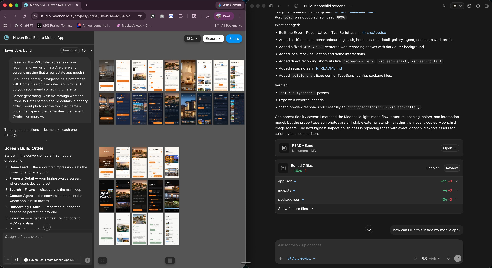
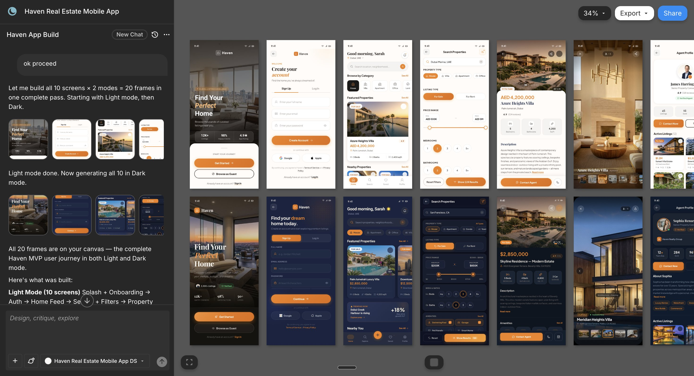
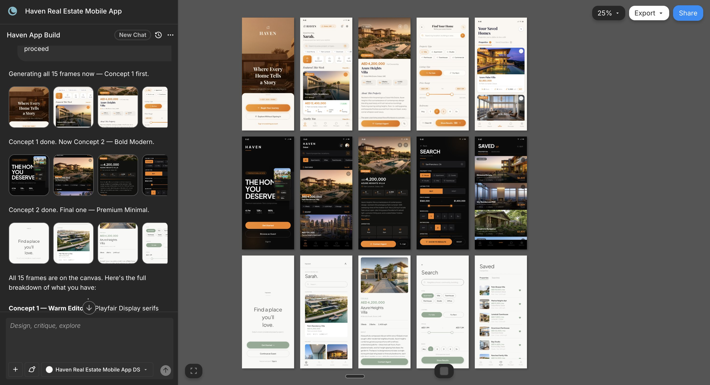
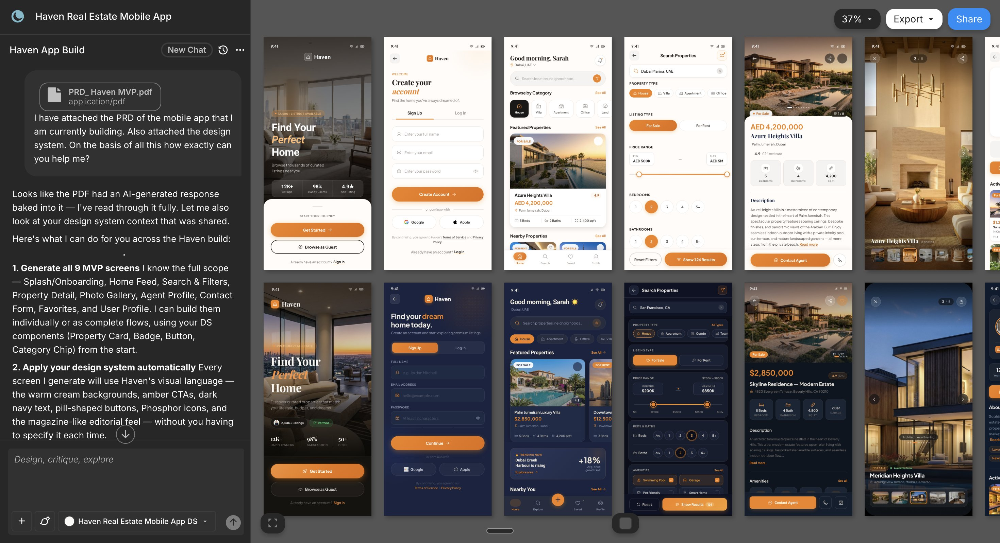
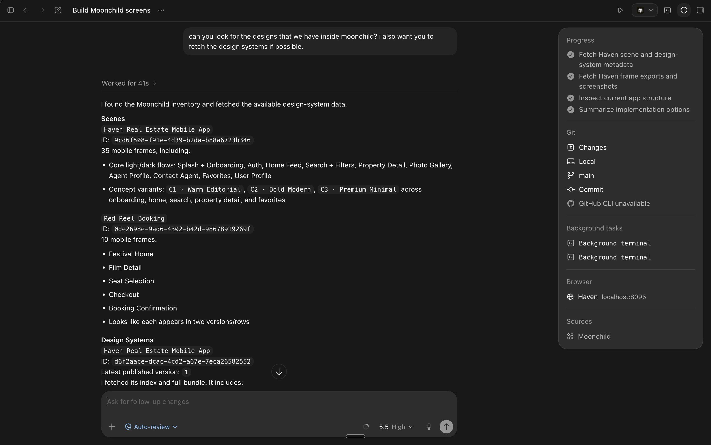

<strong style="font-size:16px;color:#1a6ba0;">要点速览</strong>

- <strong>Codex + Moonchild</strong>：Moonchild 在左边设计 UI（从设计系统出发），Codex 在右边输出生产级代码  
- <strong>20 分钟设计系统，1 小时全 App</strong>：Haven 房产 App 概念，设计系统 20 分钟 → UI 1 小时内 → Codex 直接出代码  
- <strong>MCP 是闭合 loop 的关键</strong>：Moonchild 的 MCP 连接器把结构化设计数据交给 Codex，不是截图不是文字描述  
- <strong>交互预览省掉一半迭代</strong>：生成的设计可以点击导航，在写任何代码之前发现流程问题

**如果你的应用看起来像 AI 拼凑品，那不是 Codex 的问题。那是工作流的问题，你必须先有一个设计系统。** 作者已经说了好几个月了——Codex 在设计上太强了，但前提是你得有一个能配合的工作流。Codex + Moonchild 是他们的机构一直在跑的设计工作流——输出完全在另一个层次上。大多数构建者陷在同一个 loop 里：他们用 AI 发布功能，后端能工作，逻辑是可靠的，但界面看起来像所有其他 vibe-coded 应用。用户在两秒内决定它是否看起来真实。

旧的修复方法是雇一个设计师，等几周 Figma 文件，然后让开发者去解读那些设计并重建到代码里。等到设计上线的时候，势能早没了，钱也烧掉了。**整个过程现在变成可选的了。过去需要设计师两周的工作现在只需要两天。**

为了这个演示，作者建了 **Haven**，一个房产移动 App 概念。完整设计系统 20 分钟。每个屏幕设计在一小时内。通过 Codex 输出生产级代码，**一行 CSS 没改。**

**Moonchild 到底是什么**

秘密工具是 Moonchild。作者测试了过去一年发布的几乎所有 AI 设计工具——**大多数在第一屏看起来不错，但建第二页的时候就崩了。一致性是问题。Moonchild 以一种其他工具没有的方式解决了它。**

**这就是人们说 AI 设计很烂时的意思。模型不烂。工作流烂。** Codex 不知道你的设计语言是什么。每个 prompt 都是全新上下文，每个屏幕都是猜测——颜色在变，字体在变，一切都在累积。

**这是我目前在跑的工作流。** Moonchild 在左边从你的设计系统开始设计 UI，Codex 在右边把它变成可工作的移动 App。每个用 AI 发货的构建者都需要理解它怎么工作。

它是一个对话式设计画布，**从你的设计系统开始**——不是从空白 prompt，不是从截图，而是从你实际的系统。有三种方式把系统带进去：从 Figma、GitHub 或在线链接导入；向它的 Agentic Design System Builder 描述你的品牌；从 Dribbble 拖入设计灵感。

一旦系统进去了，你不用旧的 prompt 方式来设计。**你粘贴一个 PRD。** 它根据你的系统生成完整的屏幕。

**导出路径是关闭 loop 的关键。** Moonchild 提供了一个 MCP 连接器，把你的设计作为结构化输出直接交给 Codex——不是截图，是实际的组件、token、布局数据。

**大多数构建者用 AI 做设计的问题**

大多数构建者提示 Codex 建一个新功能，发货了，看起来还行。然后提示下一个功能，看起来稍微不同。到第五个功能时，应用像五个不同产品拼在一起。**模型不烂。工作流烂。** Codex 不知道你的设计语言是什么。每个 prompt 都是全新上下文，每个屏幕都是猜测——颜色在变，字体在变，一切都在累积。

**修复很简单：给 Codex 一个系统去遵循，然后给它实际的设计去构建。** 大多数工作流给其中一个，Moonchild + MCP 同时给了两个。

**第一步：先建设计系统，始终如此**

这是每个人跳过的步骤，也是最重要的。**在我们的机构，我们在碰任何屏幕之前为每个客户建一个设计系统。过去需要设计师两天，Moonchild 大约 20 分钟。**

对于 Haven，作者从 Dribbble 拖入了三张移动房产 App 截图，加上一段简短的产品描述。工具提取了设计语言并从零构建了一个完整系统。**这是让整个工作流站得住脚的基础设施。**

**让我惊讶的是所有东西都可以预览。** 大多数 AI 工具给你扁平的 token 文件——颜色、字体、可能间距。Moonchild 不一样——它构建完整的组件库和一个图库，每个 badge、按钮、卡片和 chip 以实际效果渲染，点击可看到实时效果，带有测试变体和尺寸的控制面板。**图库才是真正改变你设计方式的部分**——不是猜测"品牌 badge"在上下文中应该是什么样子，你一眼看到它们全部并列。For Sale、For Rent、Featured——整个家族一次看到。你在任何屏幕被生成之前就做出有依据的决策。**这是风格表和一个真正系统之间的区别。**

**第二步：PRD 到 UI**

一旦设计系统进去了，你不用旧的 prompt 方式来设计。**你粘贴一个 PRD。** 一页的功能简述、产品 spec、目标陈述。对于 Haven，作者粘贴了结构化 PRD，涵盖产品介绍、目标、目标用户和角色、关键功能和 MVP 范围、完整的用户旅程、技术栈和设计方向——大约一页的长度。具体到给工具真正的上下文，结构化到把正确的细节拉入正确的屏幕。

然后做了一件大多数人跳过的事：**在生成任何屏幕之前和它 brainstorming。** 聊天模式持有完整 PRD 上下文。不是倾倒 PRD 然后直接点生成，你先讨论产品，确认屏幕列表，锁定导航模式，在任何像素存在之前预定义关键屏幕的层级。

作者具体问了：根据这个 PRD，你推荐先建哪些屏幕？房地产应用有没有漏掉什么？主导航应该是 Home、Search、Favorites、Profile 的底部 tab 还是别的？走一遍 Property Detail 屏幕的优先级顺序——照片先，然后是名称和价格，然后是规格、设施、经纪人。**当点击生成时，工具对产品的了解已经超过大多数设计师在第一次客户电话后的了解。**

关于变体的快速说明。你可以生成不同美学方向。对于 Haven，作者用了三种概念——温暖编辑风（奶油背景、衬线标题）、大胆现代（深色高对比、无衬色）、极简高级（中性色、大量空间）。注意 prompt 结尾的"你会怎么做？"——**不是让工具盲目生成，它返回了一个计划：先为每个概念建 5 个代表屏幕。审视三个方向，挑中一个后，工具就朝那个方向设计整个应用。** 这完全改变了成本方程——你付的不是三个完整构建，是三个快速样本然后一个在你实际选的方向上的完整构建。

作者选了温暖编辑风，完整的屏幕集一次返回。

**真正让我惊讶的是** Moonchild 生成的每个屏幕在预览模式下都是可交互的——不是静态模型。你可以点击输入字段、点击按钮、像真实用户一样在屏幕间移动，**在有任何代码被写出来之前测试产品。** 这就是解锁。对于 Haven，作者在预览中发现两个流程问题，否则会发给 Codex：Property Detail 没有明显的返回浏览方式，联系经纪人 CTA 太靠下。**如果不是先点击测试就直接交给 Codex，两个都会发过去。**

最后的优化 loop。当屏幕需要修改时，你不是从头重新 prompt——选中屏幕，告诉工具要改什么，它在原地生成 v2。想要更电影化的 hero？v2。想把卡片布局换成列表视图？v3。变体叠加让你可以比较并选最强的。对于 Property Detail，作者经历了三次迭代——v1 经纪人区块太高，v2 修复但图片库太小，v3 两者都好了。**大约 8 分钟的来回。** 这不是从空白开始策展，是在优化一个真实的方向——**最接近和高级设计师一起工作的感觉。**

**第三步：通过 MCP 连接 Moonchild 和 Codex**

这是工作流变强的关键。设计系统给 Codex 规则。**MCP 连接给 Codex 更强大的东西：直接访问实际的设计输出。** 不是截图，不是文字描述——Codex 可以读取和重建的结构化设计数据。

设置：进入 Moonchild Settings → MCP → 复制安装命令 → 打开 Codex CLI → 粘贴命令 → 用 Moonchild 账户认证 → 完成。

**第四步：Codex 输出代码**

现在你提示 Codex："使用 Moonchild MCP 获取 Haven 房地产移动 App 项目，告诉我里面有哪些屏幕。" 第一个 prompt 做两件事：确认 MCP 正确连接，给 Codex 对你每个设计的完整可见性。

**保持在计划模式。** Codex 在执行前展示它要做什么。每次读计划，确保它理解哪些屏幕、什么顺序、什么精确度——这是写你实际需要的东西和写它认为你需要的东西之间的区别。

一旦审查了计划，Codex 直接从 Moonchild 拉取设计数据，引用设计系统，写代码。**它甚至添加 hover 状态、转场和边缘情况处理——因为它在用实际设计数据工作，不是从 prompt 猜测。** 结果：生产级 UI，几分钟内，与设计精确匹配。

**什么时候用这个工作流**

这不适合每个团队。诚实地判断。**适合：** solo builder 或小团队发 MVP；设计一致性一直出问题；不想维护独立的 Figma→设计师→开发者管线；已有设计系统希望被各处强制执行。**跳过：** 已规模化有完整内部设计团队和成熟 Figma 库；需要像素完美交付用于营销站点或品牌工作；代码库有高度自定义 UI 模式。**对 80% 发 MVP 和 SaaS 的构建者，这个工作流覆盖所有需要的东西。**

**需要注意什么**

你的设计系统质量决定输出质量。**垃圾进，垃圾出。** 一个只有三个颜色 token 的半完成 Figma 文件会产生平庸的屏幕。在系统上投入时间，它在每个屏幕上都回报。**一个质量不高的系统会拉低所有屏幕的品质。**

PRD 质量很重要。一个模糊的 brief 给你通用的屏幕。一个带有用户流程、边缘情况和清晰层级的 PRD 给你有用的设计——具体到给工具真正的上下文，结构化到把正确的细节推入正确的屏幕。**这不是工具限制，是思考限制。**

你仍然需要品味。工具生产，你指导。挑选正确的变体并优化它们就是你的判断力所在——如果你跳过策展步骤，你就回到了 vibe 设计，一切累积的差异都会回来。

一些组件需要手动调整。复杂的动画状态、自定义交互模式、任何在设计系统之外的东西都需要在 Codex 里手动过一遍。**MCP 把你带到 90%，最后 10% 是你的 taste。**

**这实际上意味着什么**

**用 AI 构建产品的瓶颈从来不是代码。AI 可以写代码。瓶颈一直是设计层——一致性、品味、把一切绑在一起的系统。那个瓶颈刚刚崩溃了。solo builder 现在也有了机构级的杠杆，不需要人头数。**

在我们的机构，过去每个客户 MVP 设计预算两周——雇设计师、建 Figma 文件、开发者解读、解读会漂移、修正、循环。**用这个工作流，过去需要两周的现在只需要两天。** 整个 loop 压缩成一个下午的工作——相同的质量，更高的利润，少得多的上下文切换。**这就是有资金的团队已经用 Figma+设计师+开发者管线拥有的工作流。** 区别在于现在 solo builder、独立机构和小型工作室也能获得同样的杠杆，不需要人头数。

**2026 年对那些先搞明白这个的机构和构建者来说将是不公平的。这不是一个只有大团队才能获得的杠杆——现在 solo builder 也有了同样的能力。**

TLDR：**停止抱怨 Codex 导致 UI 烂。Codex 不是问题，你的工作流是。** Codex + 一个秘密工具是我们机构一直在跑的设计工作流，输出完全在另一个层次上。第一步：在 Moonchild 里建你的设计系统。第二步：粘贴 PRD，在生成前用聊天模式 brainstorm。第三步：通过 MCP 把 Moonchild 连接到 Codex。第四步：用 MCP 提示 Codex 建每个屏幕。你的设计系统质量决定你的输出质量。**Figma→交付→开发者的循环死亡了。一个工作流现在同时运行设计和代码。**

---

<strong style="font-size:15px;color:#8b6f4c;">结语</strong>

这个工作流打动人的不是任何单个工具——是「设计系统作为基础设施」这个工程原则被 Moonchild 实现了，而「结构化设计数据直接给代码生成器」这个集成模式被 MCP 标准化了。两件事合在一起，把 AI 设计从「抽奖」变成了「可重复的生产线」。  
对 solo builder 来说，这可能是今年被低估最多的效率杠杆——你不需要一个设计团队，你需要一个设计系统和一个能理解它的代码生成器。

---
参考：https://x.com/PrajwalTomar_/status/2057436839104205210
