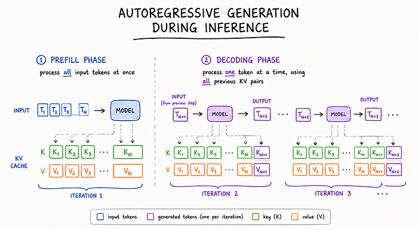
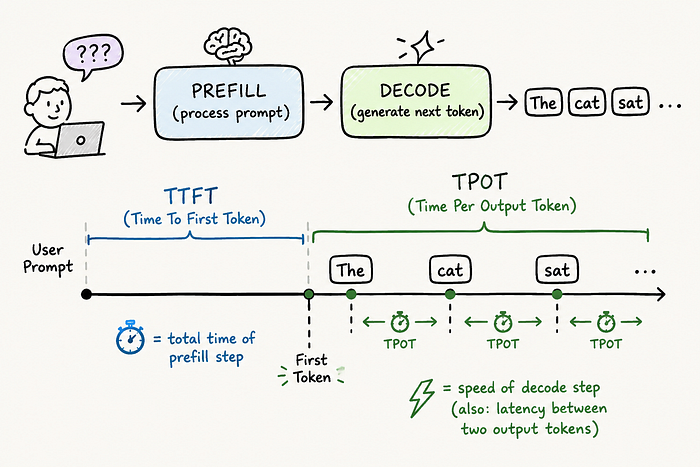
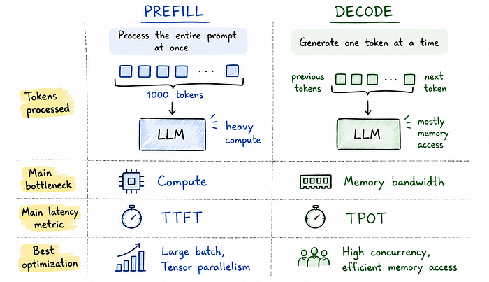
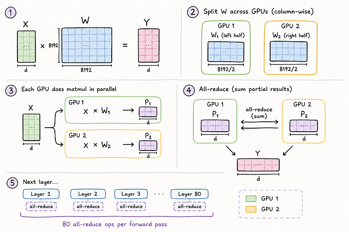
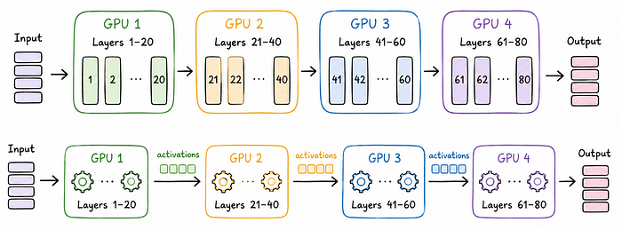
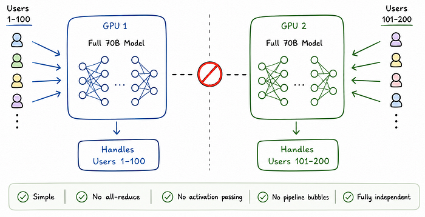
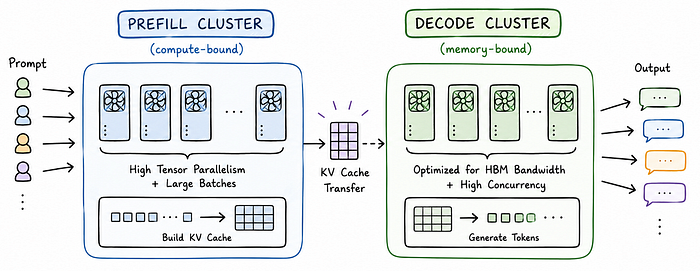

<strong style="font-size:16px;color:#1a6ba0;">要点速览</strong>

- <strong>两个阶段，两个瓶颈</strong>：Prefill 是计算密集型（大规模矩阵乘），Decode 是内存密集型（HBM 带宽瓶颈）。同一个 GPU 上优化一个必然伤害另一个。  
- <strong>三种并行策略各有利弊</strong>：张量并行对 prefill 好对 decode 差（通信开销占比不同），流水线并行有气泡问题，数据并行内存开销巨大。  
- <strong>分离方案</strong>：将 prefill 和 decode 拆分到不同 GPU 池，各用最优策略。KV cache 传输成本可通过计算重叠、快速互联、量化压缩解决。  
- <strong>已成为硬性要求</strong>：上下文从 4K 涨到 1M，分离从「好优化」变成「必须做」。SGLang、vLLM、Mooncake 都在用。

**第一个 token 和随后的每个 token，需要完全不同的硬件行为。** 同一个模型，同一个 GPU，但 Prefill 和 Decode 的差异大到把它们绑在一起会造出一个昂贵得惊人的妥协。

作者从 CMU 的 ML 系统课程开始深耕推理领域，发现这个矛盾的根源在于：**我们一直在假设 prefill 和 decode 共享同一批 GPU，而这个假设本身就是错的。** 乍一听很奇怪——毕竟是同一个模型在生成同一个回复。但在底层，这两个阶段的行为差异远比表面看起来大。

Prefill/Decode 分离（disaggregation）正是因这个妥协而存在的。

## 推理的两个阶段

自回归生成推理分为两个阶段：

**Prefill 阶段：** 模型一次性处理所有输入 token。1000 token 的 prompt？模型运行一次大的前向传播，同时处理全部 1000 个 token，从头构建 KV cache。

**Decoding 阶段：** 模型一次生成一个 token，利用之前所有 token 的 KV cache。这个阶段对你生成的每个 token 都会重复。

**两个阶段感觉相似，但它们是根本不同的工作负载。**

你知道那种感觉——问 ChatGPT 一个问题，然后等待。光标闪烁，什么也没发生，然后突然响应开始流式输出。第一个字出现前的等待就是 **TTFT（Time To First Token）**，即 prefill 步骤的总耗时。之后文字流出的速度是 **TPOT（Time Per Output Token）**，由 decode 步骤的速度决定。你也可以把它理解为两个输出 token 之间的延迟。

TTFT 慢意味着产品感觉坏了——用户以为什么都没发生。TPOT 慢意味着响应读起来卡顿。两者都以完全不同的方式损害用户体验，并且需要完全不同的优化。

**主要问题是：在同一个 GPU 上，优化一个就会伤害另一个。**

## 为什么 Prefill 和 Decode 冲突

| 维度 | Prefill | Decode |
|------|---------|--------|
| 瓶颈 | 计算密集型 | 内存密集型 |
| 批处理 | 擅长大规模批处理 | 批量大小有限 |
| 并行化 | 张量并行效果好 | 张量并行效果差 |
| KV cache | 从头构建 | 从缓存读取 |

这些阶段不仅仅是略有不同——**它们要的是根本不同的 GPU 行为。**

**Prefill 是计算密集型。** 在 prefill 期间，模型一次性处理整个 prompt。如果 prompt 有 1000 token，所有 1000 个 token 一起流经每个 transformer 层，做大型矩阵乘法。GPU 的 tensor core 执行大量计算，所以瓶颈主要是计算，不是内存移动。由于计算量如此之大，张量并行等技术效果很好——跨 GPU 同步结果（如 all-reduce）的通信开销相对较小。

**Decode 是内存密集型。** 一次只产生一个 token，每层仍要跑——一次。GPU 反复做：从 HBM（高带宽内存）加载层权重 → 计算 → 移动到下一层 → 重复。**即使单个 token 的计算量很小，但数十亿参数的内存带宽需求是瓶颈。GPU 花在等数据上的时间比花在实际计算上的时间还多。**

同一个 GPU 有两个完全不同的瓶颈，因此跨 GPU 的并行化方式也完全不同。对 prefill 好的方案对 decode 有害，反之亦然。

## 并行化的两难

将 LLM 扩展到多个 GPU 时有三种主要策略，**每一种对一个阶段好，对另一个阶段差。**

**张量并行：** 想象一个 8192×8192 的权重矩阵——6700 万个数字。在张量并行中，矩阵分片到多个 GPU（GPU 1 左半，GPU 2 右半）。每层运行一次前向传播后，GPU 们通过 all-reduce 同步结果——每个 GPU 把部分结果广播给所有其他 GPU，求和得到最终答案。对一个 80 层的 70B 模型，每次前向传播就是 80 次 all-reduce。

Prefill 下效果好的原因：一次处理 1000 个 token，每次 all-reduce 同步 1000 个 token 的计算结果。通信开销是总时间的一小部分——值得。Decode 下效果差的原因：一次生成一个 token。计算量极小，但仍要付完整的通信成本——每 token 80 次 all-reduce。**就像组织 4 人视频通话只为分享一句话——建立通话的开销比对话还大。**

**流水线并行：** 按层拆分模型（80 层 / 4 GPU = GPU 1 处理 1-20 层，GPU 2 处理 21-40 层，依此类推）。像工厂装配线——输入进 GPU 1，输出（激活值）传给 GPU 2，直到 GPU 4 产生最终输出。这里的通信比张量并行简单得多——只是把单个激活张量从一 GPU 传给下一个，没有 all-reduce。

但它引入了**气泡开销**。除非流水线被足够的并发工作填满，一些 GPU 会闲置。Prefill 可以通过将多个请求放入流水线来填充气泡——当 GPU 2 处理请求 1 时，GPU 1 开始处理请求 2。Decode 一次只生成一个 token，保持流水线满负荷要困难得多。

**数据并行：** 不拆分模型。不同 GPU 上跑完整副本，处理不同请求。GPU 1 持有完整 70B 模型处理用户 1-100，GPU 2 处理用户 101-200。**不需要通信。** 代价是内存——70B 模型 fp16 = 140GB，每个 GPU 都需要这么多。

## 调度问题

除了硬件效率，还有另一个问题：调度。

请求 A 有 200K token 的 prompt（巨大 prefill），请求 B 是普通聊天（已在 decode）。如果共享 GPU 池，**请求 A 可能延迟请求 B**——即使工作负载完全不同。这就是**队头阻塞（head-of-line blocking）**。一个长 prompt 的繁重请求可以拖慢所有人的延迟敏感型 token 生成。

问题不仅是计算 vs 内存，也是不同类型流量之间的干扰。这让分离的理由更充分了。

## 分离（Disaggregation）

我们已经知道三种并行策略各有权衡，但它们都做了同一个假设：**Prefill 和 decode 运行在同一个 GPU 上——这才是真正的问题。**

那么，如果 prefill 和 decode 根本不跑在同一个 GPU 上呢？这就是分离。

创建两个单独的 GPU 池，各为一个工作负载优化：

- **Prefill GPU**：处理入站 prompt + 构建 KV cache，激进批处理 + 张量并行
- **Decode GPU**：专注 token 生成，针对内存带宽和并发性调优

Prefill 完成后，prefill GPU 只需通过网络将 KV cache 发送到 decode GPU，由 decode GPU 接管生成。请求流变成：

> Prompt → Prefill 集群 → KV Cache 传输 → Decode 集群 → 输出 Token

现在每个集群可以使用对其工作负载实际最优的并行策略——不再妥协。

Splitwise 论文于 2023 年发表，到 2024 年许多现代服务系统已经开始采用它。

**代价：KV Cache 传输。** 当 prefill 完成时，KV cache 需要从 prefill GPU 物理移动到 decode GPU。对于长 prompt 和大模型，KV cache 大小很容易达到数百 MB 甚至数 GB。这种传输表现为 prefill 完成和第一个 token 之间的延迟间隙——直接伤害 TTFT，也就是分离本应修复的问题。

三种解决方案：

- **将传输与计算重叠**：不需要完整 KV cache 就能开始解码。在已到达的 KV cache 块上开始 decode，同时其余仍在传输。到 decode 需要后面的块时，它们已经到达了。这隐藏了大部分传输延迟。
- **使用快速互联**：同一节点内 GPU 间的 NVLink 比走网络快得多。设计上保持 prefill 和 decode GPU 在物理上靠近。
- **传输前压缩 KV cache**：量化到 INT8 再发送，传输大小减半，质量损失极小。

在实践中传输成本是值得的——专门的 GPU 池带来的收益远超过网络开销。

## 如今的应用

分离从研究论文到生产基础设施的速度快得惊人。**SGLang** 已有分离集成，**vLLM** 正在添加分离支持，主要云厂商在内部构建自己的版本。**Mooncake**——Kimi（中国最大 LLM 部署之一）的背后系统——完全围绕分离式 prefill 和 decode 构建。

传播如此之快的原因很直观：随着上下文窗口变长（4K → 32K → 128K → 1M token），prefill 的代价成比例增长。以前在 4K 上下文中只是轻微烦人的干扰问题，在 128K 上下文中变得完全无法承受。**分离从「好优化」一夜之间变成了「硬性要求」。**

<strong style="font-size:15px;color:#8b6f4c;">结语</strong>

一旦你看清楚了，分离几乎过于明显。Prefill 和 decode 不是同一个工作负载，从来都不是，但我们一直把它们强行放在同一个 GPU 上，然后疑惑为什么延迟不可预测。解决方案是两个池、两个任务，各自为所需做优化。KV cache 传输成本是真实但可控的，仅调度隔离这一点就值了。  
如果你在关注这个系列：KV cache 是关于内存的，推测解码是关于速度的，连续批处理是关于吞吐量的。而这篇是关于意识到架构本身一直都是瓶颈。

---
参考：

https://pub.towardsai.net/prefill-decode-disaggregation-why-your-gpu-cant-do-two-things-at-once-f11ba0bdd9de
https://x.com/jino_rohit
