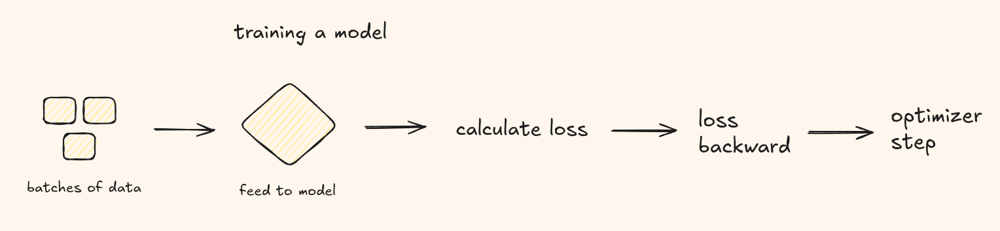
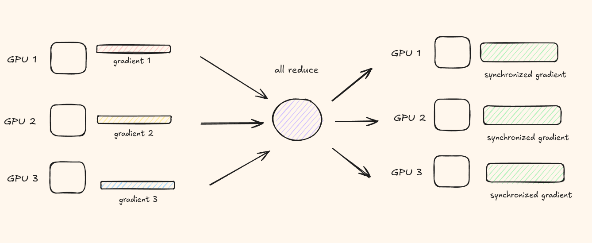
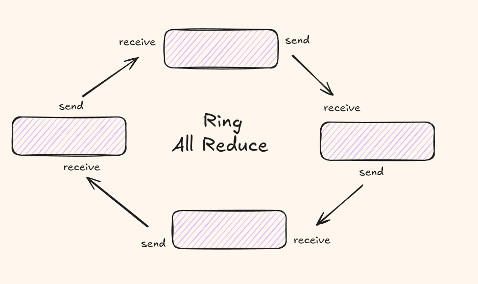

# 完整翻译：PyTorch DDP 你需要知道的一切

## 引言

你有一个模型，它还不错。但你希望它更好。这意味着更多数据、更大的 batch size、更长的训练周期。单张 GPU 可能根本不够用。

Distributed Data Parallel（DDP）是一个 PyTorch 模块，让你能够进行多 GPU 分布式训练。核心思想很简单——你在每张 GPU 上复制模型，给每个副本喂不同批次的数据切片，然后在每一步同步梯度，使所有副本保持同步。

在这篇文章中，我们将覆盖你需要知道的关于用 PyTorch 开始分布式训练的一切！

## 如何思考扩展到多个 GPU

多 GPU 训练和多 GPU 推理的场景截然不同。在这篇文章中，我们只关注训练。我们也将特别关注 PyTorch DDP 提供的**数据并行**。这是开始扩展到多 GPU 的最简单技术。

我有 10 亿个数据样本，在单张 GPU 上跑可能要花几年时间。如果我把这些数据拆分到我拥有的 N 张 GPU 上，每张 GPU 上的模型副本独立运行各自的数据切片呢？

嗯，这样不行。如果它们独立运行，最终你会得到 N 个不同的模型，而不是一个。我们需要一个能以某种方式积累所有运行 GPU 的知识的单一模型。

这时候，回顾一下模型训练实际上是如何运作的会很有帮助。

## 训练一个模型


我把流程描述如下——

1. 创建数据批次。
2. 在每一步，将一个批次喂入模型。
3. 获取 logits，通过 softmax 得到分数，计算 loss。
4. 调用 loss.backward() 计算梯度。
5. 调用 optimizer.step() 更新权重。

在这五个阶段中，你认为哪个对模型学习的影响最大？权重更新！只要在权重更新之前同步梯度，在其他 GPU 上独立运行所有其他阶段是没有问题的。

DDP 做的正是这个——它提供了一种跨多张 GPU 同步梯度的智能方式，然后让训练照常进行。

## 等等，这不就是 Data Parallelism 吗？

你可能听说过 PyTorch 旧的 `DataParallel`（DP）模块。DP 在概念上做同样的事——跨 GPUs 拆分批次——但它的底层实现非常不同。

- **DP** 使用单一进程（由于 GIL 解释器）。它对输入进行切片，分散到各个 GPU，计算 loss，然后将梯度广播回来。模型在 forward 过程中每张 GPU 上复制一份。这会产生大量开销，因为主 GPU（rank 0）成为通信的瓶颈。
- **DDP** 为每张 GPU 生成一个独立进程。每个进程有自己的 Python 解释器、自己的优化器、自己的模型副本。没有中央协调器。梯度在 backward 过程中通过 **all-reduce** 同步，完全与计算重叠。

## 梯度同步与 All-Reduce

DDP 背后的核心算法原语是 **all-reduce**。

想象你有 N 张 GPU。在 forward 和 backward 过后，每张 GPU 持有自己的本地梯度。all-reduce 操作接收这些 N 个张量（每张 GPU 一个），并在每张 GPU 上产生相同的归约后张量。


每张 GPU 最终得到完全相同的平均梯度，应用同样的 `optimizer.step()`，所有副本保持同步。

### Ring All-Reduce

朴素的 all-reduce 会给单个节点带来巨大压力。每张 GPU 要么等待中央协调器，要么与每张其他 GPU 交换，产生 $O(N^2)$ 的通信量。


**Ring all-reduce** 避免了这一瓶颈。$N$ 张 GPU 被排列成一个逻辑环形。每张 GPU 只与它的直接邻居通信。该算法分两个阶段运行：

1. 每个进程独立计算自己的梯度。
2. 每个进程将梯度按顺序传递给下一个进程，然后将从上一个进程收到的梯度再传递给下一个进程。循环 N 次（进程数）后，所有进程都将获得所有梯度。

## 基本术语

在写代码之前，先熟悉一下你会在每个 DDP 脚本中遇到的关键概念。

### World Size

参与分布式作业的进程总数。如果你有 2 台机器，每台 8 张 GPU，world size = 16。

`torch.distributed.get_world_size()`

### Rank

分配给每个进程的唯一标识符（0 到 world_size - 1）。rank 0 的进程约定为 **master** 进程。

`torch.distributed.get_rank()`

### Local Rank

单台机器内部的进程索引。在 8 张 GPU 的机器上，local ranks 是 0 到 7。机器 1 有 local ranks 0-7，机器 2 也有 0-7。这方便将每个进程分配到正确的 GPU 设备。

`int(os.environ['LOCAL_RANK'])`

### Master Address & Port

所有进程需要知道 master（rank 0）在哪里才能初始化进程组。这些通过环境变量传递：`MASTER_ADDR` 和 `MASTER_PORT`。

### Backend

通信库。在 NVIDIA GPU 上，使用 **NCCL**（NVIDIA Collective Communications Library）。对于 CPU，你会使用 **GLOO** 或 **MPI**。

## 编写 DDP 训练脚本

让我们把所有这些整合起来，写一个分布式训练脚本。

```python
import os
import torch
import torch.distributed as dist
import torch.nn as nn
import torch.optim as optim
from torch.nn.parallel import DistributedDataParallel as DDP

def setup():
    dist.init_process_group("nccl")
    torch.cuda.set_device(int(os.environ["LOCAL_RANK"]))

def cleanup():
    dist.destroy_process_group()

class ToyModel(nn.Module):
    def __init__(self):
        super().__init__()
        self.net = nn.Sequential(
            nn.Linear(1024, 4096),
            nn.ReLU(),
            nn.Linear(4096, 1024),
        )
    def forward(self, x):
        return self.net(x)

def train():
    setup()
    rank = dist.get_rank()
    local_rank = int(os.environ["LOCAL_RANK"])
    world_size = dist.get_world_size()

    model = ToyModel().cuda(local_rank)
    ddp_model = DDP(model, device_ids=[local_rank])

    optimizer = optim.AdamW(ddp_model.parameters(), lr=3e-4)
    loss_fn = nn.CrossEntropyLoss()

    dataset_size = 10000
    microbatch = 32
    loader = torch.utils.data.DataLoader(
        torch.randn(dataset_size, 1024),
        batch_size=microbatch,
        shuffle=True,
    )

    for epoch in range(10):
        for batch_idx, (x,) in enumerate(loader):
            x = x.cuda(local_rank)

            logits = ddp_model(x)
            loss = loss_fn(logits, torch.randn_like(logits))

            loss.backward()
            optimizer.step()
            optimizer.zero_grad()

            if rank == 0 and batch_idx % 50 == 0:
                print(f"Epoch {epoch}, batch {batch_idx}, loss {loss.item():.4f}")

    cleanup()

if __name__ == "__main__":
    train()
```

- `dist.init_process_group("nccl")` 初始化 NCCL backend。它会从环境变量中读取 `MASTER_ADDR`、`MASTER_PORT`、`WORLD_SIZE` 和 `RANK`。
- 每个进程通过 `torch.cuda.set_device(local_rank)` 将其 CUDA 设备设置到本地 rank。
- 模型在包装进 DDP **之前** 移动到正确的 GPU。
- `DDP(model, device_ids=[local_rank])` 告诉 DDP 这个副本在哪张 GPU 上。
- 只有 rank 0 负责日志记录和 checkpoint 保存。其他 rank 纯粹参与计算和通信。

## 用 torchrun 启动

你不能直接用 `python train.py` 启动 DDP 脚本。而是使用 **torchrun**，这是分布式 PyTorch 任务的标准入口点：

`torchrun --nproc_per_node=8 train.py`

这会生成 8 个进程，每个进程自动设置好自己的 `RANK`、`LOCAL_RANK` 和 `WORLD_SIZE` 环境变量。

## 总结

有了这些，你应该已经准备好开始为 LLM 编写分布式训练脚本，并将实验扩展到单 GPU 之外。

在接下来的几篇博客中，我将更多关注分布式技术以及像 megatron 这样更生产级的库。

## 参考文献

1. [PyTorch DDP Tutorial](https://pytorch.org/tutorials/intermediate/ddp_tutorial.html)
