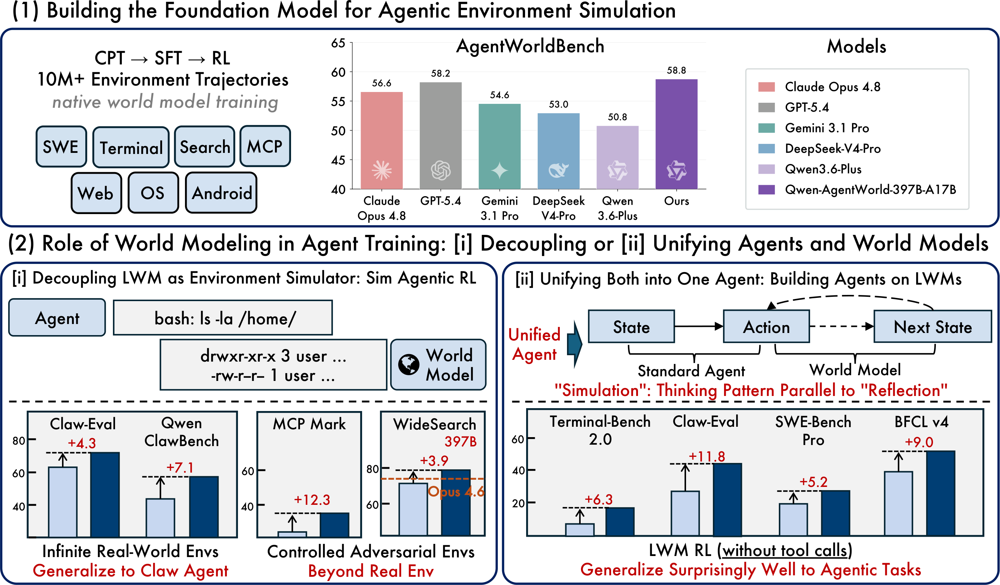
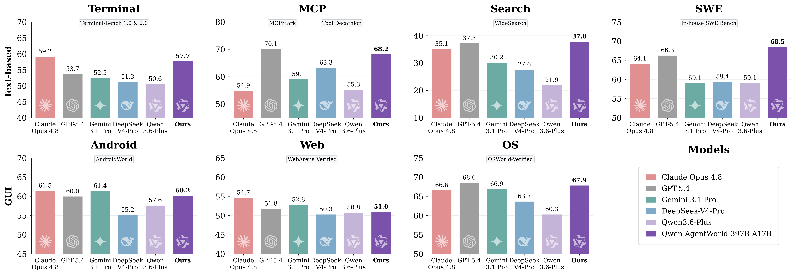
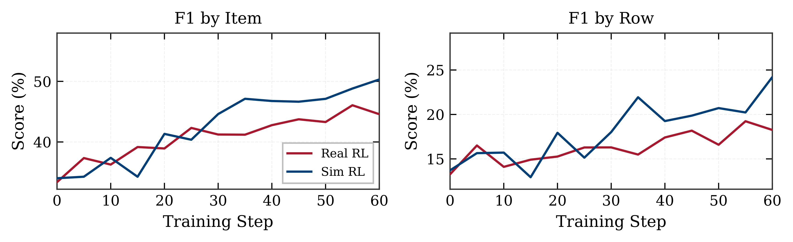
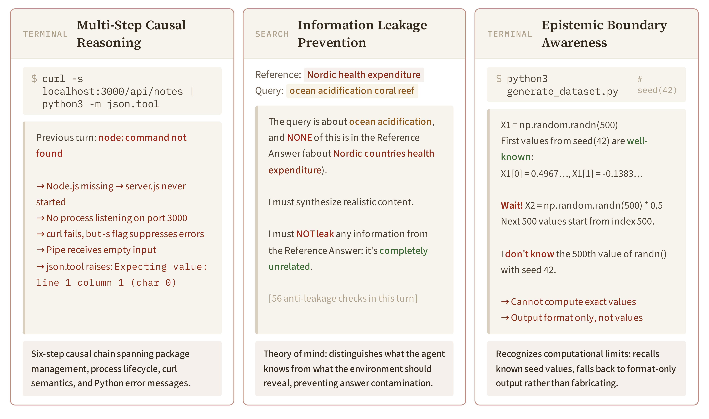

**Qwen-AgentWorld：7域一模型，模拟RL成绩反超真实环境训练**

<strong style="font-size:16px;color:#1a6ba0;">要点速览</strong>

- <strong>原生世界模型</strong>：Qwen-AgentWorld 是首个从 CPT 阶段就将环境模拟作为训练目标的语言世界模型，而非在通用 LLM 上事后适配，一次覆盖 MCP、Search、Terminal、SWE、Web、OS、Android 七个域  
- <strong>三阶段训练流水线</strong>：CPT 注入环境知识（含专业域语料）→ SFT 通过 `<think>` 块激活显式推理 → RL 用混合奖励精炼，逐轮信息论损失掩码让模型只从真正的环境信息中学习  
- <strong>模拟 RL 反超真实环境</strong>：作为独立模拟器，可控 Sim RL 的训练效果超过与实时搜索引擎对练的 Real RL（WideSearch F1 50.3% vs 45.6%），4,000 个零样本 OpenClaw 环境也能直接模拟  
- <strong>世界模型 warm-up = 新的预训练范式</strong>：单轮 LWM RL warm-up（无工具调用）迁移到多轮 Agentic 任务，在完全 OOD 的 Claw-Eval 上 +11.3、BFCL v4 上 +9.0

Qwen 团队今天发布了一个有意思的东西——他们训练了一个**专门模拟 Agent 环境的语言模型**。

不是教 Agent 怎么用工具，是教模型预测"Agent 执行某个动作后，环境会返回什么"。前者让 Agent 变强，后者让 Agent 能在模拟器里练手——而且练出来的效果，竟然比在真实环境里练还好。

**Qwen-AgentWorld** 是个原生语言世界模型，统一覆盖了 MCP、Search、Terminal、SWE、Web、OS、Android 七个交互域。三个 GUI 域（Web、OS、Android）的观察不是像素帧，而是 accessibility tree 和 UI 层级标记，纯文本就能模拟视觉环境。

_Qwen-AgentWorld 的总体框架：上图为七域统一语言世界模型，下图为两种应用范式（解耦模拟器 & 统一 Agent 基础模型）。_

模型有两个规格：35B-A3B (MoE) 和 397B-A17B。397B 版在 AgentWorldBench 上以 58.71 分超过 GPT-5.4 (58.25) 和 Claude Opus 4.8。35B 版在三阶段训练后从 47.73 涨到 56.39，超过了 Claude Sonnet 4.6 (56.04)。

**为什么会这样？** 我们先聊一下训练方法。

**CPT 注入，SFT 激活，RL 精炼**

三个阶段的逻辑非常清晰：

**Stage 1 CPT** 用超过 1,000 万条真实环境交互轨迹做持续预训练，同时混入专业域语料（工业控制、网络安全、法律、医疗、金融、时事）。注意这里不只是让模型看（action, observation）对——他们设计了一个**逐轮信息论损失掩码**：根据四个统计量（Overlap、Novelty、Jaccard、长度比）把每轮对话分成七类。像 API echo 这种"动作=响应"的轮次只保留 5% 的梯度，真正携带环境信息（如 `read_file` → 文件内容）的轮次 100% 保留。

这个设计的直觉是：模型不应该在"参数敲进去、回显参数出来"这种机械行为上浪费学习信号。

**Stage 2 SFT** 在 CPT 基础上显式教会模型通过 `<think>...</think>` 块进行下一状态预测推理。用 256K 上下文窗口 + 拒绝采样（3 条 rollout 中选最好的）整理出 7,094 条高质量思考轨迹。

**Stage 3 RL** 用 GSPO + 混合奖励（Rubric 法官 + 规则验证器）精炼输出质量。

_三阶段训练流水线：CPT 注入→SFT 激活→RL 精炼。_

**AgentWorldBench：五维 Rubric，ground-truth 锚定**

为了评估世界模型质量，团队从 GPT-5.4、Claude Opus 4.6 等五个前沿模型在 Tool Decathlon、Terminal-Bench、OSWorld-Verified 等九个已有基准上的真实交互中构建了 AgentWorldBench。每一条评估样本都配有真实环境执行的 ground-truth observation，用开放 Rubric 从格式、事实性、一致性、真实感、质量五个维度评分。

_AgentWorldBench 结果：Qwen-AgentWorld-397B-A17B 以 58.71 分超过 GPT-5.4（58.25）和 Claude Opus 4.8。优势在 Terminal 和 SWE 上最显著。_

**那训练世界模型到底有什么用？**

团队探索了两种互补的应用范式。

**范式一：作为独立环境模拟器（Sim RL）**

世界模型和策略 Agent 是两个分开的模型。训练时世界模型扮演环境——Agent 执行动作，世界模型预测下一轮观察，Agent 从这些模拟 rollout 中学习。

三个关键发现：

1. **零样本泛化到未见环境**。用一个从未在训练中出现过的开源平台 OpenClaw（覆盖排程、编码、邮件处理、浏览器自动化等任务），模拟 4,000 个环境做 Sim RL，Claw-Eval +4.3，QwenClawBench +7.1。作为对比，用 Qwen3.6-Plus 做模拟器几乎没有提升——**世界模型的质量是 Sim RL 的瓶颈**。

2. **可控模拟是必需的不是可选的**。不加控制指令的 Sim RL 完全没有效果（Tool Decathlon 从 32.4 降到 31.5），因为模拟器缺乏足够 grounding 来产生可信响应。一旦加入可控扰动——间歇性 API 错误、分页响应、不完整中间结果——Tool Decathlon +3.7，MCPMark +12.3。可控性不是锦上添花，是 Sim RL 在这类域中起效的前提。

3. **Sim RL 超过 Real RL**。在 WideSearch 上直接对比：可控 Sim RL 在 step 60 时 F1 达 50.3%，而用实时搜索引擎训练的 Real RL 只有 45.6%。更有趣的是行为差异：Sim RL 训练的 Agent 大幅增加了 `web_extractor` 调用（2.5 → 4.0），而 Real RL 反而减少（2.5 → 1.5）。为什么？因为模拟器的摘要刻意隐藏了详情，Agent 学会了必须提取完整页面才能拼出答案。

_Sim RL vs Real RL 训练曲线：可控 Sim RL 达到或略超 Real RL（实时搜索引擎）的效果。_

**范式二：统一 Agent 基础模型**

这次 Agent 和世界模型是同一个模型。LWM 训练将下一状态预测内化为模型的元级推理能力——模型在行动前先在心里模拟环境响应。

效果有点惊人：在 Qwen3.5-35B-A3B-SFT 上跑单轮 LWM RL（没有工具调用、纯文本生成），然后直接拿到多轮、带工具调用的 Agentic 任务上评估，不做任何额外微调。

| 基准 | Base | +LWM RL | Δ |
|---|---|---|---|
| Terminal-Bench 2.0 | 33.3 | 39.6 | +6.3 |
| SWE-Bench Verified | 64.5 | 67.9 | +3.4 |
| SWE-Bench Pro | 42.2 | 47.4 | +5.2 |
| WideSearch (F1 Item) | 33.4 | 46.2 | +12.8 |
| Claw-Eval **OOD** | 53.6 | 64.9 | **+11.3** |
| QwenClawBench **OOD** | 39.8 | 49.4 | **+9.7** |
| BFCL v4 **OOD** | 62.3 | 71.3 | **+9.0** |

效果在完全 out-of-distribution（OOD）的域上最显著。LWM 训练时模型根本没接触过 OpenClaw 和 BFCL，但"在行动前预测环境状态"这个元能力被学会了，并且迁移到了这些域。

**世界模型在思考什么**

团队分析了 129 条 LWM 推理轨迹，发现了三种有趣的涌现模式：

1. **审慎的自我修正**。模型会在思考过程中突然用"Wait!"打断自己，修正之前的预测。129 轮里统计到 1,347 次中断（每轮 10.4 次），涉及事实错误、认知边界确认（"我实际上不能执行 `np.random.seed(42)`"），甚至视角转换。

2. **信息泄露预防**。在 Search 域，世界模型持有一个参考答案，Agent 正在找它。当 Agent 的查询不相关时，模型会确保摘要不意外暴露答案——世界模型的心智理论能力。

3. **多步因果推理**。预测 `curl -s localhost:3000 | python3 -m json.tool` 的输出需要链条：Node.js 没装 → 服务器没启动 → 3000 端口无监听 → curl 静默失败 → 空管道 → json.tool 抛出 JSONDecodeError。六个步骤，每一步都需要对系统的因果理解，不是模板化生成。

_LWM 推理模式：自我修正、信息泄露预防、多步因果推理。_

**再聊几句为什么世界模型有意义**

团队在论文中反复强调一个论点：**世界模型不是为了替代真实环境，也不是为了省钱，而是推 Agent 能力边界的一个正交维度。**

真实环境训练再好也有天花板。工具调用的非确定性响应、不可逆操作、需要专用基础设施的部署环境——这些场景要么不可复现，要么没法规模化。世界模型提供了三个不能从真实环境中直接获取的东西：

1. **可伸缩性**。不需要维护 4,000 个容器沙箱就能模拟 4,000 个环境。
2. **可控性**。可以制造在真实环境中极其罕见的边界条件（间歇性错误、分页数据、不完整响应），有针对性地暴露 Agent 弱点。
3. **内化预测能力**。教会 Agent 在行动前先做"心智模拟"，这是一种元能力的迁移——跟教模型"先思考再写代码"类似，但面向的是未来的环境状态，不是过去的反思。

有意思的是，第三个能力在 Unified 范式下产生了跨域的、无需微调的迁移效果，这在直觉上类似给预训练模型加了一个"预测层"——不是加参数，是加了一种思维模式。

<strong style="font-size:15px;color:#8b6f4c;">结语</strong>

这篇论文提供了一个很有意思的视角：过去的 Agent 研究几乎全在拼策略（Policy），世界模型（World Model）是缺的那一块。Qwen-AgentWorld 展示了语言世界模型能做到什么——不是 ChatGPT 套壳，是从 CPT 阶段就把"模拟环境"作为训练目标的原生世界模型。  
值得关注的不是它超越了 GPT-5.4（模型更强是大概率事件），而是 Sim RL > Real RL 这个反直觉的结果——如果你的模拟器足够好，在模拟器里练出来的 Agent 能比用真实环境练的更好，因为模拟器可以制造真实环境给不了的压力。这个发现对 Agent 训练的工业化有直接价值。  
Unified 范式的 warm-up 效应可能被低估了。单轮 LWM RL（无工具调用）迁移到多轮带工具任务，且在 OOD 域上效果最好——暗示下一状态预测是一种比反思更根本的"元推理"能力。如果这个结论在更大规模的模型上成立，那 LWM warm-up 可能会成为 Agent 预训练的标准组件。

---

参考：

https://qwen.ai/blog?id=qwen-agentworld
https://arxiv.org/html/2606.24597v1
