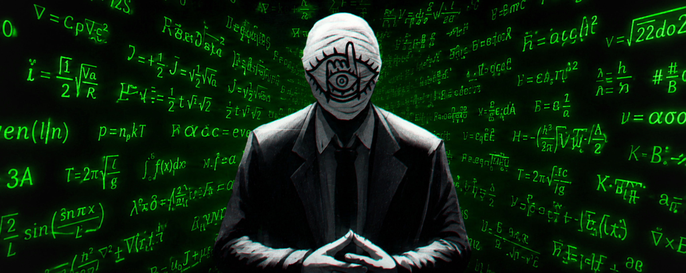
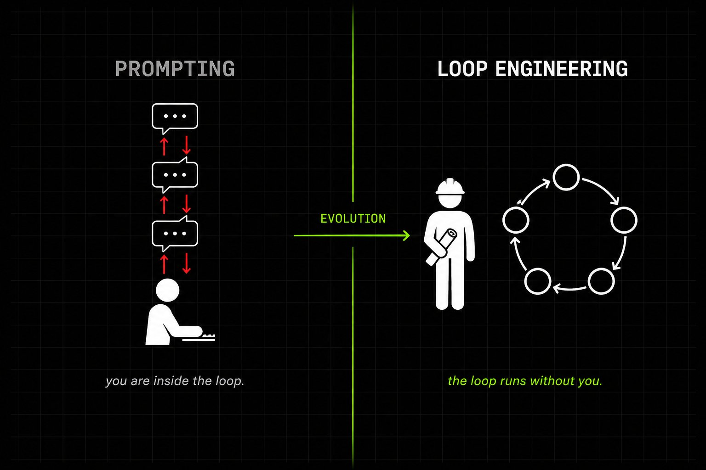
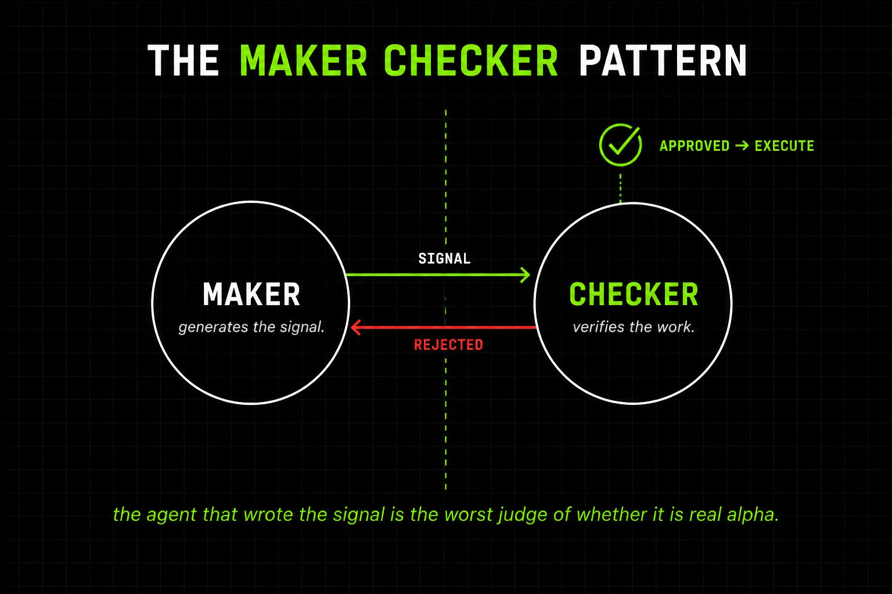
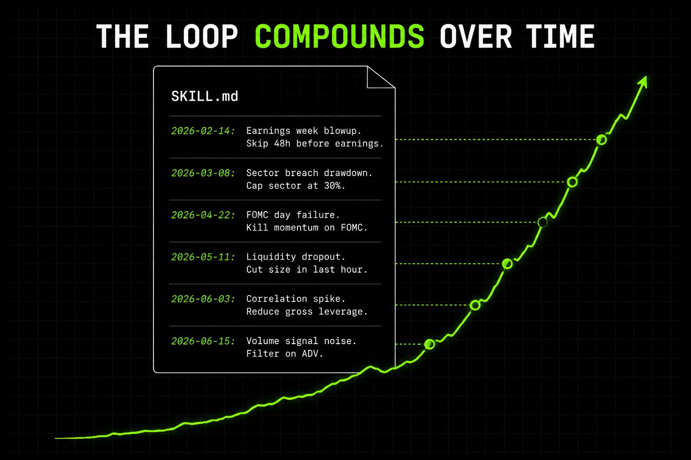

<div style="background:#e8f4fd;padding:14px 16px 10px 16px;border-radius:6px;margin-bottom:18px;">
<div style="text-align:center;margin-bottom:10px;">
<strong style="font-size:16px;color:#1a6ba0;">要点速览</strong>
</div>
<div style="font-size:14px;color:#3f3f3f;line-height:1.75;">
- <strong>量化交易 = Loop</strong>：拉数据→生成信号→回测→执行→风控→重复。华尔街的基金要几百人坐在 loop 里，你不需要<br><br>
- <strong>六个通用部件</strong>：Automation（心跳）、Skill（操作手册）、State File（持久记忆）、Verifier（独立验证）、Worktree（并行隔离）、Connector（外部接口）<br><br>
- <strong>五阶段交易 Loop</strong>：数据摄取→信号生成→独立验证→自动执行→风险监控，每阶段有自己的子 loop<br><br>
- <strong>自我改进</strong>：每个亏损写回一条规则，skill 文件随时间累积成机构级知识
</div>
</div>

**大多数量化交易者还在手动提示 Claude。他们打字，等待，阅读输出，再打字。这个星球上最聪明的构建者已经换了玩法——他们不再提示模型了，他们在写 Loops。**

Boris Cherny，Claude Code 之父，两周前说得很直白：**"我不再提示 Claude 了。我有 loops 在运行，它们提示 Claude 并决定该做什么。我的工作是写 loops。"** 这一句话重新定义了每个严肃 AI 工程师构建系统的方式——而且它完美适配量化交易。

大多数量化交易者会读完这句话然后说跟自己没关系，因为他们太小了。**他们错了。你的资本越小，这件事就越重要。** 一个自动运行的 loop 是 solo builder 缩小与坐拥 100 个博士的基金之间差距的唯一方式。

因为量化交易本来就是一个 loop：拉数据、生成信号、回测、执行、监控风险、重复。华尔街的每个基金都在跑这个循环——文艺复兴自 1988 年以来一直在跑，Citadel 用工程师团队监控每个阶段来跑，Two Sigma、Jane Street，都是如此。**唯一的区别是，他们需要几百个人坐在 loop 里面。你不需要。**

本文作者已经为自己构建了这个 loop——按计划拉取市场数据，运行 alpha 研究，通过独立 Agent 验证每个信号，只执行通过验证的信号，把每个经验教训写回记忆。

读完本文你将了解：提示 Agent 和工程化 Loop 之间的精确区别；每个生产级 loop 背后的六个通用部件；**如何把这个六个部件从零组装成一个自我改进的量化交易系统。**

这篇文章总结了作者在 loop 工程上的一切所学，**以及如何把它接入一个完整的自主交易系统。**



**第一部分：提示和 Loop 工程的区别**

过去两年，和 AI 协作看起来是这样的：你输入一个提示，阅读返回结果，根据结果输入下一个提示。**你就是那个 loop。** Agent 是一个工具，你全程握着它，每一步都是你坐在键盘前决定接下来做什么。

**Loop 工程终结了这种情况。你不再是 loop 里的那个角色——你变成了设计它的架构师。** 一个 loop 是一个递归目标：你定义一个目的，Agent 朝它迭代，Loop 持续运行直到一个真实的停止条件被满足。**Agent 在运行之间会忘记。Loop 不会——这一事实就是整个架构。**

这就是 Boris 说他的工作是写 loops 时的意思。他不再一次一条地输入指令——他构建了系统，系统替他发送指令、读取结果、决定下一步做什么。对于编码，这改变了软件交付的方式。**对于交易，这改变了一切，因为没有量化交易者曾经靠输入一条提示然后走开赚过钱。Edge 来自于把同一个循环跑数千次，每次迭代变好 1%，而且从不睡觉。**



如果你还在一次一个交易地往 Claude 里敲提示词，你在做 Boris 两年前就不做的事了。**杠杆点已经往上移了一层——你不再写更好的提示词了，你在写那个写提示词的系统。**

**第二部分：组成每个工作 Loop 的六个部件**

一个工作的 loop 由六个部分组成。**缺一个，loop 就会悄悄崩溃。**

**1. 自动化（Automation）**——这是心跳。一个 cron 调度、一个 webhook、一个 /loop 命令，或者无需你打字就能触发的钩子。有两种变体：/loop 按节奏重复运行与状态无关；/goal 持续运行直到可验证条件成真。**在交易中，/loop 是你每分钟的数据拉取。/goal 是"持续迭代信号直到回测 Sharpe 高于 1.5。"**

**2. 技能（Skill）**——一个操作手册，Agent 阅读而不是每次从头告诉它。存在 SKILL.md 文件中，保存你的惯例、规则、经验教训。**没有技能，每次 loop 运行从零开始。有了技能，意图会复利。**

**3. 状态文件（State File）**——一个 markdown 文件，通常叫 STATE.md 或 PROGRESS.md。它在运行之间存活。Agent 会忘记，文件不会。Agent 每次运行开始读取，结束时写回发生了什么。**这听起来太蠢了不值得在意——它实际上是每个工作 loop 的脊柱。**

**4. 验证器（Verifier）**——写代码的 Agent 是最差的判断代码是否正确的人。生成信号的 Agent 是最差的判断信号是真正的 alpha 还是噪音的人。**你需要一个独立 Agent，不同指令、不同模型，唯一工作是验证。** 这是 maker-checker 模式。**华尔街每个自营交易公司内部都是这样组织的：提出交易的人不批准交易，建立模型的人不验证模型。**

**5. 工作树（Worktrees）**——多个 Agent 操作同一组文件时会冲突。Git worktrees 给每个 Agent 独立的工作目录和分支。**在交易中，这让你并行运行信号研究、回测和风控，从不互相干扰。**

**6. 连接器（Connectors）**——只能读文件的 loop 是一个很小的 loop。基于 MCP 的连接器让 loop 访问 broker API、查询数据库、发 Slack、向交易所发送订单。**这是建议交易的 loop 和实际执行交易的 loop 之间的区别。**

这六个部件是通用的——它们在 Claude Code 中出现，在 Codex 中出现，**在这个星球上的每个工作 Agent 系统中都出现。**

**没有技能，每次 loop 运行从零开始。有了技能，意图会复利。没有状态文件，Agent 每次醒来什么都不记得。有了它，系统有记忆。这是那些看起来微不足道但实际上决定一切的细节。**



**第三部分：构建自我改进的量化交易 Loop**

量化交易 loop 有五个阶段。**每个阶段是自己的子 loop，有自己的 skill、自己的状态文件和自己的验证器。**

**阶段一：数据摄取。** 一个自动化根据资产类别每分钟、每小时或每天触发。数据进入共享状态文件，下阶段读取。

```python
@loop(interval="1h")
def ingest_data():
    data = fetch_market_data(symbols=universe, lookback="30d")
    state.write("latest_data.parquet", data)
```

**阶段二：信号生成。** Alpha 研究发生的环节。Agent 从 SKILL.md 中读取规则：Sharpe 必须在最近 5 次回测中的 3 次高于 1.5；每个信号仓位 ≤ 资本的 2%；跳过 FOMC 公告日的信号；跳过财报发布前 48 小时的信号。

```python
@loop(trigger="data_updated")
def generate_signal():
    data = state.read("latest_data.parquet")
    signal = claude.run_skill("alpha_research", data)
    state.write("pending_signal.json", signal)
```

**Skill 文件随时间增长。每个亏损写回一条新经验教训，每个经验教训成为下次运行的新规则。** 这就是系统自我改进的方式——一个积累中的操作手册：

```markdown
# alpha_research_skill.md
## Rules
- Sharpe ratio must be above 1.5 in 3 of last 5 backtests
- Position size limited to 2% of capital per signal
- Skip signals on FOMC announcement days
- Skip signals 48 hours before earnings releases
## Lessons learned
- 2026-02-14: Lost 4.2% during earnings week → skip signals 48h before earnings
- 2026-03-08: Sector exposure breach caused 6% drawdown → cap sector at 30%
- 2026-04-22: Momentum signal blew up on FOMC day → kill all on FOMC
```

**阶段三：验证。** 信号发给完全独立的 Agent——不同模型、不同指令、对原始推理过程一无所知。验证器检查：Sharpe 高于 1.5、最大回撤低于 10%、Newey-West t-stat 高于 2.0、样本外周期至少 2 年。

```python
@checker
def verify_signal(signal):
    result = claude.invoke(
        skill="backtest_verification_skill.md",
        signal=signal,
        rules=[
            "Sharpe ratio above 1.5",
            "Max drawdown below 10%",
            "Newey-West t-stat above 2.0",
            "Out of sample period at least 2 years"
        ]
    )
    return result.verdict
```

**验证失败信号被杀死。验证器永远不会看到生成器推理了什么——这个分离就是全部的 edge。** 你也可以为验证器用更强的模型——Claude Opus 验证，Claude Sonnet 生成。不同模型架构抓不同类型的错误，这和机器学习中用 ensemble 方法的逻辑相同。



**阶段四：执行。** 只有验证通过的信号到达此阶段。MCP 连接器处理 broker API。Loop 从不请求许可。**自动模式让它无需插手地运行。仓位限制硬性写入——最大 2% 资本每信号。**

```python
@auto_mode
def execute(signal):
    if verify_signal(signal):
        broker.send_orders(signal, max_position=0.02)
        state.write("active_trades", signal)
```

**阶段五：风险监控。** 在并行工作树中持续运行。**这是 kill switch——无条件执行规则。**

```python
@loop(interval="1m")
def monitor_risk():
    positions = broker.get_positions()
    if drawdown(positions) > 0.05:
        broker.close_all()
        state.append("STATE.md", "Drawdown trigger hit. All positions closed.")
```

**这五个子 loop 形成一个完全自主运行的系统。** 数据流入，信号生成，验证，执行，风控，写回记忆。然后重新开始。作者设计了一次，从那以后再也没有提示过这些步骤中的任何一个。

作者在另一篇博弈论文章中指出，每笔交易都是不完全信息多人博弈中的一个战略动作。**Loop 就是让你能永远坐在那个桌子上而不烧光的办法。**

**一个警告。没有真实停止条件的 loop 会悄悄失败。** Agent 发出完成信号，相信半完成的工作已经完成。Loop 退出——坏交易敞开着。你的停止条件需要能被 Agent 自己声称之外的东西检查——"Sharpe 高于 1.5"、"回撤低于 5%"、"测试套件通过"——**永远不要 "Agent 说它完成了。"**

作者设计了这个系统一次，从那以后再也没有提示过这些步骤中的任何一个。**这就是 loop 工程——你不再是写提示词的人，你在写那个写提示词的系统。**

**总结**

量化交易本来就是一个 loop。华尔街的每个基金都在跑它。**他们只是需要几百个人坐在里面。Loop 工程把人移除。**

六个部件构成每个工作 loop：Automations 发射心跳，Skills 持有项目知识，State files 持有记忆，Verifiers 打分输出，Worktrees 隔离并行工作，Connectors 给 loop 在现实世界中的手。

**把它们围绕五阶段交易周期组装起来，你就有了一个自我改进的系统——自主运行 alpha 研究、验证信号、执行交易、监控风险。**

**系统每个周期变得更聪明。** 每个亏损写一条新经验教训，每个经验教训成为一条新规则。一百笔交易后，skill 文件是一个活文档；一千笔后，它比任何一个人类能记住的都更接近机构知识。

**先构建这个的基金将在未来十年复利。还在手动提示的将被抛在后面。这正是 Loop 做的事情：每次迭代好 1%，从不睡觉。**

如果 loop 工程是提示词的下一个抽象层，而量化交易是 stakes 最高的 loop——你是那个还在一次一个交易地敲提示词的人，还是那个设计了一个在你睡觉时为你交易的 loop 的架构师？

---

<div style="background:#f5f0eb;padding:14px 16px 10px 16px;border-radius:6px;margin-bottom:16px;">
<div style="text-align:center;margin-bottom:8px;">
<strong style="font-size:15px;color:#8b6f4c;">结语</strong>
</div>
<div style="font-size:14px;color:#3f3f3f;line-height:1.75;">
这篇文章最值得提取的不是五阶段架构本身，而是 maker-checker 分离原则——提出信号的人不验证信号。这个原则直接来自华尔街风控文化，且有明确工程实现：不同模型、不同指令、从不知道对方推理。它的适用范围远超量化交易。<br><br>
State File 作为 loop 持久化脊柱——比任何复杂记忆系统都可靠。最简单的设计往往最关键。
</div>
</div>

---
<span style="font-size:12px;color:#888888;">参考：https://x.com/RohOnChain/status/2069056530960490835</span>
