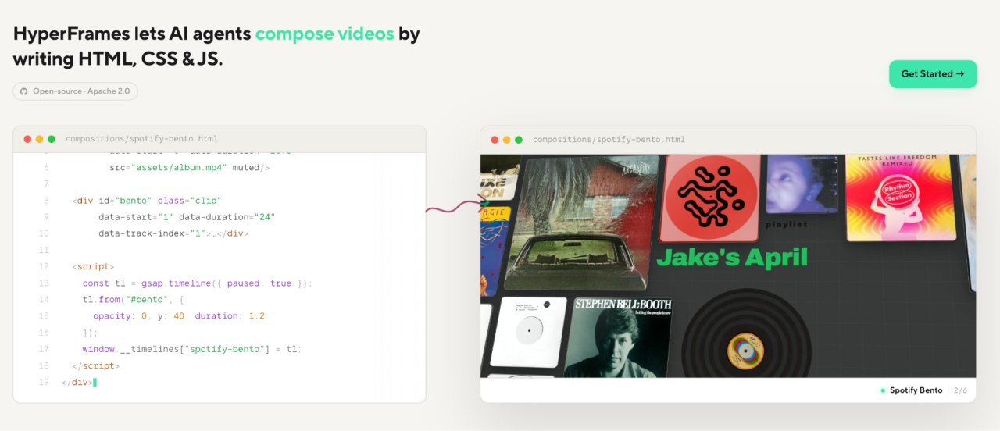
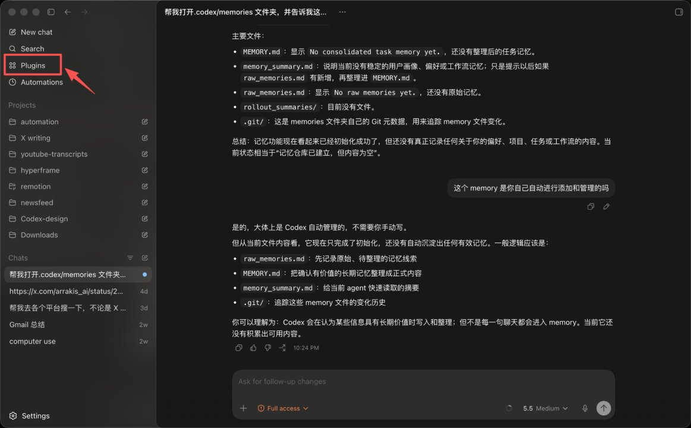
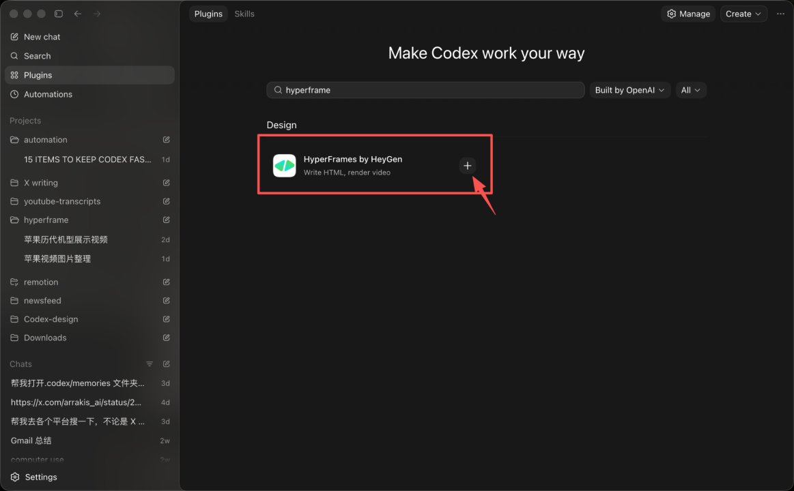
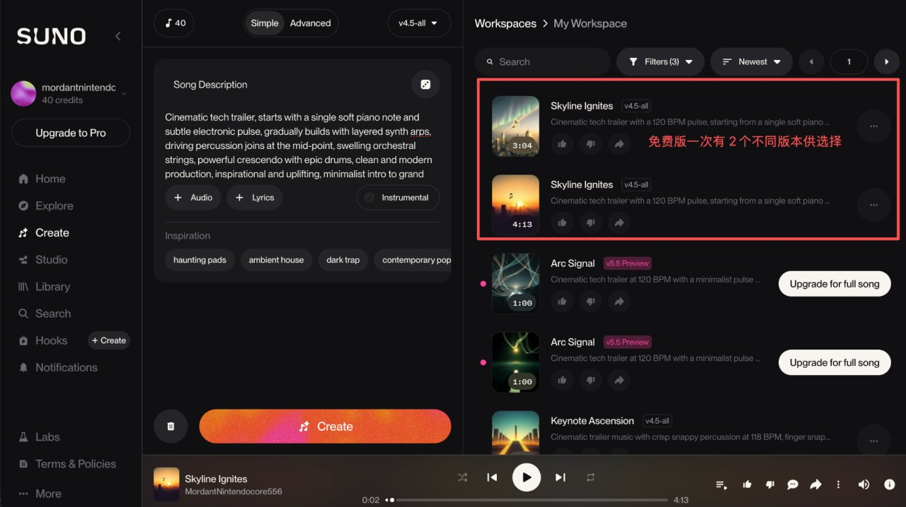

<strong style="font-size:16px;color:#1a6ba0;">要点速览</strong>

- <strong>Codex + HyperFrames</strong>：AI Agent 写代码，HyperFrames 渲染成片，1 小时搞定基础剪辑动画  
- <strong>为什么是 Codex</strong>：写代码是 AI Agent 最擅长的事，Codex 是 T0 级工具。HyperFrames 用 HTML 编写，天然为 Agent 设计  
- <strong>提示词核心</strong>：描述清楚动画类型、时长画幅、视觉风格、关键元素、动效要求、声音要求——越具体越好

**以前做视频，需要找素材、学剪辑、配音乐，一套下来投入成本极高。现在有了 AI，只要用好 Codex + HyperFrames 这套组合，基础的剪辑和动画 1 小时就搞定。**

**HyperFrames 是什么？**

HyperFrames 是 HeyGen 开源的一个代码驱动的视频制作框架。**有了它，你不用打开任何剪辑软件，直接写代码就能生成视频。** 配合 Codex 特别合适的两点：

1. **写代码是 AI Agent 最擅长的事**，Codex 又是目前 T0 级别的超级工具。你只管描述想要的画面，代码的事交给它。
2. **HyperFrames 直接用 HTML 编写**，天然为 Agent 设计。AI 写 HTML 比写任何其他格式都顺，出错少，迭代快。

**你描述清楚想要画面，Codex 负责写代码，HyperFrames 渲染成片。整个过程就是一次对话。**

**配置步骤**

安装 Codex App，在左侧栏点击 Plugins，搜索 HyperFrames 并添加即可。**整个过程只需要几分钟，不需要配置环境、不需要理解 API，点几下鼠标就完成了集成。**

**实战技巧：写好提示词的四个维度**

一份好的 prompt，核心就是把脑里的详细画面翻译成文字。**提示词的质量直接决定视频质量。** 写清楚以下内容：

- **动画类型/视频类型**：功能演示、数据可视化、发布会预告、社媒短片等
- **时长和画幅**：例如 10 秒、9:16 抖音画幅等
- **视觉风格**：例如 Apple 风格、真实软件界面、极简科技感、电影感等
- **关键元素和动效**：必须出现的文字、图标、产品、数据、流式打字、淡入淡出、缩放转场等
- **声音要求**：配乐、打字声、点击声、旁白、音效同步等

**这四个维度覆盖了一个视频从「内容」到「呈现」到「听觉」的全链路。缺一个维度，效果就少一层。**

**实战案例：iPhone 历代展示动画**

这是 Sac 做的一个苹果手机进化史视频开场时用的 prompt，核心结构如下：

1. **画面设定**：从真实感的 Codex 深色聊天首页开始，输入框自动流式输入指令
2. **Mention 效果**：指令中"HyperFrames by HeyGen"以插件 chip 形式显示，带小图标
3. **生成动画**：点击发送后，Codex × HyperFrames 图标出现，伴随呼吸、跳动动效
4. **预览卡片**：生成完成后，出现 Apple 风格的视频预览卡片，点击播放全屏展开
5. **转场过渡**：界面切换用平滑 fade in/fade out，所有动效清爽、利落

**这个案例展示了从「描述画面」到「生成可交互预览」的完整链路——每一步都是自然语言驱动，不需要写一行渲染代码。**

**第一版大概率不会完美，直接告诉 Agent 哪里要改就行。** 这个工作流的优势在于：不用理解 HyperFrames 的代码逻辑，描述画面就好了，Agent 负责执行。**迭代几次之后，你唯一需要投入的就是把画面描述得更精确——这个能力会随练习越来越强。**

---

<strong style="font-size:15px;color:#8b6f4c;">结语</strong>

HyperFrames + Codex 的价值不在于它有多强的渲染能力——比渲染能力它打不过专业剪辑软件。它的价值在于**把「做视频」从一个专业工具操作问题变成了一个提示词工程问题**。你不需要学 Final Cut Pro 或 After Effects，只需要把脑中的画面讲清楚。剪辑行业的下一个门槛可能不再是「会不会用软件」，而是「能不能说清楚自己要什么」。

---
参考：https://x.com/Saccc_c/status/2051852464400261429
