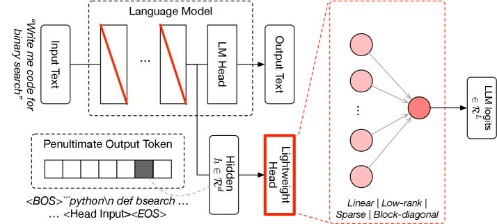
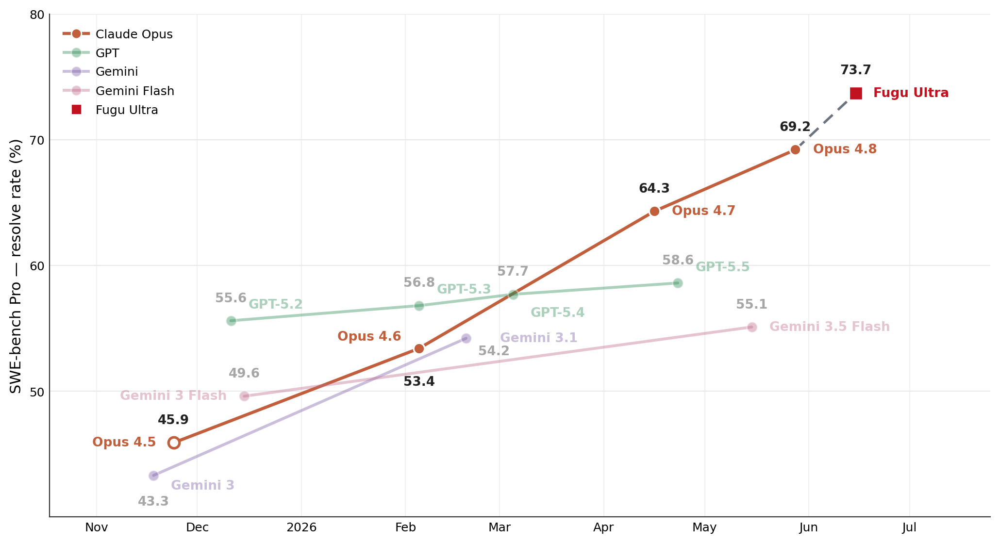
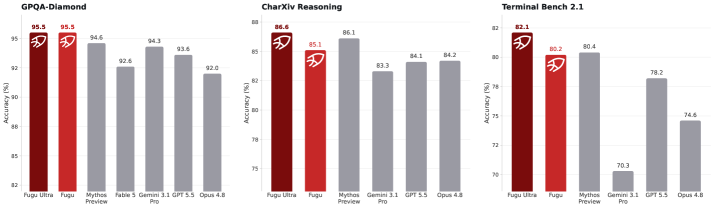
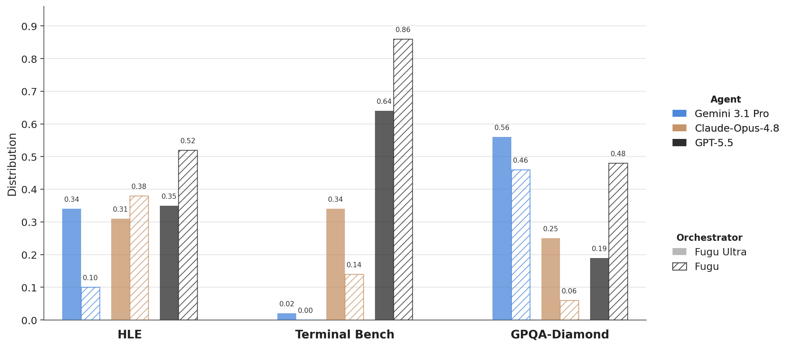
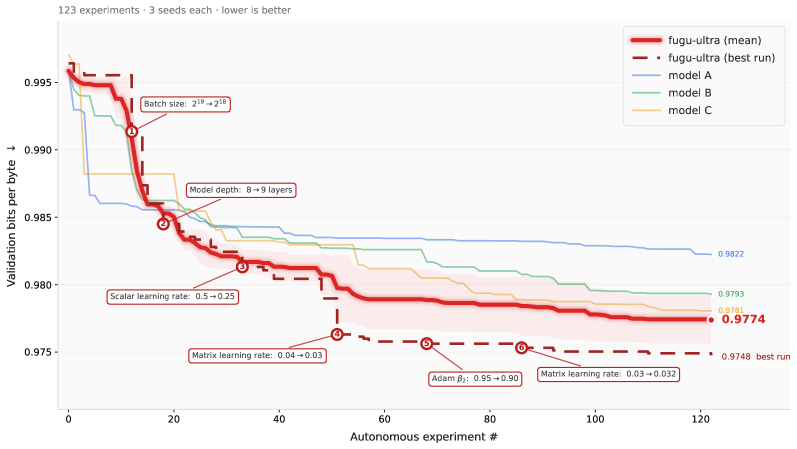

<strong style="font-size:16px;color:#1a6ba0;">要点速览</strong>

- <strong>Fugu-Ultra 全基准登顶</strong>：SWE Bench Pro 73.7%（领先 Opus 4.8 的 69.2%）、Terminal Bench 2.1 82.1%（领先 GPT-5.5 的 78.2%），甚至超越未公开的 Mythos/Fable 模型系列  
- <strong>训练即编排</strong>：Fugu 模型本身就是 LLM，经过 SFT + 进化策略 + RL 训练，学会为每个问题动态设计 Agent 工作流  
- <strong>双变体策略</strong>：Fugu（单模型选择，延迟≈直接调 API）和 Fugu-Ultra（多 Agent 多步工作流，追求极致质量）  
- <strong>多轮交替是最优策略</strong>：GPT 做建筑工、Opus 做质检员：交替调用比单独用任何模型强 5-6%  
- <strong>超越训练扩展的新轴</strong>：证明智能编排可以作为独立于训练算力的新扩展轴，无需更大的模型即可获得更大能力

前沿大语言模型现在在广泛领域达到了专家级性能，但不同模型变得越来越专门化：GPT 在数学上强，Opus 在工程和安全上有专长，Gemini 在事实回忆上出色。下一个问题自然浮现：能不能让它们组队，让强的互补更强的？

Sakana AI 今天发布了 Fugu 技术报告的完整版，这是他们学习型编排器模型的正式学术论文。Fugu 不只是一个路由层：它本身就是一个经过训练的 LLM，能理解用户问题并动态设计出最优的 Agent 编排方案。

**Fugu 的核心设计**

Fugu 的参数化设计。一个轻量级选择头与基础模型的 LM 头并行工作。它从编排器骨干获取隐藏状态 h 并输出 L 个 logits。Fugu 不分配角色：所选模型始终作为工作者被调用，这缩小了协调空间并降低了编排延迟。

Fugu 家族的编排方式不是传统的"查询→路由→转发"，而是让一个经过专门训练的 LLM 在接收到每个查询时，根据问题内容在池子里的工作者模型中做选择。Fugu 变体每次只选一个模型，Fugu-Ultra 可以构建多步 Agent 工作流。

Fugu 的参数化设计很有意思：在编排器骨干的最终隐藏层后加一个轻量级选择头。给定隐藏状态 h，头输出 L 个 logits 为每个模型打分。关键选择是 Fugu 用 logits 而非生成文本做决策：系统只需要在早期 token 位置算个隐状态，应用选择头就完成分派，不需要跑完整自回归解码。这意味 Fugu 的推理开销极低。

Fugu-Ultra 使用 Conductor 框架，用 RL 训练 LLM 来为一组 Agent 设计完整工作流。工作流以自然语言形式输出：划分输入任务、分配子任务到不同 Agent、定义通信策略。最多支持 5 步工作流，Agent 池包括 Gemini-3.1-Pro、Claude-Opus-4.8 和 GPT-5.5。

**两阶段训练**

Fugu 的训练分两阶段。第一阶段用大规模 SFT 在单步任务上训练：覆盖编码、数学、推理、语言理解和 Agent 场景。每个问题用池中所有模型跑多次，根据表现生成软目标分布，训练选择头和奇异值微调参数。

第二阶段用进化策略（sep-CMA-ES）在端到端任务上优化。从 Claude Code、Codex、OpenCode 等真实编码助手环境收集多轮轨迹，训练 Fugu 在多步交互中做正确决策。

**Fugu-Ultra 的函数调用难题**

多 Agent 系统中任何 Agent 随时可能调用函数，系统必须保留哪个 Agent 发出哪个调用以及它在工作流中的位置。Fugu-Ultra 的方案是工作流内 Agent 隔离：每个 Agent 只通过访问列表观察其他 Agent 的输出，防止第一个 Agent 给路径定调后所有人跟着走。同时允许跨工作流共享记忆，避免重复工具调用。

Fugu-Ultra 在 agentic 编码上的增益相当于模型世代升级：通过编排 Opus-4.8、GPT-5.5 和 Gemini-3.1，Fugu-Ultra 获得了通常需要下一代训练才能达到的性能。

**基准数据：全面超越个体模型**

Fugu-Ultra 在 SWE Bench Pro 上 73.7%，比 Claude Opus 4.8 的 69.2% 高出近 5 个点。Terminal Bench 2.1 上 82.1%，领先 GPT-5.5 的 78.2%。LiveCodeBench 上 93.2%，LiveCodeBench Pro 90.8%。GPQA Diamond 上两者均达 95.5%。

更惊人的是，Fugu（单模型选择变体）在多个基准上也匹配或超越了单个前沿模型：Terminal Bench 上 80.2%。分析轨迹发现，Fugu 在一个问题的解决过程中在 GPT-5.5 和 Claude-Opus-4.8 之间交替，在关键的调试点换 Opus 上场。

科学推理方面，两者在 GPQA-Diamond 上达到 SOTA，甚至超越了不公开可用的 Mythos Preview 和 Fable 5 模型类别。这直接证明了 Fugu 的核心论点：智能编排是无需扩展训练计算的额外性能轴，可以在不训练更大模型的前提下获得超越当前代际的能力。

Fugu 模型仅通过智能编排就超越了 Mythos Preview 和 Fable 5 模型类的能力：这两个模型本身都不公开可用，但通过编排它们已经成为了可用的能力。

Fugu 模型跨领域自适应地调整编排策略。Terminal Bench 中偏向 GPT-5.5，GPQA-Diamond 中偏向 Gemini，Humanity's Last Exam 中三个 Agent 高度平衡。

**三个展示性实验**

AutoResearch 训练优化：123 次自主实验后，Fugu-Ultra 达到平均验证 BPB 0.9774，领先所有单 Agent 基线。编排在最需要的时候最有价值：当搜索空间从粗略配置转向精细优化调整时，多模型编排开始拉出差距。

古典日语阅读顺序恢复：25 页专家标注的假名书信，Fugu-Ultra 平均 NED 0.776，最佳单模型基线只有 0.642。这不是训练数据能解决的问题（根本不存在这样的训练集），而是 Fugu-Ultra 在推理时通过 beam search 不断改进预测器的结果。

CAD 生成：从文本指令生成机械光圈机构。Fugu-Ultra 生成了完整的结构：每个刀片绕外销旋转，中央开口平滑开合。其他模型要么叶片没完全覆盖中心，要么外连接机械强度不够。

**编排策略的发现：原来 GPT 做建筑工、Opus 做质检员最有效**

Fugu-Ultra 在 Terminal Bench 中构建 PyPI 服务器时展现了教科书式的编排策略。它先部署 GPT-5.5 做建筑工：完成了服务器构建并确认可访问。然后部署 Opus-4.8 做质检员：Opus 发现了 GPT 实现中的三个问题：用了静态 http.server 而非 pypiserver、手建的 wheel 脆弱、Debian-slim 环境管理不当。这些问题回流给 GPT 后，GPT 成功完成了构建。

在 SWE Bench Pro 的一个问题中，Fugu-Ultra 先让 Opus 做主导工程师理解和修复一个 OTP 设备验证错误。Opus 一路追踪到 TOTP 库，但走进了死胡同。Fugu-Ultra 这时让 GPT 从零开始重新审视：GPT 发现这不是服务端问题，而是客户端并发 bug，服务端错误只是表层症状。信息回流给 Opus 后，Opus 改变了方向，找到了正确修复方案。

更进一步，当任务需要密码分析领域的数学推导时，Fugu-Ultra 用 Opus 做第一版攻击方案构建，然后让 GPT 以数学专家身份从基本原理重新推导整个攻击，逐 bit 跟踪密码推导出差分常数。

这种「构建→质检→重构」的三段式交替编排，是单一的 Claude Code 或 Codex 无法复现的。

AutoResearch 实验的验证 bits-per-byte 对比。Fugu-Ultra（红色）在 123 次自主实验后达到最佳平均验证 BPB 0.9774，超越所有单 Agent 基线。编排的收益在中后期最为明显：当搜索空间从粗略配置转向精细优化时。

<strong style="font-size:15px;color:#8b6f4c;">结语</strong>

Sakana Fugu 的技术报告是一份坦诚的学术作品：没有隐瞒编排引入的延迟成本，没有回避多 Agent 系统中的函数调用和记忆隔离难题。它的核心主张值得认真对待：编排不应该只是产品层面的功能，而应该是模型层面的能力。  
Fugu 与现有的"模型路由"类产品（如 OpenRouter）的区别在于：它不是用外部规则或轻量分类器做路由，而是用一个经过训练的 LLM 去理解问题内容，并基于隐藏状态做决策。这意味着编排策略本身也在持续进化：随着新模型加入池子、新基准出现、新用户需求产生，Fugu 可以不断适应。  
如果这个方向被验证，那么 AI 行业的竞技规则会发生变化：训练最大模型不再是通往前沿的唯一路径，学会如何组合现有模型将成为新的护城河。

---

参考：

https://arxiv.org/html/2606.21228v2
