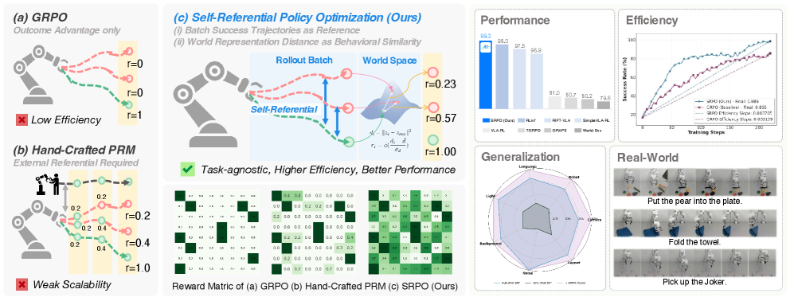
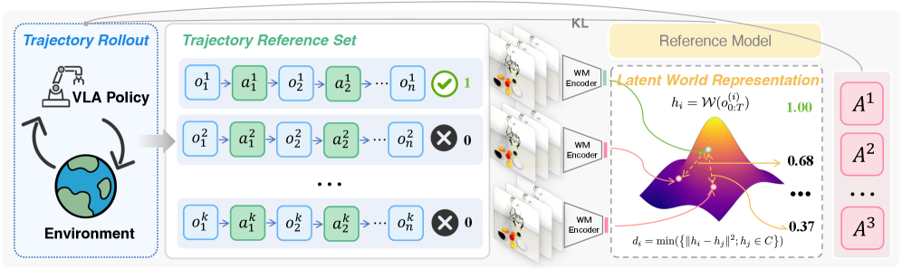
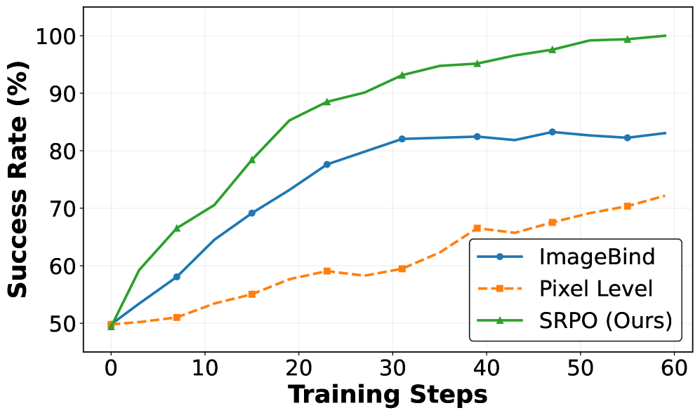
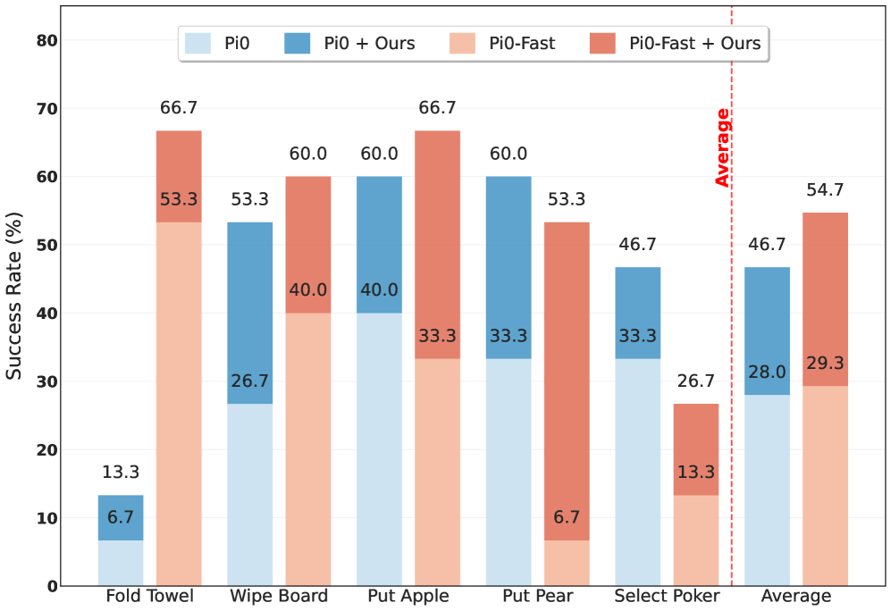
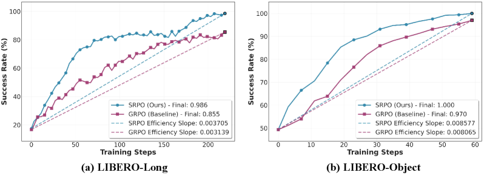

<div style="background:#e8f4fd;padding:14px 16px 10px 16px;border-radius:6px;margin-bottom:18px;">
<div style="text-align:center;margin-bottom:10px;">
<strong style="font-size:16px;color:#1a6ba0;">要点速览</strong>
</div>
<div style="font-size:14px;color:#3f3f3f;line-height:1.75;">
- <strong>48.9% → 99.2%</strong>：SRPO 仅用 200 步 RL 训练，将单次演示 SFT 基线的成功率从 48.9% 拔升至 99.2%（相对提升 103%），在 LIBERO 上创下新 SOTA<br><br>
- <strong>自参照范式</strong>：利用 batch 内自身产生的成功轨迹作为参考，为失败轨迹赋予「进度奖励」，彻底摆脱外部专家演示或手工奖赏设计<br><br>
- <strong>隐式世界表征</strong>：用预训练的世界模型（V-JEPA 2）将轨迹编码到隐空间，通过 DBSCAN 聚类 + L2 距离度量行为相似度，无需逐像素重建或领域微调<br><br>
- <strong>泛化 + 真实迁移</strong>：在 LIBERO-Plus 扰动环境上达 167% 性能提升，真实机器人五类任务平均 +66.8%~86.7%
</div>
</div>

VLA 模型在机器人操控上展现出强大能力，但一个根深蒂固的瓶颈始终悬而未决：**过度依赖专家演示**。从 OpenVLA 到 Pi0，这些模型在少量下游数据上做 SFT 后，往往只能忠实地模仿演示路径，很难超越人类的示范水平。

强化学习是被寄予厚望的 post-training 方案，然而在 VLA 场景下，RL 面临一个残酷的现实——**奖赏极度稀疏**。GRPO 等策略虽然有效，但仅依赖 0/1 二值成败信号，大量失败轨迹的信息被直接丢弃。而引入过程监督又需要外部专家演示或手工任务分解，与「自主学习」的初衷背道而驰。

复旦大学、同济大学、上海创智学院联合提出的 **SRPO（Self-Referential Policy Optimization）** 用一个优雅的思路打破了这个困局：**让模型用自己的成功轨迹来评判自己的失败尝试**。


**图 1：SRPO 整体框架。不同于 GRPO 仅使用稀疏结果奖赏（a）和手工 PRM 依赖外部演示（b），SRPO 利用 batch 内部成功轨迹 + 隐式世界表征构建进度感知奖赏，实现失败轨迹的高效利用。**

---

### 一、核心方法：自参照学习 + 隐式世界表征

SRPO 的核心洞察来自一个简单的问题：**已成功的轨迹知道「怎么做是对的」，那失败的轨迹能不能通过比对自己与成功轨迹的「差距」来获得有意义的训练信号？**

技术方案分三步走：

**Step 1：世界模型编码轨迹。** 使用大规模视频预训练的隐式世界模型 V-JEPA 2 作为编码器，将每条轨迹的所有观测帧 `o_0:T` 编码成一个隐空间向量 `h_i`。这个隐空间天然捕捉了跨环境的物理规律和行为模式，无需像像素级方法依赖精确重建，也无需像 ImageBind 缺乏机器人物理直觉。

**Step 2：聚类成功轨迹。** 对 batch 内所有成功轨迹的隐向量做 DBSCAN 聚类，得到一组代表性的「成功策略中心」。之所以用聚类而非单条最近轨迹，是因为：① 同一任务可能有多种成功策略（如先放 A 还是先放 B）；② 单条成功轨迹可能含噪声段（夹爪短暂偏离目标后纠正），聚类中心给出了更鲁棒的度量基准。

**Step 3：进度奖赏计算。** 失败轨迹与最近的聚类中心的 L2 距离 `d_i` 经 Sigmoid 归一化后即为进度奖赏 `g_i`。成功轨迹直接得满分 1.0，失败轨迹根据「离成功有多近」获得 (0,1) 之间连续值。整个奖赏函数只有一个超参数 α 控制进度感知与结果正确性的平衡——实验发现 α=0.8 最优。


**图 2：SRPO 方法流程。Policy rollout 产生成功/失败轨迹后，经世界模型编码、DBSCAN 聚类、距离度量三步生成进度奖赏，最终用于 GRPO 风格的策略优化。**

在优化层面，SRPO 采用 GRPO 的架构框架，但将二值奖赏替换为上述进度奖赏，在轨迹组内计算归一化优势估计：

```
Â_i = (g_i - μ_g) / σ_g
```

> 这样一来，**「这次虽然失败了，但比上次更接近目标」**的信号也能转化为正向梯度，推动策略持续向目标收敛。

---

### 二、实验表现：200 步从 48.9% 到 99.2%

**LIBERO 基准测试**包含 Spatial、Object、Goal、Long 四个套件，每个 10 个任务。SRPO 的基数是单次演示 SFT 的 OpenVLA* 模型，成功率仅 48.9%。**在线 SRPO 仅用 200 步 RL 训练就将平均成功率推至 99.2%**（相对提升 103%），之前的最佳方法 RLinf 在更多输入模态下也只能到 98.0%。

| 模型 | 方法 | 策略输入 | Spatial | Object | Goal | Long | **平均** |
|------|------|---------|---------|--------|------|------|---------|
| OpenVLA* (SFT) | 模仿学习 | T+I | 63.6 | 54.9 | 59.6 | 17.3 | **48.9** |
| SimpleVLA-RL | GRPO（二值） | T+I | 98.2 | 98.7 | 98.8 | 91.7 | 96.9 |
| RLinf | GRPO（二值） | T+W+P+I | 99.4 | 99.8 | 98.8 | 94.0 | 98.0 |
| **+Online SRPO** | 自参照 | **T+I** | **98.8** | **100.0** | **99.4** | **98.6** | **99.2** |

> ↑ 提升 | 35.2↑ | 45.1↑ | 39.8↑ | 81.3↑ | 50.3↑

注意 SRPO **仅用单一第三视角图像 + 语言指令**作为输入，就超越了那些使用腕部相机、本体感知甚至 3D 数据的对手。这意味着 SRPO 的核心优势不在于模态丰富度，而在于**对失败轨迹的信息利用效率**。

**LIBERO-Plus 泛化测试**更说明问题。在引入相机位姿扰动、机器人初始位姿变化、光照变化、背景杂乱等 7 个维度扰动后，SFT 基线的成功率跌落至 19.4%，SRPO 将其拉升至 59.6%（相对提升 207%）。在增强数据上训练时，SRPO 甚至超越了依赖额外视觉输入的全量 SFT 基线。


**图 3：不同进度奖赏方法的训练性能对比。像素级方法收敛缓慢，ImageBind 卡在 ~85% 平台期，SRPO 持续稳定提升至 SOTA 水平。**

**真实机器人实验**在 X-ARM 7 上完成五类任务（放苹果、放梨、折叠毛巾、擦白板、选扑克）。无论基于扩散模型的 π₀ 还是自回归的 π₀-FAST，加上 SRPO 的奖赏塑造后分别提升 **+66.8%** 和 **+86.7%**。


**图 4：真实场景成功率对比。SRPO 奖赏塑造在 π₀（扩散型）和 π₀-FAST（自回归型）上均带来显著提升。**

---

### 三、为什么 SRPO 能比 GRPO 更高效？

**训练效率**是一个核心指标。SRPO 在四个套件上的 RL 步数分别为 79（Spatial）、59（Object）、103（Goal）、219（Long），相比 SFT 需要的数万步，效率提升两个数量级。

更直观的对比来自 Figure 5：SRPO 的效率曲线斜率显著高于 GRPO，**尤其是在长程任务（Long）上差距更明显**。


**图 5：SRPO vs GRPO 训练效率对比。SRPO 在长程任务上的效率优势尤为突出。**

原因在于两种方法对失败轨迹的「态度」完全不同：
- **GRPO**：成功 = +1，失败 = 0。失败的最终结果告诉策略「你错了」，但不告诉「错在哪」。
- **SRPO**：成功 = 1.0，失败 = 0.2~0.9 之间的某个值，取决于「离成功有多近」。**一次几乎成功但最后一步失败了的轨迹，仍然能提供 0.9 的训练信号。**

在 LIBERO-Long 这种包含 5+ 子步骤的长程任务中，90% 的轨迹以失败告终，SRPO 对这部分轨迹的「部分优质信号」提取能力直接决定了它的效率优势。

---

### 四、分析：隐空间 vs 像素级 vs 通用视觉

论文设计了一套完整的 5 维度进度奖赏评测基准（700 条成功轨迹 + 300 条失败轨迹），量化比较三种方案：

| 指标 | 像素级 | ImageBind | **SRPO (ours)** |
|------|-------|-----------|-----------------|
| Spearman 相关性 ↑ | 0.125 | 0.957 | **0.998** |
| 单调性 ↑ | 0.498 | 0.837 | **0.992** |
| MMD（分布分离）↑ | 0.274 | 0.356 | **0.615** |
| JS 散度 ↑ | 0.548 | 0.408 | **0.572** |
| 标准化均值差 ↑ | 2.100 | 18.111 | **188.799** |

SRPO 在全部 5 个指标上碾压对手。特别值得注意的是**标准化均值差（SMD）**——SRPO（188.8）是 ImageBind（18.1）的 10 倍、像素级（2.1）的 90 倍。这意味着 SRPO 的进度奖赏在区分成功和失败轨迹上，信息密度高出两个数量级。

质化方面的差异同样明显：
- **像素级**：只依赖最后一帧，对微小像素变化极度敏感，产生剧烈抖动
- **ImageBind**：能捕获轨迹级特征但缺乏物理直觉，奖赏曲线出现不合理尖峰/低谷
- **SRPO**：单调平滑，物理合理，长程多子任务时依然稳定

> 论文的类比很贴切：像素级是「用最后一帧评分」，ImageBind 是「让艺术评论家给物理实验打分」，SRPO 是「让物理学家打分」——它通过对轨迹的隐空间编码，自然捕获了「物体的运动是否符合物理规律」这一核心信号。

---

### 五、消融与探索：自参照为什么优于固定专家？

**自参照机制消融**：当把 batch 内自产的成功轨迹替换为固定的 50 条外部专家轨迹后，性能在后期出现明显平台期。即使训练步数增加 1.4 倍，仍无法达到 SRPO 的最终水平。这说明**静态的外部参考最终限制了策略的开放探索能力**——策略在进化，而参考标准在原地不动。

**成功轨迹聚类消融**：去掉 DBSCAN 聚类、直接用单条最近邻成功轨迹做距离度量后，初期训练效率与完整 SRPO 相当，但后期差距逐渐拉大。原因也自然：训练早期成功策略少、成功轨迹数量小，聚类优势不明显；后期探索多样化后，聚类提取「原型策略」、去除单条轨迹噪声能力的价值就凸现出来。

**探索多样性的直观证据**来自对末端执行器轨迹的可视化：
- SFT 策略的轨迹紧贴演示路径，空间分布集中
- SRPO 在线 RL 策略的轨迹明显更分散，探索了演示数据从未覆盖的区域
- 即使是单条演示初始化的策略，SRPO 也能发现全新的抓取位置和路径策略

论文还讨论了使用像素级世界模型（Cosmos-Predict2）来生成参考轨迹的方案。结论是：零样本生成的视频质量极差（场景不一致），而微调又需要海量专家演示。这进一步验证了 SRPO 隐空间方案的优越性——**不需要生成完整的未来帧，只需要在隐空间中比较「像不像」**，成本更低、效果更好。

---

<div style="background:#f5f0eb;padding:14px 16px 10px 16px;border-radius:6px;margin-bottom:16px;">
<div style="text-align:center;margin-bottom:8px;">
<strong style="font-size:15px;color:#8b6f4c;">结语</strong>
</div>
<div style="font-size:14px;color:#3f3f3f;line-height:1.75;">
SRPO 最引人注目的不是 99.2% 的数值本身——VLA + RL 的传统路径可能花更多步数也能逼近这个天花板。真正的贡献在于：它用「自参照」这个设计选择，<strong>把 VLA-RL 从「需要外部教师」的模式切换到了「自己教自己」的模式</strong>。<br><br>
这种范式的意义远超单一任务。在 GRPO 架构下，成功是快照，失败是噪音；在 SRPO 架构下，成功是标准，失败是信号。隐式世界模型的引入让「信号提取」在不需要人类标注的情况下保持了高精度——这是一个可扩展的设计。<br><br>
论文没有讨论的是：当 RL 训练进行到后期、batch 内几乎全部是成功轨迹时，自参照的参考集合会失去多样性，参考信号逐渐趋同。是否需要在成功率达到一定阈值后引入外部扰动或回放缓冲池来维持参考集的丰富性？这是一个值得后续跟进的方向。
</div>
</div>

---

<span style="font-size:12px;color:#888888;">参考：https://arxiv.org/abs/2511.15605</span>
