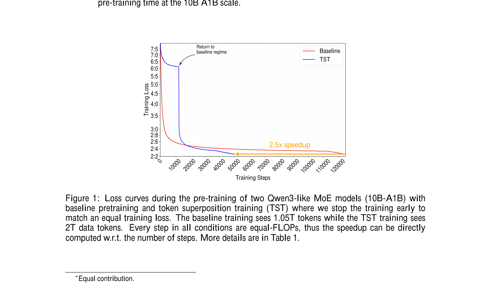
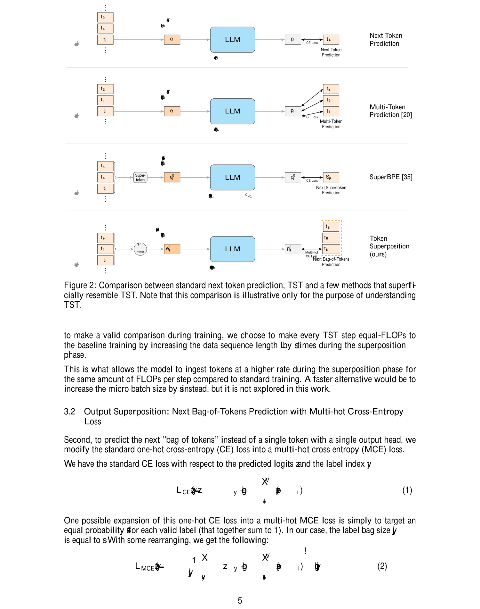
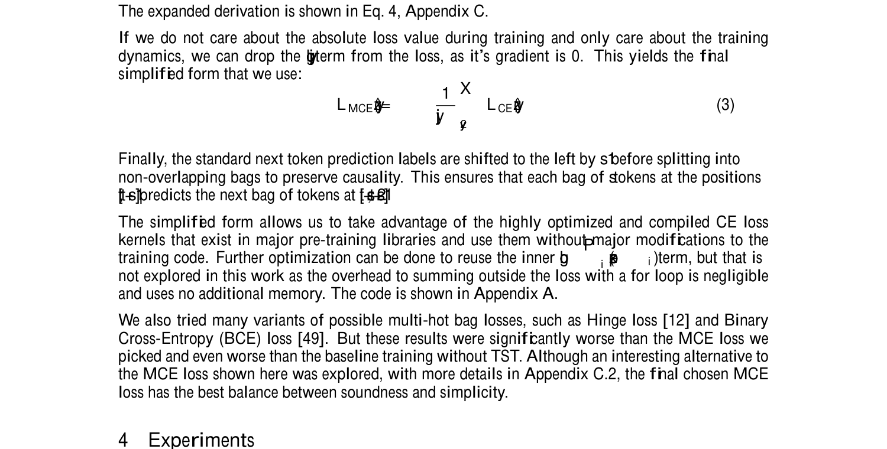

<strong style="font-size:16px;color:#1a6ba0;">要点速览</strong>

- <strong>2.5× 加速预训练</strong>：Token-Superposition Training（TST）在 10B A1B MoE 模型上以等 loss 条件实现 2.5 倍训练时间缩减，无需改并行策略、优化器、tokenizer 或模型架构  
- <strong>两阶段方案</strong>：叠加阶段（superposition phase）将 s 个连续 token 的 embedding 平均成「s-token」，用多热交叉熵（MCE）预测下一袋 token；恢复阶段（recovery phase）回归标准 next-token 预测  
- <strong>两个正交机制</strong>：输入叠加 = 粗到细粒度调度（更高 token 吞吐量），输出叠加 = 袋词预测（更丰富梯度信号），两者独立带来收益、叠加不相互干扰  
- <strong>从 270M 到 10B 都有效</strong>：在 270M、600M、3B（Dense）和 10B A1B（MoE）上验证，下游评测一致优于基线

预训练大型语言模型越来越贵。随着「过度训练」（overtraining）成为常态——在 compute-optimal 估计点后继续训练数倍数据以换取推理性能——**如何在等量算力下让模型消化更多数据**，成了最实际的效率问题。

现有的改进路径有三条：信息最大化（更好的 tokenizer、辅助 loss）、计算稀疏化（MoE、稀疏注意力）、压缩建模（让更少的表征流经昂贵层）。但前两条要么改了模型架构、要么只关注推理效率，第三条则通常需要复杂的对齐阶段。

Nous Research 的 Bowen Peng、Théo Gigant 和 Jeffrey Quesnelle 提出的 **Token-Superposition Training（TST）** 换个思路：**不改模型、不改优化器、不改数据，只在训练时把多个 token「叠」成一个来处理。**

**图 1：10B A1B MoE 模型的训练损失曲线。TST 训练在等 FLOPs 条件下达到与基线相同 loss 时，仅需约 40% 的步数——对应 2.5× 加速（125K 步基线 → 50K 步 TST）。这是论文最引人注目的单一结果。**

---

### 一、怎么做：叠 token 的两种方式

TST 只改了 Embedding 层和 Loss 函数，不碰模型主体。

**输入叠加（Input Superposition）**：将连续 s 个 token 的 embedding 平均，得到一个「s-token」。原来序列长度 L 被压缩为 L/s，但每步 FLOPs 不变（通过等比例增加数据长度保持）。这意味着模型在**等量计算下处理了 s 倍的数据 token**。

**输出叠加（Output Superposition）**：预测的不再是下一个 token 的概率分布，而是下一个「袋 token」（bag-of-tokens）的联合概率——用多热交叉熵（MCE）损失，让模型预测未来 s 个 token 各是谁，但不关心它们在本袋内的顺序。

这两个操作拼在一起构成 TST 的完整流程。论文特意强调了与 multiple-token prediction（MTP）的关键区别：MTP 不改 token 吞吐量（每 FLOP 处理相同数量 token），只加额外预测头；TST 走的是另一条路——**在训练时提高数据的消化速度**。

**图 2：TST 与标准 next-token prediction、MTP、SuperBPE 的核心区别。TST 的「s-token」通过 embedding 平均生成，输入长度被压缩为 L/s，输出用 MCE 预测整袋 token。**

之后再跟一个**恢复阶段**：切回标准的 next-token 因果预测，TST 代码完全移除。这一步至关重要——论文实验证明，如果在恢复阶段随机重初始化 embedding 和 LM head，TST 的全部收益会消失殆尽。**跨阶段的表征对齐**是 TST 成功的关键机制。

---

### 二、实验结果：全线优于基线

论文做了系统的超参扫描，关键发现：

**3B Dense 模型的三种对比视角（Figure 3）：**
- **等 FLOPs**（相同计算量，不同数据量）：TST 损失曲线始终低于基线
- **等 Loss**（相同损失，看谁更快）：TST 达到同一损失所需步数更少
- **等数据**（相同数据量，不同计算量）：TST 在该数据量下的损失更低——说明同样的数据被更有效地利用了

**从 270M 到 10B 的量化结果（Table 1）：**

| 模型 | 参数量 | TST? | 总步数 | 总 token | 最终 loss | HellaSwag | ARC-C |
|------|--------|------|--------|----------|-----------|-----------|-------|
| Dense | 270M | ✗ | 20K | 42B | 3.212 | 36.3 | 24.9 |
| Dense | 270M | ✓ | 20K | 105B | **3.142** | **38.6** | **26.4** |
| Dense | 600M | ✗ | 20K | 42B | 3.019 | 43.5 | 25.5 |
| Dense | 600M | ✓ | 20K | 105B | **2.943** | **48.2** | **26.9** |
| **MoE** | **10B A1B** | ✗ | **125K** | **1.05T** | 2.252 | 70.1 | 46.3 |
| **MoE** | **10B A1B** | ✓ | **50K** | **2T** | **2.236** | **71.2** | **47.3** |

最引人注目的是 10B MoE 那行：**TST 仅用 50K 步就超越了基线 125K 步的 loss 和下游得分**，对应 2.5× 加速，且 HellaSwag（70.1→71.2）、ARC-E（73.8→74.2）、ARC-C（46.3→47.3）、MMLU（37.4→39.0）全线提升。

**图 3：3B 模型在等 FLOPs、等 loss、等数据三种条件下的对比。TST 在所有配置下均优于基线。**

---

### 三、超参怎么选

论文对 superposition bag size `s` 和 step ratio `r`（叠加阶段占比）做了穷举扫描：

- **s=6** 在多数规模上表现最佳（270M、600M、3B）
- **s=16** 在 10B MoE 上最优（更大的模型可以吃更大的 bag）
- **r=0.3**（30% 步数在叠加阶段，70% 在恢复阶段）效果稳定
- s 过大会出现 U 形曲线——太大则信息损失过多，恢复阶段难以弥补

对于 `r` 的取值，论文发现即使叠加阶段只占 10%（r=0.1），TST 仍优于基线；但 r=0.3 是最佳平衡点。

---

### 四、为什么有效：两个正交机制

论文通过消融实验清楚分离了两个机制各自贡献：

**输入叠加（Input Superposition）**本质上是**粗到细粒度调度**。先让模型在低分辨率（大粒度 token）上快速学习语言的大致统计结构，再在恢复阶段学习细粒度细节。这与 Vision Transformer 中 patch size 从小到大调度的思路一脉相承，也在 Minixhofer 等人的字节级预训练工作中有所体现。

**输出叠加（Output Superposition）**则是让模型学会总结未来的「袋词」——用一袋不带序关系的 token 作为预测目标，迫使模型理解句子的局部上下文结构，而不是逐词地机械记忆过渡概率。

这两个机制加在一起，各自贡献、互不干扰。实验中，仅有输入或仅有输出叠加也优于基线，但两者组合后进一步提升了效果。

---

### 五、与 Shao 等人的 patch-level 训练的关系

论文公开承认，在投稿后了解到 Shao et al. 独立提出了几乎相同的机制（patch-level training），核心差异有三：
- Shao 将其理解为减少总 FLOPs，TST 则强调提高 token 吞吐量
- TST 做了更广泛的超参扫描，并将 MoE 模型扩展到 10B / 2T token
- TST 验证了跨阶段表征对齐的必要性（重初始化 embedding 后全部收益消失）

这种「独立收敛到同一算法」的现象在机器学习中不罕见，但 TST 在更大规模和更细粒度的实验设计上提供了有价值的补充证据。

---

<strong style="font-size:15px;color:#8b6f4c;">结语</strong>

TST 最令人舒服的一点是它的「不 invasive」——不改模型架构、不改并行策略、不改训练基础设施，只改了 embedding 聚合方式和 loss 函数。这意味着它可以直接作为任何现有预训练管线的 drop-in 替代，收益几乎是免费的。  
与 GRPO 对 VLA 的影响类似，TST 在预训练效率上也代表了一种范式切换：<strong>从「怎么在每个 token 上花更多算力」转向「怎么在等量算力下处理更多 token」</strong>。Gigant 等人去年关于 subword vs byte 模型性能差异的研究已经暗示「token 吞吐量」可能是比「token 质量」更关键的效率变量，TST 沿这条路径走得更远。  
但有一个局限值得关注：TST 的收益似乎高度依赖 embedding 和 LM head 的跨阶段连续性。如果未来大规模训练中需要更换 tokenizer 或调整词汇表，这种连续性会被打破，TST 的效果可能大幅衰减。此外，TST 对 s-token 内部顺序信息的完全丢弃是否会在某些需要精确 token 顺序的任务上造成盲区，论文没有深入讨论。

---

参考：https://arxiv.org/abs/2605.06546
