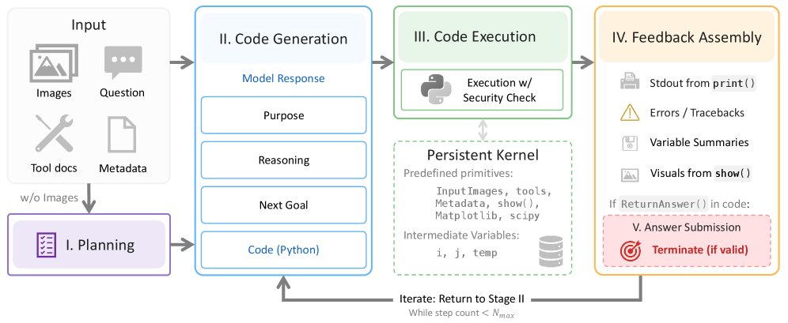
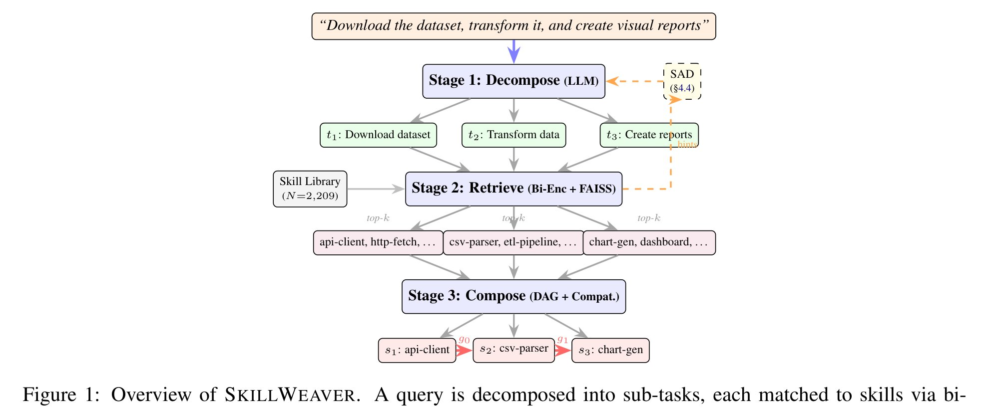
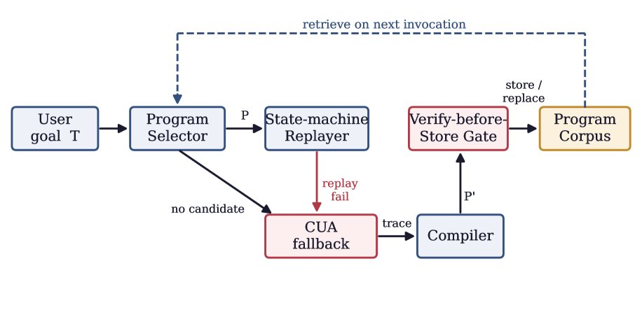
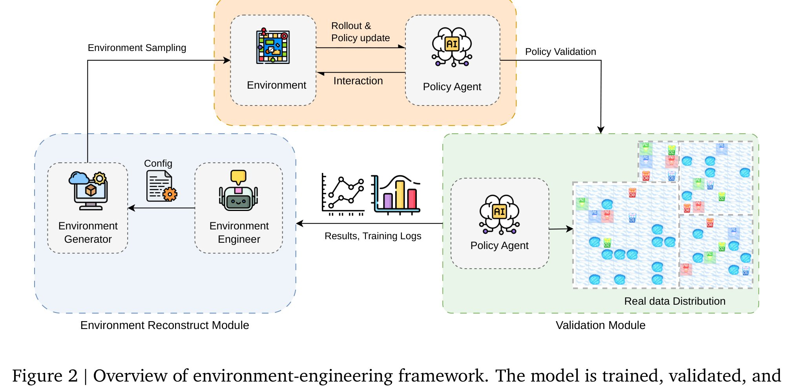
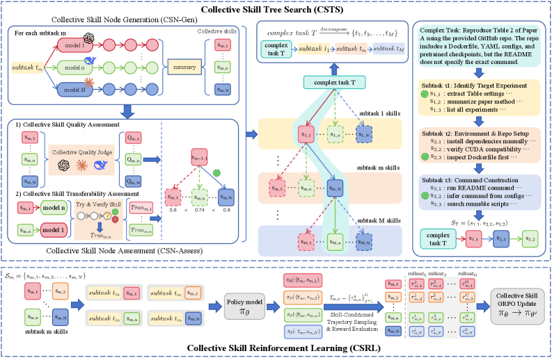

<strong style="font-size:16px;color:#1a6ba0;">要点速览</strong>

- <strong>SpatialClaw（NVIDIA）</strong>：无需训练的框架，让 VLM Agent 通过代码执行进行 3D/4D 空间推理，在 20 个基准上平均 59.9% 准确率，超越此前最佳 11.2 个百分点  
- <strong>SkillWeaver</strong>：形式化组合式技能路由，用分解-检索-组合流水线处理多步复杂查询，在 2,209 个真实 MCP 技能上验证  
- <strong>PreAct</strong>：将计算机使用 Agent 的首次成功运行编译为状态机程序，后续重放无需每步模型调用，速度提升 8.5-13 倍  
- <strong>OpenClaw-Skill</strong>：集体技能树搜索（CSTS）替代单轨迹蒸馏，构建结构化、多样化的可复用技能库  
- <strong>PAPO</strong>：过程对齐策略优化，为扩散 LLM 提供稳定的推理 RL 训练配方，GSM8K 和 MATH500 提升 4.5%-42.2%

---

**1. SpatialClaw：代码即空间推理接口**

<section style="text-align: justify;margin-left: 8px;margin-right: 8px;line-height: 1.75em;">
3D 和 4D 场景的空间推理仍然是通用视觉语言模型的死穴——它们直接输出文本答案，而不是实际测量任何东西。NVIDIA 的 SpatialClaw 换了个思路：让 VLM 驱动的 Agent 通过代码进行推理。
</section>

<section style="text-align: justify;margin-left: 8px;margin-right: 8px;line-height: 1.75em;">
Agent 每步向一个持久的 Jupyter 内核写入一个 Python cell，这个内核预装了 SAM3 分割、Depth-Anything-3 重建和几何工具等感知基元。掩码、深度图、相机几何和轨迹都是内核在各轮之间保留的普通 Python 变量——某一步生成的任何对象在后续步骤中仍可用于组合、检查和修正。
</section>

SpatialClaw 架构图：代码作为空间推理的动作接口

· 标题：SpatialClaw: Rethinking Action Interface for Agentic Spatial Reasoning 
· 链接：https://arxiv.org/abs/2606.13673

<section style="text-align: justify;margin-left: 8px;margin-right: 8px;line-height: 1.75em;">
结果：在涵盖静态和动态任务的 20 个空间推理基准上，SpatialClaw 达到 59.9% 的平均准确率，超过此前最好的空间 Agent 11.2 个百分点，在两个模型家族的六个 VLM 主干上表现一致。因为无需训练且与模型无关，它将代码执行变成了空间推理的通用基底，任何有能力的 VLM 都可以接入，而不需要专门的空间微调。
</section>

---

**2. SkillWeaver：组合式技能路由**

<section style="text-align: justify;margin-left: 8px;margin-right: 8px;line-height: 1.75em;">
真实任务很少映射到单个技能。它们通常需要多个技能组合在一起，但大多数技能路由仍然将问题视为从库中挑选一个工具。这篇论文形式化了组合式技能路由（Compositional Skill Routing）——Agent 必须从大型库中选择并排序多个可复用技能以满足复杂查询——并引入了 SkillWeaver，一个围绕它构建的分解-检索-组合流水线。
</section>

SkillWeaver 三阶段流水线：分解、检索、组合

· 标题：SkillWeaver: Compositional Skill Routing for LLM Agents 
· 链接：https://arxiv.org/abs/2504.07079

<section style="text-align: justify;margin-left: 8px;margin-right: 8px;line-height: 1.75em;">
SkillWeaver 的三阶段流水线：用 LLM 将查询分解为子任务，用双编码器加 FAISS 索引将每个子任务匹配到一个技能，然后执行依赖感知规划以组装可执行的计划。作者同时发布了 CompSkillBench，一个包含 300 个组合查询的基准，覆盖 2,209 个真实 MCP 服务器技能，横跨 24 个功能类别——路由测试是在实际工具生态上进行的，不是玩具库。
</section>

<section style="text-align: justify;margin-left: 8px;margin-right: 8px;line-height: 1.75em;">
关键发现：任务分解质量是主要瓶颈。迭代式技能感知分解（将检索信息反馈回分解步骤）把准确率从 51.0% 拉到 67.7%。随着 Agent 技能库扩展到数千个条目，单工具路由不再够用，将路由视为组合规划问题才能让 Agent 处理真正的多步请求。
</section>

---

**3. PreAct：把 Agent 操作编译成可重放程序**

<section style="text-align: justify;margin-left: 8px;margin-right: 8px;line-height: 1.75em;">
计算机使用 Agent 每个任务都从头解决。让它们重复一个任务，它会重新读取屏幕并重新推理每一次点击，付出全部成本。PreAct 的修复方案很直接：把首次成功运行编译成一个小的状态机程序，状态检查屏幕，转换执行动作，然后在后续运行中重放该程序。
</section>

PreAct 状态机示意图：将操作编译为可重放程序

· 标题：PreAct: Computer-Using Agents that Get Faster on Repeated Tasks 
· 链接：https://arxiv.org/abs/2606.17929

<section style="text-align: justify;margin-left: 8px;margin-right: 8px;line-height: 1.75em;">
重放编译后的程序比 Agent 快 8.5 到 13 倍，因为不需要每步的语言模型调用。每一步 PreAct 都会检查屏幕是否与程序预期匹配，一旦出现偏差就将控制权交还给 Agent。这本质上把计算机使用 Agent 从重新推理一切的交互式工具变成了可重复的操作系统。
</section>

---

**4. LLM Agent 能推断世界模型吗？**

<section style="text-align: justify;margin-left: 8px;margin-right: 8px;line-height: 1.75em;">
LLM Agent 真的能构建一个它看不到的环境模型吗？这篇论文通过 Agent 式自动机学习让这个问题变得可评分。Agent 必须通过两个接口与预言机交互来发现隐藏的确定性有限自动机（DFA）：成员查询（询问某个字符串是否属于目标语言）和等价查询（询问提议的自动机是否正确），这为交互式发现提供了一个干净、可扩展的测试平台。
</section>

DFA 学习框架：Agent 通过成员查询和等价查询发现隐藏自动机

· 标题：Can LLM Agents Infer World Models? Evidence from Agentic Automata Learning 
· 链接：https://arxiv.org/abs/2606.16576

<section style="text-align: justify;margin-left: 8px;margin-right: 8px;line-height: 1.75em;">
将世界模型推断视为 DFA 学习，给出了客观的成功标准和可衡量的交互效率，以经典的自动机学习算法作为强基线。隐藏自动机的大小充当难度旋钮，因此基准可以平滑地扩展任务复杂度，而不是依赖一组固定的谜题。当前 Agent 有时能执行非平凡的交互式发现，但性能随着 DFA 规模增长急剧下降，轨迹分析揭示了查询规划、证据整合和假设构建中的反复失败。推理模型明显优于非推理模型，但与经典算法之间的巨大差距表明，系统性的交互式世界模型构建仍然是一个未解决的能力，不是规模化的副产品。
</section>

---

**5. From Trainee to Trainer：让策略自己设计训练环境**

<section style="text-align: justify;margin-left: 8px;margin-right: 8px;line-height: 1.75em;">
谁应该为 RL Agent 设计训练环境——实践者还是策略本身？LLM 的 RL 流水线通常依赖各阶段之间手动重新设计的环境，实践者猜测哪种配置最能改进当前策略。这篇论文把这项工作交给了模型，提出了 LLM-as-Environment-Engineer 框架，其中策略诊断自己的弱点并提出下一个要训练的环境。
</section>

LLM-as-Environment-Engineer 框架：策略诊断弱点并设计下一阶段训练环境

· 标题：From Trainee to Trainer: LLM-as-Environment-Engineer for RL Agents 
· 链接：https://arxiv.org/abs/2606.xxxxx

<section style="text-align: justify;margin-left: 8px;margin-right: 8px;line-height: 1.75em;">
具体来说：当前策略分析失败轨迹并结合上下文信息，提出对下一阶段训练环境配置的修改。因为提议基于策略的实际失败模式，课程针对的是阻碍模型前进的具体缺口，不是通用的难度提升。关键发现：当前的 RL checkpoint 比原始基础模型更适合作为环境工程师，这表明学会行动也提升了模型诊断自己还不会什么的能力。手动阶段间环境设计是 LLM 的 RL 中最不可扩展的环节之一，让策略引导自己的课程关闭了一个拖累 Agent RL 的慢速人工循环。
</section>

---

**6. OpenClaw-Skill：集体技能树搜索**

<section style="text-align: justify;margin-left: 8px;margin-right: 8px;line-height: 1.75em;">
为 LLM Agent 配备有效技能是实际系统中的大部分工作，但大多数技能归纳工作一次只蒸馏一条轨迹，产生狭窄、脆弱的技能。OpenClaw-Skill 引入了集体技能树搜索（Collective Skill Tree Search, CSTS），在候选技能树上进行搜索，使用多个模型生成和评估它们，使库捕获多样化的策略。
</section>

OpenClaw-Skill 集体技能树搜索示意图

· 标题：OpenClaw-Skill: Collective Skill Tree Search for Agentic Large Language Models 
· 链接：https://arxiv.org/abs/2606.16774

<section style="text-align: justify;margin-left: 8px;margin-right: 8px;line-height: 1.75em;">
CSTS 不是将单条轨迹蒸馏成单个技能，而是构建结构化的、多样化的、可泛化的技能树。分层组织技能产生跨工具使用、多步推理和环境交互的泛化能力，而非过拟合到单个任务。构建树只是工作的一半——框架还配有一个学习步骤，教导 Agent 有效检索和应用构建的技能层级。可复用的技能库正在成为有能力的 Agent 的骨干，从逐轨迹蒸馏转向集体树搜索是一个具体的配方，用于构建在任务增长时仍然有用的库。
</section>

---

**7. PAPO：扩散 LLM 的稳定 RL 配方**

<section style="text-align: justify;margin-left: 8px;margin-right: 8px;line-height: 1.75em;">
扩散大语言模型以不适合为自回归模型构建的 RL 配方的方式生成文本。训练它们推理暴露了两个具体问题：奖励稀疏（单一终端奖励无法指导中间生成步骤）和轨迹漂移（策略更新漂移到不自然的轨迹而非真实的生成路径）。
</section>

<section style="text-align: justify;margin-left: 8px;margin-right: 8px;line-height: 1.75em;">
过程对齐策略优化（PAPO）把终端奖励转化为细粒度的步级指导，使中间去噪步骤收到学习信号，而不是等待单一的序列结束分数。在关键的高不确定性时刻，它重放真实的生成路径，使更新与模型实际产生文本的方式保持一致，而非追逐人工轨迹。
</section>

PAPO 过程对齐策略优化示意图

· 标题：Back on Track: Aligning Rewards and States for Reasoning in Diffusion Large Language Models 
· 链接：https://arxiv.org/abs/2606.08501

<section style="text-align: justify;margin-left: 8px;margin-right: 8px;line-height: 1.75em;">
扩散 LLM 是自回归模型的一个严肃替代方案。在 GSM8K 和 MATH500 等基准上报告了 4.5% 到 42.2% 的提升，为扩散 LLM 提供稳定的推理 RL 配方，有助于缩小两种范式之间的推理差距。
</section>

---

**8. AtomMem：原子级长期记忆**

<section style="text-align: justify;margin-left: 8px;margin-right: 8px;line-height: 1.75em;">
LLM Agent 的长期记忆通常在两个方面失败：粗粒度的摘要随时间漂移，不受约束的更新会破坏已存储的内容。AtomMem 将记忆单元保持得很小，使用一个事实执行器（Fact Executor）从长交互中选择性地提取高价值原子事实，并将它们组织成层级事件结构和时间用户画像，带有一个在检索时重新连接碎片化记忆的关联记忆图。
</section>

· 标题：AtomMem: Learnable Dynamic Agentic Memory with Atomic Memory Operation 
· 链接：https://arxiv.org/abs/2601.08323

<section style="text-align: justify;margin-left: 8px;margin-right: 8px;line-height: 1.75em;">
在 LoCoMo 长期记忆基准上报告了最先进的结果，证明细粒度原子事实比粗粒度摘要更适合作为 Agent 记忆的基本单元。
</section>

---

**9. SkillMigrator：让网页技能跨站点复用**

<section style="text-align: justify;margin-left: 8px;margin-right: 8px;line-height: 1.75em;">
LLM 网页 Agent 通常作为工具调用者运行，每轮读取一个新页面并发出一个低级动作，因此任务视野和 LLM 补全次数都会膨胀。SkillMigrator 将归纳的技能存储为以页面布局结构为键的可迁移交互模式——而非指令相似性或站点元数据——因此在一个站点上学习的技能会在具有相同交互形状的新站点上触发。
</section>

· 标题：SkillMigrator: Learning Reusable Web Skills and Transferring Them Across Sites via Layout Structure 
· 链接：https://arxiv.org/abs/2606.xxxxx

<section style="text-align: justify;margin-left: 8px;margin-right: 8px;line-height: 1.75em;">
在 WebArena 和 Mind2Web 上将平均 LLM 动作次数减少了 8% 到 10%，成功率相当，证明布局结构比站点元数据更适合作为技能迁移的锚点。
</section>

---

**10. Stanford EDGAR 数据集：152B tokens 金融语料**

<section style="text-align: justify;margin-left: 8px;margin-right: 8px;line-height: 1.75em;">
干净的长上下文文档在预训练中仍然稀缺，尤其是在金融领域。这个发布将美国 SEC 公司财务和披露文件重建为布局忠实、token 高效的 MultiMarkdown，在 SEFD-v1 中发布了 152B tokens，来自一个估计 550B token 的档案库，涵盖 1,850 万份文件，与 Common Crawl 语料库的重叠率低于 0.1%。附带两个衍生基准：EDGAR-Forecast（数值预测）和 EDGAR-OCR（金融表格转录）。
</section>

· 标题：The Stanford EDGAR Filings Dataset: Reconstructing U.S. Corporate and Financial Disclosures into Layout-Faithful and Token-Efficient Pretraining Data 
· 链接：https://arxiv.org/abs/2606.18192

---

<strong style="font-size:15px;color:#8b6f4c;">结语</strong>

这一周的论文有一个明显的共同主题：Agent 正在从「单个模型解决单个问题」走向「系统化地构建可复用能力」。SpatialClaw 把代码执行变成推理接口，SkillWeaver 和 OpenClaw-Skill 在技能路由和技能构建上给出了规模化方案，PreAct 把一次性操作编译成可重放程序——每一篇都在解决同一个问题：如何让 Agent 不再每次从零开始。  
PAPO 和 From Trainee to Trainer 则从训练层面给出了另一个方向的答案：让模型自己参与训练过程的设计。当策略自己决定下一个训练环境时，人工循环就被压缩了。  
最让我注意的是 OpenClaw-Skill 的集体树搜索思路——从单轨迹蒸馏到多模型树搜索，这个转变可能比它看起来更重要。技能库的质量决定了 Agent 能力的天花板，而构建高质量库的方法论还远没有成熟。

---

参考：https://x.com/dair_ai/status/2068724104815890889
