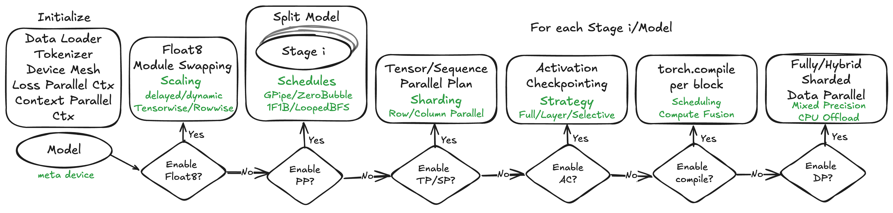
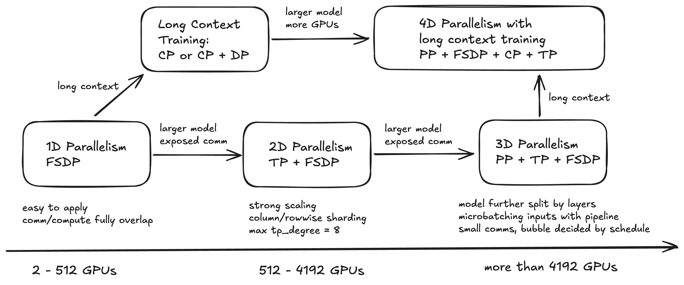
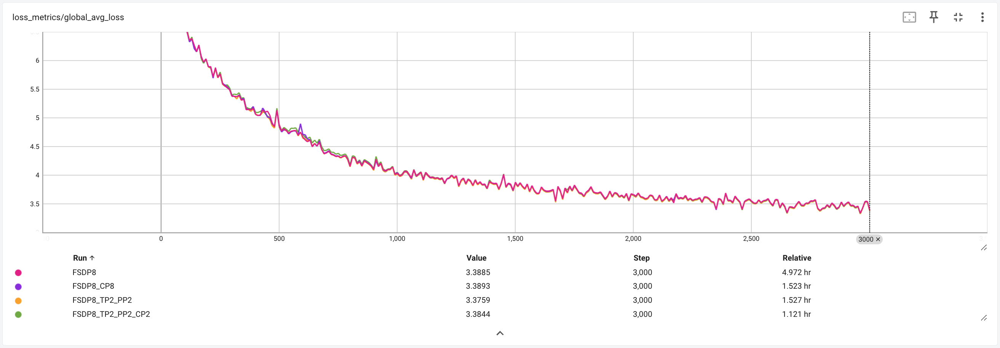

<strong style="font-size:16px;color:#1a6ba0;">要点速览</strong>

- <strong>TorchTitan是Meta开源的PyTorch原生分布式训练系统</strong>：统一FSDP、TP、PP、CP四种并行策略，模块化可组合，一行配置切换  
- <strong>4D并行带来可量化加速</strong>：Llama3.1 8B/128GPU加速65%，70B/256GPU加速12.6%，405B/512GPU加速30%  
- <strong>硬件-软件协同设计</strong>：Float8训练、SymmetricMemory、AsyncTP等PyTorch原生优化，充分利用H100硬件  
- <strong>生产就绪特性</strong>：弹性扩缩容、高效Checkpointing、Flight Recorder调试、Composable4D并行API

**训练一个405B参数的模型需要3084万GPU小时。** 跑这样的任务意味着你要同时管理FSDP、Tensor并行、Pipeline并行、Context并行。这些技术每个都经过了独立优化，但把它们拼在一起时，复杂度会指数级增长。

**2024年PyTorch生态中，四个并行方案散落在多个库里。** FSDP在PyTorch核心，TP在torchtitan或者第三方，PP在PiPPy或Megatron，CP甚至还没有统一入口。得自己把它们接起来。

**TorchTitan就是为了摊平这个复杂度而生的。** Meta在论文中展示了一个完全PyTorch原生、4D并行可组合、且能弹性扩缩容的训练系统。

---

**TorchTitan到底是什么**

**TorchTitan是一个开源的、PyTorch原生的分布式训练系统，把4D并行（FSDP + TP + PP + CP）统一在一个模块化框架里。** 它不是又一个分布式框架，它本质上是一套PyTorch原生API的组合层，开发者可以像搭积木一样配置并行策略。

它的设计哲学很直接：**并行策略应该是「选择性组合」而不是「深度耦合」。** 你不需要为了用TP就锁定整个训练栈；你可以在FSDP基础上加TP，在TP基础上加PP，在PP基础上加CP，每一步都保持向后兼容。

---

**4D并行：不只是堆叠**

**TorchTitan的4D并行做了大量工程优化让四种策略协同工作，不是简单堆叠完事。**

**1D - FSDP（Fully Sharded Data Parallel）：** 最基础的并行层。模型参数、梯度和优化器状态分片到各个GPU上，计算时按需全收集（all-gather）。Meta在TorchTitan中用了FSDP2（基于 `dtensor` 的新实现），相比FSDP1更灵活且与TP的兼容性更好。

**2D - FSDP + TP（Tensor Parallel）：** 当单GPU显存放不下一个Transformer层时，TP把每个层的矩阵乘法切分到多个GPU上。TorchTitan做了两个关键优化：一是AsyncTP，让TP的通信与计算异步重叠，减少通信开销；二是TP与FSDP的分片策略对齐，避免跨策略的内存碎片。

**3D - FSDP + TP + PP（Pipeline Parallel）：** Pipeline并行把模型按层切分成多个阶段，每个GPU负责一段连续的层。难点不在于切分本身，而是气泡率。TorchTitan用了1F1B调度（一个前向接一个后向），配合micro-batch来填充气泡，把空闲时间压到最低。

**4D - FSDP + TP + PP + CP（Context Parallel）：** 这是TorchTitan独有的创新。CP把长序列的Attention计算切分到多个GPU上，**对长上下文训练（128K tokens+）来说，这是激活内存的关键优化。** 4D并行在Llama3.1 405B的long context训练中验证有效。

**最关键的设计决策：所有这些并行策略的配置，在TorchTitan里只需要改一行YAML。** 从1D切到4D，不需要重写训练脚本。

---

**性能不是选出来的，是堆出来的**

**论文的核心价值在于渐进式加速的量化数据。** 他们没有给一个「4D并行比1D快N倍」的单一数字，而是逐层展示了每项优化带来的边际收益：

**Llama3.1 8B（128GPU，1D基线）：**

| 优化逐步叠加 | 加速 |
|------------|------|
| + Selective AC（选择性激活检查点） | +13.7% |
| + torch.compile | +38.6% |
| + Float8 | +65.08% |

**最终1D结果：65.08%加速。** 但最明显的加速来自Float8，FP8训练充分利用了H100的Tensor Core，这是硬件-软件协同设计的直接收益。

**Llama3.1 70B（256GPU，2D基线：FSDP + TP）：**

| 优化逐步叠加 | 加速 |
|------------|------|
| + torch.compile + Float8 | +6.19% |
| + AsyncTP | +12.59% |

**AsyncTP贡献了额外的6.4个百分点。** 当TP通信能和计算异步重叠时，TP本身的通信瓶颈几乎消失了。

**Llama3.1 405B（512GPU，3D基线：FSDP + TP + PP）：**

| 优化逐步叠加 | 加速 |
|------------|------|
| + torch.compile + Float8 | +18% |
| + AsyncTP | +30% |

**405B上AsyncTP的收益更大，更大的模型意味着更长的计算时间，通信重叠窗口更宽。** 训练405B在没有这些优化时需要3084万GPU小时，叠加优化后能省下约30%的时间。

---

**不仅仅是性能**

**TorchTitan在生产层面的设计值得细看。** 它不是一篇纯研究论文，Meta把它部署到了自己的训练集群上，论文中的几个设计反映的是真实踩过的坑：

**Flight Recorder：** 训练作业崩溃时，最痛苦的是你不知道崩溃前一刻发生了什么。Flight Recorder类似飞机的黑匣子，它持续记录每个rank的关键事件流（collective调用顺序、内存分配、CUDA错误），崩溃后可以直接回放。**在大规模（1024+ GPU）训练中，这个东西省的时间是以天计的。** 

**Distributed Checkpointing：** 检查点是分布式训练最容易被忽略的坑。TorchTitan用PyTorch原生的 `distributed.checkpoint`，支持异步写入和弹性恢复。你可以在训练过程中动态增减GPU数量，checkpoint会自动适配新的world size。

**弹性扩缩容：** 这是TorchTitan的一个隐藏亮点。论文提到TorchTitan支持在训练过程中动态调整GPU数量，看起来像小特性，但在共享集群上，GPU资源波动是常态。能在不重启训练的情况下缩容，意味着你不用在「多占10%的GPU等三天」和「被占用的GPU浪费一周」之间做选择。

---

**和Megatron-LM、NeMo比怎么样**

**Megatron-LM/NVIDIA NeMo是TorchTitan最直接的竞争对手。** 两者都支持4D并行，但设计哲学有根本差异：

| 维度 | TorchTitan | Megatron-LM / NeMo |
|------|-----------|-------------------|
| 基础框架 | PyTorch原生，dtensor | NVIDIA自定义C++ 内核 + Apex |
| 并行配置 | 模块化YAML，一行切换 | 需要修改代码或NeMo参数文件 |
| 弹性扩缩容 | 原生支持 | 有限支持 |
| 代码复杂度 | 论文称复杂度降低约3倍 | 较高（多年累积的抽象层） |
| Float8 | PyTorch原生Float8 | NVIDIA Transformer Engine |
| 社区生态 | PyTorch社区 | NVIDIA生态 |

**如果你已经在PyTorch生态里，TorchTitan的集成成本更低。** 如果你用NVIDIA全栈（NeMo + Triton + TensorRT），Megatron的端到端优化更成熟。**TorchTitan的差异化优势在于「PyTorch原生」：你不用为了分布式训练学第二套API。**

论文中还有一个值得注意的细节：TorchTitan的代码复杂度显著低于Megatron-LM（论文给出了具体的代码行数对比）。对于一个从零开始搭建训练栈的团队，TorchTitan的学习曲线更友好。

---

**说到底，训练系统的未来不是并行策略本身**

**这个领域的真正瓶颈是「第四维并行策略还需要多少工程努力才能互相兼容」。** 每个并行技术（FSDP、TP、PP、CP）都有独立实现，但让它们一起工作才是难点。TorchTitan的贡献不是发明了新的并行技术，而是**证明了这些策略可以在PyTorch原生框架内可组合地运作，而不需要套一个沉重的抽象层。**

**能异步重叠的都不要同步等。**

<strong style="font-size:15px;color:#8b6f4c;">结语</strong>

TorchTitan给我最大的感触不是性能数字本身，是设计选择背后的逻辑。Meta选择PyTorch原生而不是再造一个Megatron，意味着他们赌的是「未来分布式训练的复杂度应该被框架吸收，而不是被用户吸收」。  
说实话，255B参数以上模型的训练，选择权不在「哪个并行策略更好」，而在「你的运维团队能伺候好哪个框架」。TorchTitan的Flight Recorder、弹性扩缩容、Composable API这些设计，本质上是在降低运维成本，在512+ GPU的训练场景里，这可能是比5%的额外加速更重要的因素。  
如果你的团队正准备从1D升级到2D/3D训练，TorchTitan值得作为起点。读论文的代码仓库比读论文本身更有价值：<code>https://github.com/pytorch/torchtitan</code>

---
参考：https://arxiv.org/html/2410.06511v3
https://github.com/pytorch/torchtitan
