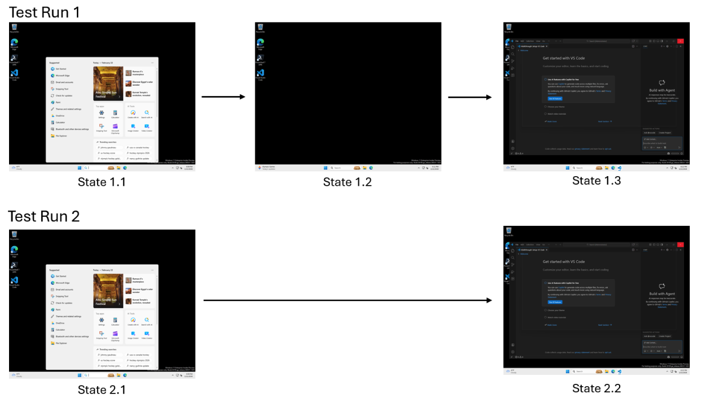
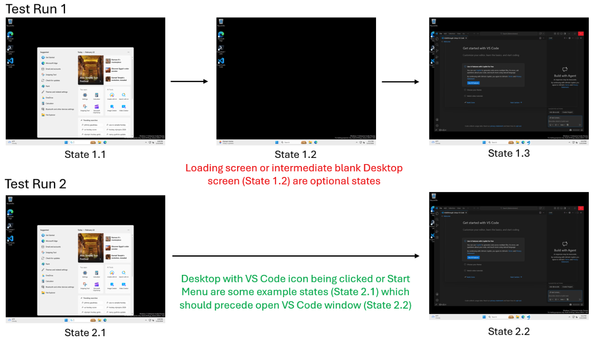

<strong style="font-size:16px;color:#1a6ba0;">要点速览</strong>

- <strong>Agent 验证的信任缺口</strong>：Copilot Cloud Agent 在 CI 中频繁产生假阴性。Agent 正确完成任务，但测试框架因环境噪声标记为失败  
- <strong>支配分析（Dominator Analysis）</strong>：将编译器理论中的节点支配关系引入 Agent 执行验证，自动区分"必要状态"和"偶然噪声"  
- <strong>三层次等价检测</strong>：视觉哈希 → SSIM → LLM 语义分析，从快速到精确逐层判断 Agent 的两个状态是否逻辑等价  
- <strong>100% vs 82.2%</strong>：支配树方法在 Agent 验证中达到 100% 准确率，远超 Agent 自评的 82.2%。更重要的是，Agent 自评在"非 Bug"场景中完全失效（0% F1）

---

GitHub Copilot 团队今天发布了一套全新的 Agent 行为验证框架，专门解决非确定性 Agent 的测试问题。这套框架的核心是**支配分析**，一个从编译器理论借用的概念，用于自动识别 Agent 执行轨迹中哪些状态是"必须到达的"、哪些只是"偶然经过的"。

**传统的软件测试建立在一个脆弱的前提上：正确的行为是可重复的。** 对确定性代码，这个假设基本成立。但对自主 Agent，尤其是使用 Computer Use 在真实环境中操作的 Agent，这个假设几乎立即崩塌。

一个典型场景：你的 GitHub Actions 流水线依赖 Copilot Cloud Agent 验证工作流。周二构建通过，周三同样的测试失败，但代码没变。发生了什么？托管运行器上的小网络延迟导致加载屏多持续了几秒。Agent 等待、适应，仍然正确完成任务。但 CI 流水线仍然标记为失败。**Agent 没失败，是验证失败了。**

这暴露了三个系统性问题：**假阴性**（任务成功但测试不能容忍变化）、**脆弱的基础设施**（测试因环境噪声失败）、**合规陷阱**（结果正确但 Agent 行为偏离了测试期望）。

### 为什么现有测试方法对 Agent 失效

传统测试工具在执行路径固定时工作良好。但它们有一个共同的结构性假设：**正确性由特定序列的可观察状态定义。** 对 Agent 系统，这个假设不成立。

四种常见范式的局限：

**断言测试**需要为每个检查手动编写规格说明，无法处理有效的替代路径。**录制-回放工具**对环境噪声极其敏感，微小渲染差异或时间变化触发假失败。**视觉回归测试**孤立比较截图，不理解执行流程的语义含义。**ML 预言机**需要数千训练样本，标记行为时无任何解释性。

正如论文指出的："Agent 系统正在加速开发，但我们的验证方法仍然僵硬。正确性不是关于遵循一组预设步骤，而是可靠地达成必要结果。"

### 从直觉到理论：支配分析

区分"必须有"和"偶然"行为的概念并非凭空而来。它根植于编译器理论中的**支配关系（Dominator Relationships）**。

在控制流图中，节点 A **支配**节点 B，如果从起点到 B 的每条路径都必须经过 A。将这个定义应用于 Agent 执行轨迹：

- 哪些状态是**强制的**（每条路径都必须经过）
- 哪些状态是**可选的**（有些路径跳过它们仍然成功）
- 不同路径在**哪里收敛**（Agent 成功应对变化后返回主流程）

**图 1：Agent 自适应的加载屏变化**：同一 Agent 在不同运行中遇到的不同 UI 状态

图 1：使用 Computer Use 的 Copilot Agent 在 VS Code 中搜索的场景。左侧加载屏是"可选"状态，右侧搜索结果才是"必要"状态

### 将执行建模为图，而非脚本

为了捕获 Agent 行为的复杂性，团队放弃了线性脚本模型，转向基于**前缀树接收器（PTA）**的图结构。

在这个模型中，执行不是一串命令，而是一张有向图：**节点**表示可观察状态（UI Agent 的截图）、**边**表示节点间的转换（点击、按键、API 调用）。

**图 2：支配分析提取的执行骨架**：从多条执行轨迹中自动识别必要状态

图 2：Agent 执行轨迹的 PTA 建模。加载屏（State 1.2）是可选的，而 VS Code 窗口（State 2.2）是必要状态

**图结构的关键优势**是能同时表示分支和收敛，线性脚本完全无法捕获的概念。分支处理非确定性环境变化，收敛标识不同路径的汇合点。当 Agent 从不同路径抵达同一结果时，测试不再因"路径不同"而惩罚它。

### 核心算法：从轨迹到验证模型

整个框架的核心工作流分三步：

**捕获：PTA 构建。** 收集 2-10 条成功执行轨迹，转换为前缀树接收器（PTA）。每条轨迹是一串连续的可观察状态。

**泛化：语义合并。** 将多条轨迹合并为统一图。合并的难点在于：如何判断两个截图状态是否逻辑等价？团队开发了**三层次等价检测框架**：

- **视觉指标层**：快速感知哈希和 SSIM（结构相似性），立即捕获接近相同的状态
- **LLM 语义分析层**：视觉指标模糊时，用多模态 LLM 判断差异是否有语义意义，忽略时间戳变化、窗口装饰差异，但标记不同错误消息或缺失的 UI 控件
- **保守合并层**：仅在模型确定等价时合并，允许图在路径真正分叉的地方自然分支

这不是朴素逐像素比较，也不是让 LLM 判断整个任务的"万能胶"。LLM 被防御性地、有节制地用于解决特定歧义。

**提取骨架：支配分析。** 对合并图应用支配分析，自动提取"必要状态"：每条成功轨迹必须经过的里程碑，同时过滤掉加载 spinner 等可选状态。

### 评估：支配树 100% vs Agent 自评 82.2%

在 Copilot Agent 的 VS Code 扩展测试套件上，团队进行了严格对比实验：

| 指标 | Agent 自评（CUA） | 支配树方法 | 提升 |
|------|:-:|:-:|:-:|
| 准确率 | 82.2% | **100%** | +17.8% |
| 精确率 | 83.3% | **100%** | +16.7% |
| 召回率 | 60.0% | **100%** | +40.0% |
| F1 分数 | 69.8% | **100%** | +30.2% |

**支配树方法在验证任务上实现了完美区分。** Agent 自评频繁将失败误报为成功（超时或误判状态），而支配树方法通过聚焦于必要里程碑是否真正达到，排除了所有假阴性和假阳性。

更引人注目的发现是对"非 Bug"场景的识别能力。当一个测试失败时，开发者需要知道：是产品代码坏了，还是 Agent 因环境噪声出了问题？**Agent 自评完全无法识别"非 Bug"场景（0% F1 分数）**。Agent 还不能可靠地自评成绩。支配树模型在区分"Agent 执行错误"和"产品回归"时达到了 52.2% F1。

### 融入现有开发工作流

本框架被设计为直接集成到开发者日常使用的系统中：

- **GitHub Actions 流水线**：减少环境噪声导致的假阴性，提供"更高信号"的构建状态
- **回归测试**：用稳定版本的已验证轨迹创建"真实来源"模型，自动验证后续更新
- **Agent 评估**：独立于 Agent 自评的度量方式，团队可用结构性验证衡量 Agent 实际达到必要里程碑的频率
- **UI 自动化**：更鲁棒地处理桌面和 Web 应用中 UI 元素或路径的微变

### 当前限制与未来方向

框架当前有几个明确边界：

**需要成功轨迹。** 算法"通过示例学习"，需要 2-10 条成功执行轨迹来构建真实来源模型，无法仅从失败日志学习或定义正确性。**LLM 依赖。** 语义等价检查依赖多模态 LLM，虽然带来了智能（忽略时间戳），但引入了外部 API 依赖和附加延迟。**时间盲点。** 当前实现能验证事件顺序，但无法标记某个状态持续过长（如加载 spinner 卡了 30 秒）。

未来方向包括：捕获时序约束（"加载必须在 5 秒内解决"）、从失败示例中学习显式阻止已知失败路径、低层截图的层次化抽象（将多个截图聚类为"启动序列"等高阶概念）、以及实时模型优化：验证新成功运行后自动重新计算支配关系。

<strong style="font-size:15px;color:#8b6f4c;">结语</strong>

本文最值得关注的一点不是 100% 的准确率，那是受控实验的数字，真实环境会低一些，而是框架的设计哲学。团队刻意避开了"用另一个黑盒模型评判前一个黑盒模型的输出"这种套娃式方案，而是从编译器理论中借用了经过 50 年验证的支配分析，作为验证的结构性骨架。  
这种思路的巧妙之处在于：它把 Agent 从"必须被信任"的位置挪开了：你不需要信任 Agent，只需要信任一个数学关系。支配关系在数学上可证明：如果某个状态是支配节点，那么任何成功路径都必须经过它，没有例外。这是比 Agent 自评、或 LLM 直接判断完全不同的可靠性层次。  
对使用 Agent 做自动化测试和 CI/CD 的团队，本文提供了一个可以直接使用的框架设计，而不是需要数万标注样本才能落地的研究想法。

---

参考：

https://github.blog/ai-and-ml/generative-ai/validating-agentic-behavior-when-correct-isnt-deterministic/
https://arxiv.org/pdf/2605.03159
