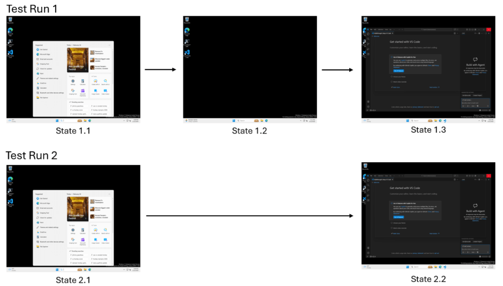
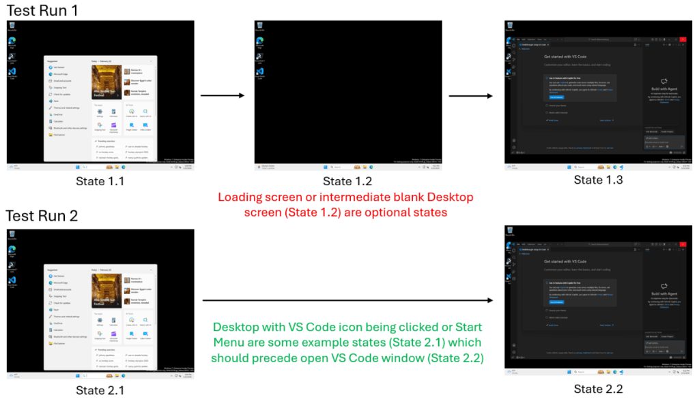

<strong style="font-size:16px;color:#1a6ba0;">要点速览</strong>

- <strong>传统测试框架在 Agent 面前全面失效</strong>：断言测试、录制回放、视觉回归、ML 预言机：四种范式都假设「正确=固定路径序列」，这在 Agent 的非确定性行为面前产生大量误报  
- <strong>Dominator 分析：从编译器理论借来的一把钥匙</strong>：将 Agent 执行轨迹建模为有向图，用图论中的支配关系自动识别「必经状态」和「可选噪声」；只需 2-10 条成功轨迹即可自动构建正确性基准  
- <strong>三层等价判定框架</strong>：先视觉哈希快速匹配 → 语义模糊时用多模态 LLM 判定 → 保守合并。LLM 只做防卫性使用，不靠「LLM 黑盒判断另一个黑盒」  
- <strong>实测：100% 准确率的信任层</strong>：在 Copilot Agent VS Code 扩展测试中，Dominator Tree 方法准确率 100%（vs CUA 自评的 82.2%），召回率 100%（vs 60%），F1 提升 30 个百分点

---

Agent 验证的核心矛盾写在一句话里：**Agent 的行为是非确定性的，但我们的测试框架假设确定性。**

周二构建是绿的。周三同样的代码，测试失败了。不是因为 Agent 做错了什么：一条加载动画多持续了两秒，Agent 自适应地等了一下然后成功完成任务，但 CI 管道还是判了失败。**Agent 没挂，验证挂了。**

这不是偶然事故，而是现代软件测试架构性假设的崩坏。GitHub 博客最近发表了一篇技术深博，详细阐述了如何为 Copilot Coding Agent 构建一套「信任层」（Trust Layer）验证框架。核心思路很简单：从编译器理论里借来一种图分析方法，让验证从「检查步骤」转向「检查结构」。

本文带你拆解这套框架的核心逻辑。

**为什么现有测试框架在 Agent 面前集体失灵**

在确定性软件中，「正确」很简单：把预期输入和已知输出匹配就行。但 Agent 的工作方式完全不同：中间的路径是故意非确定性的。当 Agent 在真实环境里，操作 UI、浏览器、IDE，**正确性变成了多路径的**：加载界面可能出现也可能不出现，时序在变，多个合法的操作序列可能导向同一个结果。除非 CI 工作流足够强壮来容纳这些变量，否则 Agent 明明成功了，测试却判它失败，一个「假阴性」直接阻塞生产。

四条主流测试范式都卡在同一堵墙上：

- **断言测试**：需要手动为每条检查写规约，无法覆盖合法的替代执行路径
- **录制回放**：对环境噪声高度敏感，渲染差异或时序偏移都会触发误报
- **视觉回归测试**：孤立对比截图，不理解更广的执行流或语义含义
- **ML 预言机**：需要成千上万的训练样本，标记一条行为为「错误」时给不出解释

这四种方法在实现上各不相同，但共享同一个结构性假设：**正确性由特定可观测状态的序列来定义。**

对于 Agent 系统，这个假设直接崩溃了。

Agent 驱动的验证暴露出三个反复出现的痛点，形成了一个「信任缺口」：**误报**：任务成功了，但测试运行器无法容忍变量的存在；**脆弱的基础设施**：测试因时序、渲染或环境噪声而失败，与正确性无关；**合规陷阱**：结果是对的，但因 Agent 行为偏离了测试的预期而被标记为回归。

要规模化这类系统，需要一个能区分「附带噪声」（比如加载屏幕）和「关键失败」（比如未保存数据）的验证框架。**正确性的定义从「这件事发生了吗？」转向「为了真正的成功，什么事必须发生？」**

**重新定义「正确」：必备行为 vs 可选行为**

要构建信任层，必须先从根本上改变对「正确」的定义。Agent 系统的正确执行不需要看起来一模一样。它们需要共享一个共同的逻辑结构。

以一个使用 Computer Use 能力的 Copilot Coding Agent 在 VS Code 中执行搜索为例。一次运行中加载屏幕出现了几秒钟，另一次 UI 瞬间加载完成：

同一任务在不同环境中的表现：加载屏幕出现与否不影响任务成功

传统测试看到的是两个不同的结果。但对开发者来说，加载屏幕是**附带性的**（incidental），它不影响任务是否成功。

关键洞察是把 Agent 行为分为三类：

- **必备状态（Essential states）**：成功必须经过的里程碑，比如到达「搜索结果」屏幕
- **可选变化（Optional variations）**：附带状态，如加载动画、装饰性 UI 变化
- **收敛路径（Convergent paths）**：不同的步骤序列（比如用快捷键 vs 用菜单），最终汇合到同一个结果

**Dominator 分析：从编译器理论借来的方法**

「必备 vs 可选」的区分，根植于编译器理论中的**支配关系**（dominator relationships）。

在控制流图中，节点 A 支配节点 B，如果从起点到 B 的每条路径都必须经过 A。

将支配分析应用到 Agent 执行轨迹上，可以自动识别：

- 哪些状态是强制的
- 哪些状态是可选的
- 不同路径在何处收敛

这样就能提取出一个最小的、可解释的正确性定义。

**建模：从线性脚本到结构化图**

传统的 Agent 测试把一次执行看作一维的脚本序列。这套框架用另一种结构来表示行为：**前缀树接收器（Prefix Tree Acceptor, PTA）**。

在这个模型中，一次执行不是一个命令序列，而是一个有向图：

- **节点**表示可观测状态，对 UI Agent 是截图，对代码 Agent 是代码快照
- **边**表示转换，记录在状态间移动的动作（点击、按键、API 调用）

Dominator 分析流程：从多条成功轨迹中提取必经状态骨架

把执行建模为图，就可以表示分支和收敛，线性脚本无法捕捉的概念。分支处理的是非确定性环境变化（加载界面的有无），收敛标记不同路径在何处重新汇合，这标志着 Agent 成功绕过了一次环境波动，回到了主任务流。

从步骤序列到结构化行为模型的转变，意味着**不再因为 Agent 走了不同的路而惩罚它，而是验证它是否遵循了逻辑上合理的路径**。

**三步工作流：从轨迹到「主图」**

这套框架通过观察 2-10 次成功会话，自动构建一个「地面真相」模型：

1. **捕获（PTA 构建）**：收集 2-10 条成功执行轨迹，转换为前缀树接收器
2. **泛化（语义合并）**：将多条轨迹合并为统一图。使用三层等价检测框架，结合快速视觉指标和 LLM 语义分析，判断两个状态是否逻辑等价
3. **提取骨架（Dominator 分析）**：对合并后的图应用支配分析，识别「必备状态」：每次成功运行必须经过的里程碑，同时自动过滤掉「可选」状态

这套方法的独特之处在于：**不需要手工规约，不需要大规模模型训练。** 生成的模型是实际执行状态的图，所以所有决策都是完全可解释的。验证失败时，算法会明确说明缺少了哪个必备状态。

**三层等价判定：什么时候两个状态「一样」**

状态等价判断是 Agent 验证的难点。两张不同的截图是否代表同一个逻辑状态？

解决方法是一个三层框架：

- **视觉指标**：用快速感知哈希和结构相似度（SSIM）立即捕捉近似相同的状态
- **LLM 语义分析**：当视觉指标模棱两可时，用多模态 LLM 判断差异是否有语义含义（知道忽略时间戳变化，但会标记不同的错误消息或缺失的 UI 控件）
- **保守合并**：只有确定等价时才合并，让图在路径真正分叉的地方自然分支

这不是逐像素的比较，也不是「LLM 空谈」（让模型判断整个任务）。**LLM 只做防卫性、节省性地使用**，仅在需要解决具体歧义时才调用。

**「搜索对话框」为什么是必备节点**

在 VS Code 实验中，「搜索对话框」状态被识别为必备里程碑。原因纯粹是数学的：它是支配节点：不先触发搜索，逻辑上不可能到达搜索结果。

相反，「加载中」屏幕不支配任何节点。因为更快的运行会跳过它，算法自动将其标记为可选变化，而不是成功的前提。

这确保了信任层框架**只在你错过关键步骤时发出警报**，而不是在环境波动时。

**新执行轨迹的验证**

有了 Dominator 树作为地面真相，验证一个新的执行轨迹就变成了结构比较的过程，不需要精确匹配。

验证算法用**拓扑子序列匹配**来检查新轨迹：

- 不要求新轨迹完全相同，只要求必备状态按正确的相对顺序出现
- 如果参考序列是 A → B → C，Agent 产生 A → X → B → Y → C，测试仍然通过，额外的状态（X, Y）被视为附带噪声
- 失败只在必备状态被跳过或顺序错误时触发

**结果不仅是一个二进制通过/失败**，还提供了一个覆盖率指标和清晰的解释：覆盖率是匹配的必备状态占参考模型总状态数的百分比；失败时，算法明确说是哪个状态缺失了。

**实测数据：100% vs 82.2%**

在一项对照实验中，团队将 Dominator Tree 方法与 Agent 的自我评估（CUA 报告自身成功）进行了对比：

| 指标 | CUA 自评 | Dominator Tree |
|------|---------|---------------|
| 准确率 | 82.2% | **100%**（+17.8） |
| 精确率 | 83.3% | **100%**（+16.7） |
| 召回率 | 60.0% | **100%**（+40.0） |
| F1 分数 | 69.8% | **100%**（+30.2） |

CUA 经常把失败报告为成功：超时或错误理解自身状态。而 Dominator Tree 通过聚焦于必备里程碑是否实际到达，实现了完美区分。

更关键的是「非 Bug」识别：**Agent 的自我评估在此项上的 F1 为 0%**，它完全无法判断一个失败是产品 Bug 还是 Agent 执行错误。而信任层的 F1 达到 52.2%。

**结论很清楚：结构验证远胜于自报成功。**

GitHub 团队的判断是：**Agent 还不能可靠地给自己的作业打分**。在最关键的「非 Bug 识别」场景中：当测试失败时，你需要知道是产品代码坏了还是 Agent 环境波动了：CUA 自评的 F1 是 0%，完全帮不上忙。而结构化的信任层通过状态和动作等价性判断，达到了 52.2% 的 F1。

把「真相来源」从 Agent 的内部逻辑移到一个学习到的外部结构上，能大幅减少花在检查不稳定测试结果和 CI 误报上的手动审查时间。

**为什么这件事现在尤其重要**

AI Agent 正在从实验性 Demo 走向核心基础设施，验证方式也必须跟上。GitHub 团队说了一句关键的话：**「我们不需要黑盒模型去判断另一个黑盒模型。我们需要结构化的保证：开发者可以检查、推理和信任的保证。」**

通过结合经典编译器理论和多模态 AI，从寥寥几条成功例子中学习一个可解释的、稳健的成功定义是可行的。这套信任层框架的三个特性是：高效学习（从成功示例自动推导地面真相）、运维稳健（正确处理非确定性行为和噪声）、完全透明（可解释的结果和明确的推理依据）。

论文出处：团队已将这套 Dominator Analysis 框架的完整论文发布在 arXiv（arxiv.org/pdf/2605.03159）。

**集成点与当前限制**

这套框架设计要融入几个关键场景：

- **GitHub Actions 管道**：减少环境噪声引起的误报
- **回归测试**：用少数已验证的轨迹创建地面真相模型
- **Agent 评测**：不再依赖 Agent 自报成功
- **UI 自动化**：鲁棒地处理 UI 元素和路径的变化

当前限制包括三个方向：一是**对成功轨迹的依赖**：算法目前只能从 2-10 条成功轨迹学习，无法只从失败日志中定义正确性；二是**LLM 依赖**：语义等价判定依赖多模态 LLM，引入了外部 API 的延迟和成本；三是**时序盲区**——当前实现只能验证事件顺序，无法检测某个状态是否持续了太久（比如加载动画超时）。

未来工作也包括三个方向：**时序约束和负面约束**：捕获时间要求（如「加载必须在 5 秒内完成」）并从失败例子中学习已知的失败路径；**层级和多模态抽象**：将底层截图聚类为高层概念（如「启动序列」），同时整合 DOM 结构、无障碍树和网络流量等非视觉信号；**在线学习**——实现实时模型优化，每次验证新的成功运行后重新计算支配关系，持续改进对「什么是真正必备」的理解。

---

<strong style="font-size:15px;color:#8b6f4c;">结语</strong>

这套框架最有价值的地方不是 100% 的准确率，虽然在工程上确实漂亮。更有意思的是它揭示了一个方向性问题：过去我们总想用更聪明的「判断者」来验证 Agent，另一个模型来打分、端到端评估基准，但这条路通向的是一个不可解释的递归。而 GitHub 团队的做法是回到计算机科学的基础：图论和编译原理，把 Agent 行为当作程序控制流来分析。方向是对的：不要一个新的黑盒来判断已有的黑盒，而是把验证还原为可检查的结构性问题。  
另一个值得关注的点是「从失败中学习」的缺失。框架目前只能从成功轨迹构建地面真相，无法从失败中做负面学习。这恰好映射了 Agent 安全领域的核心困境：你总是比 Agent 遇到失败更晚。如果验证框架只能从成功中学习，那它本质上是一个保守系统：它告诉你的都是你已经知道是对的路径。真正的突破会来自对失败痕迹同样结构化的理解。

---

参考：

https://github.blog/ai-and-ml/generative-ai/validating-agentic-behavior-when-correct-isnt-deterministic/
