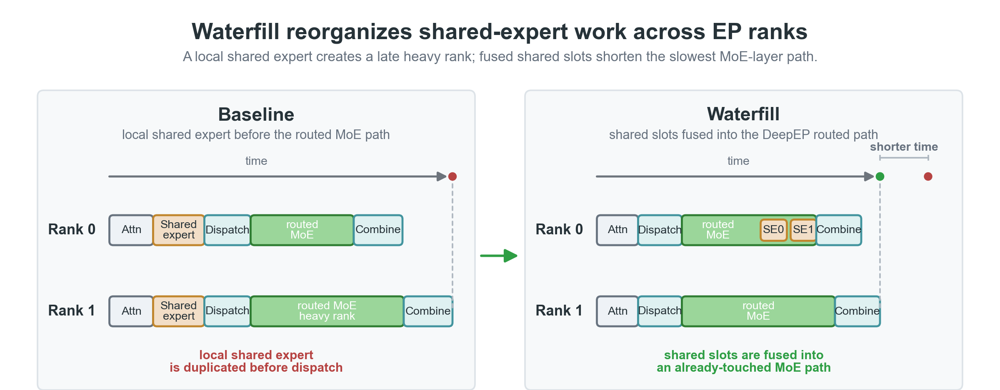
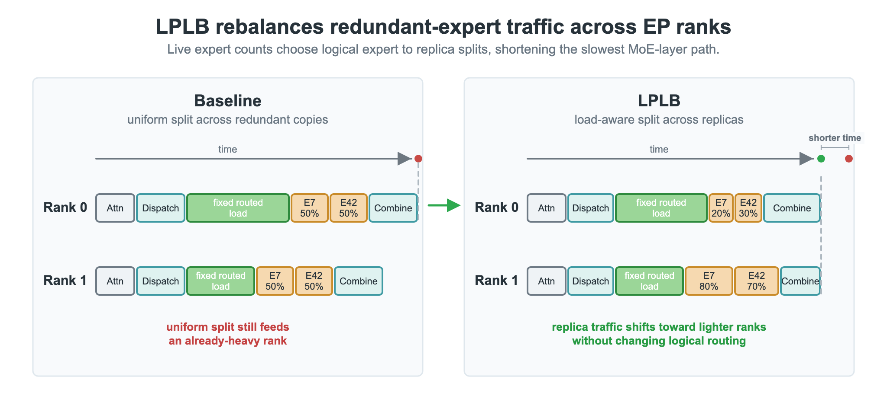
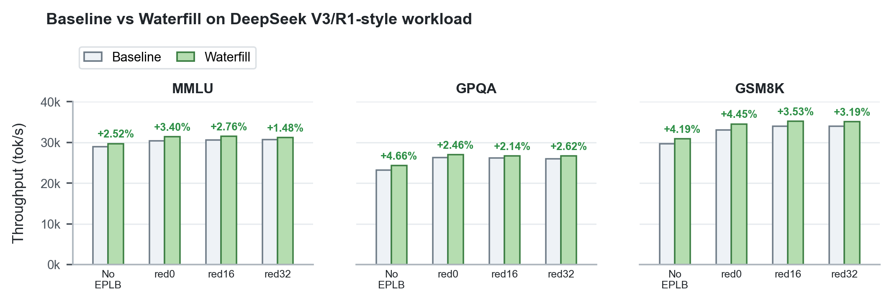
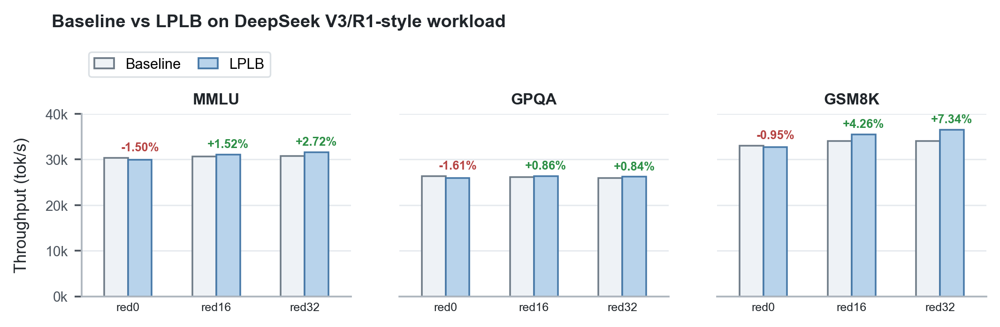
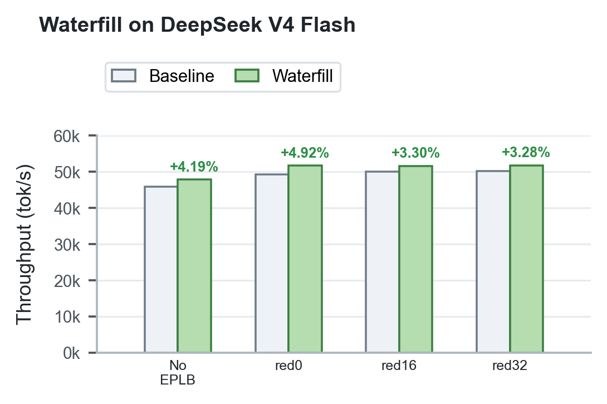

<div style="background:#e8f4fd;padding:14px 16px 10px 16px;border-radius:6px;margin-bottom:18px;">
<div style="text-align:center;margin-bottom:10px;">
<strong style="font-size:16px;color:#1a6ba0;">要点速览</strong>
</div>
<div style="font-size:14px;color:#3f3f3f;line-height:1.75;">
- <strong>Waterfill</strong>：轻量级共享专家负载均衡算法，调度时把共享专家分配给负载较低的 rank。DSV3/R1 上吞吐 +1.48%~+4.66%，DSV4 上最佳点从 49,253 tok/s 提到 51,677 tok/s（+4.92%）<br><br>
- <strong>LPLB</strong>：基于线性规划的冗余专家副本负载均衡器，每层求解 min-max LP 在副本间最优分派 token。DSV3/R1 上 +0.84%~+7.34%<br><br>
- <strong>两者互补</strong>：Waterfill 消掉共享专家的密集不均衡，LPLB 消掉路由副本间的稀疏不均衡，都不改路由逻辑，精度无损<br><br>
- <strong>启用方式</strong>：SGLang 加 `--enable-deepep-waterfill`（Waterfill）或 `--ep-dispatch-algorithm lp`（LPLB），需要 DeepEP 后端 + EPLB 放置
</div>
</div>

SGLang 在 DeepEP MoE 推理上加了两道调度时负载均衡：**Waterfill** 把共享专家"倒水"到轻载 rank，**LPLB** 用线性规划在冗余专家副本间做最优分派。**两者都不动模型逻辑，但都能把吞吐量往上提几个百分点。**

---

**MoE 推理的负载不均衡问题**

大型 MoE 模型（DeepSeek-V3/R1、DeepSeek V4）使用稀疏专家激活来增大模型容量。推理时通过 Expert Parallelism（EP）把专家分布到多个 GPU 上。每个 token 被路由到少数几个专家，但**路由器不会均匀分配流量**——某些专家收到的 token 远多于其他专家。

当某些专家收到远多于其他专家的 token 时，整个 EP 组需要等待最繁忙的 rank 完成。**这种不均衡同时拖慢计算和通信。** 静态放置方法（如 EPLB）能改善长期分布，但单个批次的剩余不均衡仍然存在。

SGLang 团队的解法是在**调度时**做文章——不是改专家放置，而是在运行时决定哪个物理副本处理哪个 token。他们开发了两种方法：Waterfill（聚焦共享专家路径）和 LPLB（聚焦跨冗余专家副本的 token 路由）。

---

**Waterfill：把共享专家"倒水"到轻载 rank**

Waterfill 瞄准的是**共享专家**（shared expert）——MoE 层中对每个 token 都应用的密集计算路径。在传统设计中，每个 rank 都本地计算共享专家，无论它是否已经被路由专家过载。**过载的 rank 继续过载，轻载的 rank 也帮不上忙。**

Waterfill 的思路：把共享专家变成一个可调度的槽位。路由专家选完后，估计每个 EP rank 的当前路由负载，然后把共享专家分配给负载较低的 rank——像往不平坦的容器里倒水，水会自然流向低处。

具体算法分为五步。第一步，统计每个 EP rank 上已分配的路由专家负载。第二步，用这些计数作为每 rank 的负载分数——在动态模式下，SGLang 先运行一次 EP 组集体通信，使分数可以使用全局路由负载向量加上每个 rank 的当前本地批次大小。第三步，为每个参与 token 添加一个共享专家槽位，计算目标水位线：H = ceil((sum(L_r) + N) / R)，其中 L_r 是 rank r 的负载分数，N 是待放置的共享专家槽位数，R 是 EP 组大小。**第四步，** 低于水位线的 rank 获得 slack：S_r = max(H - L_r, 0)。第五步，每个 token 从候选 rank 中以正比于 slack 的概率采样共享专家的目标 rank，带小的本地 rank 偏好。所有候选 slack 为零时回退到明显较轻的候选 rank。

**通信与计算的权衡：** 如果每个 token 都能把共享专家工作发送到任何 EP rank，Waterfill 会有更多均衡自由度，但也会增加 all-to-all 通信量。对于 GPU MoE 服务，通信通常比额外的共享专家计算更昂贵。因此通信保守的候选集将共享专家保持在 token 已经路由到的 rank 上，以源 rank 为回退。SGLang 也支持全 rank 模式，拥有更多均衡自由度但可能增加每个 token 的调度目标。


<span style="font-size:12px;color:rgb(153,153,153);">图 1. Waterfill 将共享专家工作从过载 rank 转移到较轻的 rank，同时保持路由专家的选择不变</span>

**共享专家融合**是 Waterfill 的使能机制。在 EP 下，共享专家原本使用与路由专家分离的执行路径——Waterfill 选择非本地 rank 后需要额外提取和启动。融合把共享专家表示为 DeepEP MoE 布局中的另一个 expert slot，让路由专家和共享专家共享同一套 dispatch、grouped-GEMM 和 combine 流程。这也是 Waterfill 被拆为两个 PR 的原因：[#20089](https://github.com/sgl-project/sglang/pull/20089) 做融合（固定本地分配），[#19290](https://github.com/sgl-project/sglang/pull/19290) 在融合基础上加 Waterfill 的负载感知调度。

---

**LPLB：线性规划做最优冗余副本分配**

LPLB 解决的是另一个问题。EPLB 会为热门逻辑专家创建多个物理副本，默认把每个热门专家的 token **均匀**分配到各物理副本。**均匀分配只有在离线分布与实时流量匹配时才是最优的。** 但实践中，单个批次会集中在不同的专家上、服务数据集会漂移、再平衡周期很长，导致放置对很多批次而言是静态的。结果即使均匀划分了热门专家的负载，副本所在 rank 相对于 EP 组中的其余 rank 仍然不均衡，整个组都在等最忙的 rank。

LPLB 在调度时弥补这一差距：对每个 MoE 层、每个批次，查看实际每专家 token 计数，决定如何在每个复制专家的物理副本间分配 token，使得 **每 rank 最大负载最小化**。它不移动权重，不改变路由器的逻辑 top-k 选择——仅选择哪个物理副本接收多少流量。

**LP 公式的直觉映射到三层约束：**

- **目标——最小化峰值。** 引入标量 M 表示所有 rank 的最大负载，最小化它。降低 M 把最忙 rank 拉向平均值，正好缩短 EP 不均衡产生的 grouped-GEMM 尾延迟。
- **Rank 负载约束。** 每个 rank：（来自冗余副本的负载）+（来自单副本专家的固定负载）+ slack = M。slack 非负，所以 M 必须至少等于每个 rank 的真实负载。
- **冗余专家守恒。** 每个复制逻辑专家的各副本负载之和 = 该专家的总观察负载：x1 + x2 + ... + xn = L。**LPLB 只重新分配现有流量，从不发明或丢弃 token。**

决策变量是复制专家的每副本负载、每 rank slack 和 M。单副本专家只贡献固定项，所以 LP 的规模只与冗余专家数和 rank 数成正比，而非全部专家数。

**约束矩阵的离线部分在启动时和每次 EPLB 再平衡后预计算一次。** 只有右侧（冗余专家负载、每 rank 单副本负载）在每个批次变化。一个 Big-M 辅助列保持系统在求解过程中可行，目标中对其重罚使求解器驱为零。

**DP-attention 的集体通信设计**很巧妙。不同 EP rank 在同一步骤中运行不同的前向模式（prefill、decode 或 idle），没有 rank 能看到全局分布。LPLB 的处理是：每个 rank 统计本地每逻辑专家的 token 数，所有 EP rank 参与一次 all-reduce（空闲 rank 贡献零），每个 rank 得到相同全局分布，然后**独立求解同一个 LP，得到相同解，不需要广播结果。**

LP 本身通过融合内点法（IPM）内核在 GPU 上求解，构建在 `cuSOLVERDx`/`cuBLASDx` 之上，启动时预编译所以第一个请求不支付 JIT 成本。**整个每批次路径——构建右侧、求解、提取每副本分配——压缩为三个 CUDA 内核启动，写入预分配的缓冲区。**

**从 LP 解到实际调度：** LP 返回每个复制专家负载应在各副本间如何划分。LPLB 归一化为每专家的概率分布（`log2phy_prob`）。调度时，每个路由到复制逻辑专家的 token 从该分布中采样物理副本。这是对现有 `dynamic` 策略（均匀随机选择）的替换——保持概率性、每 token 调度形态，但将均匀抽样替换为负载最优分布。


<span style="font-size:12px;color:rgb(153,153,153);">图 2. LPLB 将复制专家流量向较轻的 rank 转移，当冗余副本可用时，同一专家可在负载较轻的物理副本上完成</span>

**Waterfill 与 LPLB 的区别：**

Waterfill 和 LPLB 共享最终目标——压平 DeepEP 下的每 rank 负载——但作用于不同的调度选择。Waterfill 的目标是共享（密集）专家，对每个 token 都生效，用轻量级低谷填充启发式，需要共享专家融合，成本近乎零。LPLB 作用于 EPLB 已复制的路由专家，用每层 min-max 线性规划在 GPU 上求解，需要 EPLB 冗余副本存在，成本是每层一次 all-reduce 加 LP 求解。

**两者是互补而非竞争的**：Waterfill 消除密集共享专家带来的不均衡，LPLB 消除稀疏路由副本间的不均衡。因为 LPLB 仅在同一逻辑专家的有效副本间重新分配流量且不改逻辑 top-k，它与 Waterfill 一样保持模型语义。

**LPLB 在中等规模服务中最有效**——流量集中在适度数量的相关主题上，每个批次以离线放置未能预期的方式不均衡，但又有足够结构性使基于批次的最优分配能降低峰值 rank 负载。当批次极大且高度多样时，剩余不均衡很少；当流量基本不变时，静态均匀分配已足够。

---

**实测结果**

**DeepSeek-V3/R1（FP8，两台 Hopper 节点，16 GPU）**

基准配置：TP16、DP16、EP16、DP attention、DeepEP normal 模式。数据集 MMLU、GPQA、GSM8K。batch_size=1000，concurrency=256，max_tokens=1。

| 数据集 | 基线设置 | 基线 tok/s | Waterfill | 增益 | LPLB | 增益 |
|--------|----------|-----------|-----------|------|------|------|
| MMLU | 无 EPLB | 28,968 | 29,697 | +2.52% | — | — |
| MMLU | EPLB red0 | 30,392 | 31,424 | +3.40% | 29,938 | -1.50% |
| MMLU | EPLB red16 | 30,638 | 31,483 | +2.76% | 31,104 | +1.52% |
| MMLU | EPLB red32 | 30,714 | 31,169 | +1.48% | 31,547 | +2.72% |
| GPQA | 无 EPLB | 23,201 | 24,283 | +4.66% | — | — |
| GPQA | EPLB red0 | 26,322 | 26,970 | +2.46% | 25,899 | -1.61% |
| GPQA | EPLB red16 | 26,124 | 26,683 | +2.14% | 26,350 | +0.86% |
| GPQA | EPLB red32 | 25,975 | 26,655 | +2.62% | 26,193 | +0.84% |
| GSM8K | 无 EPLB | 29,649 | 30,892 | +4.19% | — | — |
| GSM8K | EPLB red0 | 33,058 | 34,529 | +4.45% | 32,744 | -0.95% |
| GSM8K | EPLB red16 | 34,026 | 35,226 | +3.53% | 35,474 | +4.26% |
| GSM8K | EPLB red32 | 33,988 | 35,070 | +3.19% | 36,482 | +7.34% |

**关键观察：** Waterfill 在全场景一致正向，从 +1.48% 到 +4.66%。LPLB 在 red0（无冗余副本）时为负——只有算法开销，没有均衡空间。有冗余副本（red16/red32）后才出现正增益，最高 +7.34%。这说明 LPLB 依赖 EPLB 提供的冗余专家作为决策空间。


<span style="font-size:12px;color:rgb(153,153,153);">图 3. MMLU、GPQA、GSM8K 上 Waterfill 一致提升总吞吐量</span>


<span style="font-size:12px;color:rgb(153,153,153);">图 4. LPLB 在存在冗余专家副本（red16/red32）时提升吞吐量，red0 仅有算法开销</span>

**DeepSeek V4 Flash 上的 Waterfill 验证**

DeepSeek V4 使用 `HashTopK` 路由路径，Waterfill 需要在 `HashTopK` 输出中追加和重新映射共享专家槽位（[#25391](https://github.com/sgl-project/sglang/pull/25391)）。实测使用 MMLU 14,042 prompt 池，batch=512，concurrency=128，max_tokens=1：

| 配置 | 基线 tok/s | Waterfill | 增益 |
|------|-----------|-----------|------|
| 无 EPLB | 45,951 | 47,876 | +4.19% |
| Static EPLB red0 | 49,253 | **51,677** | **+4.92%** |
| Static EPLB red16 | 50,006 | 51,655 | +3.30% |
| Static EPLB red32 | 50,167 | 51,813 | +3.28% |

最佳点从 49,253 tok/s 提升到 51,677 tok/s，**+4.92%**，且所有配置下方向一致正向。


<span style="font-size:12px;color:rgb(153,153,153);">图 5. DeepSeek V4 Flash 上 Waterfill 在无 EPLB 和静态 EPLB 设置中一致有效</span>

**精度验证：** Waterfill 不改变路由器的逻辑 top-k 决策，仅改变哪个物理 rank 执行共享专家槽位，语义无损。LPLB 同理——所有副本持有相同权重，token 结果与哪个副本处理无关，与 EPLB 和 `dynamic` 策略依赖相同的精度保证。

---

**启用方式**

**Waterfill：** 启动命令中加入 `--enable-deepep-waterfill`：

```bash
python3 -m sglang.launch_server \
    --model-path /path/to/DeepSeek-V3 \
    --tp 16 --dp-size 16 --nnodes 2 \
    --moe-a2a-backend deepep \
    --deepep-mode normal \
    --enable-dp-attention \
    --enable-deepep-waterfill
```

**LPLB：** 启动命令中加入 `--ep-dispatch-algorithm lp`：

```bash
python3 -m sglang.launch_server \
    --model-path /path/to/DeepSeek-R1 \
    --tp 16 --dp-size 16 --ep-size 16 --nnodes 2 \
    --moe-a2a-backend deepep \
    --deepep-mode normal \
    --enable-dp-attention \
    --ep-num-redundant-experts 16 \
    --ep-dispatch-algorithm lp
```

`--ep-dispatch-algorithm lp` 选择 LPLB 调度器替代默认 `static` 或 `dynamic`。`--ep-num-redundant-experts` 创建冗余物理副本——没有冗余专家时 LPLB 无收益。

---

**致谢**

本工作构建在 SGLang DeepEP 和 MoE 服务栈之上，感谢 SGLang 维护者和审阅者的讨论与集成支持。相关 PR：[#20089](https://github.com/sgl-project/sglang/pull/20089)（共享专家融合）、[#19290](https://github.com/sgl-project/sglang/pull/19290)（Waterfill 负载均衡）、[#25391](https://github.com/sgl-project/sglang/pull/25391)（DeepSeek V4 支持）、[#24515](https://github.com/sgl-project/sglang/pull/24515)（LPLB）。感谢 NVIDIA 团队（Xuting Zhou、Fei Liang、Aichen Feng）和 SGLang 团队（Cheng Wan）的贡献。感谢 DeepSeek 开源其 LPLB 工作于 [deepseek-ai/LPLB](https://github.com/deepseek-ai/LPLB)，其线性规划公式启发了 SGLang 的 LPLB 集成。

---

<div style="background:#f5f0eb;padding:14px 16px 10px 16px;border-radius:6px;margin-bottom:16px;">
<div style="text-align:center;margin-bottom:8px;">
<strong style="font-size:15px;color:#8b6f4c;">结语</strong>
</div>
<div style="font-size:14px;color:#3f3f3f;line-height:1.75;">
这两个算法的价值不是几个百分点的吞吐提升，而是它们的**方法论**：不碰模型权重、不改路由逻辑、不重新训练，纯粹在调度层优化。Waterfill 的"倒水"精妙在差一点点语义无关——在共享专家的分配上做文章，不涉及任何路由决策。LPLB 的在线 LP 求解三发 CUDA kernel 完成，展示了"把优化问题藏在系统层"的工程品味。<br><br>
对跑大规模 MoE 推理的团队，这是几乎零成本的性能红利——加两个启动参数就行。尤其是 LPLB，在中等规模、流量有结构性的场景收益最大，值得在自家集群上跑一跑验证。
</div>
</div>

---

<span style="font-size:12px;color:#888888;">参考：

https://www.lmsys.org/blog/2026-06-26-waterfill-lplb</span>
