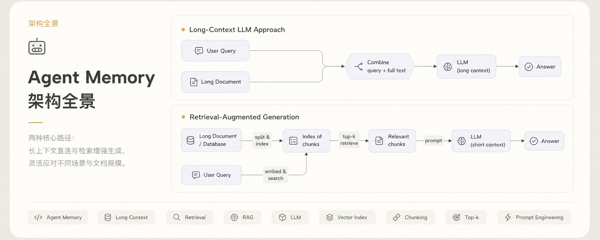
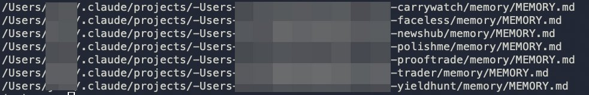
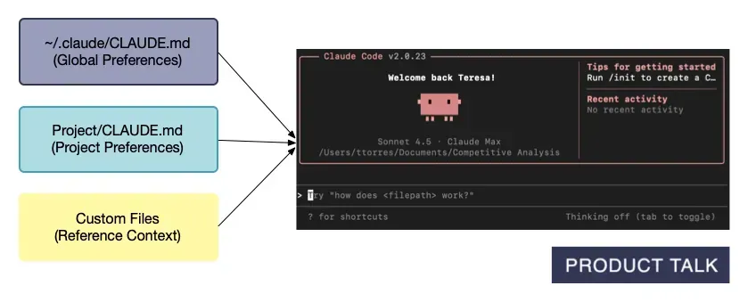
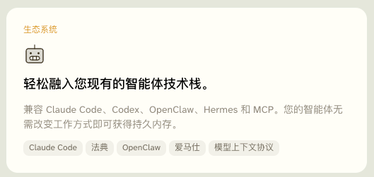
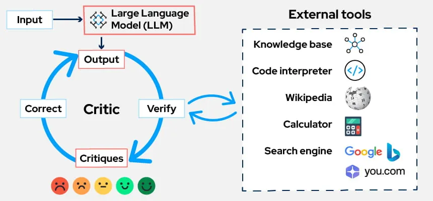
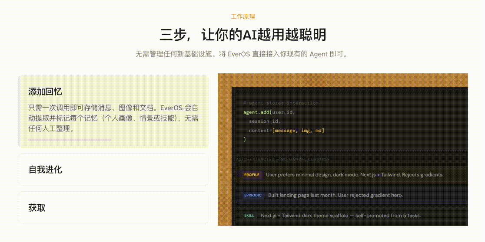
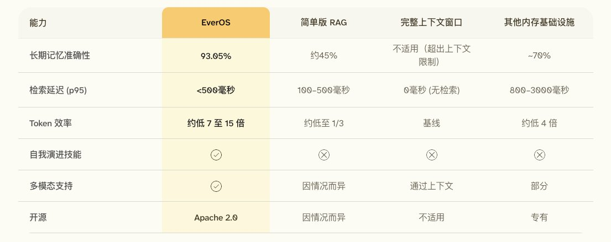
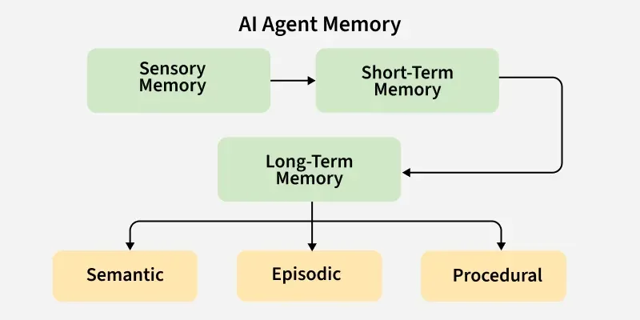
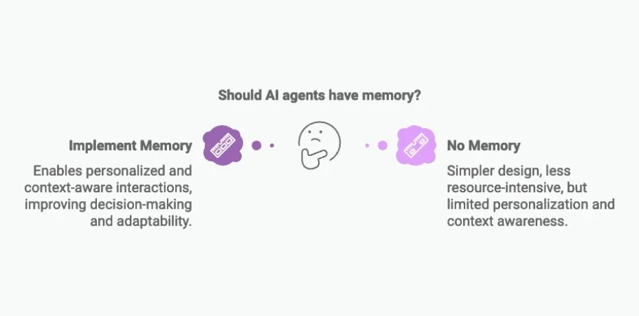

**Agent Memory 架构全景：从规则文件、会话检索到反思与技能沉淀**

<strong style="font-size:16px;color:#1a6ba0;">要点速览</strong>

- <strong>Memory 不是长上下文的替代品</strong>：长上下文解决"这一轮能装下多少"，Memory 解决"下一轮醒来还记不记得"。Context window 是工作台，RAG 是资料库，Memory 是跨会话持久状态层。  
- <strong>五层架构正在形成共识</strong>：规则层（CLAUDE.md/AGENTS.md）→ 常驻层（MEMORY.md/USER.md）→ 历史层（session search/daily notes）→ 证据治理层（postmortem/governance）→ 进化层（dreaming/reflection/skills）。  
- <strong>Memory 的终局不是"记住更多"</strong>，而是少犯同样的错、更快复用做对过的事。从 recall 到 reflection 到 skill extraction，才是真正的复利。  
- <strong>Memory 也是治理系统</strong>：来源、置信度、过期性、权限、可删除性——这些比向量召回更关键。一个 embedding 解决不了。

---

<section style="text-align: justify;margin-left: 8px;margin-right: 8px;line-height: 1.75em;">
几个月前我开始用 OpenClaw，发现它带给 Agent 行业的东西里，最让我兴奋的除了定时任务，还有一个看起来平平无奇的文件：MEMORY.md。
</section>

<section style="text-align: justify;margin-left: 8px;margin-right: 8px;line-height: 1.75em;">
这个好奇心驱使我翻了翻本机 ~/.claude/ 目录。结果发现，我经常用 Claude Code 跑 /loop 的那些项目，每个下面都有自己对应的 memory 文件。它们不是日志，不是 README，也不是类似 session 历史的东西。
</section>

<section style="text-align: justify;margin-left: 8px;margin-right: 8px;line-height: 1.75em;">
把几个项目的 memory 放在一起看，一个问题自然浮现：他们都在记录些什么内容。有的是"以后必须这么做"，有的是"这个项目现在是这个状态"，有的是"上次在这里踩过坑，别再来了"，有的是"我们为什么相信这个结论"，还有的是"下一轮 loop 从这里接着来"。
</section>

<section style="text-align: justify;margin-left: 8px;margin-right: 8px;line-height: 1.75em;">
Agent Memory 其实已经从"存聊天记录"分化成了一整套架构。规则、画像、历史、证据、反思和技能沉淀，各有各的存储方式、加载时机和治理难题。这篇文章想完整讲清楚的，就是截至 2026 年中，这套架构到底长什么样。
</section>

**长上下文解决当前任务，Memory 解决跨任务复利**

<section style="text-align: justify;margin-left: 8px;margin-right: 8px;line-height: 1.75em;">
先说一个很多人都搞混的点：Agent Memory 不是长上下文的替代品。
</section>

<section style="text-align: justify;margin-left: 8px;margin-right: 8px;line-height: 1.75em;">
250K、1M 甚至更长的 context window 已经是标配。长上下文当然重要——它让模型在当前任务里能同时看见更多文件、更多日志、更多证据，避免频繁摘要带来的信息损耗。但长上下文解决的永远是"这一轮能装下多少"。
</section>

<section style="text-align: justify;margin-left: 8px;margin-right: 8px;line-height: 1.75em;">
<strong>Memory 解决的是另一个问题：下一轮醒来的时候，agent 还记不记得上一次为什么要那样做。</strong>
</section>

<section style="text-align: justify;margin-left: 8px;margin-right: 8px;line-height: 1.75em;">
Context window 是工作台，当前任务需要的材料全摊在上面；RAG 和搜索是按需调用的外部资料库；Memory 则是跨会话、跨项目、跨 agent 持久存在的状态层。三者分工清晰。
</section>

<section style="text-align: justify;margin-left: 8px;margin-right: 8px;line-height: 1.75em;">
一个 coding agent 只有长上下文没有 memory，下周重开 session 照样踩同一个测试环境的坑。一个 research agent 只有 RAG，它能查到过去的资料，却不知道哪条已经被证伪。一个交易 agent 只有 transcript，分不清哪些已经升格成不变量、哪些只是一次偶然。
</section>

**第一层：规则记忆——Agent 的工作宪法**

<section style="text-align: justify;margin-left: 8px;margin-right: 8px;line-height: 1.75em;">
最早被广泛使用的 agent memory，其实比任何自动记忆系统都更早落地。它就是规则文件。
</section>

<section style="text-align: justify;margin-left: 8px;margin-right: 8px;line-height: 1.75em;">
Claude Code 叫 CLAUDE.md，Codex 叫 AGENTS.md。本质是一份"工作宪法"：这个项目怎么构建和测试，哪些目录绝对不能碰，哪些命令必须在特定子目录跑，哪些代码风格和提交规则不可破坏，哪些业务红线比完成当前任务本身更重要。
</section>

<section style="text-align: justify;margin-left: 8px;margin-right: 8px;line-height: 1.75em;">
优点一目了然：可读、可改、可审计、可放进 Git。团队能 review，CI 能检查，agent 每次启动都能看到。但它有明确边界。<strong>规则文件适合放"长期稳定、每次都该遵守"的东西，不适合塞所有历史细节。</strong>
</section>

<section style="text-align: justify;margin-left: 8px;margin-right: 8px;line-height: 1.75em;">
第一条设计原则就此确立：必须遵守的规则，不要只放在自动记忆里。它们应该进入版本化的规则文件。
</section>

**第二层：常驻画像——每一轮都要付 token 税的东西**

<section style="text-align: justify;margin-left: 8px;margin-right: 8px;line-height: 1.75em;">
规则之后，是一类更微妙的东西：画像。
</section>

<section style="text-align: justify;margin-left: 8px;margin-right: 8px;line-height: 1.75em;">
Hermes Agent 的设计在这一点上很有性格。它内置两个文件：MEMORY.md 存 agent 自己的高密度笔记——环境事实、项目约定、学到的经验；USER.md 存用户画像——偏好、沟通风格、长期期待。这两个文件在 session 启动时直接注入 system prompt，而且有严格的长度限制：超限不是静默压缩，是直接报错，逼着 agent 自己去合并、替换、删除。
</section>

<section style="text-align: justify;margin-left: 8px;margin-right: 8px;line-height: 1.75em;">
这个设计很克制。但正是因为克制，它才有效。<strong>常驻记忆不是越多越好。它每一轮都要付 token 税，而且位置越靠前越容易影响模型判断。</strong>
</section>

<section style="text-align: justify;margin-left: 8px;margin-right: 8px;line-height: 1.75em;">
常驻 memory 应该只放三类东西：身份——这个 agent 是谁，长期职责是什么；偏好——这个用户稳定地喜欢什么、不喜欢什么；不变量——环境中反复成立、下次必然有用的事实。
</section>

**第三层：历史召回——大部分记忆不该常驻，但必须能被找到**

<section style="text-align: justify;margin-left: 8px;margin-right: 8px;line-height: 1.75em;">
大多数历史如果不该常驻，放哪？答案是按需召回。需要的时候搜出来，不需要的时候就安静待在磁盘上。
</section>

<section style="text-align: justify;margin-left: 8px;margin-right: 8px;line-height: 1.75em;">
Hermes 用 SQLite FTS5 保存所有 CLI 和 messaging session，提供 session_search。OpenClaw 把 workspace 设计得更像文件系统记忆：MEMORY.md 是精炼层，memory/YYYY-MM-DD.md 是日常笔记，DREAMS.md 存放离线思考产出。Codex 的 Memories 也走这个路子——把旧线程里稳定的偏好、工作流、技术栈、项目约定、已知坑转成本地 memory files。
</section>

<section style="text-align: justify;margin-left: 8px;margin-right: 8px;line-height: 1.75em;">
<strong>一个共识正在形成：把"常驻记忆"和"历史召回"拆开。</strong>常驻记忆像索引页，很短。历史召回像资料库，很大。搜索负责在需要时把资料库里的局部片段精准地拿出来。
</section>

**第四层：证据链和状态治理——记住结论不够，得记住凭什么**

<section style="text-align: justify;margin-left: 8px;margin-right: 8px;line-height: 1.75em;">
真正难的 memory，是记住结论的来源。
</section>

<section style="text-align: justify;margin-left: 8px;margin-right: 8px;line-height: 1.75em;">
Agent 太容易把一次总结当事实，把一次猜测当经验，把一次临时 workaround 当长期规则。memory 一旦长期化，错误也跟着长期化——而且是那种越久越难发现、越自信越难纠正的错误。
</section>

<section style="text-align: justify;margin-left: 8px;margin-right: 8px;line-height: 1.75em;">
一个合格的 bug memory 不应该只写"已修复"，它应该像一份微型的 postmortem：问题是什么，证据在哪，影响了什么，怎样修的，怎样验证的，以及还有什么没解决的。
</section>

<section style="text-align: justify;margin-left: 8px;margin-right: 8px;line-height: 1.75em;">
<strong>agent memory 里必须有一类东西叫 governance memory</strong>：权限边界、风险红线、环境拓扑、部署流程、验证闸门、当前运行状态，以及上一次决策为什么成立。这类 memory 不能只靠向量召回，它需要清晰的结构、显式的状态和可人工审计的来源。
</section>

**第五层：从 recall 到反思与技能沉淀——memory 的复利在此**

<section style="text-align: justify;margin-left: 8px;margin-right: 8px;line-height: 1.75em;">
到目前为止讨论的仍主要是 recall——记住规则、画像、历史和证据。但 agent memory 真正的分水岭在下一层：self-evolution。
</section>

<section style="text-align: justify;margin-left: 8px;margin-right: 8px;line-height: 1.75em;">
Recall 只是想起过去发生过什么。Reflection 是总结过去为什么成功或失败。Skill extraction 是把重复成功的路径沉淀成可复用的流程。Dreaming 是在空闲时离线整理，而不是每一轮在线临时往上下文里塞东西。
</section>

<section style="text-align: justify;margin-left: 8px;margin-right: 8px;line-height: 1.75em;">
<strong>Agent memory 的终局不是"记住更多"，而是少犯同样的错，更快复用做对过的事。</strong>
</section>

**四个应用的 memory 架构对照**

<section style="text-align: justify;margin-left: 8px;margin-right: 8px;line-height: 1.75em;">
Claude Code、Codex、OpenClaw 和 Hermes 放在一起看，应用层 memory 正在清晰分化为四层：
</section>

<section style="text-align: justify;margin-left: 8px;margin-right: 8px;line-height: 1.75em;">
- 规则层：CLAUDE.md / AGENTS.md，放必须遵守的项目约定 - 常驻层：MEMORY.md / USER.md，放高密度身份、偏好和不变量 - 历史层：session search、daily notes、topic files，放大量事实、证据和过程 - 进化层：dreaming、reflection、skills，把历史经验转成未来行动的默认能力
</section>

<section style="text-align: justify;margin-left: 8px;margin-right: 8px;line-height: 1.75em;">
<strong>真正的成熟 agent memory 是这四层的组合。没有一个文件、一个向量库能单独撑起来。</strong>
</section>

**EverOS 为什么踩中了这个方向**

<section style="text-align: justify;margin-left: 8px;margin-right: 8px;line-height: 1.75em;">
EverOS 把 memory 设计成了 developer-facing runtime——开发者能直接读写、调试、版本化的结构，而不是隔着 API 猜一个黑盒召回层里到底存了什么。Markdown as source of truth，SQLite + LanceDB 管状态和向量，Dual-track memory 把 user memory 和 agent memory 分开。
</section>

<section style="text-align: justify;margin-left: 8px;margin-right: 8px;line-height: 1.75em;">
<strong>如果 memory 只在一个远端黑盒里，开发者永远不知道 agent 记住了什么、为什么召回这条、什么时候该删掉。</strong>如果 memory 是 Markdown，第一步至少变简单了：你能打开它，读它，diff 它，改它，把它放进 Git，把它交给另一个 agent。
</section>

**Memory 会带来的新问题**

<section style="text-align: justify;margin-left: 8px;margin-right: 8px;line-height: 1.75em;">
Memory 不是银弹。恰恰因为它会长期存在，它会制造比上下文幻觉更棘手的麻烦：
</section>

<section style="text-align: justify;margin-left: 8px;margin-right: 8px;line-height: 1.75em;">
错误记忆永久化、过期信息继续影响决策、prompt injection 的持久化污染、隐私和删除的不可逆性、summary 把证据变成二手结论——<strong>好的 memory 系统必须内置治理：来源、时间、过期性、置信度、作用域、可删除性、可追溯性。</strong>
</section>

<section style="text-align: justify;margin-left: 8px;margin-right: 8px;line-height: 1.75em;">
我也因此越来越不喜欢把 agent memory 简化成"向量库里存对话"。向量库只是召回手段。真正的 memory 系统要处理的是状态、来源、权限和演化——这些东西，一个 embedding 解决不了。
</section>

<strong style="font-size:15px;color:#8b6f4c;">结语</strong>

当一个 agent 真的开始参与长期项目，它自然会需要一个对话之外的地方来保存状态。这个状态包括项目怎么运行，哪些 bug 已被证伪，哪些风险红线不能碰，哪些实验结论已被后续数据更新——以及，下一步该做什么、什么时候触发、哪些承诺还没兑现。  
<strong>长上下文让 agent 在当前任务里看得更全，Memory 则让 agent 在下一次任务里起点更高。</strong>  
这就是 Agent Memory 从"小功能"变成"架构层"的原因。它不是一个可选的增强，而是 agent 从单次调用进化到持续运行的基础设施。

---

参考：https://x.com/wquguru/status/2069641926752780384
