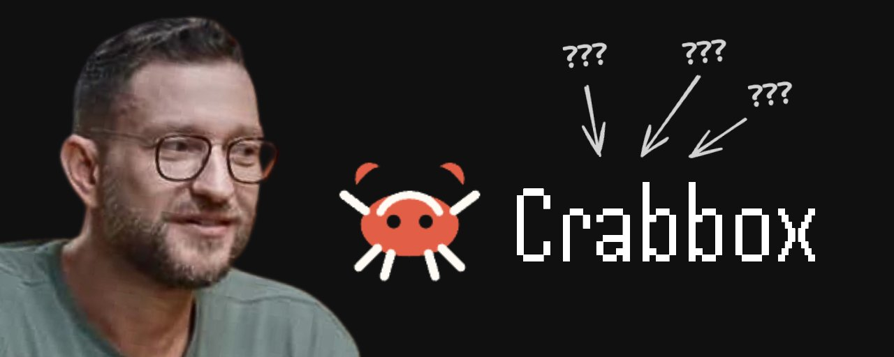
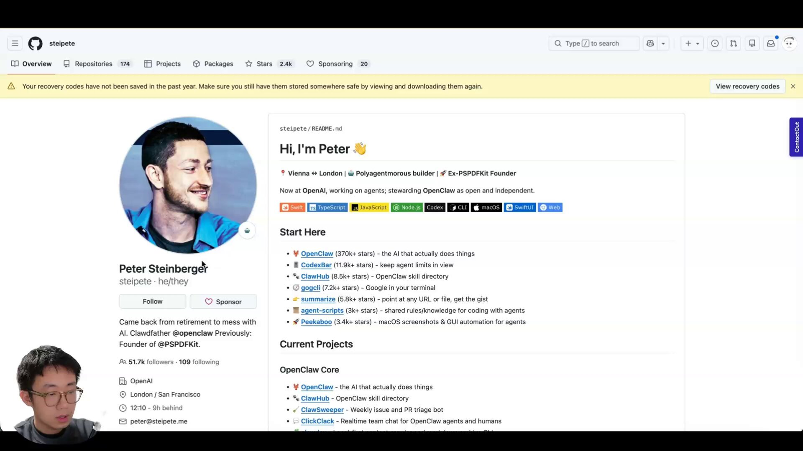
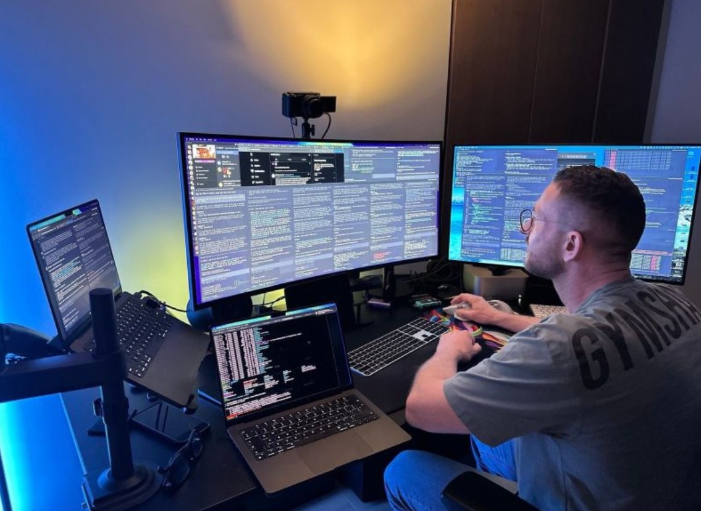
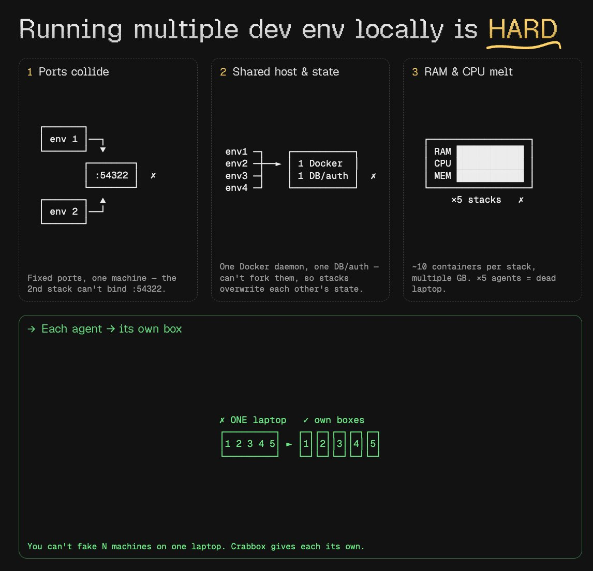
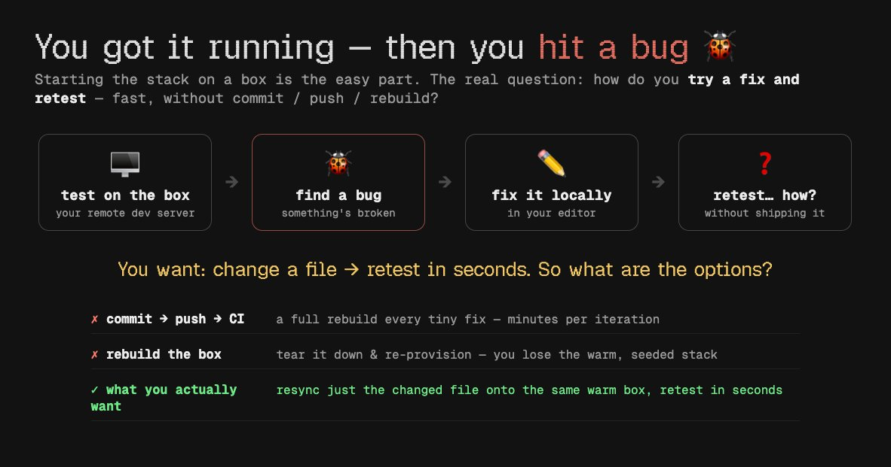
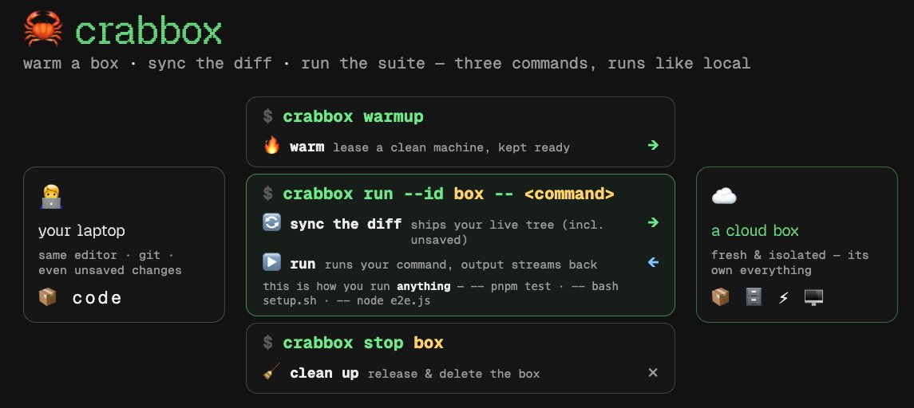
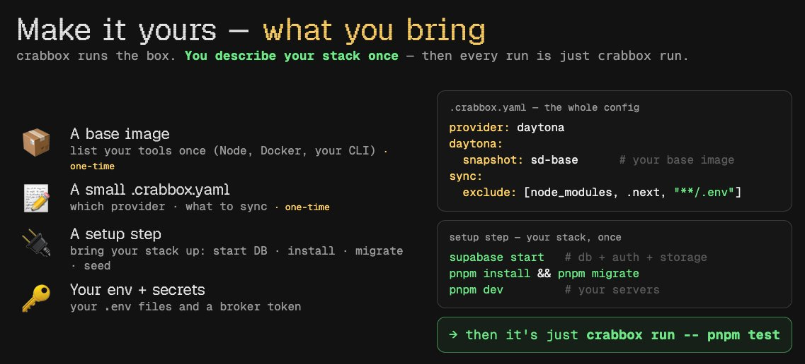

**Crabbox 是什么：5 到 10 个 Agent 并行跑 PR，瓶颈从写代码变成了合并代码**

<strong style="font-size:16px;color:#1a6ba0;">要点速览</strong>

- <strong>Agent 并行的新瓶颈不是写代码，是合并代码</strong>：5-10 个 Agent 同时跑，PR 数量暴涨，但每个 PR 都要 review 和合并，测试环境冲突成了最大障碍。  
- <strong>Crabbox 让每个 Agent 拥有独立云端沙箱</strong>：三行命令（warmup → run → stop），自动同步本地 dirty diff，不用 commit 就能测试最新代码。  
- <strong>三文件配置，应用不用改</strong>：Dockerfile + .crabbox.yaml + setup.sh，整个 footprint 就这么多。Agent 可以自己写 Dockerfile，自己跑测试，自己带回证据。  
- <strong>Peter 的开源新项目</strong>：Crabbox 是 Claude Code 之父 Peter Steinberger 的新 side project，配套 skill 已开源在 AI-Builder-Club/skills。

---

<section style="text-align: justify;margin-left: 8px;margin-right: 8px;line-height: 1.75em;">
以前我同时只能管 2 到 3 个 Claude Code session。今年四月之后，这个数字一路涨——尤其是上了 loop 之后。现在任何时候我都有至少 5 到 10 个 session 在并行跑。大多数我根本没直接给过指令：它们来自 loop，自己发现 issue、自己领任务、自己验证改动、自己开 PR。
</section>

<section style="text-align: justify;margin-left: 8px;margin-right: 8px;line-height: 1.75em;">
这带来了大量的 PR 产出量。但也带来了一个新问题：每个 PR 都要 review、要合并到真实客户手上，每一个都有破坏东西的风险。
</section>

<section style="text-align: justify;margin-left: 8px;margin-right: 8px;line-height: 1.75em;">
<strong>瓶颈已经转移了。不再是写代码，而是把代码合并进代码库。</strong>
</section>

<section style="text-align: justify;margin-left: 8px;margin-right: 8px;line-height: 1.75em;">
问题出在 harness 组件上，以及 Peter 的新 side project Crabbox。
</section>

**Agent 需要自己的盒子来验证工作**

<section style="text-align: justify;margin-left: 8px;margin-right: 8px;line-height: 1.75em;">
现在常见的做法是让 Agent 生成一个子 Agent，用 Playwright CLI 测试工作并记录证据——截图或视频，附在 PR 上。这才能让 Agent 的工作可信、可合并——不是信它说的话，而是亲眼看到它跑通了。
</section>

<section style="text-align: justify;margin-left: 8px;margin-right: 8px;line-height: 1.75em;">
跑 3 到 4 个 Agent 时这没问题。但并行 session 一多，问题就来了——它们都在同一个环境里测试，互相冲突。
</section>

<section style="text-align: justify;margin-left: 8px;margin-right: 8px;line-height: 1.75em;">
每个 Agent 验证时，dev server 必须实际跑在它自己的代码上。就算给每个 ticket 分配独立的 git worktree，那也只是隔离了写代码。在本地反复跑应用，不 scale：端口经常写死，第二个实例起不来；一台笔记本只有一个 Docker daemon、一个数据库、一个 OS，每个"隔离"的 session 实际上在共享它们——一个 Agent 尝试新 schema 就能同时搞崩所有 session；真正的生产栈还吃 RAM 和 CPU，五个根本塞不下。
</section>

<section style="text-align: justify;margin-left: 8px;margin-right: 8px;line-height: 1.75em;">
<strong>要 scale，就别再在笔记本上跑所有东西。让每个 Agent 在云端拥有自己独立的隔离环境：自己的机器、自己的数据库、自己的 dev server。沙箱之间互不接触。</strong>
</section>

<section style="text-align: justify;margin-left: 8px;margin-right: 8px;line-height: 1.75em;">
团队之前手搓过一个版本，跑在 Fly.io 上：一个 Firecracker VM，里面装了完整栈（通过 docker-in-docker 的本地 Supabase、Redis 和 dev server），从基础镜像启动，带持久化卷。加了机内编排、CDP 浏览器驱动、suspend/resume（盒子约 3 秒热恢复）、以及 45 分钟空闲自动关机的 watchdog。效果不错。
</section>

<section style="text-align: justify;margin-left: 8px;margin-right: 8px;line-height: 1.75em;">
但它有个麻烦：要把代码弄上盒子，它从 GitHub 用 git fetch 拉分支。你必须先 push。未 commit 的工作区改动完全无法验证。
</section>

<section style="text-align: justify;margin-left: 8px;margin-right: 8px;line-height: 1.75em;">
所以当 Agent 在盒子上测试、发现 bug、在本地修复后，你就卡住了：本地有 dirty 文件，盒子里只知道已经 push 的内容。正常的 commit-push-CI 流程在这里行不通——仓库会塞满垃圾 commit。你也不想每次都从头重建盒子。
</section>

<section style="text-align: justify;margin-left: 8px;margin-right: 8px;line-height: 1.75em;">
改完代码，几秒内重新测试。这就是 Peter 的新 side project Crabbox。
</section>

**Crabbox 怎么工作**

<section style="text-align: justify;margin-left: 8px;margin-right: 8px;line-height: 1.75em;">
Crabbox 让 Agent 在云端预热一个盒子，把本地工作区的 dirty diff 同步上去，然后实时跑测试。三个命令：
</section>

<section style="text-align: justify;margin-left: 8px;margin-right: 8px;line-height: 1.75em;">
1. crabbox warmup — 启动一个盒子 2. crabbox run -- &lt;command&gt; — 在云端盒子上跑任何命令，就像在本地跑一样。每次运行前自动同步本地的 diff。不需要 commit。只要文件夹是 git 初始化的，它就同步所有未提交的改动，然后执行。 3. crabbox stop — 关闭并删除盒子
</section>

<section style="text-align: justify;margin-left: 8px;margin-right: 8px;line-height: 1.75em;">
整个 loop 就这些。Agent 完成任务后：warmup → 跑 setup 安装依赖并启动 dev server → 跑测试或驱动 Playwright → 如果遇到 bug，在本地修复再跑一次（最新改动自动同步）→ stop。<strong>本地修复、重新运行、最新改动自动同步——这一步绕过了所有传统流程。</strong>
</section>

**配置只要三个文件**

<section style="text-align: justify;margin-left: 8px;margin-right: 8px;line-height: 1.75em;">
1. Dockerfile — 封装本地机器上的一切：Node、包管理器、CLI（Supabase CLI 等）、浏览器。可以让 Agent 自己写。 2. .crabbox.yaml — 配置每个 Crabbox 命令：定义沙箱 provider、跳过同步的文件、转发的环境变量。 3. setup.sh — 一个脚本让 Agent 把整个 dev server 跑起来，不用手动一步步执行命令。
</section>

<section style="text-align: justify;margin-left: 8px;margin-right: 8px;line-height: 1.75em;">
同步排除方面：node_modules、.next、.env* 通常不需要列，因为它们已经在 .gitignore 里。真正该排除的是盒子上不需要的大文件夹。环境变量通过加密 SSH 连接直接推送到盒子，不经过任何 broker，也不会写入同步的仓库。
</section>

<section style="text-align: justify;margin-left: 8px;margin-right: 8px;line-height: 1.75em;">
<strong>整个 footprint 就这么多文件。任意 Agent 在隔离云端盒子中验证代码库，靠这三个文件就够了。</strong>
</section>

<section style="text-align: justify;margin-left: 8px;margin-right: 8px;line-height: 1.75em;">
cbx.sh 是一个小便利脚本，把 warmup 和 poll 的流程包装成一个命令。而 skill 让我只需要说"用 Crabbox 测试这个"，Agent 就知道整个序列：预热盒子、跑 setup、驱动 Playwright、带回证据、停止。三个文件做实际工作，应用不用改。
</section>

**把证据带回来**

<section style="text-align: justify;margin-left: 8px;margin-right: 8px;line-height: 1.75em;">
Crabbox 有证据原语：--artifact-glob 在命令完成后自动下载匹配的文件；crabbox artifacts collect 截取盒子屏幕截图；artifacts video 录制 session 视频；artifacts publish 直接上传到 S3，可以把图片或视频内联到 PR 评论中。
</section>

**一个值得知道的 flag：--no-sync**

<section style="text-align: justify;margin-left: 8px;margin-right: 8px;line-height: 1.75em;">
默认每次 crabbox run 都会先把 dirty diff 同步到盒子——这是它最大的用处。但你不总是需要它。当命令只读取或驱动已有代码的盒子、且自上次运行以来没改过东西时，用 --no-sync：读文件、tail 日志、检查状态；在盒子里驱动 Playwright CLI（测试已有代码，不想每次点击都重新上传）；轮询长时间运行的命令（中途重新同步可能踩到运行中的文件）。
</section>

<section style="text-align: justify;margin-left: 8px;margin-right: 8px;line-height: 1.75em;">
改了代码要测新版本就 sync，只读或驱动运行中的盒子就 no-sync。
</section>

**/Crabbox-setup skill**

<section style="text-align: justify;margin-left: 8px;margin-right: 8px;line-height: 1.75em;">
作者把所有东西打包成了一个 skill：Crabbox 测试套件，加上它接入的更大代码库 harness。开源在 GitHub 上。指向你的仓库，它会自动生成上述文件（Dockerfile、.crabbox.yaml、setup.sh 和 crabbox-test skill），适配你的技术栈。
</section>

<strong style="font-size:15px;color:#8b6f4c;">结语</strong>

Agent 并行化正在把开发瓶颈从"写代码"推向"合并代码"。Crabbox 的解法很直白：每个 Agent 一个独立云端沙箱，dirty diff 自动同步，不用 commit 就能重测。三个文件、三条命令，应用零改动。  
这个思路和之前讨论的 Agent Memory 架构正好互补——Memory 解决跨 session 的状态持久化，Crabbox 解决跨 Agent 的测试隔离。两者合在一起，就是 Agent 从单次调用到持续运行所需的基础设施。

---

参考：https://x.com/jasonzhou1993/status/2069413003897012435
