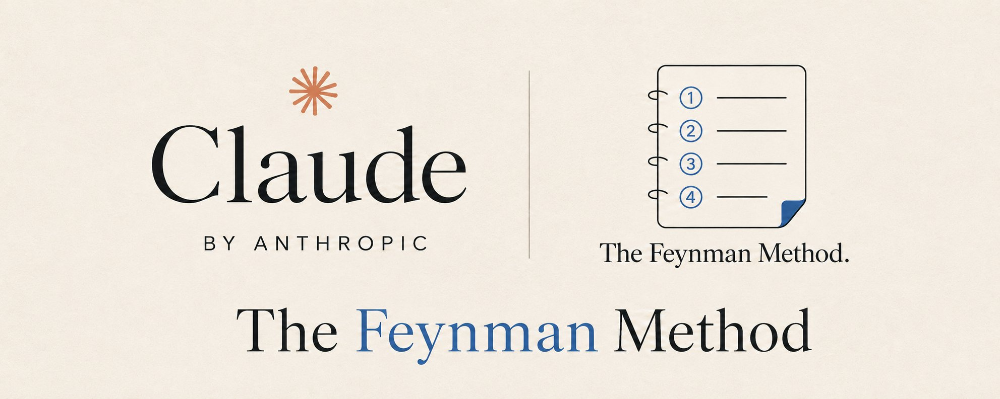
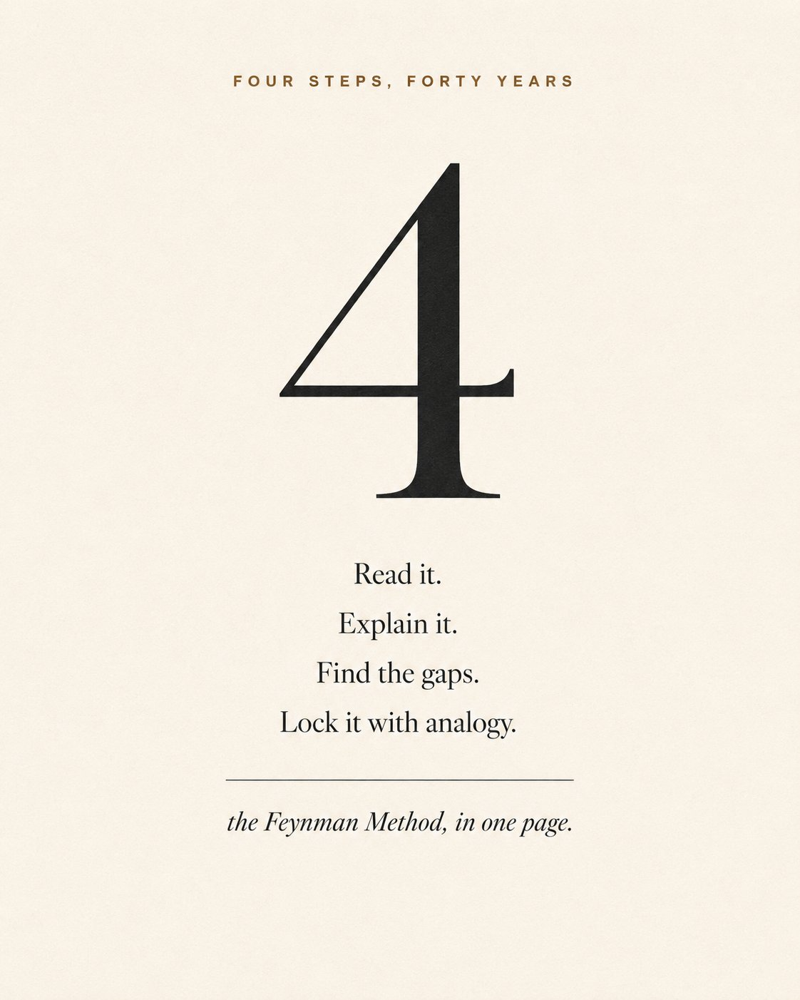
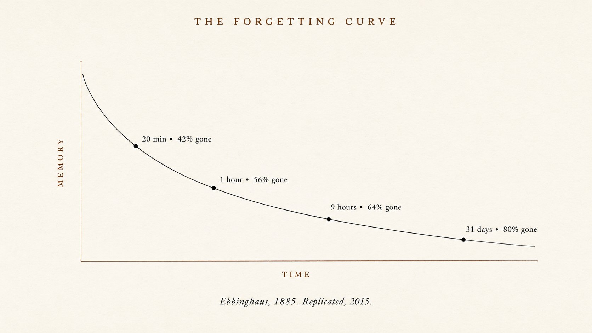
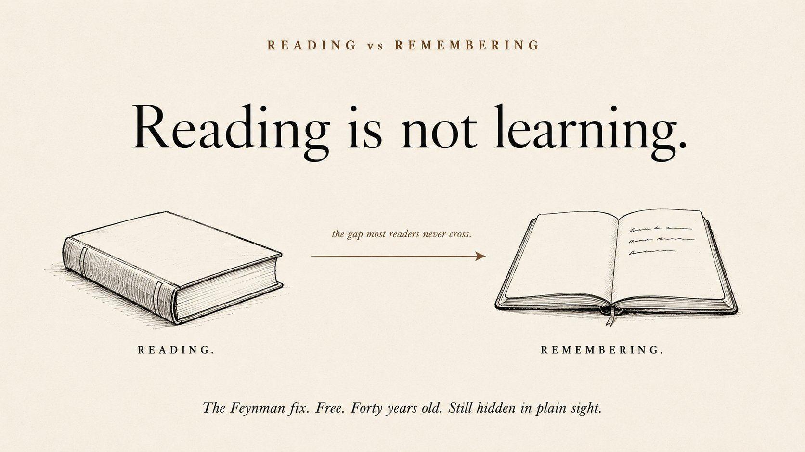
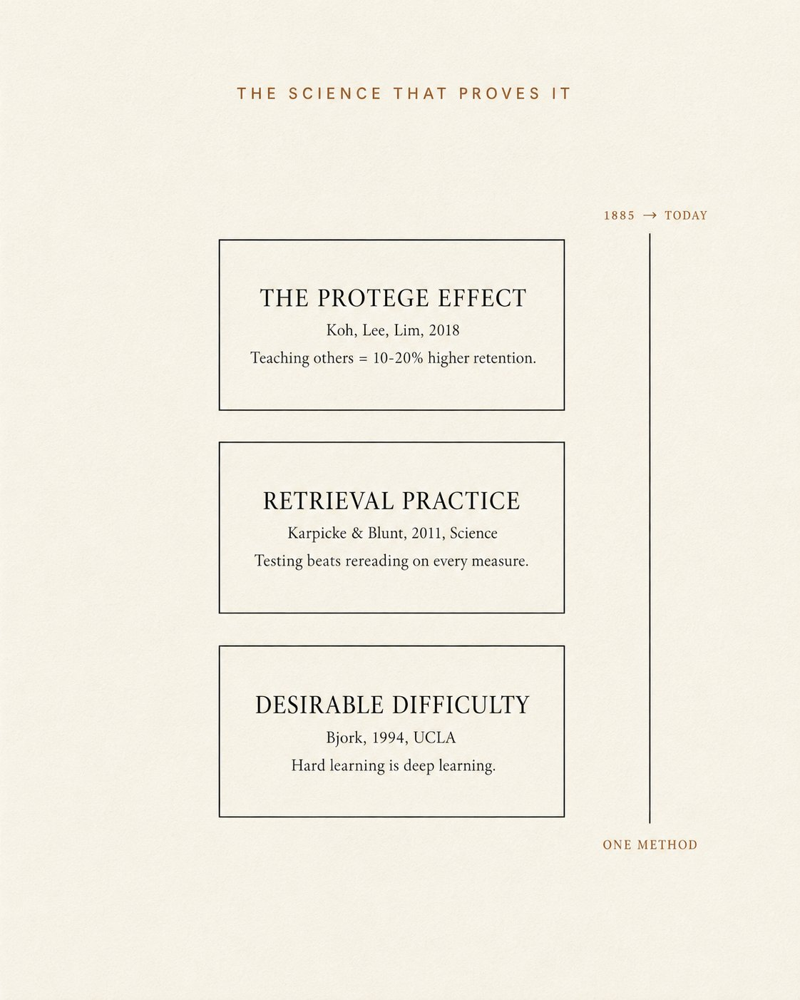
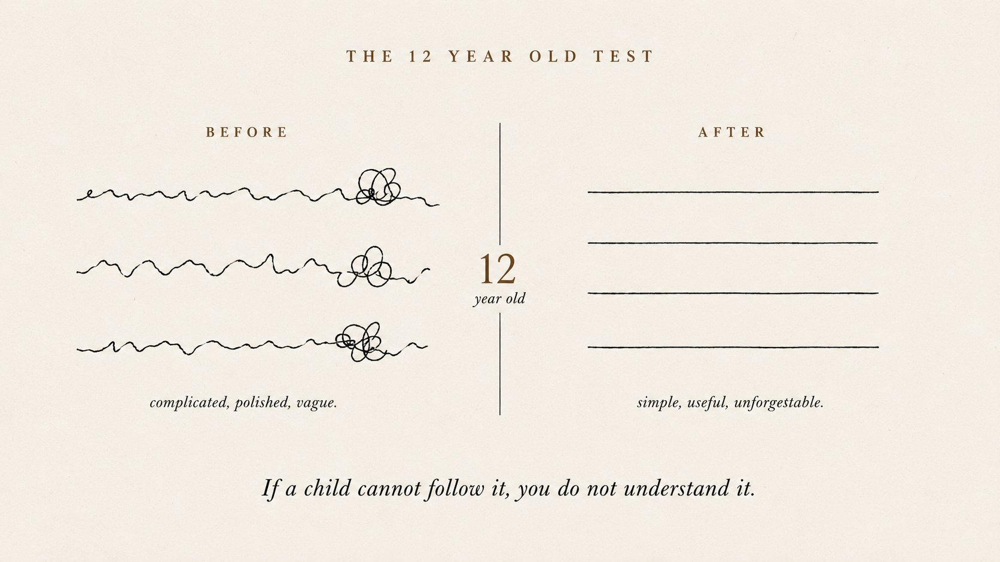
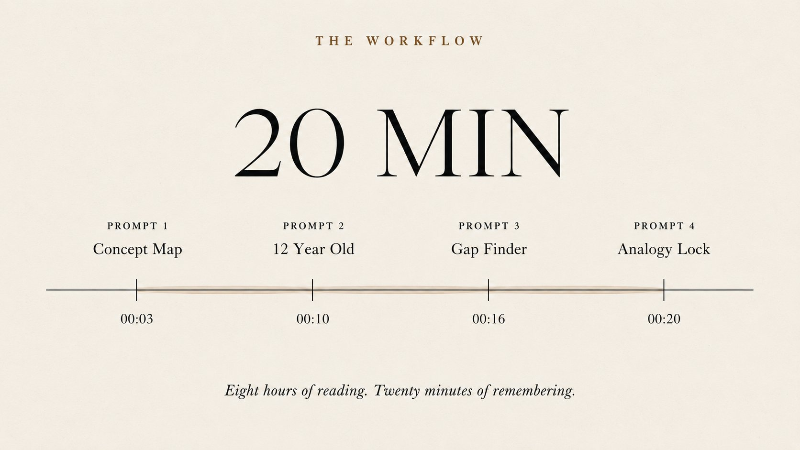

<strong style="font-size:16px;color:#1a6ba0;">要点速览</strong>

- <strong>遗忘曲线</strong>：20 分钟后丢失 42%，31 天后丢失 80%。不是记性差，是大脑的正常机制。  
- <strong>费曼四步法</strong>：选概念 → 用 12 岁语言解释 → 找缺口 → 用类比锁定。每一步都在强迫大脑做提取而非识别。  
- <strong>三大科学支柱</strong>：Protégé 效应（教别人比自学高 10-20%）、提取练习（输出远胜输入）、理想难度（感觉困难才是真学习）。  
- <strong>4 个 Prompt × 20 分钟</strong>：概念地图 → 12 岁测试 → 缺口发现 → 类比锁定。在 Claude 中一次跑完，效果超过一门完整在线课程。

**你读完一本好书。两周后，你记不住任何一个章节。不是因为你笨——因为从来没人教过你怎么真正学习。**

1965 年，Richard Feynman 拿了诺贝尔物理学奖。但他最被人记住的，不是物理学——而是他在 Caltech 用的一套 4 步学习方法。简单到 12 岁孩子都能操作，MIT、Stanford 和 UCLA 在他去世 38 年后还在教。

你可以在 Claude 中用同样的 4 步，20 分钟完成一次完整的学习闭环。

**4 个 Prompt。20 分钟。真正留得住的知识。**

## 1. 为什么你什么都记不住

你昨天读了一篇文章。现在能说出它讲了什么吗？不是主题——是真正的洞见。

大多数人做不到。而这是整篇文章最重要的一句话：**你不是不擅长学习。你的大脑只是在做大脑该做的事。**

1885 年，德国心理学家 Hermann Ebbinghaus 做了第一个关于记忆的科学实验。他记了一堆无意义音节，然后随时间推移测试自己。这个发现后来成了心理学中被重复验证最多的结果之一，2015 年有人重复验证，结果一样：

- 20 分钟后：丢失约 **42%**
- 1 小时后：丢失约 **56%**
- 31 天后：丢失高达 **80%**

这就是**遗忘曲线**。几乎所有类型的学习都逃不过它——书、课、讲座、在线文章。没有主动强化，你读的大部分东西一个月就没了。

更深层的原因：认知科学家管这叫**流利错觉（fluency illusion）**。读起来轻松，就被当成了真懂。一段清晰的文字感觉像知识，但其实不是——那是识别。你只是看到了这个想法，没用过它。

**阅读是注意力的证明。解释才是理解的证明。这两者不是一回事。**

## 2. 费曼实际做了什么

Richard Feynman 从 1950 年到 1988 年在 Caltech 任教。他的讲座好到其他大学的科学家会专程飞来听他解释他们已经知道的东西。

原因很简单。**Feynman 拒绝躲在术语后面。** 如果他不能用 12 岁孩子能懂的话解释一个概念，他就说自己根本没懂。然后他会把概念拆到能解释为止。

有个几乎没人知道的故事。准备普林斯顿资格考试时，Feynman 打开一本新笔记本，扉页上写着：「**我不懂的东西笔记本**」。然后他逐个攻克每一个盲区。他不学他已经知道的，他学他还不能解释的。

那本笔记本就是费曼学习法最纯粹的形式：**找到缺口 → 填补缺口 → 进入下一个缺口。**

他去世后，他的学生将这个方法整理为 4 个步骤：

- **第 1 步**：选一个概念。写在空白页上。
- **第 2 步**：像教 12 岁孩子一样解释它。只用简单词汇。不用术语。
- **第 3 步**：找出你解释中的所有缺口。卡住或模糊的地方，标记出来。
- **第 4 步**：回到原始资料，修复缺口，用一个类比简化。

四个步骤。**每一步都在迫使你的大脑做阅读永远做不到的事：提取。**

## 3. 科学证明它有效

Feynman 从没发表过关于他方法的研究。他就是自己用。但 60 年的认知科学已经确认了它为什么有效。

**Protégé 效应。** Koh、Lee 和 Lim（2018）发现，向他人教授材料的学生比只学习的学生得分高 **10% 到 20%**。教授行为迫使提取。提取才是构建记忆的关键。Prompt 1 和 4 激活了这个效应。

**提取练习。** Karpicke 和 Blunt（2011）发表在《Science》上的研究表明，从大脑中提取信息比输入信息效果显著更好。自我测试在每一项指标上都击败了重读。Prompt 2 和 3 强制提取。

**理想难度。** Robert Bjork（1994）在 UCLA 提出了这个术语。感觉轻松的学习是浅层的。感觉困难的学习才是深层的。**你在打字写出自己解释时感受到的不适不是失败——那正是你的大脑在建立更强连接的瞬间。**

这就是完整的研究基础。**教授胜过学习。提取胜过重读。难度胜过舒适。** Feynman 在数据追上来之前 40 年就知道了。

以下 4 个 Prompt 在 20 分钟内叠加了全部三种效应。

## 4. Prompt 1 — 概念地图

将这段 Prompt 粘贴到 Claude 中。替换方括号中的主题。

返回结果：一张清晰的地图，包含 **5 个真正重要的概念**。大多数主题有 50 个事实，只有 5 个是承重的。这个 Prompt 在 30 秒内找到它们。

大多数人读完一本书只留下「好书」的模糊感觉。用了这个 Prompt，你走的时候能列出 5 个有名字的概念。**这就是感觉和记忆之间的区别。**

## 5. Prompt 2 — 12 岁测试

现在做最难的部分。这是激活 Protégé 效应的 Prompt。

返回结果：Claude 先写出简化版本。然后它停下来让你写你的版本。你用简单词汇写出每个想法的你自己的版本。

**这就是全部的关键。你打出自己版本的那一刻，才是学习真正发生的时刻。** 不是读书时，不是划重点时，不是做笔记时——是你用自己简单的话写出来的时候。

如果你跳过这一步，你会忘记 80%。如果你做了，你会记住大部分内容很多年。这不是猜测——这是 Koh 2018 的研究。

> 阅读是注意力的证明。解释才是理解的证明。

打出你的答案。发给 Claude。现在你准备好进入下一个 Prompt 了。

## 6. Prompt 3 — 缺口发现者

这是让费曼方法变得神奇的 Prompt。**Claude 读取你的解释，告诉你你的理解在哪里出了问题。**

返回结果：一份关于你自己思维的诚实成绩单。

这是书籍永远无法给你的步骤。一本书不知道你错过了什么。Claude 知道——它读了你的解释，它能看出逻辑在哪里断了。

在物理、金融、AI 甚至谈判策略上都试过。**每一次 Claude 都发现至少 2 个我以为懂了但实际上没懂的概念。每一次。**

「先重新学习这个」那一行是金子。它告诉你要修复的最具杠杆作用的缺口。你不再需要重读整本书，只需要重读一段。

## 7. Prompt 4 — 类比锁定

原始费曼方法的第 4 步是最被低估的。**用你生活中的一个类比锁定每个想法。** 当想法与大脑已经知道的东西关联时，大脑的存储时间是 3 倍。

返回结果：每个想法两个锚点。外加一句你可以永远携带的总结。

「类比在哪里失效」这部分是这个 Prompt 与众不同的地方。大多数老师给出类比就停了。Feynman 坚持展示局限性。**这能防止你把错误的心理模型带到下一次对话里。**

明天早上当你重读那 5 句总结时，类比会把完整想法拉回你的脑海。这就是锁定。

## 8. 20 分钟工作流

- **第 1-3 分钟**：Prompt 1。你有了 5 个重要概念的清晰地图。
- **第 4-10 分钟**：Prompt 2。阅读 Claude 的示范答案，然后写你自己的。**这是慢的部分，不要急。打字就是全部意义。**
- **第 11-16 分钟**：Prompt 3。拿到你的成绩单。找到你的缺口。花 2 分钟重新学习最薄弱的概念。
- **第 17-20 分钟**：Prompt 4。用 2 个类比锁定每个想法。保存 5 句总结。

**总时间：每个主题 20 分钟。四轮主动提取。比大多数人在整个在线课程中学到的真正知识还多。**

对比一下替代方案：花 8 小时读一本 300 页的书，忘记 80%。或者花 300 美元买一门课，下个季度忘记大部分。

**费曼方法 + Claude 把 8 小时的阅读变成了 8 小时的记忆。**

## 9. 现在就用它的 7 个场景

1. **每读完一本非虚构书后。** 当天就运行 4 个 Prompt。书会永远留下。
2. **每完成一门在线课程后。** 大多数 300 美元的课程 80% 都随风而去。看完每个模块的第二天运行费曼方法。
3. **任何面试前。** 选出 5 个最难可能被问到的话题，每个跑一遍费曼方法。你的清晰度会让其他人望尘莫及。
4. **任何会议前。** 你的老板提到一个你假装懂的概念。今晚跑 4 个 Prompt。明天你就是给团队解释的那个人。
5. **在教任何东西之前。** 如果你需要在工作中解释一个话题，先跑一遍 Prompt。你的听众会以为你比实际多 10 年经验。
6. **读完一篇研究论文后。** 论文很密集。通过 Claude 跑费曼方法是真正理解一篇论文最快的方式。
7. **在你竞争对手谈论的任何话题上。** Kubernetes、RAG、Fine-tuning、MCP。任何你点头但并未真正理解的东西。20 分钟。永久。

<strong style="font-size:15px;color:#8b6f4c;">结语</strong>

阅读行业卖书给你。课程行业卖课程给你。笔记应用卖订阅给你。没有一个人卖给你那个让这一切真正留下痕迹的东西——<strong>主动回忆</strong>。  
费曼方法已经免费了 40 年。背后的科学（Koh、Karpicke、Bjork）已经定论超过十年。上面的 4 个 Prompt 在你已经在付费的工具里运行。但几乎没有人这么做。  
我们正处于一个 <strong>18 个月的窗口期</strong>。学会用 AI 做主动回忆的人，将远远超越用 AI 做摘要的人。不是因为他们更聪明，而是因为他们在打出自己的版本，而其他人还在划重点。18 个月后，这种工作流会成为每个阅读应用的默认功能。优势将消失。今天它还是一个安静的技巧。  
<strong>停止消费。开始解释。</strong>

---
参考：

https://x.com/heynavtoor/status/2069730505541693951
