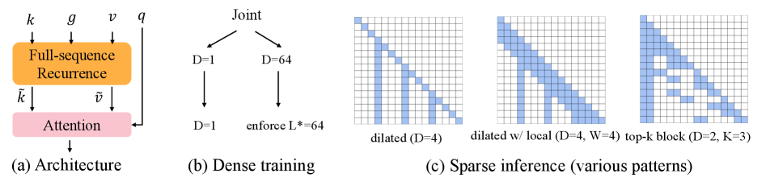
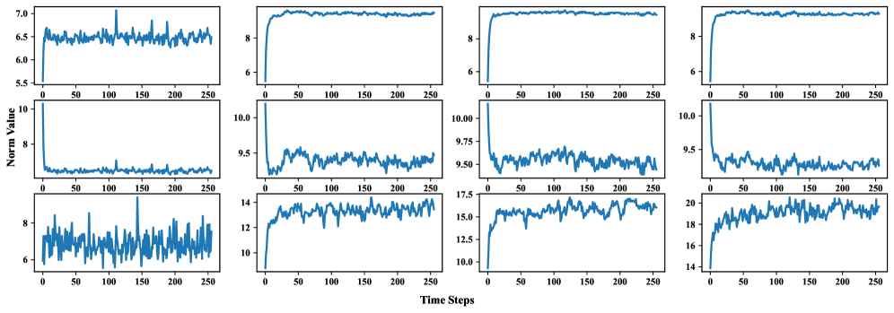
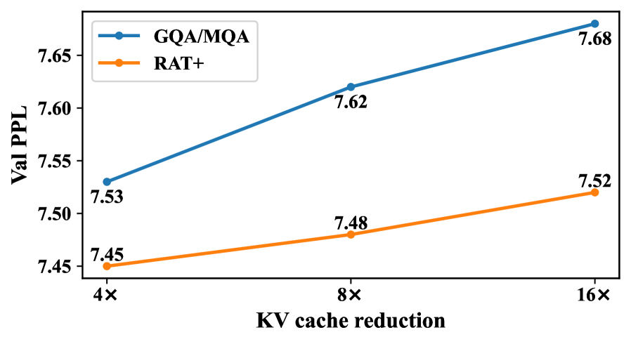
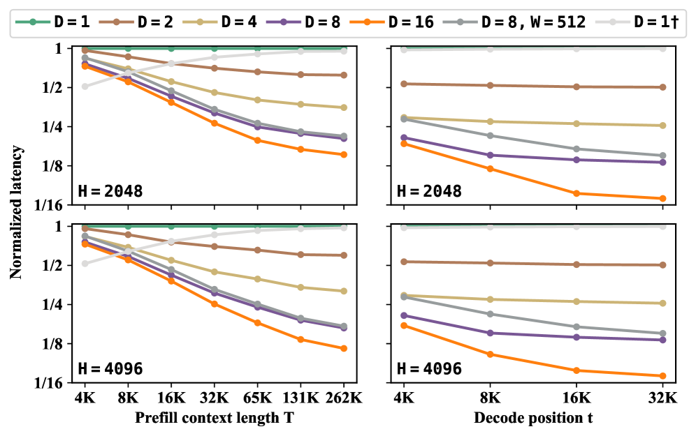
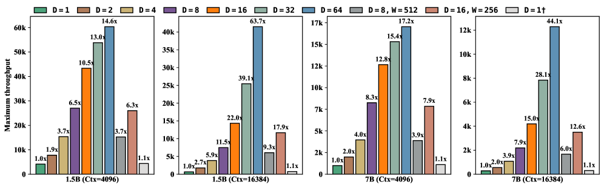
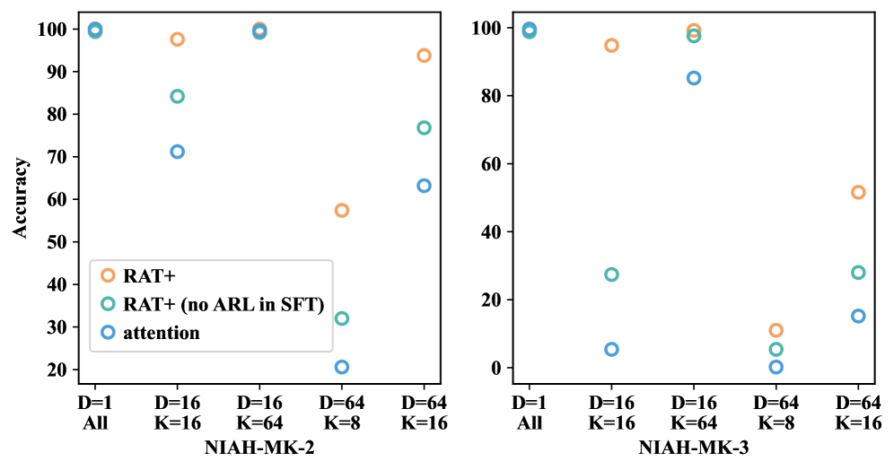
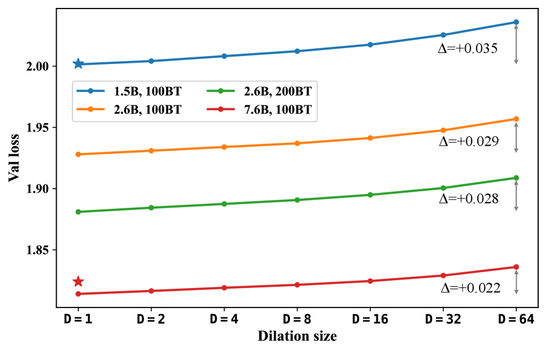
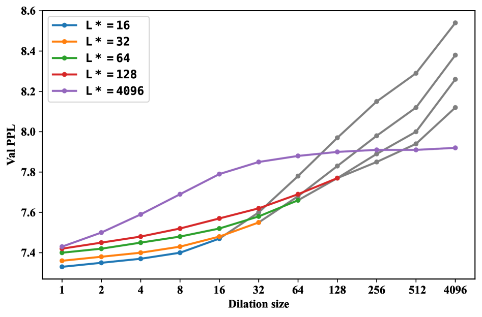
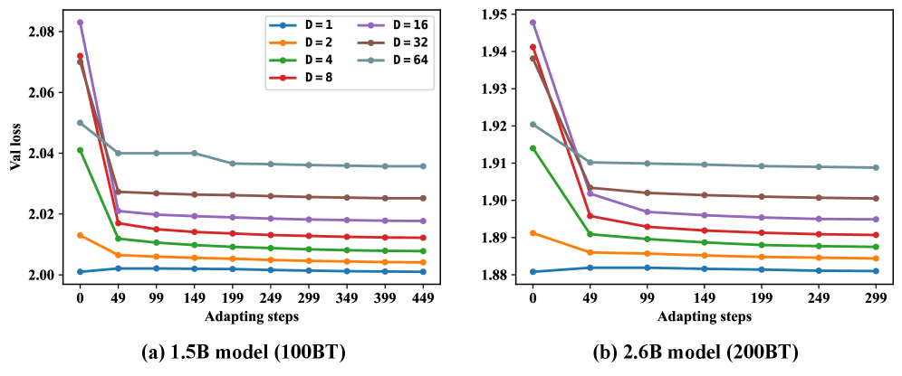

<strong style="font-size:16px;color:#1a6ba0;">要点速览</strong>

- <strong>核心矛盾</strong>：扩张注意力（dilated attention）能按扩张率D等比压缩注意力的FLOPs和KV cache，但把预训练稠密模型直接稀疏化成这个模式会彻底崩塌（D=64时困惑度破百），只能从头为每种配置单独训练  
- <strong>RAT+ 思路反转</strong>：不训练稀疏模型，而是训练一个"能力更强"的稠密模型，靠全序列循环（full-sequence recurrence）+ 主动循环学习（active recurrence learning）让它在推理时灵活切换成任意扩张模式，只需1B token的分辨率适配  
- <strong>实测表现</strong>：1.5B模型在D=16几乎追平稠密精度，D=64仅降约2–3个点；扩到7.6B后D=64平均精度损失仅1个点，同时注意力FLOPs和KV cache缩减64×  
- <strong>额外红利</strong>：RAT+ 里的循环还顺手改善了top-k block attention（如Quest/MoBA），并能在推理时按任务自由组合不同稀疏模式，这是GQA这类方案做不到的

---

## 一个被搁置的"效率旋钮"

结构化扩张注意力有一个诱人的效率旋钮：把注意力的计算和KV cache都缩减为扩张率D分之一，同时还保留长程连接。理论上，D=64就意味着注意力开销直接砍到1/64，长程信息却不丢。

但现实很骨感。这种模式的成功案例几乎全是从头训练（DeepSeek的NSA、前作的RAT都是如此），而**直接把一个预训练好的稠密模型稀疏化成扩张模式，精度会彻底崩塌**。原文给出了一组刺眼的数字：纯注意力模型在D=64时困惑度直接冲到100以上，而同等FLOPs预算训练的稠密模型只有7.44。

这就导致一个尴尬的局面：每一种扩张率、每一种KV头数、每一种状态大小，往往都得单独从头训练一个模型。想在不同任务的效率-精度权衡间灵活切换？成本高得离谱。

RAT+ 想走另一条路：**不训练稀疏模型，而是训练一个"能力更强"的稠密模型，让它在推理时灵活切换成任意稀疏模式。**

图1：RAT+ 的整体思路。(a) 采用极端的重叠设置，即L=T的全序列循环；(b) 联合训练在保留稠密注意力的同时强制主动循环学习（有效长度L*=64）；(c) 预训练后单个模型可适配多种稀疏推理模式，且在top-k block attention上也优于标准注意力

## 为什么稠密模型转扩张会崩

要理解RAT+ 的修复逻辑，得先看清楚扩张注意力"断在哪"。

扩张注意力把序列切成块，每个token只和同位置、跨块的token做注意力。问题在于：它切断了块内相邻token的直接连接，整个注意力图是"断开"的。作者从两个角度验证了一个结论：**扩张注意力需要显式机制去构建完整的感受野，而循环（recurrence）正是那个机制。**

从头训练时，RAT在块内加一个类遗忘门的简单循环，再在块间做扩张注意力，D=16就能追平稠密。表1的对照很说明问题：没有循环的扩张注意力根本训不动（收敛到次优平台），而加上循环后，连纯稠密注意力本身也因循环受益（困惑度从7.44降到7.38）。

推理期稀疏化时更麻烦。原文对预训练稠密模型做了轻度微调实验：切到扩张模式后loss确实会快速下降，但很快进入平台期，再堆token也没用。原因是局部注意力在这里只是个推理期配置，没有被显式训练去构建完整感受野，和从头训练之间始终存在鸿沟。

一句话总结作者的洞察：**扩张注意力不是不能稀疏，而是缺一个能桥接断开连接的"完整感受野"机制。**

## RAT+ 怎么修：全序列循环 + 主动循环学习

RAT本身是为从头训练设计的稀疏结构，它缺D=1时的稠密注意力能力，直接拿来用不够。RAT+ 在它基础上做了两处关键改造。

**第一处：重叠块大小，简化为全序列循环。** 原始RAT把块大小设为等于扩张率（L=D）。这带来一个隐患：用L=64训练的循环，到D=4推理时得适配到L=4，而早期时间步的循环输出分布会明显漂移（协变量偏移），后续扩张注意力很难适配。RAT+ 的做法很干脆：让每个token关联一个固定长度的循环窗口（L=64），评估时只改扩张率D、不动L。训练推理保持一致，循环输出的分布就稳定了。

进一步，主动循环学习让这个固定长度可以一路扩展到整个序列（L=T），实现上变成全序列循环：训练只需对序列做一次并行前向扫描，KV cache管理也更简单。

图9：循环输出在不同时间步的L2范数。可以清晰看到早期时间步的输出分布与后续差异显著，这正是需要固定循环窗口来规避的协变量偏移

**第二处：主动循环学习（ARL），治"懒惰循环"。** 麻烦在于，在已有全序列注意力提供完整连通性的架构里直接训练循环，模型会"偷懒"：反正注意力已经连上了，循环就没动力去学预期的长度能力，最后收敛到一个更容易学的短长度。结果就是稀疏推理下困惑度仍然很高。

作者的解法基于一个洞察：完整感受野对强表现至关重要，那就**给"学到足够长的循环能力"一个明确优势**。具体是联合训练策略：每个batch同时跑两种情形：稀疏情形（L=64, D=64，循环能力不足会直接拉低性能，从而强制它学）和稠密情形（L=64, D=1，保留足够注意力能力）。稀疏情形逼出主动循环学习，稠密情形保住稠密精度，两种设置都强。

最终RAT+ 用全序列循环（L=T）+ 被主动强制的循环长度（L*=64），在保留稠密表现的同时，各种扩张设置都稳得住。

## 实测：1B token适配，精度几乎不掉

实验主结果基于1.5B参数、FineWeb-Edu上100B token训练的模型，上下文4096。

**稳定扩张，且保留稠密精度。** 表3里，RAT+ 在同等FLOPs预算下困惑度与纯注意力模型持平，扩张时却稳如泰山；纯注意力直接稀疏化到D=64时困惑度破百。表4的常识推理结果更直观：D=16的平均精度几乎和稠密（D=1）一样，D=64只掉约2个点，而时序混合FLOPs降了64×。

**不同任务偏好不同模式。** 在LongBench长上下文上，作者发现一个支撑"训练稠密、推理稀疏"范式的关键现象：任务会挑模式。比如StreamingLLM除了RBP任务外全面劣于RAT+，说明那个任务偏好局部窗口；在层内或跨层加局部窗口能补回扩张注意力的表现，插少量稠密层还能进一步利好某些任务。

图5：与GQA/MQA对比。两者也用联合训练匹配训练FLOPs。RAT+ 困惑度更低且更灵活：只需一次预训练，就能在推理时配置不同的局部KV cache大小，这是GQA做不到的

**真金白银的延迟收益。** 在中等序列长度（如4K）解码、以及长上下文预填充时，时序混合算子才是主要瓶颈（图2）。RAT+ 在D=16、预填充262K时，隐藏维度2048/4096分别最高加速6.3×/8.5×；算上整个时序混合块仍有5.5×/6×。解码时收益更大，扩张16时算子和块层面都接近13×–14× 的墙钟加速。

图2：单一GH200 GPU上时序混合算子的效率结果，覆盖预填充与解码场景。预填充延迟在262K token序列上测量，解码延迟在256/128的batch上测量

KV cache存储是另一个硬约束，它直接限制了解码时的最大batch（通常内存受限）。图4显示D=64在1.5B和7B模型上分别带来超过60× 和40× 的解码吞吐提升。

图4：完整1.5B和7B模型解码1024 token的最大吞吐（tokens/sec），在上下文长度4096与16384下测量

## 意外的红利：循环还能救top-k block

除了扩张注意力，RAT+ 里的循环还顺手改善了top-k block attention（Quest、MoBA那一类的"重要性驱动"稀疏）。图3显示，所有稠密配置都满精度，而稀疏变体在D=64、K=16的NIAH-MK-2上，RAT+ 保持93.8精度，普通注意力只有63.2。消融掉SFT阶段的主动循环学习后表现落到中间值，说明增益确实来自循环本身。

图3：top-k block attention在RULER基准困难任务NIAH-MK-2/MK-3上的结果。RAT+（SFT阶段关闭ARL）进一步证明了循环的贡献

作者给出的一个解释是：循环改善了block的打分（block scoring）。表9的head命中率分析显示，RAT+ 中关键head的命中率显著高于标准注意力。而且扩张和top-k是正交的：top-k管重要块，扩张管剩下的块，两者结合在D=64、K=8的困难设置下把NIAH-MK-2从57.4拉到97.4。

## 放大到7B：差距进一步缩小

随着模型从1.3B扩到2.6B再到7.6B，稀疏与稠密注意力的验证损失差从0.035降到0.029再到0.022。作者归因于心维度更大带来的更强循环能力，更好支撑所需的长度64。

图6：扩展实验，用留出0.5B token子集的验证损失展示：随着模型增大，稠密与稀疏变体的损失差越来越小

表8的下游评估印证了这点：7.6B模型在D=16配合局部窗口（时序混合FLOPs和KV cache降8×）时，某些任务甚至超过稠密注意力。在NIAH-MK-2上，D=32在1.5B时是78% 精度，到7.6B涨到94.6%。

## 几个值得记住的设计取舍

作者没有把细节藏起来。两个消融点对新架构设计很有参考价值。

**为什么L*=64是经验最优？** 64不算大，循环能可靠处理而不会在长上下文建模里遭遇记忆退化；同时它也不小：覆盖到扩张率64，给选择扩张大小和构建高加速混合模型留足了灵活性，而且比L=16在长度泛化上更安全。图7系统消融了其他主动循环长度后的权衡。

图7：L*=64的选择依据。L*=16表示用D=1与D=16联合训练来赋予循环16的长度能力；不同D=1表现的差异来自训练FLOPs与循环捕捉对应长度的能力不同

**1B token的适配够不够？** 图8显示，无论哪种扩张模式，1B token内loss就稳定了。原文也坦承，虽然分析表明这1B token的适配需求来自注意力机制本身，但彻底解决它仍是未来工作。

图8：两个预训练模型上的1B token适配。各种扩张模式都在几亿token内快速达到稳定loss（无warmup的简单优化导致D=1起初略有上升，随后恢复）

<strong style="font-size:15px;color:#8b6f4c;">结语</strong>

RAT+ 把"效率"问题从下游方法上移到上游架构：与其为每种稀疏模式从头训一个模型，不如训一个能力足够的稠密模型，让它能在推理时按需切换。这个"训练稠密、推理稀疏"的范式，比单纯堆稀疏架构更灵活，也更符合实际部署中效率预算多变的需求。  
全序列循环加主动循环学习，本质上是在补扩张注意力缺失的"完整感受野"。1B token就能适配、且规模越大差距越小，说明这条路在scalability上是站得住的，不是只在小模型上凑巧成立。  
循环还能改善top-k block attention是个意外但合理的发现：它暗示"显式循环构建的感受野"可能对一大类稀疏模式都有普适增益，而不只服务于扩张注意力。这块机制值得进一步挖。

---

【传送门】 
<a class="normal_text_link mp_article_text_link" href="https://mp.weixin.qq.com/s/MmbHH7FfPEqhbi7Va1qgsg" target="_blank" data-linktype="2">Claude Code 60%的Token 被浪费？Anthropic教你怎么省。</a> 
<a class="normal_text_link mp_article_text_link" href="https://mp.weixin.qq.com/s/ZYubEusdx3fcymXYf6kwTQ" target="_blank" data-linktype="2">小米罗福莉MiMo-V2.5推理全链路优化：Hybrid SWA效率从理论走向工程</a> 
<a class="normal_text_link mp_article_text_link" href="https://mp.weixin.qq.com/s/kmOTUebNJRWDuDvnCvJOMA" target="_blank" data-linktype="2">Anthropic Claude Tag 的 Agent 身份革命：当 AI 不再代表你，而是代表自己</a> 
<a class="normal_text_link mp_article_text_link" href="https://mp.weixin.qq.com/s/OHfR5G47CWXXNjhFcH3HBw" target="_blank" data-linktype="2">GPT-Realtime 2.0只用声音控制电脑</a> 
<a class="normal_text_link mp_article_text_link" href="https://mp.weixin.qq.com/s/qHscVKN06FEGTru80STlxA" target="_blank" data-linktype="2">M²A多模态双层混合记忆系统：记住你的每一次变化</a> 
<a class="normal_text_link mp_article_text_link" href="https://mp.weixin.qq.com/s/VZRcpl6vL7riJp77ZmtSIg" target="_blank" data-linktype="2">Hermes vs OpenClaw创始人隔空互怼：假星标，抄袭，死亡威胁各种瓜</a> 
<a class="normal_text_link mp_article_text_link" href="https://mp.weixin.qq.com/s/hIab8mXanh0rdpEq_aHo7Q" target="_blank" data-linktype="2">Hermes Desktop 来了：从 CLI 到原生桌面应用，黄仁勋GTC首秀的产品正式公开</a> 
<a class="normal_text_link mp_article_text_link" href="https://mp.weixin.qq.com/s/olxLm3almopaba6J2JeFrA" target="_blank" data-linktype="2">Anthropic：如何用 Claude 实现 95%自动化数据化分析</a> 

---

参考：https://arxiv.org/html/2602.18196v5
