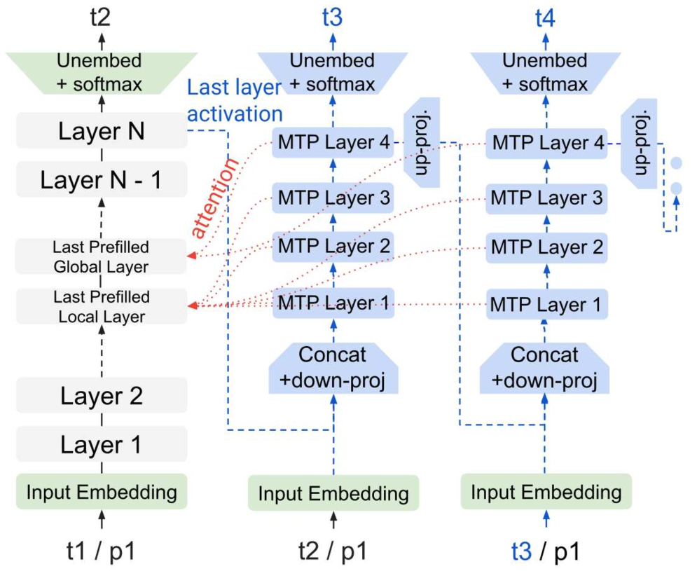
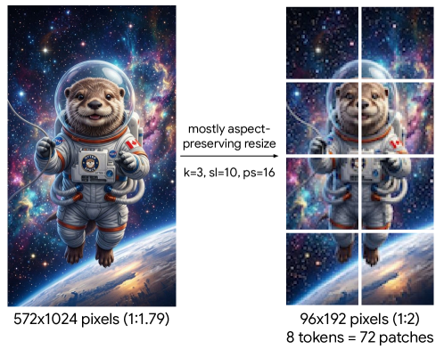

<strong style="font-size:16px;color:#1a6ba0;">要点速览</strong>

- <strong>全模态开放权重新旗舰</strong>：Gemma 4覆盖2.3B到31B共5档规模，含稠密与MoE两种架构，原生支持文本、图像、音频三者统一处理。  
- <strong>12B干掉编码器</strong>：12B模型采用统一无编码器架构，直接把原始图像块和40ms音频块投影进LLM嵌入空间，省掉独立的视觉与音频编码器。  
- <strong>思考模式上车</strong>：全系引入thinking mode，回答前先生成推理轨迹，数学与编程等重推理任务明显受益。  
- <strong>长上下文内存砍37.5%</strong>：通过本地滑动窗口与全局注意力5:1配比、p-RoPE位置编码、KV缓存共享与键复用为值，全局KV占用最高降37.5%。  
- <strong>以小博大</strong>：31B成为Arena文本榜稠密开放模型第一，E2B仅用Gemma 3 27B十分之一的参数就追平其性能。

---

## 引言：开放权重的下一跳

Gemma 4是Gemma家族迄今最强、最省的一代。它的目标很明确：在端侧硬件上跑得动的前提下，把多模态理解、推理能力和计算效率同时推高。模型套件包含稠密架构（2.3B、4.5B、12B、31B）以及一个MoE变体（26B-A4B，激活3.8B、总参26B），全部以Apache 2.0许可证发布。

**这一代的核心变化有五处。** 第一，思考模式（thinking mode）进入全系，模型先输出一条推理轨迹再作答，数学和编程这类重推理任务因此明显提升。第二，长上下文不再让KV缓存爆炸：本地滑动窗口与全局自注意力保持5:1配比（2.3B为4:1），配合p-RoPE位置编码，全局KV缓存占用最高降37.5%。第三，计算效率上放出多token预测（MTP）draft头，专为投机解码提速。第四，内存效率上提供量化感知训练（QAT）版本。第五，12B模型用统一无编码器架构替代独立编码器，减少内存碎片。

## 模型架构：稠密与MoE并行

Gemma 4遵循decoder-only的Transformer架构，同时具备pre-norm与post-norm，采用RMSNorm与QKNorm。家族内部，E2B与E4B沿用Gemma 3n的逐层嵌入技巧，总参5B与8B却只等效2.3B与4.5B，把参数花在刀刃上。

长上下文效率是Gemma 4的工程重点。全球注意力层中直接复用键作为值（values = keys），再叠加p-RoPE编码（全局层p=0.25、本地层用常规RoPE），把全局KV缓存有效压低37.5%。RoPE频率在全球与本地层分别设为1M和10k。E2B、E4B还以20/35、18/42的比例共享KV缓存，进一步省内存。

## 视觉与音频：冻结编码器，但更轻

E2B与E4B配150M视觉编码器，更大模型用550M（12B除外）。两者都是patch size 16的Vision Transformer，支持可变宽高比，并融合轴向2D-RoPE与2D绝对位置嵌入，最大视觉token数可在70到1120之间调节。

音频侧，E2B与E4B用305M编码器，以40ms块、Mel filterbank处理音频，架构基于通用语音模型（USM），由两层下采样卷积加十二个Conformer层构成。相比Gemma 3n，参数量砍了55%（从680M降到305M），且不走向量量化，LLM直接吃连续表征。预训练期间视觉与音频编码器权重全部冻结。

## 12B的无编码器架构

Gemma 4 12B从头训练，用一套统一、无编码器的范式替代了独立的视觉与音频编码器。视觉上，它接收48×48×3的RGB块，却用单个3500万参数的大矩阵乘法替代了550M视觉编码器，空间感知靠在块表征上直接加2D坐标位置嵌入、再接LayerNorm来保持。

音频上更彻底：基于USM的305M Conformer编码器完全丢弃。原始音频以16kHz切成40ms块，每块得到640维向量，直接投影进LLM嵌入空间。因为音频本身是时间序列，连位置编码都省了。这种「投影模块替代重编码器」的思路，是12B在保持多模态能力的同时压缩内存碎片的关键。

## 量化与MTP：把端侧门槛打下来

Gemma 4同时放出原始检查点和量化版本，聚焦两类权重表示：移动端量化（int2与int4混合权重 + int8激活）和Q4_0分块量化。在32k上下文下，量化让31B的权重内存从64GB压到19.2GB。

图像编码器量化到W8A8后，前向内存占用减半（400MB→200MB），端侧延迟相对Gemma 3n降44%。音频编码器量化后磁盘占用从390MB骤降到87MB，降幅78%，而翻译与转写相对Gemma 3n还分别提升12%/10%（E2B）和17%/12%（E4B）。

为加速解码，Gemma 4训练了一个自回归MTP draft头做投机解码。它把主模型上一步的最后一层激活和token嵌入喂进去，用一个独立嵌入器加4层Transformer块对主模型KV做交叉注意力（图1），免去了MTP预填充，支持任意draft长度。

图1：自回归MTP draft头（右侧蓝色块）接收主模型（灰色块）的激活与KV缓存

对E2B、E4B的draft头，还用token簇的top-k操作替代对完整词表的投影，最终矩阵乘法从d×262,000降到d×4096，解码开销大幅下降而接受率几乎不变。

## 指令微调与思考模式

预训练模型通过类似Gemma 3的后训练转为指令微调（IT）模型，最大区别是加入了思考模式。数据层面，团队过滤掉含个人信息、有毒输出、错误自我身份识别和重复的样本，并特意加入鼓励上下文归因、审慎表述和拒答的数据子集，在降低幻觉的同时不伤其他指标。

格式上，PT模型以 `<eos>` 收尾，IT模型以 `<turn|>` 收尾，微调时必须补上各自的结束token。如何激活思考模式、如何处理函数调用，都有专门的格式约定。

## 评测：以小博大的证据

人类评估上，31B与26B-A4B在Arena盲测两两对比（表4）中表现突出：**Gemma 4 31B是稠密类开放模型排名第一**，且两者都追平了参数量大得多的开放模型。

静态基准（表5）更有说服力：Gemma 4 31B尺寸最接近Gemma 3 27B却全面大幅领先，而E2B仅用十分之一参数就大致追平Gemma 3 27B。视觉基准（表6）上E4B在所有评测持平或超越Gemma 3 27B。长上下文（表9）则是另一处飞跃：E4B已经跑赢Gemma 3 27B，128k检索召回从8.6飙到58.5。

图2：Gemma 4视觉编码器支持可变宽高比的分块与token分配示意

## 关键性能数字

光说「飞跃」不够直观，几个硬数字更能说明代际差距。在思考模式下，Gemma 4 31B的MMLU Pro达到85.2、AIME 2026（无工具）89.2、LiveCodeBench v6 80.0、GPQA Diamond 84.3，对比Gemma 3 27B的67.6、20.8、29.1、42.4，几乎翻倍。长上下文检索（LOFT 128k Recall@k）从Gemma 3 27B的8.6跳到31B的79.5，差了一个数量级。

E2B这档最惊人：仅2.3B有效参数、量化后权重内存0.8GB，AIME 2026却拿到37.5，已经摸到Gemma 3 27B（20.8）的两倍。换句话说，端侧小模型第一次在重推理任务上有了可用性。

## 安全与责任

Gemma 4接受了与Gemini同样严格的安全评估。安全策略对齐Google的AI原则，明确防范CSAM、危险内容、色情露骨内容、仇恨言论与骚扰。所有安全测试都在无过滤器下盲测，以暴露模型真实行为，各尺寸、各模态的策略违规都极少，同时无理由拒答保持在低位。

团队也坦承开放模型的伦理权衡：AI的开放性应普惠社会，但必须持续与有害用途的风险相权衡，并在确信收益显著超过可预见风险时才发布。

<strong style="font-size:15px;color:#8b6f4c;">结语</strong>

Gemma 4把「开放权重」的性价比又往前推了一截：12B的无编码器范式证明，多模态不必靠堆独立编码器堆出来，投影模块就能把原始音视频块接进LLM。  
它真正的杀手锏是尺度分布：从2.3B到31B全系同架构、同分词器，思考模式、量化、MTP一视同仁，开发者可以按硬件预算自由选档而不牺牲能力谱系。  
值得留意的是，Gemma 4 31B在Arena稠密开放模型里排第一，但榜单前列几乎被MoE巨兽占据，Gemma用稠密架构挤进去，更像是给「不想碰MoE路由复杂度」的端侧场景一个干净选项，而非去争夺绝对性能王座。

---

参考：https://arxiv.org/html/2607.02770v1
