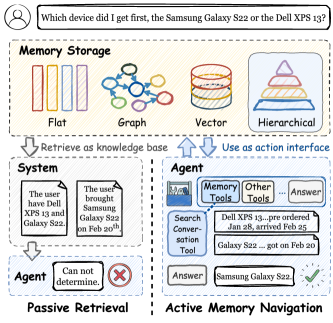
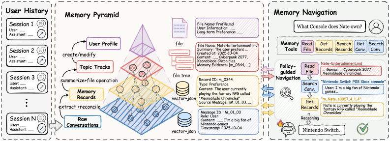
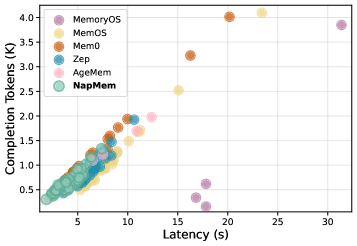
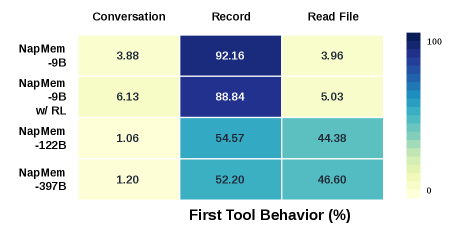

<strong style="font-size:16px;color:#1a6ba0;">要点速览</strong>

- <strong>核心转变</strong>：把长期用户记忆从"被动检索的上下文"重构为"Agent可主动导航的结构化动作空间"  
- <strong>NapMem</strong>：将用户历史建成多粒度记忆金字塔（原始对话→记忆记录→主题轨迹→用户画像），用五个记忆工具暴露各层级，再用GRPO强化学习训练Agent按需选取  
- <strong>关键结果</strong>：9B模型经RL训练后，在三个记忆密集型基准平均62.74分，超过未经训练的397B变体（59.85）；非记忆任务能力基本保留  
- <strong>额外收益</strong>：存储比多数基线更省，推理延迟更低，RL把不必要的记忆调用从34.51%压到6.90%

---

## 被动检索的瓶颈

现有用户记忆系统大多把记忆访问做成一个系统级检索函数或预设计管线：底层把不同存储结构压缩成"预选上下文"塞给模型。一旦检索到的上下文不完整，Agent几乎没有能力再去查证额外证据。

NapMem的反向思路是：长期用户记忆不应是被动喂给模型的上下文，而应是Agent能主动使用的动作空间。模型自己决定要不要查记忆、查哪个抽象层级、拿到的证据够不够。

图1：被动检索只给Agent部分证据；NapMem把记忆暴露成动作接口，让Agent在回答前主动搜证

## 框架：多粒度记忆金字塔

NapMem为每个用户按时间顺序构建独立的记忆金字塔，自底向上增量式生长。四层对同一段用户历史提供不同抽象度，相邻层通过溯源链接相连，使Agent能在推理时在细粒度对话证据和摘要式画像间移动。

- **原始对话**：最高保真证据层，消息级条目，可精确回查
- **记忆记录**：把对话转成紧凑记录，分事实、事件、指令、偏好四类，经增量提取+混合检索调和去冗余
- **主题轨迹**：把相关记录聚合成跨会话演进的用户中心叙事，保留指向记录的链接
- **用户画像**：顶层全局摘要，归纳稳定属性与长期偏好

低层变化（扩展/取代/冲突）满足条件时向上传播，让画像与主题始终反映最新证据。

## 用工具把记忆变成可导航的接口

NapMem通过五个工具暴露金字塔各层，把"用记忆"变成在金字塔上的顺序决策过程：每一步Agent要么调用一个记忆工具，要么终止导航直接回答。

五个工具：`get_conversations`、`search_conversations`、`get_records`、`search_records`、`read_files`。搜索工具用混合检索返回候选对话片段或记录；get类用持久标识精确取数；文件读取工具检视主题轨迹与用户画像。支持自上而下（从画像下沉到原始对话核验）和自下而上两种导航。

图2：NapMem总览。Agent通过记忆工具主动导航多粒度记忆金字塔，依据中间证据选取抽象层级并精炼动作

## 用GRPO学会"怎么用记忆"

记忆使用策略用GRPO（Group Relative Policy Optimization）优化。训练样本是"记忆密集型查询+对应记忆金字塔"，Agent在最大工具调用预算下作答。每条轨迹只给一个终末奖励，使工具调用决策和最终回答生成都对着同一个任务级结果优化。

奖励是三项二元准则的加和：格式合法、回答正确、调用了记忆工具（因训练样本本身依赖记忆，工具使用被视为期望行为）。超出工具预算或无法产出合法回答的轨迹判为无效。轨迹级优势均匀施加到所有输出token，包括指定记忆工具调用的那些，于是终末奖励同时优化了回答质量和前序的导航行为。

## 实验要点

在六个基准上评估，三个记忆密集型（PersonaMem-v2、LongMemEval、LoCoMo）+ 三个非记忆（GPQA-Diamond推理、BFCL-v3函数调用、V*Bench视觉工具使用）。基模统一Qwen3.5-9B，NapMem默认在此之上做RL训练。

**记忆任务（核心）**：NapMem-9B w/ RL平均62.74分，超过未训练的NapMem-397B（59.85）。在LongMemEval和PersonaMem-v2拿到全场最佳，LoCoMo拿到最佳F1且L-J接近最强。9B训练模型跨不同记忆需求（事实回忆、跨会话推理、隐式偏好理解）均有竞争力。

**非记忆任务不退化**：在GPQA-D和V*Bench上较基模还有提升，BFCL-v3持平。关键看不必要的记忆调用：RL把GPQA-D上的记忆调用率从34.51%降到6.90%，在BFCL-v3和V*Bench上保持零调用。说明RL校准的是"该不该用记忆"，不是简单堆调用。

**存储更省**：NapMem总存储4.83 GiB，远低于Mem0（10.44）、MemOS（23.10）、Zep（14.10）等，仅AgeMem（2.99）更小但任务表现差一大截。

**推理更快**：平均延迟和平均完成token近似线性关系，生成长度是成本主因。NapMem做定向导航，证据够就停，因而完成更短、延迟更低。

图3：100个样本上的延迟与完成token统计，NapMem完成更短、延迟更低

**消融**（四个变体）：去掉RL（48.39）、去掉主动导航改被动检索（54.08）、只开放记录类工具（44.93）、去掉主题与画像高层（54.11），均低于完整版62.74。三者都有贡献，其中主动导航和高层抽象尤其关键。

**工具行为**：更大变体更常以读文件起步（从宽画像/主题入手），9B变体多从记录级工具起步（局部证据）。RL让模型用更少工具调用拿到更高准确率，证据命中率从20.66%升到34.92%，且多级导航率基本不变，说明效率增益来自更精准的检索而非塌缩到单层级。

图4：各NapMem变体的首步记忆工具行为分布

## 结语

NapMem的核心判断是：长期记忆的价值不只在"存得好"，更在"用得对"。把记忆组织成结构化金字塔、再把使用方式变成可学习的策略，让9B模型在记忆任务上压过大得多的未训练变体，同时不伤通用能力。

这类工作的真正难点在推理时：Agent要在"查够没有"和"别查过头"之间自己拿捏。NapMem用RL把这种拿捏变成可优化目标，而不是写死的检索管线。

存储与延迟的双重优势说明，主动导航不是加开销，而是用更少的证据换取更准的回答。这对长期运行的个人助理尤为关键，因为用户历史只会越积越多。

<strong style="font-size:15px;color:#8b6f4c;">结语</strong>

NapMem把"记忆使用"从系统级检索函数提升为Agent决策过程里显式、可学习的一环，方向比具体架构更值得关注。  
9B训练模型超过未训练397B变体，说明记忆导航策略的学习收益可以抵消参数量的差距，小模型+好策略有现实部署价值。  
RL把不必要记忆调用压到6.90%且非记忆任务不退化，证明"主动导航"不等于"更多访问"，而是更精准的取舍。

---

【传送门】 
<a class="normal_text_link mp_article_text_link" href="https://mp.weixin.qq.com/s/OoHu1yeuh1gzgCfEiPvDuQ" target="_blank" data-linktype="2">RL的下一个大突破：不是优化可验证问题而是把'不可验证'领域变</a> 
<a class="normal_text_link mp_article_text_link" href="https://mp.weixin.qq.com/s/s0Ovn3_tnbbl9jxfAC3WLg" target="_blank" data-linktype="2">阿里Sparse Attention on CXL替代RDMA做KV Cache解耦 推理2.1×吞吐, 9.7×TTFT</a> 
<a class="normal_text_link mp_article_text_link" href="https://mp.weixin.qq.com/s/HnGKVp45C-GApBJ-LleP6g" target="_blank" data-linktype="2">小米MiMo罗福莉:8卡GPU让1T参数模型跑出1000 TPS , FP4+DFlash+TileRT全解</a> 
<a class="normal_text_link mp_article_text_link" href="https://mp.weixin.qq.com/s/3btXHAVd8_x5CM5CWETc2g" target="_blank" data-linktype="2">Agent卷向AI Infra: SGLang团队用硬核Agent优化框架和CUDA Kernal性能</a> 
<a class="normal_text_link mp_article_text_link" href="https://mp.weixin.qq.com/s/FTsibdpbEjvoPWtxGqgxkQ" target="_blank" data-linktype="2">小米MiMo罗福莉后训练新范式MOPD: 多教师同策略蒸馏，多领域无损</a> 
<a class="normal_text_link mp_article_text_link" href="https://mp.weixin.qq.com/s/nVqW9acA7NN1zeALDwRAsw" target="_blank" data-linktype="2">Google新论文RubricEM: 评分标准引导的深度研究Agent训练框架</a> 
<a class="normal_text_link mp_article_text_link" href="https://mp.weixin.qq.com/s/2eWh5jZJPHsv0wi9km2nVg" target="_blank" data-linktype="2">NVIDIA TriAttention解读: KV Cache压缩最大的问题不是算法而是两个Infra</a> 
<a class="normal_text_link mp_article_text_link" href="https://mp.weixin.qq.com/s/OqtF6ZaWQNu3o-VAWLfqbg" target="_blank" data-linktype="2">榨干GPU性能：流水线解码消除GPU气泡，推理吞吐提升35%</a> 
<a class="normal_text_link mp_article_text_link" href="https://mp.weixin.qq.com/s/qcIFzXsBalSGpca5fzJKxg" target="_blank" data-linktype="2">Claude Code 动态Workflow Vs. SubAgent Vs. Skill</a> 
<a class="normal_text_link mp_article_text_link" href="https://mp.weixin.qq.com/s/VwQP-AZcHMYksmMLHOy_FQ" target="_blank" data-linktype="2">从 Token 流到 Agent 流：LangChain 全新流式架构深度解读</a> 
<a class="normal_text_link mp_article_text_link" href="https://mp.weixin.qq.com/s/0dQ7pBJ0NmFt-bOwUCQ5ew" target="_blank" data-linktype="2">Torch解析系列二：Dynamo字节码级的计算图捕获</a> 

---

参考：
https://arxiv.org/html/2607.05794v1
