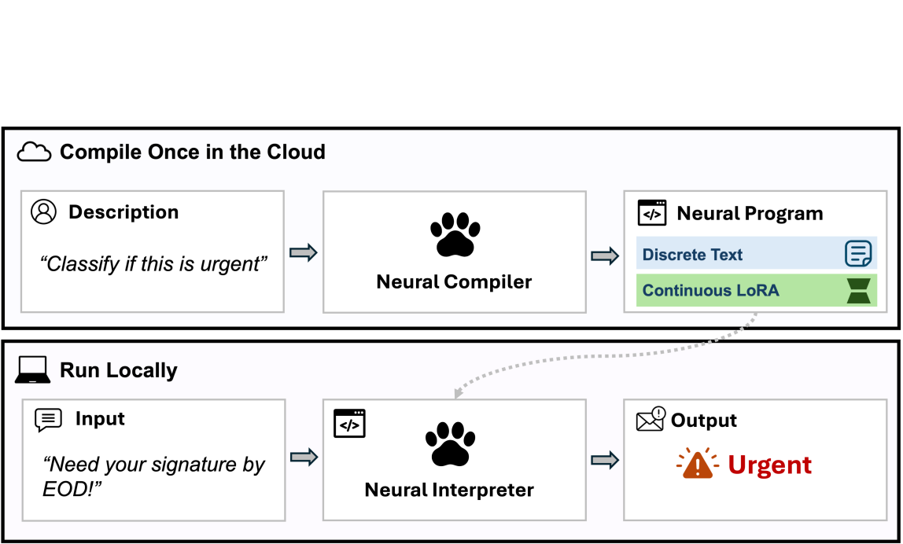
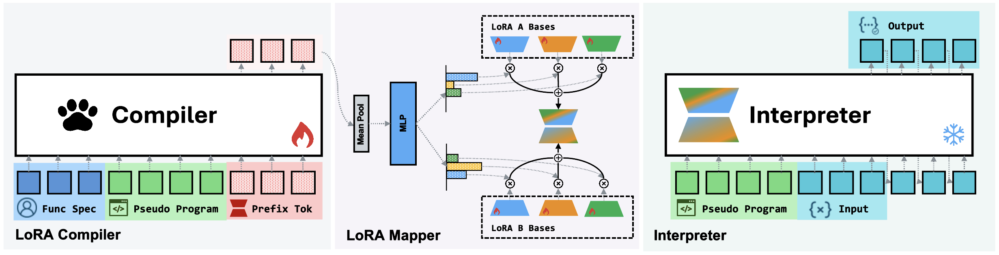
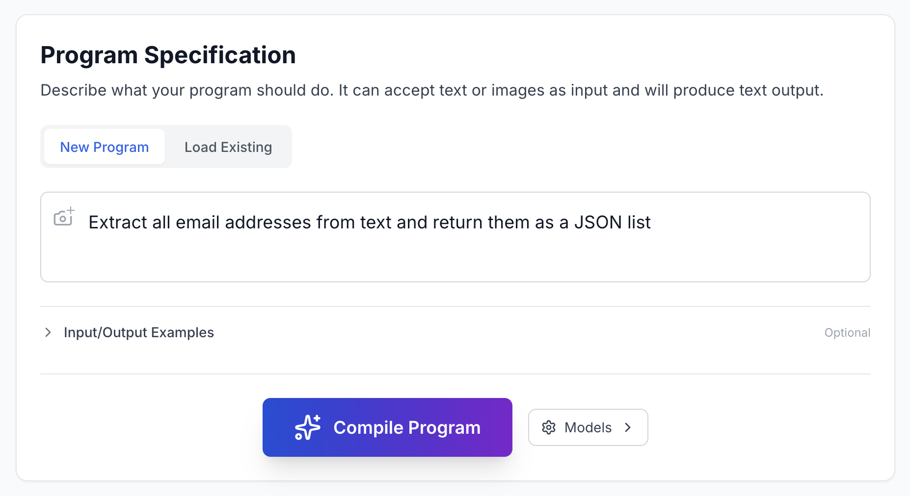
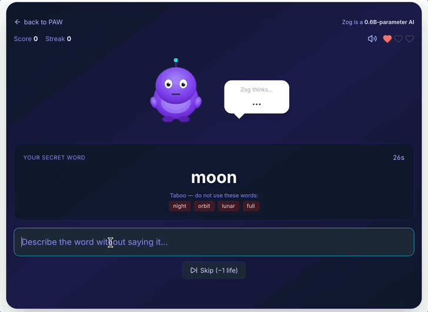

<strong style="font-size:16px;color:#1a6ba0;">要点速览</strong>

- <strong>核心范式PAW</strong>：把「用自然语言描述的函数」编译成一个小型神经二进制（权重文件），之后在本地一个冻结的轻量解释器上反复调用，像调用普通库函数一样离线运行  
- <strong>小模型逆袭</strong>：0.6B参数的解释器执行PAW程序，在FuzzyBench上拿到73.78% 精确匹配，超过了直接提示Qwen3-32B的68.70%，推理内存却只用约五十分之一  
- <strong>一次编译、处处离线</strong>：编译在云端由4B编译器完成，量化后单个程序约23MB，整个系统在MacBook M3上以30 token/s跑，无需每请求调LLM API  
- <strong>自带1000万例数据集</strong>：论文同步发布FuzzyBench，覆盖800多类模糊文本任务，并验证了对噪声规格说明的鲁棒性

---

## 模糊函数：写代码最难受的那类任务

很多日常的编程活儿，你根本没法用干净的规则写清楚。过滤日志、只在重要的那几行告警；修复格式碎掉的JSON；按用户意图给搜索结果排序。这些事今天大多被外包给了LLM API，代码里到处是 `gpt("extract answer", text)` 这种远程调用。

方便是方便，代价也实在：贵、脆弱、不可复现（模型静默更新你就傻了），而且软件再也没法自包含。

问题出在哪？这类任务人类觉得理所当然，却无法被清晰的符号规则完全捕捉。论文把它们叫做**模糊函数（fuzzy function）**：直觉上明确，但写正则、写if-else总会漏掉边界情况，真实输入还带噪声。

PAW的回答是：别让大模型去「每次现算」，而是**先把它编译成一个可以本地反复跑的小工件**。

## Program-as-Weights：编译一次，本地跑

Program-as-Weights（PAW）分三步。开发者用自然语言描述这个函数；一个神经编译器把描述变成一个小型神经二进制；一个冻结的轻量解释器在用户设备上装一次，像运行普通函数一样去跑这个二进制。

图1：PAW范式总览。顶部云端编译一次（「这是否紧急」→ 神经程序），底部本地运行（解释器加载程序处理「请今天EOD前签名！」→ 输出「紧急」）。编译产物是单文件，可缓存、版本控制、离线调用

这里的「程序」不是代码，是**权重**。一个PAW程序就是一个单文件，可以用两行API从Python或JavaScript调用，能被包管理器分发。它和Python模块是同一类东西：有名字、有版本，只是行为编码在权重里而非源码里。编译器干活，解释器是固定运行时，类比传统软件栈里的CPU或字节码解释器。

## 一个程序有「两半」

PAW程序是离散和连续两部分的混合。

离散那一半是一段自然语言的**伪程序**：对用户规格说明的重述，带上几个输入-输出例子。它负责把原始需求说清楚，顺带屏蔽掉规格里的错别字和歧义。

连续那一半是一个 **PEFT模块**（参数高效适配器），由编译器从自己的隐藏状态生成，注入到冻结的解释器里，提供文本单独给不了的行为级控制。在前驱系统里这部分是前缀微调的KV缓存，现在的系统是LoRA。

## 流水线：伪编译器 + LoRA编译器

整条编译线跑两个4B的Qwen3模型。

第一个是**伪编译器**，现成模型，从不训练：你给它一段小模板提示，它把用户规格重写成一个干净的伪程序（转述 + 几个例子）。

第二个是**LoRA编译器**，这才是论文真正训练的部分：读规格和伪程序，一次前向传播，吐出LoRA权重。具体做法是把隐藏状态在深度对齐的层和前缀位置上做均值池化，过一个浅层MLP，投影成共享基上的混合系数，拼出每个目标模块的LoRA。每个模糊函数大约向解释器注入3850万个LoRA参数。

图2：Text-to-LoRA实例化。左：训练的LoRA编译器读规格 + 伪程序 + 学习前缀token，发射隐藏状态H；中：LoRA映射器池化H、投影成混合系数、组合出LoRA矩阵；右：冻结解释器加载伪程序并热插拔LoRA，自回归生成输出

论文对比了两种PEFT形式：前缀微调（KV缓存）在受控算力下拿到50.4%，LoRA在秩64时拿到65.7%，而无编译器的提示基线只有9.8%。**LoRA明显更强**，后续实验都基于它。

## 数字会说话：0.6B干翻32B

在FuzzyBench（论文自带的1000万例测试集）上，主结果相当扎眼：

| 方法 | 解释器大小 | FuzzyBench 精确匹配 |
|------|-----------|---------------------|
| 直接提示 Qwen3-32B | 32B | 68.70% |
| 直接提示 Qwen3-0.6B | 0.6B | 9.84% |
| **PAW（Qwen3 0.6B）** | 0.6B | **73.78%** |
| gpt-5.2（API 上限） | 无 | 96.09% |

**一个0.6B的本地解释器，跑PAW程序，比直接提示32B还高5个点**，而推理内存约1.2GB（bf16）对32B的约60GB，差了大约50倍。而且在Yelp、IMDB等下游任务上，PAW也普遍优于同等体量的本地模型。

消融实验进一步说明增益来自「编译器」本身，不是数据或基础模型：同样的数据、同样的0.6B基础、同样的训练预算，只是去掉编译器做全微调或固定LoRA，PAW比全微调高15.4个点、比最强固定LoRA高21.7个点。

有意思的是，连只有五分之一参数、没有指令微调的GPT-2 124M，塞进编译器生成的LoRA后也能到54%，说明这套机制真的能把任务适配「编码」进很小很弱的基础模型。

## 不换解释器，还能「看」图

这个抽象最漂亮的一点：换模态不用动解释器。

把纯文本的Qwen3-4B编译器换成同家族的视觉-语言编译器Qwen3-VL-4B，解释器还是那个Qwen3 0.6B，LoRA映射器也复用。图像条件完全编码在VL编译器发射的PEFT模块里，小文本解释器从头到尾没见过像素。结果在三个图表理解任务（电路、化学、乐谱）上，0.6B的PAW全胜过参数量更大的VLM基线。

## 鲁棒性：脏规格说明也不怕

开发者写的规格说明天然带噪声：错别字、歧义、语法问题。PAW在重度噪声下准确率只掉了大概3.7%，远没崩。

论文的假设是：鲁棒性来自那一半离散伪程序。4B编译器在小型解释器看到之前，先把噪声规格「翻译」成干净重述。为验证，作者训练了一个绕过伪程序、直接把原始规格喂给解释器的变体。干净输入下两者只差1.6个点，但在重度错别字的规格上，差距拉到4.5个点。**编译器其实就是个专职的「去噪器」，把小模型要消化的输入先理顺。**

## 本地跑：MacBook M3上30 token/s

光有benchmark不够，论文还做了开发者接口和端侧部署。一个PAW程序就是个单文件，下载缓存后通过极简Python API调用，首次下载之后全部本地执行，不再有任何外部API调用。

图4：开发者接口。左：编译器把自然语言规格翻译成神经程序；右：解释器加载程序并把它暴露成一个本地可调用函数

量化后几乎不掉点：4-bit基础（约484MB）加Q4_0的LoRA适配器（每个程序约23MB），相对bf16只损失1.3个点；Q6_K基础加Q4_0适配器在噪声内和bf16不可区分。在MacBook M3上，Q5_K_M基础加Q4_0适配器跑到31.6 token/s，冷加载0.48秒。还有一条更小的GPT-2路径能完全在浏览器里通过WebAssembly跑。

## 五个落地场景

论文用五个案例说明这套范式在真实模糊任务上的价值：

事件驱动的日志监控，把Cursor里「傻等终端输出」替换成只在对的行上触发的本地分类器；基于意图的站点导航，给网站加自然语言快查，且每个请求不再调LLM；语义搜索重排序，在已有关键词索引上叠加意图感知的模糊排序；工具调用，一条由10个PAW函数组成的流水线在ToolCall-15上拿到93%；还有多语言猜词游戏Alien-Taboo，每个玩家回合由小型服务器上的0.6B解释器服务、每种语言一个PAW程序，LLM只在编译时调用一次。

图：Alien-Taboo多语言猜词游戏，是PAW的创意生成案例之一，每个语言对应一个本地PAW程序

## FuzzyBench：顺手开源的1000万例数据集

训练PAW式方法的最大障碍，是缺一个「从规格编译模糊函数」的公开数据集。论文用gpt-5.2两阶段生成了FuzzyBench：先生成自然语言规格，再为每个规格生成输入-输出对，跨29个主题版本增量构建，覆盖800多类模糊文本任务（解析、分类、NER、模糊匹配、自然语言命令、智能体工具使用等）。测试集还做了验证过滤，只有两个强模型对输出达成一致才保留，专门剔除本身有歧义的样本。

<strong style="font-size:15px;color:#8b6f4c;">结语</strong>

PAW重新定义了基础模型的角色：它不再是对每个输入临场解题的「求解器」，而是对每个函数一次性造工具的「构建器」。重活儿在编译时做一次，日常运行全在本地，这恰恰是很多开发者想要的小模型未来。  
真正巧妙的是「两半」设计：离散伪程序负责去噪和说清意图，连续LoRA负责精细行为控制，两者分工让0.6B小模型吃下了本属于32B的活儿。这比单纯堆参数或提示工程走得更远。  
数据集和代码全开源，意味着这条路不只属于作者。接下来值得看的是：当编译器能对接更强的底座、PEFT形式继续演进，本地小模型能不能真的吃掉一大块「每请求调API」的场景。

---

【传送门】 
<a class="normal_text_link mp_article_text_link" href="https://mp.weixin.qq.com/s/f05wnBex0ECquqLadXgwAg" target="_blank" data-linktype="2">Agent自进化/持续学习的三个层次：Model、Harness、Context</a> 
<a class="normal_text_link mp_article_text_link" href="https://mp.weixin.qq.com/s/4kvRgpNrlnGJMBy8BtCDNw" target="_blank" data-linktype="2">从API到Agent：Anthropic发布Claude Managed Agents，Agent...</a> 
<a class="normal_text_link mp_article_text_link" href="https://mp.weixin.qq.com/s/NsdT63TplKvPOWDg15N3IQ" target="_blank" data-linktype="2">Anthropic教你怎么在Claude Code中设计并使用Loop工程</a> 
<a class="normal_text_link mp_article_text_link" href="https://mp.weixin.qq.com/s/i6aZ8u3HSCNv7o1G8Lr6wQ" target="_blank" data-linktype="2">Miles：PyTorch原生的大规模RL后训练框架</a> 
<a class="normal_text_link mp_article_text_link" href="https://mp.weixin.qq.com/s/mqTab0qwrT95DVrxTllmcQ" target="_blank" data-linktype="2">Torch解析系列一：深入理解FX Graphs</a> 
<a class="normal_text_link mp_article_text_link" href="https://mp.weixin.qq.com/s/_4vgKCTSir14mhtdvs7_HA" target="_blank" data-linktype="2">美团开源LongCat-2.0 (OpenRouter原Owl Alpha)解读：1.6T参数，...</a> 
<a class="normal_text_link mp_article_text_link" href="https://mp.weixin.qq.com/s/VZRcpl6vL7riJp77ZmtSIg" target="_blank" data-linktype="2">Hermes vs OpenClaw创始人隔空互怼：假星标，抄袭，死亡威胁各种瓜</a> 
<a class="normal_text_link mp_article_text_link" href="https://mp.weixin.qq.com/s/4Iz5SjE4D240EL4MmKrWZQ" target="_blank" data-linktype="2">OpenAI Dreaming记忆系统：从记住你到理解你</a> 

---

参考：https://arxiv.org/html/2607.02512v1
