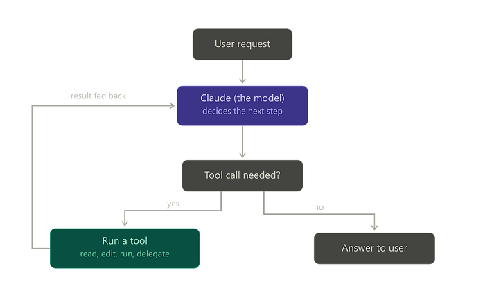
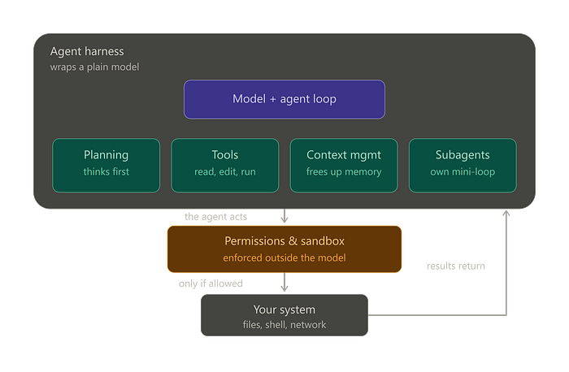

**用 LangChain 复刻 Claude Code：Agent Harness 才是真正的魔法**

---

**要点速览**

<div style="background:#e8f4fd;padding:14px 16px 10px 16px;border-radius:6px;margin-bottom:18px;">
<div style="text-align:center;margin-bottom:10px;">
<strong style="font-size:16px;color:#1a6ba0;">要点速览</strong>
</div>
<div style="font-size:14px;color:#3f3f3f;line-height:1.75;">
- <strong>Agent 循环</strong>：模型决定下一步 → 调用工具 → 反馈结果 → 继续循环，直到模型返回纯文本，循环结束。这是所有 Agent 的通用引擎<br><br>
- <strong>工具层</strong>：专用工具（read_file、edit_file、execute）比原始 shell 命令更安全、更省 token，且权限管控更精细<br><br>
- <strong>规划与上下文管理</strong>：Agent 在执行前先写 to-do list，避免在复杂任务中迷失；通过文件外存 + 自动压缩突破 context window 限制<br><br>
- <strong>安全边界</strong>：权限规则在模型之外执行，提示词不是安全边界。Human-in-the-loop 审批 + 沙箱隔离是真正的安全保障
</div>
</div>

---

如果你用过 Claude Code，可能会觉得："哇，这个模型写代码太聪明了。"

但这个认知其实是错的。一个编程 Agent 不只是一个更聪明的聊天机器人。**Claude Code 的魔力不在于模型本身，而在于包裹在它外面的那层 Agentic Harness。**

**Harness 就是控制平面——一个看不见的系统，给模型提供读文件的工具、运行代码的环境、记住上下文的记忆，以及保持方向感的检查清单。** 没有 Harness，语言模型只是一个文本生成器。有了 Harness，它才变成一个能干的、自主的软件工程师。

**这篇文章要打开这个黑盒。我们会逐层拆解 Claude Code 幕后的工作机制，然后用 LangChain 的 deepagents 库把每一块重新搭建出来。读完你不仅知道编程 Agent 怎么工作，更知道怎么亲手造一个。**

**Agent 的整体架构**

在深入细节之前，先看一张系统全景图：



整个引擎就是这个循环，而一切的起点是你。从一个用户问题或请求开始——可能是"这个文件夹里有哪些文件？"这种快速问题，也可能是"重构登录系统并更新测试"这种大工程——模型先读取这条消息，然后决定下一步。接下来二选一：如果模型需要行动，它就调用一个工具，结果返回后继续循环——无论任务需要一步还是五十步，都是同一个循环。当模型回复纯文本而不是工具调用时，循环退出，你得到答案。**那个退出条件（"没有工具调用"）就是 Agent 知道自己完成的方式。**

"决定下一步"这个框实际上融合了研究中的三个阶段：模型在不断收集上下文（读文件）、采取行动（编辑、运行命令）、验证结果（跑测试），全部流经同一个循环。**它们之间没有独立的"模式"——只是不同的工具调用而已。**

不过有一个刻意设计的换挡值得提出来：**Plan 模式在循环前面加了一道门——你让 Agent 先调研并提出方案但不做任何改动，所以它读文件、思考，但暂缓编辑和命令直到你批准。** 然后正常的循环接管并执行。对于大型或高风险任务来说，这是一个安全阀。这不同于自动 to-do list（Agent 在每个任务上都会给自己写一个）；Plan 模式是用户触发的暂停，需要你明确批准。

这张图还省略了围绕循环的其他机制——上下文压缩（记忆满了的时候）、子 Agent（运行自己的私有循环）、以及从"运行工具"到实际系统之间的权限/沙箱层。**这些不改变循环本身，而是包裹它——真正让 Agent 从玩具变成产品的，正是这些看不见的工程细节。**



Harness 内部的四个组件是让循环从"不稳定"变成"可靠"的能力。**规划让 Agent 在行动前先思考，工具给它双手，上下文管理防止它在长任务中被自己的记忆淹没，子 Agent 让它可以派生出独立的小任务在自己的私有循环中运行，主对话保持干净。** 这些都不改变循环——它们喂养循环。

现在是最重要的部分：底层。当 Agent 决定在真实世界中做点什么——编辑文件、运行 shell 命令、访问网络——这个操作不会直接发到你的机器上。**它必须先通过权限和沙箱层——这是整个系统中最关键的安全理念。**

**一个常见的陷阱是：以为在指令里写"请不要删除重要文件"就能保证 Agent 安全。那不是一堵墙——那是一张便利贴，模型可以忽略、误读、或被说服绕过。真正的安全存在于这一层，在模型之外，权限规则可以直接阻止工具调用，沙箱可以在操作系统层面阻止危险命令，无论模型多想执行它。**

理论够了。开始搭建。

**Part 0：从零开始的循环——没有框架，没有魔法**

在接触任何库之前，先看裸引擎。这是一个完整可用的 Agent 循环：

```python
def run_agent_loop(client, user_message, tools, tool_functions, max_turns=20):
    messages = [{"role": "user", "content": user_message}]
    for _ in range(max_turns):
        response = client.messages.create(
            model="claude-sonnet-4-6", max_tokens=1024, tools=tools, messages=messages
        )
        messages = [*messages, {"role": "assistant", "content": response.content}]
        tool_uses = [b for b in response.content if b.type == "tool_use"]
        if not tool_uses:
            return "".join(b.text for b in response.content if b.type == "text")
        results = [
            {"type": "tool_result", "tool_use_id": call.id,
             "content": tool_functions[call.name](**call.input)}
            for call in tool_uses
        ]
        messages = [*messages, {"role": "user", "content": results}]
    raise RuntimeError(f"agent loop did not finish within {max_turns} turns")
```

就这么简单。大约三十行代码，这篇文章后面的每一个概念都是**这个循环加上了电池**：更好的工具插进 `tool_functions`，一个规划器给自己写笔记放进 `messages`，一个压缩器在 `messages` 膨胀时缩小它，子 Agent 就是同一个函数用全新的 `messages` 列表递归调用，以及权限检查插入在模型请求工具和实际调用工具之间。**`max_turns` 这个兜底机制是每个真实 Harness 都不会少的偏执——模型无限循环就等于无限烧钱。**

**Part 1：循环——驱动一切的引擎**

每个编程 Agent 都有一个跳动的心脏，叫做 Agent 循环。**它是把"说话"变成"做事"的周期，简单得令人尴尬：**

1. 问模型下一步做什么。
2. 模型要么回复普通文本，要么请求使用工具。
3. 如果它请求了工具，系统运行该工具并把结果交还给模型。
4. 从步骤 1 重复。
5. 当模型回复纯文本且没有工具请求时，任务完成。停止并向用户展示答案。

**这就是整个引擎。读文件、运行命令、编辑代码——每一个操作都流经这个完全相同的循环。**

**把它想象成一个承包商：** 你交给他们一个任务和一份检查清单。他们看看下一步是什么，做完它，检查结果，然后决定下一步做什么。只有在清单上没有任何事情可做时，他们才会回来跟你说话。Agent 循环就是那个承包商的大脑。

一个值得欣赏的优雅细节是：**这个循环自然地伸缩以适应任务——一个快速问题可能只需要一轮，一个庞大的请求可能链式调用几十个工具调用跨越多轮，没有人需要硬编码一个任务需要多少步。**

**用 Deep Agents 构建**

**好消息是：你不需要自己写这个 while 循环。当你创建一个 Deep Agent 时，你会免费得到一个完整可用的循环。**

首先，安装库和模型提供者：

```bash
pip install deepagents langchain-anthropic
```

然后，创建最简单的 Agent：

```python
from deepagents import create_deep_agent

def get_weather(city: str) -> str:
    """Get the weather for a given city."""
    return f"It's always sunny in {city}!"

agent = create_deep_agent(
    model="anthropic:claude-sonnet-4-6",
    tools=[get_weather],
    system_prompt="You are a helpful assistant.",
)

result = agent.invoke(
    {"messages": [{"role": "user", "content": "What's the weather in San Francisco?"}]}
)
```

这个 `create_deep_agent` 调用返回一个立即可用的 Agent，循环已经接好。当你调用 `.invoke()` 时，它运行的就是我们刚才描述的循环。**Harness 不关心你插入了哪个模型——OpenAI、Google 还是 Anthropic——循环始终如一。**

**Part 2：工具——给 Agent 双手**

如果循环是引擎，工具就是双手。没有工具的模型只能说话。有好工具的模型可以读你的代码库、修改它、并检查自己的工作。真正的编程工具分为四类：

**读取工具**——查看但不做任何改动：
- `read_file` 打开文件
- `glob` 按名称模式查找文件（如所有 `.py` 结尾的文件）
- `grep` 在文件内部搜索特定文本
- （一个常见的初学者困惑：**glob 按名称找文件；grep 按内容找文件**）

**编辑工具**——安全地修改：`write_file` 用于新文件，`edit_file` 用于修改已有文件的一部分。

**执行工具**——运行 shell 命令，和你在终端里敲的一样。

**委托工具**——`task`，把子任务交给一个辅助 Agent。

**为什么不让模型直接运行任何命令？**

Agent 难道不能用 `cat` 读取、用 `sed` 编辑吗？可以，但专用工具好得多，原因有二：

- **Token 预算：** 一个专用读取工具可以在把文件内容塞进内存之前测量文件大小并裁剪。原始 `cat` 会一股脑全部灌入，可能撑爆 context window。
- **更清晰的权限：** 当 Agent 使用已知的 `edit_file` 工具时，Harness 确切知道正在发生什么，可以应用安全规则。而自由形式的 shell 命令是一个危险的黑盒。

**有一个有趣的实际问题：模型从公开互联网上学习，上面满是使用 `cat` 和 `sed` 的 Stack Overflow 答案。所以即使是高级模型也会习惯性地去拿原始 shell 命令。你的 system prompt 必须坚定地提醒它使用真正的工具，而不是 shell 快捷键。**

**用 Deep Agents 构建**

**Deep Agents 内置了全套工具——规划、文件系统工具、执行和委托。** 你可以在上面用装饰器函数添加自定义工具：

```python
import subprocess
from langchain_core.tools import tool

MAX_OUTPUT_CHARS = 20_000  # 大约 5k tokens

@tool
def run_tests(path: str = ".") -> str:
    """Run the project's pytest suite and return its output.
    Output is truncated to the last 20k characters (failures appear at the
    end). The run is killed after 5 minutes.
    """
    try:
        result = subprocess.run(["pytest", path], capture_output=True,
                                text=True, check=False, timeout=300)
    except subprocess.TimeoutExpired:
        return "pytest timed out after 300s"
    output = result.stdout + result.stderr
    if len(output) > MAX_OUTPUT_CHARS:
        return ("[... output truncated to the last 20,000 characters ...]\n"
                + output[-MAX_OUTPUT_CHARS:])
    return output

agent = create_deep_agent(
    model="anthropic:claude-sonnet-4-6",
    tools=[run_tests],  # 与内置工具合并
    system_prompt="You are a coding assistant. Always run tests after editing.",
)
```

`@tool` 装饰器把一个普通函数变成模型可以调用的东西。**那个 docstring 至关重要——模型把它当作说明书来读，知道何时以及如何使用这个工具。**

**Part 3：规划——先想再做**

**把一个复杂请求丢给裸模型，它往往会乱来——做一个工具调用，再做另一个，没有整体规划，有时还会原地打转。一个好的编程 Agent 通过先规划来避免这个问题。**

**在碰任何代码之前，Agent 会写一个结构化的 to-do list。它把任务分解成清晰的步骤，然后逐一执行，边做边标记"进行中"和"已完成"。**

**把它想象成一个厨师：** 一个好厨师在开火之前会先读完整个菜谱。他们不会在第三步正在锅里烧着的时候才去想第四步怎么做。

**这背后藏着一个巧妙的工程技巧。** 在长会话中，模型会丢失原始目标，因为它的指令被一页页的工具输出埋没了。为了解决这个问题，Harness 在每次工具调用后悄悄地把当前的 to-do list 重新注入回对话中。**就像同事轻轻地把检查清单滑回你面前，让你不会忘记重点。**

**用 Deep Agents 构建**

这个功能叫做 `write_todos` 工具，在 Deep Agents 中是内置的。你不需要配置任何东西——默认的 system prompt 会自动教会 Agent 在行动前先规划，并在整个循环中保持 to-do list 的更新。

**Part 4：上下文管理——突破记忆限制**

**这是最硬的工程所在。每个模型都有一个 context window——短期记忆的硬上限。读几个大文件、运行一些命令，很快就填满了。一旦溢出，Agent 就会忘记事情，包括你最初的指令。**

编程 Agent 用双管齐下的策略来解决这个问题：

1. **文件作为外部记忆：** 与其把巨大的搜索结果塞进对话，Agent 把它保存到文件里，只记住文件名。如果之后需要细节，它再读文件。
2. **压缩：** 当对话危险地接近填满窗口时，Harness 自动暂停循环。它总结对话中较早的部分，把重要事实存进长期存储，然后清理膨胀的短期记忆。

**把它想象成研究一份庞大的报告：** 你不会试图把所有书都记在脑子里。你做笔记，把书归档，只在桌上留一页摘要。

**用 Deep Agents 构建**

两部分都是内置的。Deep Agents 自带一个虚拟文件系统来卸载大型结果，以及自动摘要中间件。**你创建 Agent 的那一刻就免费获得了这个记忆管理能力。**

**Part 5：子 Agent——分而治之**

**有些任务太大，一个对话装不下。搜索一个庞大的代码库可能需要读五十个文件——你不想让五十个文件堵住主 Agent 干净的记忆。**

**解决方案是子 Agent。主 Agent 创建一个帮手，交给它一个高度具体的任务，帮手在自己的独立空白上下文窗口中完成工作，然后返回一个简洁的摘要。**

**把它想象成一个经理：** 经理把调研任务委托给一个初级员工。初级员工读一叠文件，回来给出一段摘要。经理的桌面保持整洁。

**安全护栏：** 子 Agent 严格禁止再创建自己的子 Agent。如果它们能，一个混乱的 Agent 可能创建无限嵌套的帮手，产生一个失控的进程烧光你的 API 预算。**严格的深度限制保证了委托的安全。**

**用 Deep Agents 构建**

Deep Agents 有一个内置的 `task` 工具用于创建帮手。你可以通过简单的字典来描述专门的帮手——比如一个专门的代码搜索器：

```python
code_searcher = {
    "name": "code-searcher",
    "description": "Searches the codebase to find where specific logic lives. "
                   "Use this for any open-ended 'where is X?' question.",
    "system_prompt": "You are an expert at navigating codebases. Use the grep "
                     "and glob tools to locate relevant files, then report a "
                     "concise summary of what you found and where. Do not make "
                     "any edits.",
}

agent = create_deep_agent(
    model="anthropic:claude-sonnet-4-6",
    tools=[run_tests],
    system_prompt="You are a coding assistant.",
    subagents=[code_searcher],
)
```

主 Agent 现在知道自己有一个可用的专家，保持自己的记忆纯净，专注于实际的编码工作。

**Part 6：安全与 Human-in-the-loop——刹车**

我们现在已经构建了一个可以在你的机器上编辑文件和运行 shell 命令的 Agent。停下来想想这意味着什么。一个过于积极的 Agent 可能删除错误的文件或运行极具破坏性的东西。**没有刹车的权力是巨大的责任。**

编程 Agent 通过两层来增加控制：

1. **白名单和拒绝规则：** 安全的工具（读文件）自动运行。破坏性工具（删除文件）需要审批。
2. **审批提示（Human-in-the-loop）：** 对于高风险操作，Agent 暂停并询问你。你批准、编辑或拒绝该操作，然后循环继续。

**Agent 安全的第一金律：提示词不是安全边界。**

告诉模型"请不要删除重要文件"是一个礼貌的建议，不是一堵墙。模型可能产生幻觉并完全绕过它。**真正的安全在模型之外、在 Harness 内部执行。** 权限规则可以直接阻止工具调用。沙箱可以在操作系统层面阻止危险的 shell 命令，无论模型多想执行它。这就是为什么执行工具需要一个真正的后端。**礼貌地请求不是安全。**

**用 Deep Agents 构建**

Deep Agents 在 Harness 中强制执行限制。它需要后端来提供 shell 访问，并使用 LangGraph 的原生中断功能在危险操作前暂停：

```python
from deepagents import create_deep_agent
from deepagents.backends import LocalShellBackend

agent = create_deep_agent(
    model="anthropic:claude-sonnet-4-6",
    system_prompt="You are a coding assistant working inside this project.",
    backend=LocalShellBackend(),
)

# 当请求受限工具时，循环中断，结果包含 __interrupt__ 负载
# 描述待定操作和你可做的决定（approve, edit, reject, respond）
# 然后恢复：
from langgraph.types import Command
result = agent.invoke({"messages": [...]}, config)
result["__interrupt__"]
agent.invoke(Command(resume={"decisions": [{"type": "approve"}]}), config)
```

**始终在 Harness 中配置你的真实限制，永远不要只在提示词里写。**

**Part 7：记忆与持久化——跨会话记住**

**默认情况下，Agent 在对话结束的瞬间忘记一切。但一个真正的助手应该记住你项目的编码规范、你的偏好、以及它昨天在做什么。**

**两个能力处理这个问题：**

- **Checkpointing：** 保存 Agent 的精确状态，使长任务能在中断后存活，并从中断处继续。
- **长期记忆：** 存储跨完全独立对话持续存在的事实（例如，"这个项目使用 4 空格缩进"）。

**用 Deep Agents 构建**

因为 Deep Agents 运行在 LangGraph 上，你只需要插入一个 checkpointer 就能获得持久化：

```python
from deepagents import create_deep_agent
from langgraph.checkpoint.memory import InMemorySaver

agent = create_deep_agent(
    model="anthropic:claude-sonnet-4-6",
    tools=[run_tests],
    system_prompt="You are a coding assistant.",
    checkpointer=InMemorySaver(),
)

config = {"configurable": {"thread_id": "project-alpha"}}
agent.invoke(
    {"messages": [{"role": "user", "content": "Start refactoring the auth module."}]},
    config=config,
)
agent.invoke(
    {"messages": [{"role": "user", "content": "Now update the tests too."}]},
    config=config,
)
```

`InMemorySaver` 在程序生命周期内有效。对于需要跨重启的真正持久化，你只需换成数据库支持的 checkpointer。

**整合起来**

让我们把所有七个部分组装成一个 Agent：循环、自定义工具、规划、上下文管理、子 Agent、shell 访问和持久化。

```python
from deepagents import create_deep_agent
from deepagents.backends import LocalShellBackend
from langchain_core.tools import tool
from langgraph.checkpoint.memory import InMemorySaver

@tool
def run_tests(path: str = ".") -> str:
    """Run the project's pytest suite and return its (truncated) output."""
    import subprocess
    try:
        result = subprocess.run(["pytest", path], capture_output=True,
                                text=True, check=False, timeout=300)
    except subprocess.TimeoutExpired:
        return "pytest timed out after 300s"
    output = result.stdout + result.stderr
    return output if len(output) <= 20_000 else "[... truncated ...]\n" + output[-20_000:]

code_searcher = {
    "name": "code-searcher",
    "description": "Finds where specific logic lives in the codebase. "
                   "Use for open-ended 'where is X?' questions.",
    "system_prompt": "You navigate codebases using grep and glob, then report a "
                     "concise summary of what you found. You never make edits.",
}

SYSTEM_PROMPT = """You are a careful coding assistant.
Workflow:
1. Plan the task as a to-do list before doing anything.
2. Use your built-in read, grep, and glob tools to explore - never the raw shell
   equivalents like cat or grep.
3. Make focused edits.
4. ALWAYS run the tests after editing, and fix anything that breaks.
5. Delegate broad codebase searches to the code-searcher subagent.
"""

agent = create_deep_agent(
    model="anthropic:claude-sonnet-4-6",
    tools=[run_tests],
    system_prompt=SYSTEM_PROMPT,
    subagents=[code_searcher],
    backend=LocalShellBackend(root_dir=".", virtual_mode=False),
    interrupt_on={"execute": True, "write_file": True, "edit_file": True},
    checkpointer=InMemorySaver(),
)

config = {"configurable": {"thread_id": "my-project"}}
result = agent.invoke(
    {"messages": [{"role": "user", "content": "The login tests are failing. Fix them."}]},
    config=config,
)
print(result["messages"][-1].content)
```

**不到一百行代码，你就拥有了一个能规划、探索、编辑、跑测试、委托给帮手、尊重沙箱、并记住上下文的编程 Agent。这和 Claude Code 的解剖结构完全一样。**

**诚实的部分：什么容易，什么难**

**如果以"这就是全部了"结尾，那就太误导人了。以下是诚实的工程现实。**

**Harness 免费给你的（大约 80%）：** 循环、工具套件、规划、上下文管理、委托、持久化和流式。几年前，从零搭建这是一个巨大的项目。今天，它只是一个库调用。

**仍然在你身上的（那 20% 的硬功夫）：**

- **System prompt：** 这决定了 Agent 的可靠性。教会它何时使用哪个工具、如何从错误中恢复，需要认真、迭代的调优。
- **沙箱：** 安全的 shell 执行是没得商量的。设置正确的操作系统级隔离需要深入细致的功夫。
- **合适的工具：** Agent 的好坏取决于它的工具。如果你的代码搜索器或测试运行器不稳定，你的 Agent 也会不稳定。

**需要记住的限制：**

- **它要花钱：** 规划、子 Agent 和循环意味着大量的 API 调用。复杂任务会产生实际成本。
- **它受限于模型：** 世界上最好的 Harness 也无法让一个弱语言模型推理得好。
- **它可能失败：** Agent 会误解指令，做出糟糕的编辑。刹车之所以存在，正是因为错误是现实。
- **它可能是杀鸡用牛刀：** 对于快速问题，标准聊天机器人更快更便宜。只有在任务确实需要时才启动 Agent。

**总结**

最大的收获就是我们开头说的那个：**魔力从来就不只是模型本身。**

**一个能干的编程 Agent 就是一个普通语言模型包裹在一个强大的 Harness 里面——一个把"说话"变成"行动"的循环，给它双手的工具，让它保持专注的规划，突破记忆限制的上下文管理，分而治之的子 Agent，保证安全的刹车，以及让它持久化的记忆。**

一旦你看清了这些零件，黑盒就打开了。有了像 Deep Agents 这样的库，你可以在一个下午把它们全部组装起来。**真正理解 Claude Code 如何工作的最好方式，就是亲手搭建一个缩小版，然后看着它运行。**

---

<div style="background:#f5f0eb;padding:14px 16px 10px 16px;border-radius:6px;margin-bottom:16px;">
<div style="text-align:center;margin-bottom:8px;">
<strong style="font-size:15px;color:#8b6f4c;">结语</strong>
</div>
<div style="font-size:14px;color:#3f3f3f;line-height:1.75;">
这篇文章最大的价值在于拆解了"Agent 不是更聪明的聊天机器人"这个认知——Harness 才是真正的魔法所在。这个框架帮助开发者把注意力从"哪个模型更强"转移到"如何设计更好的工具和循环"上，是一个更健康的思考方向。<br><br>
LangChain Deep Agents 让构建 Agent 的门槛从"几个月"降到了"一个下午"，但那 20% 的硬功夫——system prompt 的迭代调优、沙箱的 OS 级隔离、工具质量的打磨——仍然是决定 Agent 能否从"玩具"变成"工具"的关键分水岭。<br><br>
本文用 LangChain 的库来"复现 Claude Code"，本身就是一种精巧的 thought leadership——既展示了 deepagents 的产品能力，又在读者心中建立了"LangChain = Agent 基础设施"的心智锚点。类比是否完全成立，取决于你的 Agent 是否真的需要 LangGraph 的图编排能力。
</div>
</div>

---

<span style="font-size:12px;color:#888888;">参考：Build Your Own Claude Code Using Langchin: A Deepdive Into LangChain's Deep Agents<br>https://pub.towardsai.net/build-your-own-claude-code-using-langchin-a-deepdive-into-langchains-deep-agents-9ef98d98a69a</span>
