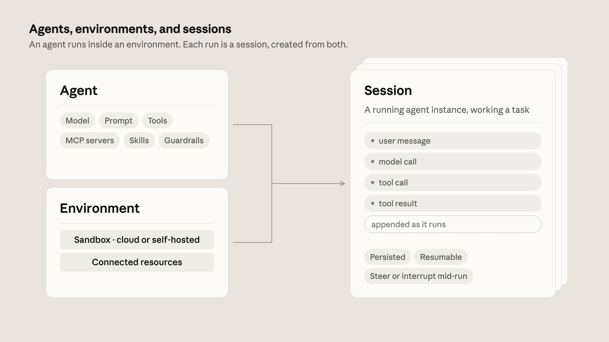
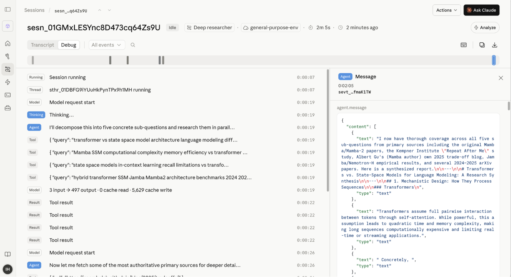
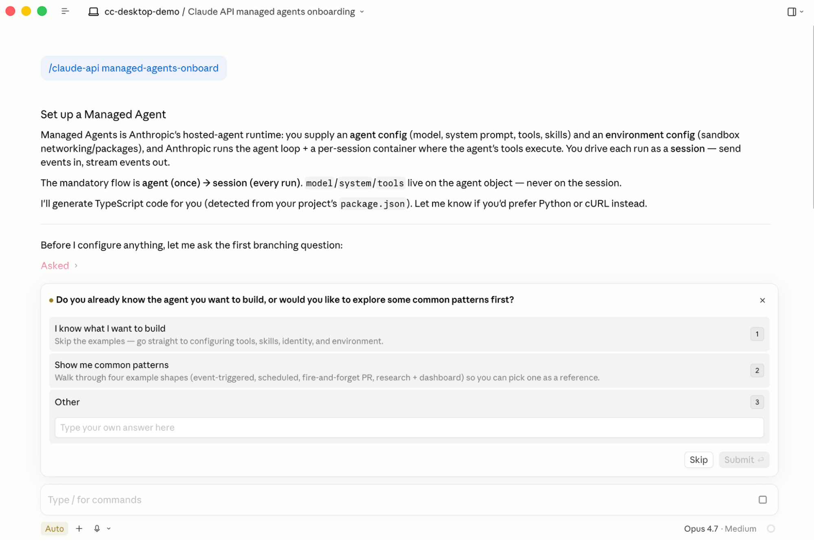

<strong style="font-size:16px;color:#1a6ba0;">要点速览</strong>

- <strong>Brain-Hands 解耦架构</strong>：Claude Managed Agents 将推理（Brain）与执行（Hands）分离到不同容器，Claude 可在沙箱启动前就开始推理，凭证永远不进入执行环境。  
- <strong>Harness 维护是隐性成本</strong>：模型行为随版本变化（如 Sonnet 4.5 的"上下文焦虑"在 Opus 4.5 消失），自建 Harness 需要持续调优，而 Managed Agents 的 Harness 随模型同步进化。  
- <strong>事件驱动会话</strong>：每次模型调用、工具调用、结果都追加到独立日志中，会话可暂停、恢复、回溯，空闲时自动 checkpoint。  
- <strong>首 Token 延迟降低 60%</strong>：Brain 与 Hands 解耦后，Claude 立即开始推理，容器并行启动；纯推理会话完全跳过容器，p50 延迟降 60%，p95 降 90% 以上。

---

**Agent 从原型到生产，最大的瓶颈从来不是模型能力，而是基础设施。** 安全、状态管理、权限控制、Harness 调优——这些"脏活"消耗了团队大量开发周期，却没有直接提升产品的差异化价值。

---

**1. Agent 架构的进化**

2023 年 Claude API 刚开放时，设计极其简单：tokens in, tokens out。你发一个 prompt，Claude 返回一个 completion，应用自己决定下一步。**对于单轮任务——总结文档、分类工单、改写文本——这完全够用。**

但用户想交给 Claude 的任务很快超出了单轮范畴：让 Claude 从头到尾完成一个任务，查资料、执行操作、观察结果、决定下一步。**而且要在真实的系统里操作——代码库、内部 Wiki、工单系统。**

用原始 API 构建 Agent 意味着自己写循环：问模型做什么 → 跑工具 → 喂结果 → 重复。**你还要负责构建和部署 Agent 脚手架，而随着模型进化，这些脚手架可能需要不断调优。** 对于需要完全定制化的 Agent，这条路有意义；但对于更可预测、复杂度较低的 Agentic 工作负载，维护 Harness 变得越来越繁琐。

2025 年 Anthropic 推出了 Claude Code——让 Claude 直接与代码库交互的 Agentic 编程工具。**它内置了完整的 Harness：循环、工具执行、子 Agent、上下文管理，以及让它成为高效 Agent 的丰富能力。** 开发者自然希望在自己的领域也能使用类似的 Harness 机制。

于是 Anthropic 发布了 **Claude Agent SDK**，将 Claude Code 的 Harness 暴露给开发者。**对很多团队来说，这是 Agent 变得实用的转折点：Harness 已经为 Claude 调优好，基础设施原语就位，而且随着 Claude Code 的改进持续优化。**

但即使有了 Harness，在生产环境中部署 Agent 仍然面临多个挑战：

- **托管与扩展**：Agent 在哪里运行？多小时任务能存活多久？用量增长时如何扩展？
- **会话管理**：Agent 的历史和进度存在哪里？中断后能否无阻碍地恢复？能否回溯检查之前的会话？
- **文件系统管理**：Agent 需要一个工作区来产生 artifact，这个工作区在运行之间如何处理？
- **执行隔离**：Claude 写的代码要在某处执行。出错时的爆炸半径有多大？什么样的边界在生产中才可信？
- **凭证管理**：Agent 需要访问你的系统。如何在不向生成的代码暴露敏感信息的前提下授予访问权限？
- **可观测性**：Agent 自主工作一小时，做了出人意料的事，你能重建它的每一步吗？

**这些挑战的根源在于一个常见的架构选择：Agent Harness 与文件系统运行在同一个容器中。** Agent SDK 通过 Claude Code 的机制提供了部分生产基础设施：Agent 获得真实的文件系统，会话状态持久化到本地或外部存储，可观测性通过 OpenTelemetry 导出到已有监控栈。

然而，随着团队构建的 Agent 从本地开发走向生产，他们需要一种能规模化部署且带有托管基础设施的方式。**而随着模型和 Harness 越来越先进——运行更久、执行更多代码、触及更多系统、采取更多行动——扩展、安全和沙箱化变得越来越具挑战性。**

**这些障碍的根源在于一个常见的架构选择：Agent Harness 通常与文件系统运行在同一个容器中。** 容器必须在 Claude 思考之前启动（付出启动成本），Agent 和代码执行紧挨着你的凭证，容器一死，运行就跟着结束。

**Managed Agents 通过将 Brain 与 Hands 解耦解决了这些问题。** 调用 Claude 的 Harness 与执行代码的沙箱分离运行，会话——每次模型调用、工具调用和结果的追加日志——连接两者。Claude 可以在任何容器存在之前就开始推理，沙箱远离你的凭证，整个运行过程可以随时从会话重建。

---

**2. 何时以及为何使用 Claude Managed Agents**

使用 Managed Agents 时，用户定义任务、工具和护栏，Anthropic 在基础设施上运行 Agent，**处理底层的 Agentic 循环：如何给 Agent 提供执行环境来调用工具，失败时如何恢复，多 Agent 编排等。**

**当 Harness 不与模型智能同步进化时，Agent 就会出问题。** 在 Claude Sonnet 4.5 上，Agent 会在接近上下文末尾时匆忙结束，而不是利用剩余空间——一种称为"上下文焦虑"的模式。Anthropic 的修复方案是在 Harness 中添加上下文重置，假设 Claude 在接近限制时需要帮助保持连贯性。但这个假设在下一个模型上就不成立了。在 Claude Opus 4.5 上，这种行为消失了，之前添加的重置只是额外开销。

**对大多数组织来说，维护 Harness 是不产生差异化价值的开销。** Harness 需要针对特定模型行为调优；压缩、工具执行和缓存等原语在 Claude 上的工作方式与其他模型不同。使用 Claude Managed Agents，Harness 随模型同步进化，让团队专注于真正能产生差异化的东西：**上下文管理和领域专长。**

Managed Agents 围绕三个核心资源构建：**Agent、Environment 和 Session。**

- **Agent**：一个配置——模型、prompt、工具集和护栏
- **Environment**：Agent 运行的执行上下文——沙箱容器、网络规则、预装包，托管在 Anthropic 云或你自己的基础设施上
- **Session**：每次运行将 Agent 与 Environment 配对，获得独立的沙箱实例。会话持久化完整的事件历史、沙箱状态和输出，因此长时间运行的工作可以暂停、干净地恢复，并在事后逐步追溯

你可以定义一次 Agent 和 Environment，然后随着工作负载增长，**对同一配置运行多次会话。**

---

**3. 在生产环境中构建和扩展**

**3.1 凭证不进入沙箱**

当一切运行在同一个容器中时，Claude 生成的代码紧挨着你的凭证——prompt 注入可能诱使模型读取自己的环境来泄露 token。**解耦架构可以实现更安全的方案：将凭证完全隔离在沙箱之外。**

用于 MCP、CLI 和 GitHub 仓库等工具的 token 存放在独立的 Vault 中，代理按需获取并解密。**Managed Agents 的 Vault 开箱即用地处理凭证，你不需要运行自己的密钥存储、不需要在每次调用时传输 token、也不会丢失 Agent 代表哪个终端用户行动的追踪。** Vault 凭证在存储前使用信封加密保护，检索需要签名请求 token 进行验证。

**3.2 消除沙箱开销，降低延迟**

没有 Managed Agents 架构时，每次会话都必须启动容器——即使 Agent 只需要思考、从不运行工具。**启动时间是浪费的，用户感受到的是首次响应前的延迟。**

有了 Managed Agents，Claude 立即开始推理，同时环境并行启动；从不运行工具的会话完全跳过容器。用户看到第一个 token 无需等待容器启动，环境在 Agent 需要运行工具时已经就绪。**测试显示，这在中位数情况下将首 token 时间降低了约 60%（p50），在最慢情况下降低了 90% 以上（p95）。**

**3.3 可靠、持久的会话**

Managed Agents 以**事件而非请求/响应来思考**。会话是一个持续的事件流：每次模型调用、工具调用和结果都追加到独立于 Agent 进程的日志中。

有了这种架构，Agent 工作时你可以实时获取事件流更新，之后可以恢复任何会话——**无需管理数据库或保存点。** 历史记录在交互之间保留，除非你删除会话。会话空闲时，其容器会被 checkpoint，以便从暂停处干净地恢复。

**因为整个运行过程已经是事件记录，可观测性和记忆随之而来。** Claude Developer Console 提供原生的可视化时间轴视图，可以深入检查任何 transcript。Managed Agents 还内置了 Memory 和 Dreaming 功能。**Dreaming 是一个定时进程，它审查 Agent 会话和记忆存储，提取模式，整理记忆，让 Agent 随时间改进。** Dreaming 在会话之间精炼记忆，通过读取持久的会话日志，从重复错误和用户偏好中学习。

**3.4 灵活的部署选项**

默认情况下，Managed Agents 将编排和工具执行委托给 Anthropic 管理的云容器，**托管和扩展简单直接。**

但由于 Brain 与 Hands 解耦，Hands 可以放在任何地方——包括你的 VPC 内部。**Anthropic 提供自托管沙箱，让 Agent 的代码、文件系统和网络出口永远不离开你的环境。** MCP 隧道则让你将 Claude 连接到运行在私有网络内的 MCP 服务器。自托管沙箱控制"Agent 的代码在哪里执行"，MCP 隧道控制"Anthropic 如何到达你网络中的 MCP 服务器"——**两者结合，你可以精确控制什么留在你的边界内。**

其他功能还包括：让 Agent 按照评分标准自我评估的 outcomes、多 Agent 编排、权限策略和 webhook。

---

**4. 客户实践**

各行业的客户已经在用 Claude Managed Agents 在生产中部署 Agent：

- **Notion** 在 Managed Agents 上运行 Custom Agents：团队直接从任务板分配工作给 Claude，Claude 提取每个任务相关的文档、会议纪要和连接数据，完成的代码、演示文稿和网站直接回到工作区供审阅。**数十个任务并行运行，一个早期原型将大约 12 小时的工作缩短到 20 分钟。**
- **Rakuten** 用 Managed Agents 在产品、销售、市场和财务领域部署了专家 Agent，每个约在一周内上线。
- **Sentry** 将其 Seer 调试 Agent 与一个 Claude Agent 配对，由后者编写补丁并提交 PR，**单个工程师在数周而非数月内完成构建。**
- **Asana** 构建了能拾取项目内任务的 AI Teammates，**Atlassian** 则将开发 Agent 放入了 Jira 工作流。

---

**5. 快速上手**

Anthropic 设计了最简单的上手路径：通过 Claude Code 和 Claude Developer Console（platform.claude.com）即可快速启动 Agent。**Console 的快速入门允许你从 Agent 模板开始，或用自然语言描述想要的 Agent，然后转化为可安全部署的生产级 Agent——只需几分钟。**

在 Claude Code 中，`/claude-api` skill 默认提供，包含构建 Claude Managed Agents 应用的详细参考材料。**运行 `/claude-api managed-agents-onboard` 即可通过交互式引导从头设置一个新的 Managed Agent。**

---

**6. 未来**

随着团队分享他们用 Managed Agents 构建的成果，Anthropic 看到：**过去花在生产基础设施上的时间，现在被用于真正差异化 Agent 的东西——管理上下文和为用户定制体验。** 当新模型发布时，你只需更新 Agent 使用它，重新运行评估，然后推送改进——完全不需要触碰底层架构。

---

<strong style="font-size:15px;color:#8b6f4c;">结语</strong>

Brain-Hands 解耦是一个被低估的架构决策。它不仅是安全改进——并行启动带来的延迟收益、纯推理会话跳过容器的成本节省、以及事件日志带来的天然可观测性，都是副产品。但最根本的洞察是：<strong>当推理和执行不再共享生命周期，Agent 基础设施就从"单体应用"变成了"分布式系统"，每一层都可以独立演进。</strong>  
Harness 随模型同步进化是 Anthropic 的差异化卖点，但也是一种锁定。自建 Harness 的团队确实面临"上下文焦虑"这类模型特定行为的调优负担，但换来的是模型供应商的切换自由。对大多数非 AI 原生的企业来说，这个取舍是清晰的——用 Anthropic 的 Harness 换取开发速度。  
值得注意的一点是：Managed Agents 的 Vault + 自托管沙箱 + MCP 隧道三层架构，实际上定义了一个清晰的信任边界模型——凭证层、执行层、网络层各自独立。这种分层思路比"一个容器里放所有东西"的架构更适合企业安全合规需求，可能是这篇博客最有长期价值的贡献。

---
参考：https://claude.com/blog/building-with-claude-managed-agents