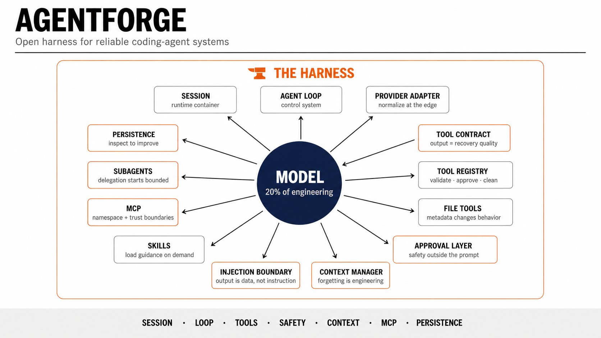
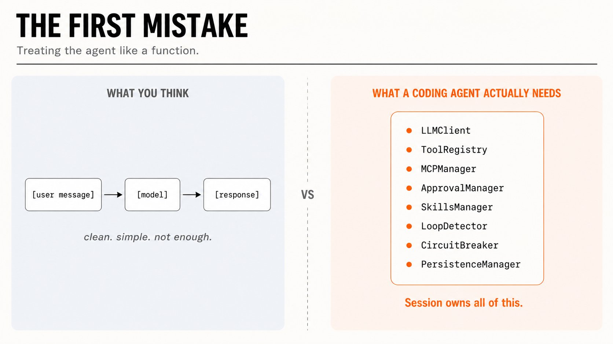
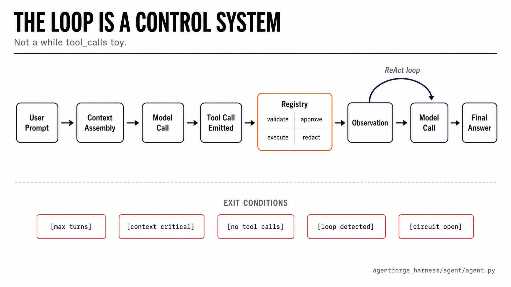
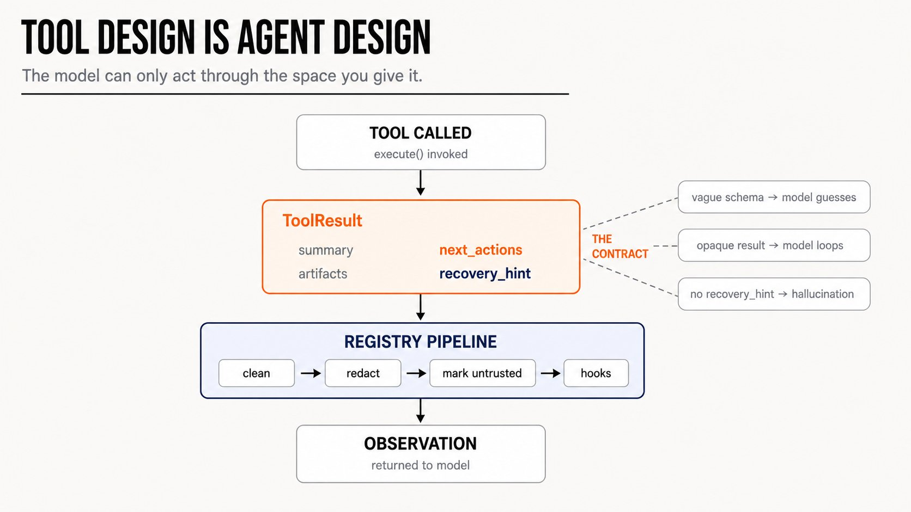
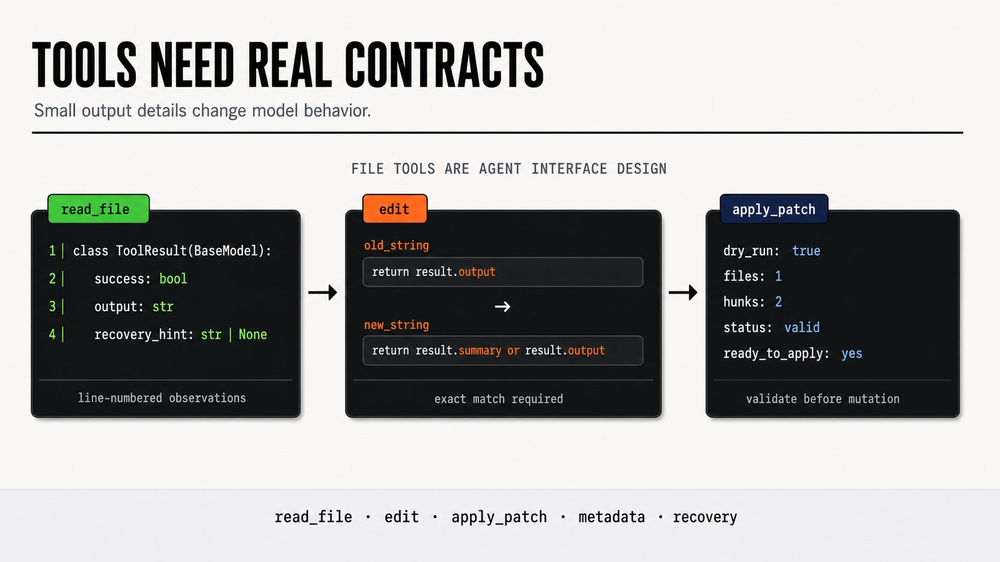
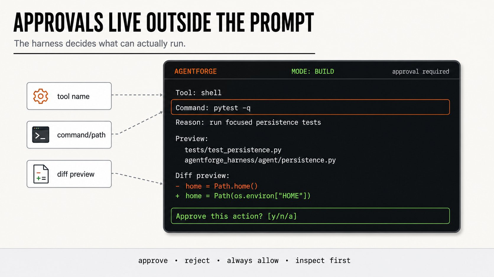
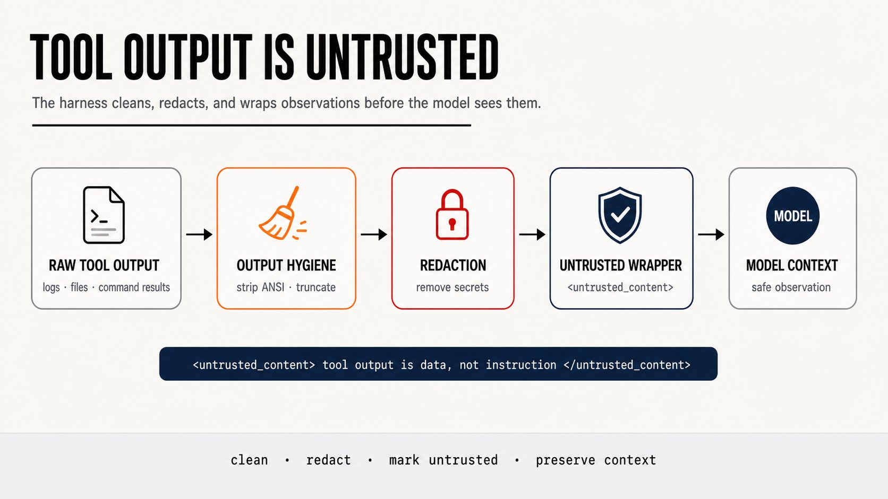

我从零构建了一个 Agentic Harness，它教会了我 Agent 到底是什么

每个人都在用 Agent 做东西。但几乎没人谈论 Agent 里面到底有什么——不是模型，是包裹模型的 Harness。

Mohit Goyal 花了几个月用 Python 从零构建了一个 Agentic Harness，没用什么框架捷径。流式 Agent 循环、类型化的工具调用、审批门控、提示词注入边界、上下文压缩、MCP 集成、子 Agent、持久化、以及完整的测试套件。项目叫 **AgentForge**，开源可装，现在正在他的机器上运行。

但这不是一篇产品发布文。这是构建 AgentForge 让他学到的东西——关于 Agent 到底是什么，以及为什么不先自己构建一个 Harness 就直接用框架，会在你的认知里留下危险的盲区。

核心教训来得很快，之后的一切都变了：

> Agent 不是一个模型。Agent 是一个运行时，控制模型如何看、如何行动、如何重试、如何记忆、以及如何停止。

模型大概占工程量的 20%。另外 80% 是包裹它的东西：行动空间、审批策略、观察格式、上下文预算、恢复路径、持久化层。

他全造了一遍。以下是每部分教给他的东西。

---

## 一张表概括整个 Harness



这是他最终构建的东西，以及每部分教会他的：

| 组件 | 文件 | 学到的事 |
|------|------|----------|
| 会话运行时 | agentforge_harness/agent/session.py | 聊天历史不够。Agent 需要一个真正的运行时容器。 |
| Agent 循环 | agentforge_harness/agent/agent.py | 循环是一个控制系统，不是 while tool_calls 玩具。 |
| 提供商适配器 | agentforge_harness/client/llm_client.py | 在边缘层标准化模型提供商。 |
| 工具契约 | agentforge_harness/tools/base.py | 工具输出质量决定恢复质量。 |
| 工具注册表 | agentforge_harness/tools/registry.py | 每个操作都应该经过验证、策略、清理和钩子。 |
| 文件工具 | agentforge_harness/tools/builtin/ | 微小的元数据细节改变模型行为。 |
| 审批层 | agentforge_harness/safety/approval.py | 安全必须在提示词之外实施。 |
| 提示词注入边界 | agentforge_harness/safety/prompt_injection.py | 工具输出是数据，不是指令。 |
| 上下文管理器 | agentforge_harness/context/manager.py | 遗忘是一个工程问题。 |
| 技能 | agentforge_harness/skills/manager.py | 需要时才加载指引，而不是一直加载。 |
| MCP | agentforge_harness/tools/mcp/mcp_manager.py | 外部工具需要命名空间和信任边界。 |
| 子 Agent | agentforge_harness/tools/subagents.py | 委托应从有边界的范围开始。 |
| 持久化 | agentforge_harness/agent/persistence.py | 如果不能检查运行记录，你就无法改进 Agent。 |

这张表才是真正的文章。以下是学到这里面每一行教训的故事。

---

## 会话：Agent 的第一个真实对象不是模型客户端

一个编码 Agent 需要知道它在哪个目录、有什么工具、哪个模型激活、什么审批模式、已经发生了什么、加载了哪些技能、哪些 MCP 服务器连接了、还剩多少上下文、是否在计划模式、是否可以稍后恢复、以及是否有工具/行动循环正在形成。

所以 AgentForge 的第一个真实对象不是模型客户端，是会话。



有意思的不是会话存储了模型客户端——而是它在第一次调用之前就构建了模型的世界：

```
await self.mcp_manager.initialize()
self.mcp_manager.register_tools(self.tool_registry)
self.discovery_manager.discover_all()
self.skills_manager.discover()
self.context_manager = ContextManager(
    config=self.config,
    tools=self.tool_registry.get_tools(mode=self.mode),
    skills=self.skills_manager.list_skills(),
    mode=self.mode,
)
```

这永久改变了他的思维模型。模型不是自己发现世界的。Harness 在第一个 token 生成之前就决定了哪些工具存在、哪些 MCP 工具注册了、哪些技能可见、哪个操作模式塑造上下文。**运行时拥有模型，而不是反过来。**

---

## Agent 循环：控制系统，不是玩具



Chatbot 的简单形状是「用户消息→模型→响应」。这不适用于编码 Agent。

AgentForge 的循环是：

1. 构建系统提示（会话状态、技能、MCP、安全边界）
2. 处理用户输入（代理、审批、生命周期命令）
3. 调用带停止条件的模型
4. 如果工具调用 → 验证参数 → 检查审批 → 执行 → 观察 → 检测循环 → 恢复
5. 如果响应 → 流式输出 → 快照 → 返回

每一步都有停止条件：最大工具调用次数、过长观察、重复工具调用循环、上下文预算阈值。循环有一个提前退出，不是只有「模型决定停止」。

---

## 工具契约：工具输出质量决定恢复质量



所有工具都返回结构化结果，不是字符串。AgentForge 中的基础类：

```python
class ToolResult(BaseModel):
    success: bool
    output: str                      # 人类可读的结果
    metadata: Dict[str, Any]         # 模型使用的结构化数据
    next_actions: List[str]          # 推荐的后续步骤
    recovery_hint: Optional[str]     # 失败时：如何恢复
```

`recovery_hint` 字段是关键。没有它，Agent 失败后只会盲目重试同一个工具——然后用不同的参数再试一次、再一次。有了 `recovery_hint`，模型获得的是上下文指导而非反复猜测。

---

## 安全层：提示词之外的另一道墙

AgentForge 有两个独立的安全组件，都不在模型提示词里。

**审批层**拦截操作而非依赖模型自我约束。写操作在默认情况下被路由到审批队列直到显式批准或超时。

**提示词注入边界**在工具输出和模型之间。当工具返回的数据可能被注入时，AgentForge 不会原样交给模型，而会通过包装器：

```
# 原始工具输出可能包含...（指令改写）
```

这看起来简单，实际上在防止模型被工具返回的数据引导做不该做的事。

---

## 上下文管理器：遗忘是工程问题



Claude 3.5 Sonnet 开始使用后，AgentForge 在最简单的上下文管理做法上就看到了显著的改进：在系统提示中保持一个活跃的「已知文件」列表。

最简单有效的压缩策略被证明是**最后手段**而不是**智能摘要**：当距离上下文限制还有约 3000 token 时，从最旧的消息开始丢弃群组消息（超过 N 轮的对话合并为一行摘要）。结果：8K 的上下文使用率降到了约 5K，问题解决率在边缘情况下略有改善。

关键是：这不需要聪明。到期丢弃。比任何试图理解上下文的方案都可靠。

---

## 工具注册表与钩子

AgentForge 中的每个操作都通过注册表的多层管道：

```
validate → pre_hook → execute → post_hook → log → notify
```

每个工具自带定义的自校验（如 `edit` 工具验证模式匹配是唯一的）、钩子层允许注册在每次文件写入后的 linting 检查或 shell 命令执行后的审核追踪。

---

## MCP 集成：命名空间与信任边界

外部工具通过 MCP 连接，但每个工具在自己的信任边界下：

- MCP 工具在注册表中获得 `mcp_` 前缀以避免命名冲突
- 每个 MCP 服务器有自己的超时和速率限制
- 工具调用失败不会影响主 Agent 循环

---

## 子 Agent：从有边界范围开始

AgentForge 实现了子 Agent 委托，但有明确的范围限制：子 Agent 继承一个受限的工具集和上下文预填，不能进行进一步的委托（防止级联失控）。

他的视图：委托应该从有边界和范围开始。不在第一次调用中就给你子 Agent 所有的权力。

---

## 持久化：如果不能检查运行记录，就无法改进 Agent



AgentForge 中的每个会话都被快照到一个持久的运行记录中。包含：

- 完整的消息历史
- 每次工具调用的输入和输出
- 审批决策
- 注入边界触发的上下文
- 循环终止原因

快照的不仅仅是对话。当你无法重播、检查、或调试一个运行，你就无法系统性地改进它。

---

## 孵化模式：从不安全到受控



AgentForge 有一个 "incubation"（孵化）阶段——一个有限制的、人类监督的操作期，之后 Agent 可以获得更多自主权。模式：

- **受限** — 只读文件 + 只读 shell。只有非交互的审批后写操作。
- **受控** — 写权限但有严格的审查。在每天授权时间内自动审批常规写操作。
- **扩展** — 覆盖写 + 包管理。带日志记录的自动审批。
- **根** — 系统配置变更。总是需要明确的人工确认。

不是所有模型在任何时候都可以访问所有模式。受限模式是所有模式的起始状态。

---

## 测试：278 个通过的测试，没有一个需要模型调用

AgentForge 包含 278 个测试，覆盖率涉及工具契约、工具架构、文件工具行为、补丁验证、shell 工具策略、输出卫生、审批和导出中的脱敏、提示词注入包装器、持久化快照、报告、技能和 MCP 相关行为。

测试集使用一个隔离的家目录运行：

```
HOME=/tmp/agentforge-test-home python3 -m pytest -q
278 passed
```

你可以测试危险命令在执行前是否被拦截。测试密钥在到达模型前是否被剥离。测试编辑在匹配不唯一时是否拒绝。测试计划模式是否从工具列表过滤写工具。测试会话快照是否能够圆整恢复。测试提示词注入包装器是否应用于每个外部观察。

**这些测试没有一个需要真正的模型调用。**

关键是：Agent 可靠性的很大一部分来自与模型智能无关的确定性 Harness 行为。如果你的 Harness 契约是坏的，世界上最聪明的模型也无法补偿。**测试边界，而不是测试文笔。**

---

## 给你的建议：从小的 Harness 开始

不要从构建庞然框架开始。构建一个小 Harness：

- 构建一个模型适配器
- 构建带停止条件的循环
- 构建三个工具：read_file、edit、shell
- 让工具类型化
- 让工具返回结构化的带 summary、next_actions、recovery_hint 的结果
- 在写操作前加入审批
- 在文件读取中加入行号
- 在失败路径中加入恢复提示
- 加入上下文修剪
- 加入一个检查点
- 加入一个技能
- 加入一个 MCP 服务器并命名空间它的工具
- 加入一个测试：工具调用失败时，验证模型收到有用的观察

这个练习教给你的东西会超过另一个抽象解释 Agent 的文章。因为一旦你构建了 Harness，真正的问题就无法回避：

- 应该存在什么操作？
- 模型永远不应该被允许直接做什么？
- 工具运行后模型应该看到什么？
- 在那之前什么应该被脱敏？
- 什么应该被视为不受信任？
- 循环应该在什么时候停止？
- 什么状态必须在崩溃后存活？
- 哪些部分可以在没有模型调用的条件下测试？

这就是 Agent 工程。不仅仅是提示词——是操作空间设计、观察设计、上下文设计、恢复设计、安全设计、运行时设计。

构建 AgentForge 让这一切变得可见。每个认真的 Agent 工程师都应该至少从零构建一个小型 Harness——不是为了上线它，而是为了理解框架在对你隐藏什么。

---

**一点观察**

这篇文章和上一篇 Rahul 的 Harness Engineering 文章在同一天发布，形成了有趣的对照。Rahul 从团队和组织层面阐述 Harness 的五大工件和三大流派，Mohit 从代码层面逐行拆解一个 Harness 的 13 个组件。一个讲"为什么需要 Harness"和"Harness 长什么样"，另一个讲"我怎么把它写出来"。两条线互不覆盖，合在一起才构成完整的理解。

三个值得单拎出来的洞见：

**"遗忘是工程问题"**——当大多数人在追逐更大的上下文窗口时，AgentForge 的做法刚好相反：主动丢弃、到期压缩。这不是因为小窗口更好，而是因为模型对上下文的使用并非均匀分布——开头的内容在第 50 次工具调用后几乎不可用。与其塞更多，不如管理遗忘曲线。

**从不安全到受控的孵化模式（incubation stages）**——不是让 Agent 从一开始就有权限，而是经过受限→受控→扩展→根四个阶段。这在现有的 Agent 框架中几乎看不到。大多数框架默认给 Agent 全部权力，然后在出了问题后靠提示词约束它。AgentForge 把信任当作逐步授予的权限，不是初始状态。

**278 个测试没有一个需要模型调用**——这是 Harness 工程里最反直觉但对实践最有价值的一点：Agent 可靠性中很大一部分是与模型智能无关的确定性行为。测试工具契约、审批策略、输出脱敏、上下文修剪——这些都可以在没有模型的情况下验证。如果只依赖端到端测试（即跑一个完整会话看它会不会犯错），你会发现 bug 的成本高得离谱。

---
<span style="font-size:12px;color:#888888;">参考：I Built an Agentic Harness From Scratch. That Taught Me What Agents Actually Are</span>
