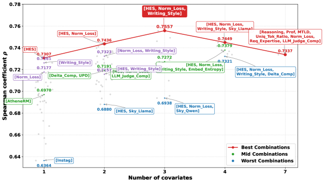
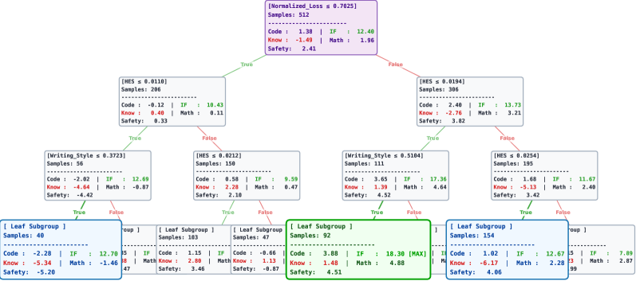

<strong style="font-size:16px;color:#1a6ba0;">要点速览</strong>

- <strong>数据混合=因果推断</strong>：CausalMix将SFT数据混合优化重构为状态条件的因果边际回报估计问题，使用双重机器学习（DML）从历史代理运行中分离混杂影响  
- <strong>跨尺度迁移</strong>：0.5B代理模型上拟合的因果模型可直接外推到7B模型和全新的数据池，无需重新运行代理实验  
- <strong>可解释性工具</strong>：CATE解释器揭示了IF数据是下游对齐的核心驱动力，以及事实知识与逻辑推理之间的"技能冲突"：知识数据在高质量目标上反而产生负效应  
- <strong>LongCoT扩展</strong>：框架成功泛化到长思维链数据（Qwen3-4B），表明因果方法不限于标准SFT场景

---

大模型训练的数据混合长期依赖一个隐含假设：最优混合比例是静态的，一旦从代理实验中确定，就可以在更大的模型和数据规模上复用。RegMix等方法的局限性正在于此：当数据池发生变化时，一切推倒重来。

清华、蚂蚁集团和人大联合团队提出CausalMix，彻底换了一个框架：**不再把数据混合当作一个黑箱超参搜索问题，而是当作因果推断的边际回报估计问题。**

核心思路：将历史代理训练运行视为因果处理，以数据状态（复杂度、难度、质量）为条件，估计"增加某个领域的比例"对下游性能的因果效果。由于学到的是底层的因果动力学而非记忆某个特定数据集的表面模式，CausalMix可以外推到从未见过的数据池和更大规模的模型上。

CausalMix完整pipeline：历史代理运行提供数据状态协变量、混合方案和处理结果，通过正交因果学习估计状态条件的边际数据回报。

## 问题的本质：为什么全局最优混合不存在

现有方法（RegMix、DoReMi等）的核心问题是**将混合优化简化为从混合权重到损失的全局映射**。它们假设存在一个与数据状态无关的最优比例：无论你的数据池是容易的还是困难的，高质量的还是低质量的，最优比例都一样。

这显然不符合经验观察。不同数据池的统计特性差异巨大：难度分布、质量门槛、复杂度层次：这些"数据状态"因素会强烈影响每个领域在训练中的实际效用。一个混合比例在A数据池上最优，在B数据池上可能恰恰相反。

**CausalMix的突破在于把"数据状态"显式纳入模型。** 它不是学习T → Y的映射，而是学习X → (T → Y) 的因果条件关系。具体来说：

- **协变量X**：数据池的统计特征（归一化损失、熵、写作风格评估等30维指标中精选的三个）
- **处理变量T**：以对数形式表示的混合比例向量
- **结果Y**：训练后的下游性能

框架提出的核心问题是：**在当前数据状态下，相对改变某个领域的混合比例，对最终性能的因果边际影响是多少？**

## 双重机器学习：把因果信号从混杂中剥离

要实现上述目标，最大的技术障碍是**混杂偏差**。简单来说，数据状态既影响你选择了什么混合比例（分配机制），也影响训练结果（结果变量）。如果不分离这两个路径，直接回归会得到混合了基准效果和因果效果的估计。

CausalMix采用Double Machine Learning（DML）来解决这个问题。DML构建两套残差：

1. **结果残差**：真实性能减去基于数据状态预测的性能基线
2. **处理残差**：真实混合比例减去基于数据状态预测的"预期"混合比例

然后问一个更干净的问题：**混合比例偏离其状态条件期望的程度，能否解释性能偏离其状态条件基线的程度？** 如果答案是肯定的，说明混合改变的因果效应被成功隔离出来了。

不同协变量组合下的Spearman秩相关系数。三个精选指标（HES、Normalized_Loss、Writing_Style）的组合达到最优，分别对应复杂度、难度和质量。

## 从因果估计到具体策略

估计出边际回报 θ̂(X_tar) 后，CausalMix提供了两种提取最终混合方案的方法：

**CausalMix-A（解析式）**：对因果边际回报应用ReLU激活（负数置零），然后做L1归一化。数学上这等价于在概率单纯形约束下的闭合解：负回报领域比例置零，正回报领域按正比分配。

**CausalMix-S（搜索式）**：枚举一组候选混合方案，用因果模型评分，取得分最高的若干候选在原始混合空间中平均。相当于对高分候选做局部bagging，降低推断噪声。

## 实验结果：从0.5B到7B的无缝迁移

实验设置：512次Qwen2.5-0.5B代理运行，每次10万条数据，覆盖5个领域（编程、指令遵循、数学推理、知识回忆、安全）。然后将学到的策略扩展到800K数据池和Qwen2.5-7B。

**主结果表格**（Table 1）显示，CausalMix在0.5B和7B上均优于Equal、Grid、RegMix、DoReMi、ODM和DMO等基线。更重要的是，在7B的跨规模迁移实验中，CausalMix同时在开发集和未见集上取得了最高分。

更有价值的是LongCoT扩展实验：将CausalMix框架直接应用于Qwen3-4B-Base上的长思维链数据（AM-Thinking-v1-Distilled），同样取得最优性能。这表明因果方法的优势不止于标准SFT。

## CATE解释器：数据混合的因果解剖

也许论文最有意思的部分是CATE解释器分析：用决策树对训练好的因果模型做可视化。

CATE模型树解释器的简化可视化。树结构展示了不同特征子空间下各数据领域的因果边际回报模式。

三个关键发现：

**第一，IF数据（指令遵循）是下游对齐的绝对主力。** 在所有特征子空间上，增加IF比例的边际回报都是稳定的正值。这符合直觉：但因果分析提供了量化证据。

**第二，"技能冲突"的存在。** 知识回忆数据（Knowledge）在高质量目标数据上呈负的边际回报：当数据已经足够复杂（高HES、高Normalized_Loss）时，加入知识数据的比例，反而会降低性能。这实证地支撑了逻辑推理与事实知识注入之间存在竞争关系的猜想。

**第三，数据质量决定了"哪些数据有用"。** 在低质量区域（低Writing_Style、低HES），数学、编程等复杂领域引入分布噪声，降低性能。但在中等质量区域，这些领域产生显著的协同增益：安全数据（Safety）的负效应也被有效抵消了。

---

<strong style="font-size:15px;color:#8b6f4c;">结语</strong>

CausalMix最吸引人的地方不是它比RegMix高了多少分：论文的改进幅度并不惊人。真正有价值的是它提供了一个框架：把数据混合从"多试几次找最优"的经验主义操作，变成了"问一个因果问题"的结构化策略。  
双重机器学习在计量经济学里已经是成熟工具，但把它系统地用于SFT数据混合优化，确实是一个视角转换。这种"因果化"思路一旦打开，可以推广到很多需要从历史实验中学习分配策略的场景：课程学习、持续训练、甚至RLHF的奖励模型设计。  
当然，512次代理运行的成本不低。但关键在于：这套因果模型可以跨数据池重用，不需要在新的数据池上重新跑512次代理实验。这是它和RegMix最本质的区别：RegMix学的是"这个数据池的最佳混合"，CausalMix学的是"如何根据数据状态决定最佳混合"。

---

【传送门】 
<a class="normal_text_link mp_article_text_link" href="https://mp.weixin.qq.com/s/qcIFzXsBalSGpca5fzJKxg" target="_blank" data-linktype="2">Claude Code动态Workflow Vs. SubAgent Vs. Skill</a> 
<a class="normal_text_link mp_article_text_link" href="https://mp.weixin.qq.com/s/aiJs5CC8Gb6qa_xDRNEjTA" target="_blank" data-linktype="2">Dynamic Subagents：用代码编排Agents，告别逐轮工具调用</a> 
<a class="normal_text_link mp_article_text_link" href="https://mp.weixin.qq.com/s/mFuUJ79DRodIK6shVWOgpw" target="_blank" data-linktype="2">OpenAI GPT-5.6: 安全之外新增Prompt Cache断点+两种推理模式; 放弃版本号</a> 
<a class="normal_text_link mp_article_text_link" href="https://mp.weixin.qq.com/s/xP1cEoO_plRpWItxhqeQnQ" target="_blank" data-linktype="2">Agent Harness Engineering：为什么Agent可靠性的天花板不是模型，而是基...</a> 
<a class="normal_text_link mp_article_text_link" href="https://mp.weixin.qq.com/s/o6pnSWW01pahFQelJSbSPA" target="_blank" data-linktype="2">华为「韬定律」全解析：从 τ 常数到4GHz麒麟，一张时间表看清未来十年芯片路线</a> 
<a class="normal_text_link mp_article_text_link" href="https://mp.weixin.qq.com/s/PLNx54PxO1A0oYc47hz99g" target="_blank" data-linktype="2">Anthropic三连：Claude Opus 4.8-更聪明+诚实；CC动态工作流+算力控制</a> 
<a class="normal_text_link mp_article_text_link" href="https://mp.weixin.qq.com/s/Pdjz39WG9SS6IpWWAJ6pPw" target="_blank" data-linktype="2">Claude Opus 4.8击败Opus 4.7、GPT-5.5和Gemini 3.1 Pro</a> 
<a class="normal_text_link mp_article_text_link" href="https://mp.weixin.qq.com/s/oDZJbvskv_ocNgPUH1DHVA" target="_blank" data-linktype="2">AI暗输出：为何AI价值在GDP统计中失效了</a> 

---

参考：https://arxiv.org/abs/2607.01104
