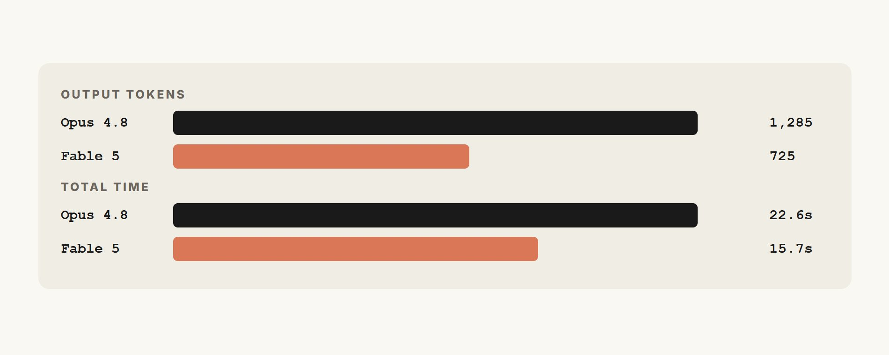
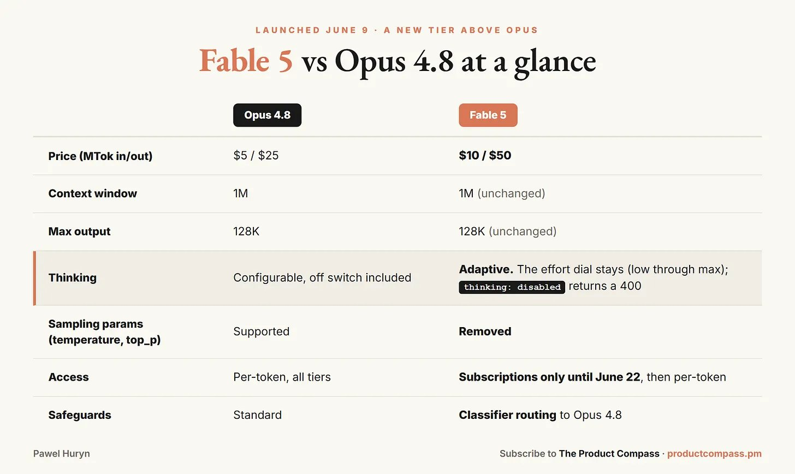
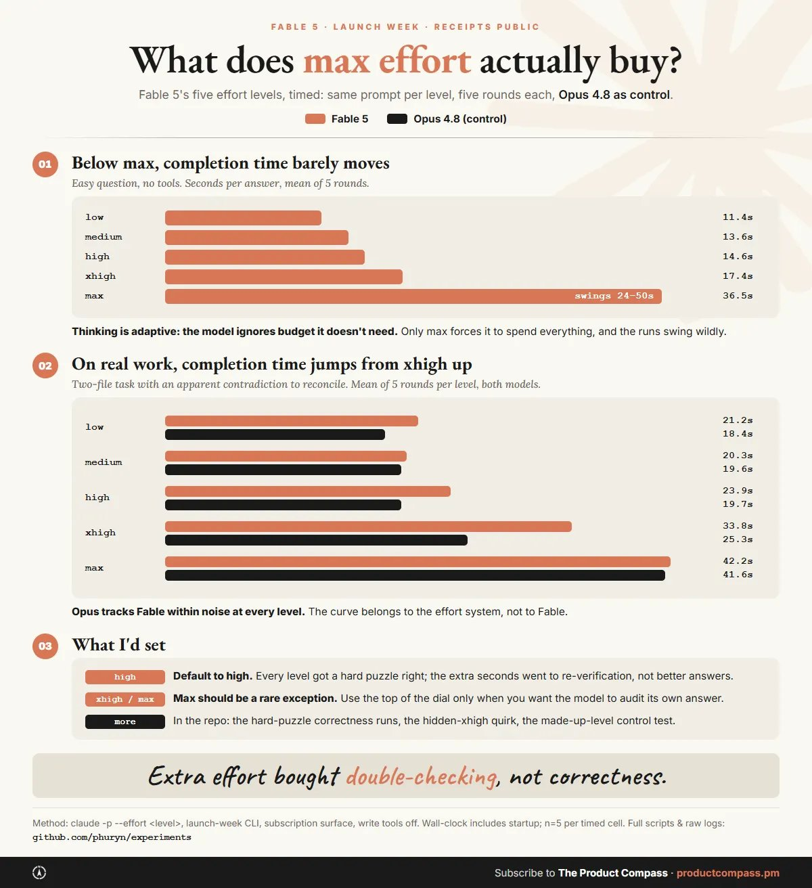
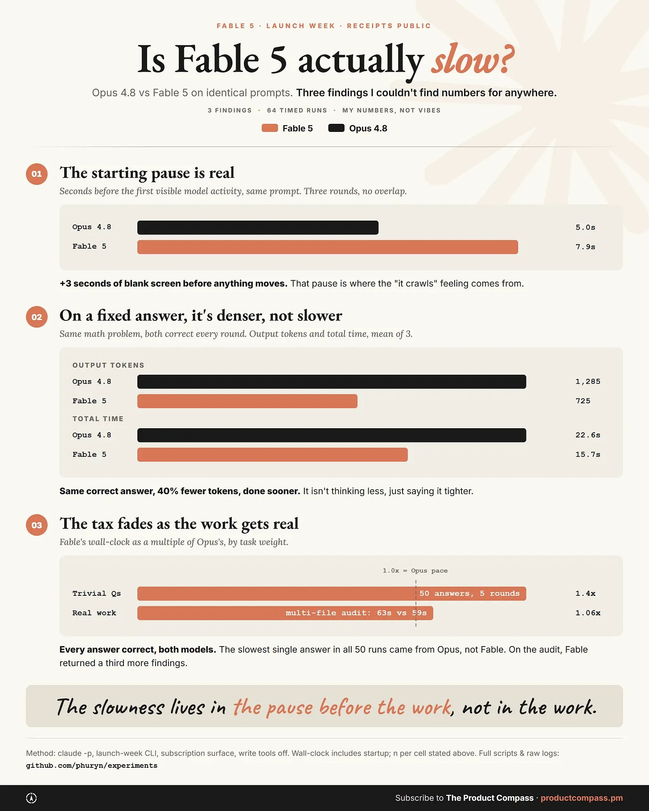
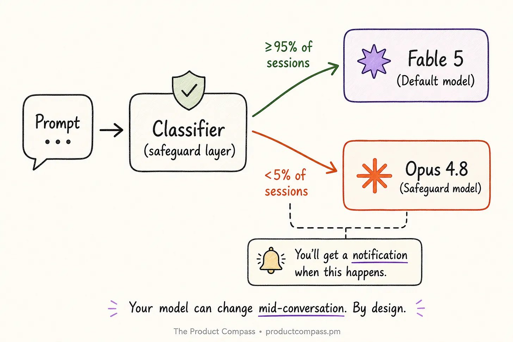
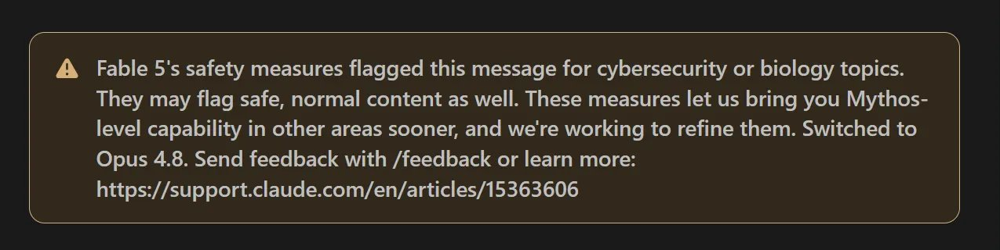
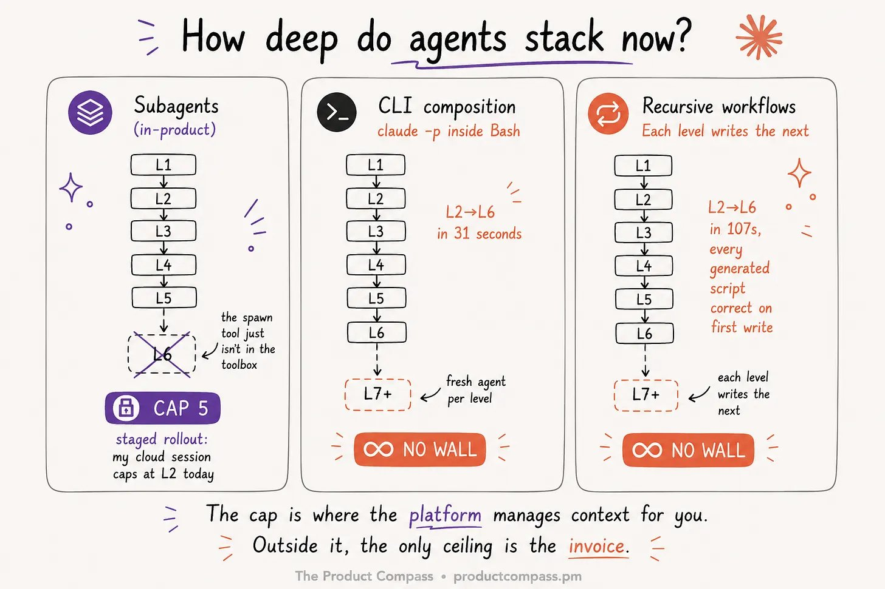

**Claude Fable 5 完全指南：36 小时测试后的 6 个关键发现**

Fable 5 是第一个让作者感到"被审计"的模型——36 小时、6 组实验，从知识层审计到嵌套 Agent 深度，覆盖了基准测试之外的真实使用体验。

---

**1. 第一个要跑的 Prompt**

在给 Fable 5 分配真正的工作之前，先让它读自己的指令文件（CLAUDE.md、skills、rules、memory files），然后回答四个问题：

1. 哪些地方互相矛盾？引用双方原文。
2. 哪些规则是为了管理一个更弱的模型而存在的——你不再需要的故障模式护栏、不再需要手把手教的配方、已经漂移的硬编码事实？列出 file:line。
3. 哪些规则以坏例子教学——那些违反了自己所规定模式的文档？
4. 你会删除什么？你会原封不动保留什么，为什么？

先报告，再修改。审计先行的结构原因在于：一个由 Agent 维护的知识层有一个盲点——每条由 Agent 添加的规则，都经过了添加它的那个模型的审查。**能存活下来的错误，正是那个模型看不见的错误。** 由模型 N 维护的系统，保留了模型 N 看不见的错误，它们一直待在那里，直到一个更强的读者出现。现在这个读者就是 Fable 5。

**2. Fable 在我的仓库里发现了什么**

作者的 Agent 维护着那些文件，不是他本人。他信任 Opus 来保持它们整洁。一次审计发现了五个问题：

- **一个硬编码的日期**告诉模型今天是哪天：`(today is 2026-05-24)`，写于五月的某次 session，再也没人注意到。它把错误的日期喂给了每一个加载它的 session。
- **一条规则用它所禁止的模式来书写。** 作者的写作系统禁止在已发布内容中使用 em dash。但记录这条禁令的文件本身就是用 em dash 写的。**指令通过示范来教学，和通过规则来教学一样有效。**
- CLAUDE.md 教导的起草模式，恰好是作者自己的质量门禁要抓的模式。
- **为旧模型的故障模式设置的护栏：** 一个已经漂移的关注者阈值（写规则时 5 万，现在 7.5 万）、"永远不要把判断密集型工作委托给更便宜的模型"、为旧模型阵容定价的双重检查仪式。
- **同一条规则出现在三个文件中。** 三个文件，三次漂移的机会。

有些问题仔细 grep 就能发现。但真正重要的那些不会——那些规则对它们所服务的模型来说是正确的，错在含义上而非语法上。**没有自动化检查能找到它们。这就是陷阱：你为上一个模型搭建的系统越好，它就越拖累这一个。**

**3. 实际变化了什么**

Fable 5（claude-fable-5）可以直接替换 Opus 4.7/4.8 的位置，但有几个陷阱：

| 变化 | 影响 |
|------|------|
| 无法关闭 thinking | 设置 `thinking: disabled` 会返回 400 错误 |
| Temperature 参数已移除 | 扫描采样设置的评测套件会在 Fable 上失败 |
| 6 月 22 日前 API Key 无法访问 | 仅限订阅界面（Claude Code、Cowork、App）|

这些都是整个迁移中最便宜的发现：你为 Opus 写的设置，Fable 直接拒绝。**公开基准测试将其置于编程模型的最顶层**（在最难的未见问题上，它超过 Opus 4.8 两倍以上），但作者更关心日常使用中的实际变化。

**4. 审计之后我测量了什么**

作者测量了两个对实际使用影响最大的设置：effort 和 speed。各五轮，流级时间戳，精确 token 计数。

**Effort 旋钮几乎不产生作用，除非你强行拉到最大。** 低于 max 时旋钮几乎不动——thinking 是自适应的，模型会忽略它不需要的预算。Max 会让时间翻倍或三倍，且各次运行之间波动很大。在一个有可验证答案的硬数学谜题上，每个 effort 级别都用同样的方法得到了正确答案。多出来的几秒买来的是重新验证和附带说明，不是不同的答案。**目前结论：默认用 high。Max 是重新验证税。**

**"Fable 很慢"的抱怨只有一半是对的。** 它启动更晚：首次可见活动在 7.4 到 8.2 秒，而 Opus 是 4.7 到 5.3 秒，没有重叠。那约 3 秒的空白停顿正是"它好慢"的感觉来源。但一旦开始运行，它的密度更高，而不是更慢。同一个数学题，两个模型都正确：Fable 少用了约 40% 的输出 token，且提前 5 到 9 秒完成。在一个更重的多文件审计任务上，差距完全消失——59 秒对 63 秒，而 Fable 多发现了三分之一的问题。**在对话开头预留一点耐心，然后就不用担心了。**

**5. 大多数报道遗漏的安全层**

Fable 5 是一个更强模型的通用版本——Anthropic 没有完全发布的 Mythos 5，仅限于受信任的合作伙伴。**同一个模型，但由分类器门控。** 这就是安全层，也是大多数发布报道跳过的那部分。

Fable 5 配备了分类器，用于筛查高风险领域。一旦触发，session 会被路由到 Opus 4.8，并附带通知。Anthropic 估计约 5% 的 session 会触发。**它不会拒绝查询，而是有目的地交给另一个模型，并告诉你。**

还有第二层，几乎没人读到。根据系统卡第 1.5 节，针对前沿 AI 开发的请求不会被重新路由。它们会被静默降级，没有通知，约占流量的 0.03%。除非你的团队预训练模型，否则不太可能碰到。但**你购买的模型可以按主题被静默调低能力**。

另外：当 6 月 22 日按 token 访问开放时，API 默认没有自动回退。触发的分类器会阻止请求并返回拒绝类别。服务器端回退到 Opus 是 opt-in 的。

**6. Agent 堆叠能有多深**

这次发布附带了一个更安静的变化：嵌套子 Agent（nested subagents）。Claude Code 之父 Boris Cherny 说："刚刚在 Claude Code 中上线了嵌套子 Agent 支持……初始深度上限为 5。" Agent 启动 Agent 来管理上下文。

作者测试了这个上限的实际位置：
- Cherny 说上限是 depth=5，但 Claude Code Web 上 depth=1 时 spawn 工具就已经没了，Desktop 上是 depth=7
- **上限不存在于 Task 工具之外。** Claude session 可以在自己的终端里运行 claude。作者用这种方式链到了六层，端到端约 30 到 45 秒，没有任何阻力

**深度是乘数效应，不是免费的。** 作者对 CLI 组合工作流进行了嵌套 vs 扁平的两轮测试：一个玩具任务（1.84 倍成本，中间管理层消耗了 71% 的预算但没有产生任何分析），一个基于作者四个月真实发文数据的实际工作负载（1.63 倍，管理层的份额下降到 32%，叶子节点做了真正的工作）。**当叶子节点做真正的工作时，开销会缩小。但协调层仍然要为一个完整的 session 开销买单。**

决策规则：当下一个层次的计划依赖于上一个层次的发现时，或者当一个分支需要自己的干净上下文时，才使用嵌套。**对于几乎所有场景，depth=2 的扁平扇出优于 depth=5 的组织架构图。** 上限是平台的。预算才是你的。

这与审计是同一个迁移，只是往下了一层。你的委托规则是在 Agent 不能启动 Agent 的世界里写的。"一个 Agent 还是多个 Agent"现在是一个附带账单的架构决策，答案与人类组织一样：**只在协调胜过直接工作时才增加管理层，因为一个经理的成本是一样的，无论它是否值这个价。**

**7. 留给 Newsletter 的内容**

完整的指南在 The Product Compass 上继续，包含真正重构系统的部分，而不仅仅是测量它：

- 迁移工作流：三桶分类法（约束/校准/脚手架），**让你剪掉锚点而不剪掉品味**
- 目标而非任务：让 Fable 无人值守运行长时间 PM 工作的 `/goal` 模式
- 递归动态工作流实验：每一层编写下一层的编排器（L2 到 L6 仅 107 秒，每个生成的脚本首次编写即正确）
- 可直接复制的 CLAUDE.md 段落，用于 Fable 的委托和升级工作流
- 什么还不奏效，以及第一周的逐日计划

---

**一点观察**

1. 这篇文章最值钱的部分不是 Fable 5 的性能数据，而是那个"知识层审计"的思路。**一个由 Agent 维护的系统，其错误会随着模型迭代而积累，且只有更强的模型才能发现。** 这个洞察适用于任何使用 AI 辅助维护代码库或文档库的团队——你的"最佳实践"文件里可能藏着大量为旧模型写的拐杖。

2. 嵌套 Agent 的成本实验（1.84x vs 1.63x）是这篇文章最被低估的数据点。**"管理层开销"在 Agent 世界里和人类世界里一样真实存在。** 当叶子节点做真正的工作时开销下降，这个发现意味着：如果你的子 Agent 只是把工作再委托给另一个子 Agent，而不产生自己的价值，你就是在浪费 token。

3. 安全层的双重设计（显式路由 + 静默降级）值得关注。**Fable 5 的 API 版本默认没有 fallback**——这意味着如果你在 6 月 22 日后直接接入 API，触发了分类器的请求会直接失败，而不是优雅降级。对于生产环境，opt-in 回退到 Opus 应该是必选项，不是可选项。

4. 作者提到他的知识层有 166 个文件、约 30 万词规则——这个规模本身就说明了问题。**CLAUDE.md 越长，模型越难真正"读"它。** 也许真正的下一步不是写更多规则，而是学会删除。

---
参考：Claude Fable 5: The Ultimate Guide
