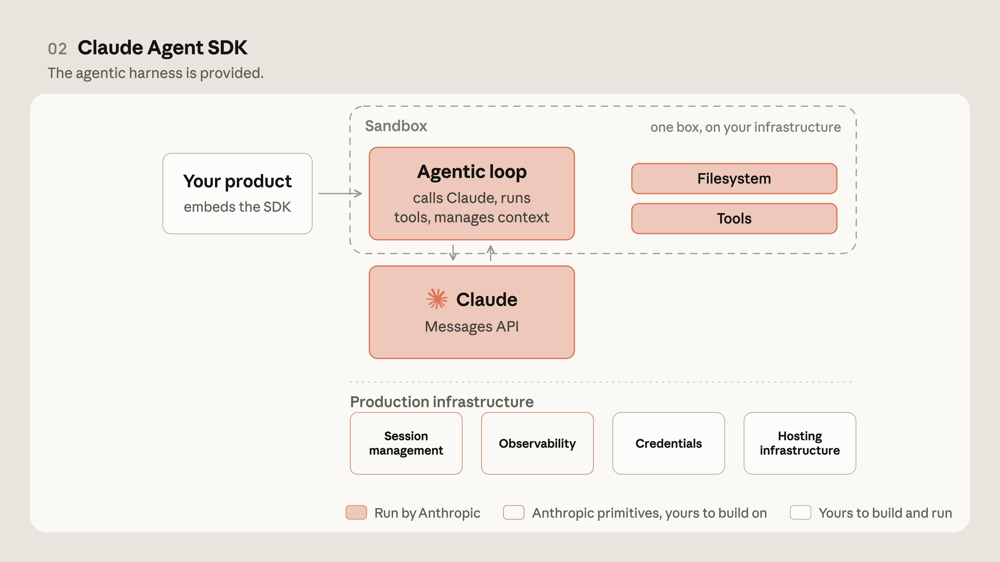
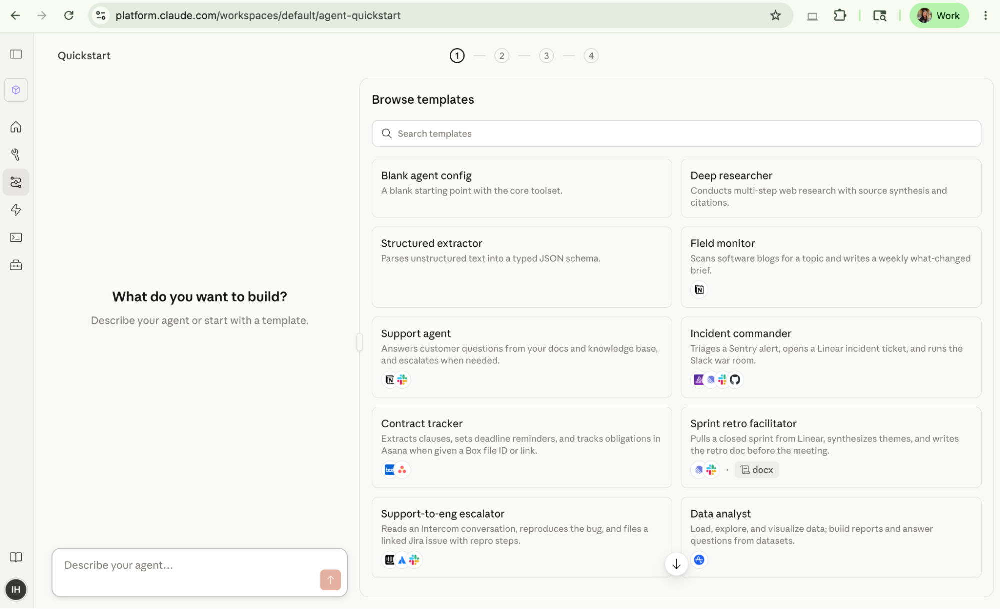

# 从API到Agent：Anthropic发布Claude Managed Agents，AI Agent进入「托管时代」

当AI Agent从概念验证走向生产部署，最大的瓶颈从来不是模型能力，而是**基础设施的复杂度**。Anthropic Applied AI团队（Gagan Bhat与Isabella He）于2025年6月10日发布的Claude Managed Agents，正是对这一问题的系统性回答——它将Agent的"大脑"与"双手"彻底解耦，让开发者只需关注业务逻辑，而把运行环境、安全凭证、会话管理全部交给托管平台。

## 一、Agent架构的进化：从API到Managed Agents

Anthropic的Agent能力演进经历了四个阶段：

**2023年：Messages API**——开发者通过API调用Claude，每次请求独立，无状态，开发者需要自行管理对话历史和工具调用逻辑。

**2025年：Claude Code**——在终端中运行的Agent式编程助手，能够自主阅读代码、执行命令、管理文件，但运行在开发者本地环境中。

**2025年末：Claude Agent SDK**——提供了构建Agent的编程框架，开发者可以用Python/TypeScript定义工具、配置模型行为，但部署和运维仍需自行处理。

**2026年6月：Claude Managed Agents**——这是Anthropic迄今为止最完整的Agent产品。它不仅提供了Agent的定义框架，更将运行环境、安全模型、会话管理全部作为托管服务提供。

*图1：Anthropic Agent架构的四代演进——从简单的API调用到全托管Agent平台*

## 二、核心问题：Harness与凭证在同一容器中运行

在Managed Agents出现之前，构建生产级Agent面临一个根本性矛盾：**Agent的"大脑"（模型推理、工具调用逻辑）和"双手"（文件系统、Shell执行、API凭证）运行在同一个容器中。**

这意味着：
- 如果Agent需要访问数据库，数据库凭证必须存储在Agent运行的容器中
- 如果Agent执行了恶意或错误的Shell命令，它可能直接访问自身容器中的敏感信息
- 多租户场景下，不同Agent之间的隔离只能依赖容器边界，缺乏细粒度的安全控制

**这种架构在生产环境中是不可持续的。** 任何安全审计都会指出：让一个自主决策的AI系统直接持有生产凭证，是灾难的配方。

*图2：传统架构中，Agent的推理逻辑（Harness）与执行环境（Sandbox）在同一容器中，安全风险极高*

## 三、解决方案：将大脑与双手解耦

Claude Managed Agents的核心创新在于**将Agent的"大脑"（Harness）与"双手"（Sandbox）彻底分离**：

- **Harness**：运行在Anthropic的托管基础设施中，负责模型推理、工具选择、对话管理。它不直接访问任何外部系统。
- **Sandbox**：运行在独立的执行环境中（可以是Anthropic托管的容器，也可以是客户自托管的沙箱），负责执行工具调用、访问文件系统、调用外部API。
- **Credentials Vault**：凭证存储在独立的保险库中，仅在Sandbox执行具体操作时按需注入，Harness层永远无法直接读取凭证。

**这种解耦带来了根本性的安全改进。** 即使Agent被诱导执行了恶意操作，攻击者也无法从Sandbox中提取凭证或访问Harness层的内部状态。Sandbox本身就是一次性的、隔离的执行环境。

*图3：Managed Agents将Harness（大脑）与Sandbox（双手）分离，凭证通过Credentials Vault安全注入*

## 四、三个核心原语：Agent、Environment、Session

Claude Managed Agents定义了三个核心抽象：

### Agent（代理配置）
Agent是一个声明式配置对象，定义了：
- 使用的模型（如Claude 4 Opus、Claude 4 Sonnet）
- 系统提示词（System Prompt）
- 可用的工具集（Tools）
- 关联的Environment和凭证策略

### Environment（执行环境）
Environment定义了Agent的运行时上下文：
- 计算资源（CPU、内存、GPU）
- 网络访问策略
- 文件系统挂载
- 凭证保险库（Credentials Vault）绑定

### Session（运行实例）
Session是Agent的一次具体运行实例：
- 包含完整的对话历史
- 持久的执行状态
- 可中断和恢复
- 支持长时间运行的任务

*图4：Agent是配置，Environment是执行上下文，Session是运行实例——三者构成了Managed Agents的核心抽象层*

## 五、生产环境的关键收益

### 凭证保险库（Credentials Vault）
这是Managed Agents最实用的特性之一。开发者可以在Claude Developer Console中配置凭证，Agent在运行时自动按需获取。**凭证永远不会暴露给模型或Harness层。** 支持的凭证类型包括API Key、OAuth Token、SSH Key、数据库连接字符串等。

### 60%的延迟降低（p50）
通过优化推理与执行之间的通信协议，以及Harness层的智能预取机制，Managed Agents相比自建方案实现了**p50延迟降低60%**。这意味着用户交互的响应速度显著提升，尤其是在多轮对话场景中。

### 持久化会话（Persistent Sessions）
Agent可以在不丢失上下文的情况下运行数小时甚至数天。**会话状态在Harness层持久化，不受Sandbox生命周期影响。** 这意味着即使Sandbox因超时或错误被销毁，Agent也可以在新的Sandbox中继续执行。

### 自托管沙箱（Self-hosted Sandboxes）
对于对数据主权有严格要求的企业，Managed Agents支持在客户自己的基础设施中运行Sandbox。**数据永远不会离开客户的网络边界。** 这对金融、医疗、政府等受监管行业至关重要。

*图5：Managed Agents的运行时架构——Harness、Sandbox、Credentials Vault三层分离*

## 六、客户案例：从12小时到20分钟

### Notion：知识库自动化
Notion使用Claude Managed Agents构建了自动化知识库维护系统。**之前需要12小时的人工整理工作，现在20分钟即可完成。** Agent自动识别过时内容、建议更新、执行修改，并生成变更日志。

### Rakuten：一周构建一个Agent
日本电商巨头Rakuten利用Managed Agents将Agent开发周期从数周缩短到**一周一个Agent**。通过复用Environment配置和凭证策略，团队可以快速原型化新的Agent用例并推向生产。

### Sentry：智能错误分类
Sentry使用Managed Agents来自动分类和路由错误报告。Agent分析堆栈跟踪、关联日志、检查历史模式，**将错误分类的准确率提升了40%**，同时将人工介入减少了70%。

### Asana：项目管理自动化
Asana构建了能够自动创建任务、分配负责人、跟踪进度的项目管理Agent。**Agent能够理解自然语言的项目描述，自动拆解为可执行的工作项。**

### Atlassian：跨工具工作流
Atlassian使用Managed Agents连接Jira、Confluence和Bitbucket，**实现了从需求到代码到部署的端到端自动化。**

*图6：Notion和Rakuten等企业已在使用Claude Managed Agents实现显著的效率提升*

*图7：Sentry和Asana利用Managed Agents优化了错误分类和项目管理流程*

*图8：Atlassian通过Managed Agents连接Jira、Confluence和Bitbucket实现端到端自动化*

## 七、快速上手：Claude Developer Console

要开始使用Claude Managed Agents，最快捷的方式是通过**Claude Developer Console**的快速启动模板：

1. 登录 console.anthropic.com
2. 选择"Managed Agents"项目类型
3. 选择一个模板（如"Customer Support Agent"或"Code Review Agent"）
4. 配置Environment和Credentials Vault
5. 点击部署——Agent即刻可用

**整个过程只需几分钟，无需配置任何基础设施。** Console提供了实时的Agent运行监控、日志查看、会话回放等调试工具。

*图9：Claude Developer Console提供了从创建到监控的完整Agent管理界面*

---

## 结语：Agent基础设施的"分水岭时刻"

Claude Managed Agents的发布，标志着AI Agent从"框架时代"进入"平台时代"。以下是我认为最重要的几个观察：

**第一，"Harness-Sandbox分离"将成为Agent架构的行业标准。** 正如微服务架构将应用拆分为独立服务，Harness与Sandbox的分离解决了Agent安全性的根本矛盾。任何严肃的生产级Agent方案都必须解决这个问题，而Anthropic率先给出了一个经过验证的参考架构。

**第二，托管模式降低了Agent开发的准入门槛，但可能带来平台锁定风险。** Managed Agents让中小团队也能构建生产级Agent，但Environment、Credentials Vault、Session管理等核心能力都与Anthropic平台深度绑定。对于长期战略而言，关注开放标准（如MCP、Agent-to-Agent协议）同样重要。

**第三，持久化Session是Agent从"工具"走向"同事"的关键能力。** 一个能够在数小时甚至数天内保持上下文、中断恢复的Agent，才能真正承担起独立的工作流。这是Agent从"问答机器人"进化为"数字员工"的必要条件。

**第四，自托管Sandbox是企业级采用的前提条件。** 对于受监管行业，数据主权是不可妥协的要求。Anthropic提供自托管选项，说明他们认真对待企业市场——这一点值得肯定。

---

**参考资料：**

- The evolution of agentic surfaces: building with Claude Managed Agents
- https://claude.com/blog/building-with-claude-managed-agents
- https://docs.anthropic.com/en/docs/agents-and-tools/claude-managed-agents
- https://console.anthropic.com

