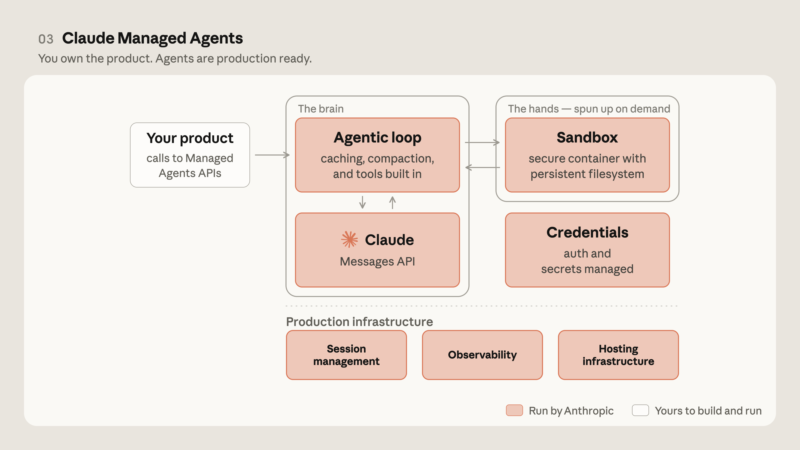
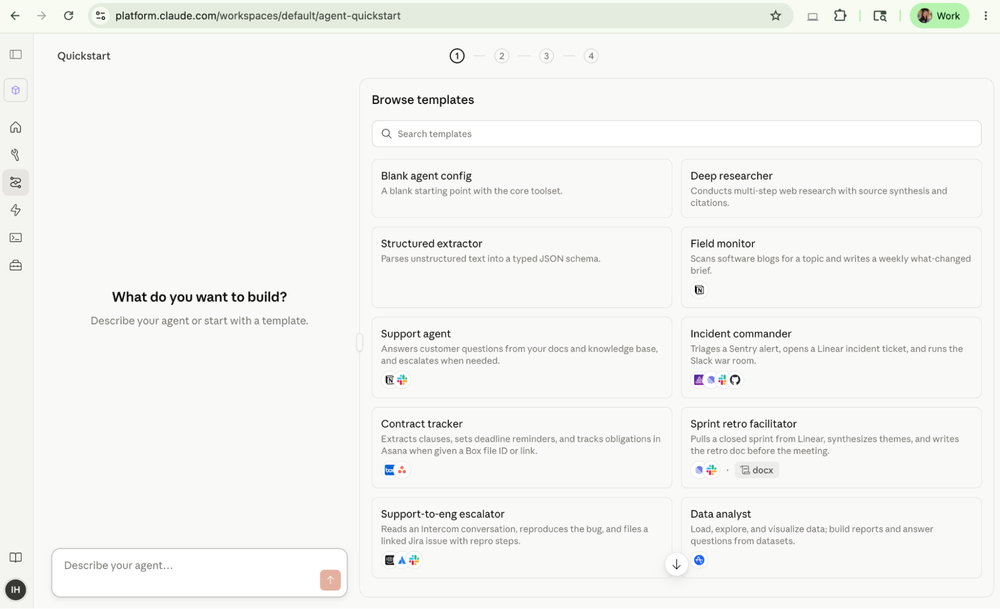

<strong style="font-size:16px;color:#1a6ba0;">要点速览</strong>

- <strong>托管式Agent基础设施</strong>：Claude Managed Agents是一套可组合API，消除从零构建安全、状态管理、权限和Agent loop的全部工作，让开发者专注业务逻辑  
- <strong>核心能力</strong>：沙箱代码执行、跨会话检查点、凭证管理、细粒度权限、端到端追踪、内置编排Harness、会话分析  
- <strong>效率飞跃</strong>：任务成功率在最难问题上提升最多10个百分点。活跃运行仅 $0.08/小时（不计token费）。合作伙伴报告开发时间缩短3-10倍  
- <strong>合作伙伴验证</strong>：Notion、Rakuten、Asana、Sentry、Atlassian、VibeCode等已在生产环境中使用

---

**AI Agent从概念验证走向生产部署，最大的瓶颈从来不是模型能力，而是基础设施的复杂度。** Anthropic发布的Claude Managed Agents正是对这一问题的系统性回答：它把Agent的"大脑"和"双手"彻底分开，让开发者只需关注业务逻辑，而运行环境、安全凭证、会话管理全部交给托管平台。

Claude Managed Agents是一套可组合的API，用于构建和部署云端托管的Agent。它目前处于Claude Platform的公开测试阶段。

**Agent架构的演进路线可以清晰地分为四个阶段。** 最早是Messages API，模型由Anthropic提供，但会话管理、可观测性、凭证管理、托管基础设施、沙箱：全是开发者自己建。

Messages API阶段：Anthropic只提供模型，其余全部开发者自建

第二个阶段是Claude Agent SDK，Agentic编排层（Harness）由SDK提供，但运行环境依然是开发者的基础设施，会话管理和可观测性变成了Anthropic的"原语"：开发者按需使用。

Claude Agent SDK阶段：编排层由SDK内置，沙箱在开发者一侧

第三个阶段就是Claude Managed Agents。**现在开发者的产品只需调用Managed Agents API，Agent的大脑（Agentic loop + Claude）和双手（沙箱执行环境）全部由Anthropic托管。** 凭证管理、会话管理、可观测性、托管基础设施：所有这些以前开发者需要自己搞定的生产级组件，现在直接内置。

Claude Managed Agents阶段：大脑和双手全部托管，开发者只负责产品层

**Agent、环境和会话这三个概念之间的关系也变得更加明确。** Agent是大脑（模型+提示+工具+MCP+技能+护栏），环境是行动空间（沙箱+连接资源），会话是Agent在环境中运行一个任务时的实例。会话是可持久化、可恢复的，运行时还可以人工干预和中断。

Agent + 环境 = 会话：可持久化、可恢复、可中断的运行实例

**安全架构采用三层边界设计。** Agent loop（由Anthropic管理）负责推理和决策，工具执行（在用户边界内运行）负责实际代码执行，凭证信息（Vaults）通过加密通道按需传输。这种设计确保用户的敏感数据和执行环境始终可控。

三层边界：Agent loop（Anthropic）→ 工具执行（用户边界）→ Vaults（加密通道）

**Managed Agents的核心能力覆盖了生产环境的全部需求：** 沙箱代码执行、跨会话检查点状态持久化、内置凭证管理、细粒度作用域权限、端到端追踪、会话分析（在Claude Console中检查每次工具调用和失败模式）。还有一个基于结果的Agentic模式（研究预览）：你定义目标和成功标准，Claude自己评估和迭代直到成功。

定价方面，token按标准Claude Platform费率计费，活跃运行时间每小时 $0.08。

**合作伙伴的实际反馈很有说服力。** Notion表示整合后用户可以直接在Notion内部委托开放式复杂任务：从编码到生成幻灯片和电子表格。Sentry则实现了从根因分析到Claude Agent写修复、开PR的全自动链路：之前需要数月的工作，现在数周完成，而且后续运维开销完全消失。VibeCode算了一笔账：之前用户得手动管理LLM生命周期、装备工具，现在几行代码就能10倍速启动同样基础设施。Atlassian提到，Managed Agents处理了沙箱化、会话和权限这些最困难的部分，让团队在几周内就能为开发者构建Agent。

**在Claude Console中，开发者可以选择模板或从空白开始创建Agent。** 模板覆盖了Deep Researcher、Structured Extractor、Sprint Retro Facilitator、Incident Commander等常见场景。

Claude Console Quickstart：模板化Agent创建，覆盖常见场景

调试界面提供了完整的Agent运行日志：从thinking到tool call到tool result的全链路透明可见。

Agent调试界面：全链路透明，每一步都可追溯

<strong style="font-size:15px;color:#8b6f4c;">结语</strong>

Claude Managed Agents的出现说明Agent基础设施正在从"自建"走向"托管"。这跟云计算的演进路径几乎一样：先自己做一切，然后托管层出现，再然后托管变成默认选项。  
不过有一个值得注意的矛盾：托管虽然降低了单次开发门槛，但也提高了供应商锁定程度。不管承不承认，"中立"的托管层本身也是一种商业模式。

---

<a href="https://claude.com/blog/amazon-bedrock-google-cloud-gateway" style="color:#ffffff;text-decoration:none;font-size:15px;font-weight:bold;display:block;margin-bottom:10px;">🔗 Claude apps gateway for Amazon Bedrock and Google Cloud 正式上线</a>

<a href="https://claude.com/blog/microsoft-foundry-ga" style="color:#ffffff;text-decoration:none;font-size:15px;font-weight:bold;display:block;margin-bottom:10px;">🔗 Claude in Microsoft Foundry 正式可用</a>

<a href="https://claude.com/blog/workload-identity-federation" style="color:#ffffff;text-decoration:none;font-size:15px;font-weight:bold;display:block;margin-bottom:10px;">🔗 Claude Platform 安全接入：Workload Identity Federation</a>

<a href="https://platform.claude.com/docs/en/managed-agents/overview" style="color:#ffffff;text-decoration:none;font-size:15px;font-weight:bold;display:block;">📖 Managed Agents 官方文档</a>

参考：

https://claude.com/blog/claude-managed-agents
