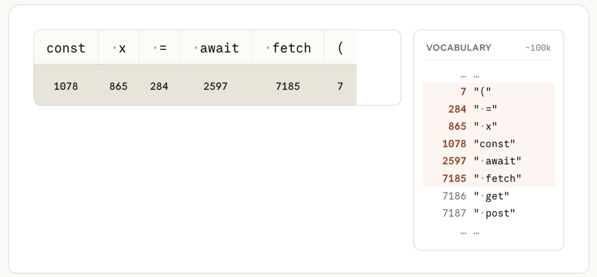
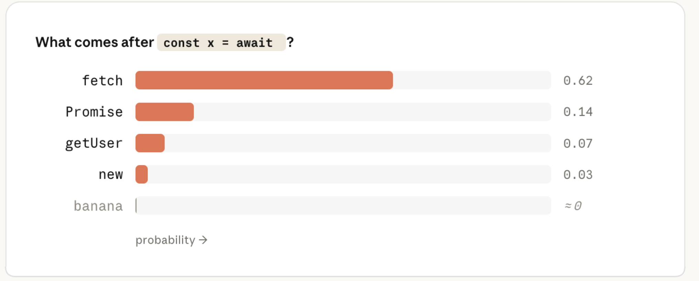
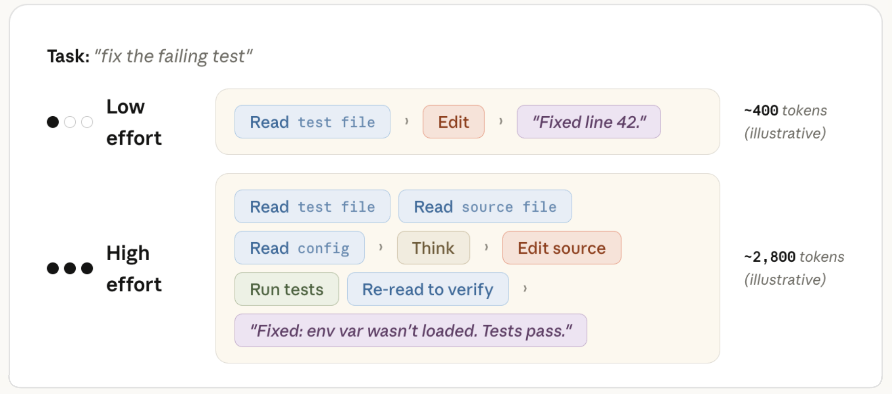

<strong style="font-size:16px;color:#1a6ba0;">要点速览</strong>

- <strong>模型决定能力上限</strong>：换模型等于换一组冻结的权重（参数），它决定"懂多少"和每个token的成本，但决定不了生成多少token。  
- <strong>effort不只是思考时间</strong>：它控制Claude为这次请求做的总体工作量，包括读多少文件、跑多少验证、在多步任务里推进多远才回头找你。  
- <strong>诊断口诀</strong>：Claude该知道的都有、明显努力了还错，换更大模型；它跳文件、没跑测试、中途放弃，就调高effort。  
- <strong>先用默认值</strong>：大多数任务用模型默认effort即可，把effort当通用偏好而非逐任务旋钮；结果不达标时再问"是懂得不够还是没努力够"。

---

## 两个看起来都能"让答案更好"的旋钮

Claude Code给你两个设置：模型设置和effort级别。你大概默认以为，更大的模型（比如Claude Fable 5）比Claude Sonnet输出更聪明，而更高的effort意味着Claude在回答前思考得更久。

第一句是对的。按行业基准，最大的模型能力确实更强。

但 **effort远不止"思考时间"**。它控制的是Claude为你的请求所做的总体工作量。这包含思考时长，但也包括：读了多少文件、做了多少验证、在一个多步任务里推进到哪一步才回头向你确认。

高effort下，Claude会在回来找你之前做更多动作：读文件、跑测试、反复核对。低effort下，它宁可向你多要上下文，也不愿自己花token去搞清楚。

## 模型选择到底在换什么

按下回车，Claude Code把你的消息、系统提示、工具定义、CLAUDE.md、对话历史和上下文里的文件，全部打包成一个API请求发出去。在服务器端，文本先经过分词，被切分成片段，每个片段映射成一个固定词表里的整数。从此刻起，你的提示就是一个整数数组。

模型的工作是接收这个数组，预测下一个token：为词表里每个token算一遍概率，挑最高的那个。在 `const x = await` 之后，训练好的模型会给 `fetch` 很高概率，给 `banana` 接近零。

把输入token变成这些概率的，是**权重（参数）**：数十亿个组织成大矩阵的数字。要预测一个token，模型把你的输入穿过这些矩阵，跑一长串矩阵乘法，最后读出概率。权重就是模型"知道的一切"所在。

权重在训练时设定，等你发请求时已经是只读的。你的提示、CLAUDE.md、上下文都改不了它。Claude关于TypeScript、流行框架、地道Go的一切，都在训练时编码进了权重。

如果一个库在训练时还不存在，它就不在这个权重里。你可以把文档塞进上下文，Claude会用，但那只是**引导（steering），不是教学**：回应只影响这一次请求，底层模型没记住任何东西。所以Claude信心满满地调一个不存在的API（幻觉），是权重按训练模式生成了看似合理的token序列，而不是一次失败的查找。

换模型，本质就是**换哪一组冻结的权重来处理你的请求**。模型不是一次性生成整个答案，而是预测一个token、追加、再重跑一遍去拿下一个，一个200 token的回复就是200次穿过权重。这个循环就是你等待时间和输出成本的主要来源。

所以模型设置决定了：由哪组权重处理请求，以及每个输出token的成本。但它**决定不了生成多少个token**，同一个提示下这个数字会因为Claude决定做多少工作而天差地别。而这，正是effort级别控制的东西。

分词器把文本切成片段并映射到固定词表中的整数，图中ID仅为示意

模型的预测是对词表中每个token的一个概率，最优猜测与无关猜测之间差距巨大

权重是数十亿个数字组成的大矩阵，把输入token变成输出概率

序列每步只增长一个token，模型每次都重读整个数组预测下一个

## effort怎么改变这一切

Claude Code处理任务时生成的token落在三类里：**思考**（动作前后流式出现的推理）、**工具调用**（如Read、Edit及其参数的结构化块）、**给你的文本**（计划、进度、结尾总结）。它们都是同一个循环里的普通输出token，按同一费率计费，思考token也和读到的文件一样留在上下文里。

effort级别作为请求的一部分发给模型，和你的提示并排。模型在训练时就学会了每个effort级别下的行为，这种行为被烘焙进冻结的权重。它就像你的提示文本一样，是模型要响应的又一个输入，为Claude设定了"在认为任务完成前，需要多彻底、多确定"。

每一轮都会考量这点，于是更高置信度的答案需要生成更多token。同一提示、两个effort级别，高effort路径大约会生成 **7倍**的token才到达更高置信度。

Claude的所有输出都是token：思考、工具调用、给你的文本都来自同一个循环

effort级别作为请求的一部分与提示并排发送，设定Claude行为的彻底程度与确定性

在更高effort下，Claude通常会从制定计划开始，effort影响计划的深度和广度。但计划不是冻结的：随着动作返回结果，它会更新进展和确定度。一个三假设调试计划第一步就找到bug时，"调查假设2和3"可能就不需要了，Claude会明确说"第一次检查就找到了，剩下的不用查了"然后跳过去，这就是你看到任务列表在运行中途被改的原因。

更高effort下Claude更倾向反复核对额外假设、验证正确性，但它**不会在简单任务上人为抬高用量**。团队在训练期间就紧盯"过度思考"，因为它会降低有效性。

同一提示两个effort级别，高effort路径生成约7倍token以换取更高置信度答案

更高effort下Claude先制定计划，并随结果更新进展、跳过已不必要的步骤

## 怎么选effort：先用默认值

对大多数任务，用模型的**默认effort级别**。默认级别是Claude按大多数人愿意为一个任务花的量来扩展token用量的那个点。

把effort当作手动覆盖，用来缩放Claude工作得多努力、多久。只有当你基于领域或工作类型，对"彻底性还是速度"有强烈偏好时，才刻意去选它，且**更多当作通用偏好，而非逐任务决策**。

一个实战观察：Claude Opus 4.8发布后的测试里，对Opus 4.8用默认effort设置，相比对同一个任务用Opus 4.7的默认effort设置，会在大致相同的token数下产出更好的结果。

## 出错了该改哪个旋钮

Claude出错时，第一反应不该是调旋钮，而是检查你给的上下文：提示太模糊？连错了工具？没装对技能？如果在一个本不需要更高effort的任务上硬提effort，修复往往在上游：上下文、CLAUDE.md或任务范围。

假设上下文已经清晰，Claude仍出错，就问自己：**它是没努力够，还是懂得不够？** 把这当选起点的启发式，不是硬性规则。

**问题太难，换更大模型。** 比如微妙bug、陌生领域、架构决策。当更小模型无论给多少上下文都自信地错，更大模型更有用。更大模型也更能处理模糊性；而具体、指导执行的指令，是在更小模型上成功的更好配方。

**工作常规，选更小模型。** 比如能精确描述的改动、机械性更改、关于已在上下文里的代码的问题，没理由为不需要的能力付费。若Claude掌握所有上下文、明显尝试过仍错，是换更大模型的信号；若已在更大模型上、工作一直常规，降下来会提速且通常降本不降质。

**Claude没努力够，调高effort。** 如果它因为跳过文件、没跑测试、没核对自己的工作而出错，就选更高effort，这最相关于你原本选的effort低于模型默认值时。

## Fable、Opus、Sonnet：专才、专家、通才

我喜欢这样理解两者关系：Fable是专才，见过几乎没人见过的难题；Opus是专家；Sonnet是相当好的通才。effort级别决定它们中任何一个在你的任务上花多少时间。

低effort的Opus，像得到有丰富类似问题经验的专家的五分钟：他们带来你代码库里没有的知识（见过的模式、知道要查的坑），但只给五分钟意味着快速扫一遍代码而非细读。高effort的Sonnet，像给一个好通才整个下午：他会读全部、跑起来、反复核对，彻底理解你特定的代码，但少的是"我exactly见过这个"的辨认力。Fable即使低effort，也是那个专才瞥一眼所有人都卡住的问题，仍能指出没人会注意的东西，这种辨认力是你付得最多的，所以**留给真正需要它的任务**。

这些都不是绝对更好。模型设置大致是"多强"，effort设置大致是"多彻底"，大多数真实任务两者都要一点。

Fable是专才、Opus是专家、Sonnet是通才，effort决定每个角色在你的任务上花多少时间

## effort、模型与token消耗

三者如何相互作用，取决于任务。

在同等effort的常规工作上，两个模型一般都能做对。更大模型以更高的单token价格，靠额外验证步骤消耗更多token，这也是为什么常规阶段降到更小模型能**省真金白银而不降质**。

曲线仅作说明：同等effort的常规任务上，更大模型因额外验证消耗更多token（非真实基准）

在更难的、多步工作上等式不同：更小模型朝着能力极限死磨、烧掉迭代，更大模型用更少步数达到同样质量门槛。你为更大模型付更高单token价，但在真正拉伸更小模型的任务上，**每个任务的总成本反而可能更低**；更重要的是，更大模型能完成即使最高effort下更小模型也够不到的任务。

这一点在Fable上最明显：长程多步工作里它领先得最远，测试里它完成了Opus和Sonnet在任何effort都够不到的工作，同时单token也最贵，这正是不浪费它去干常规活的理由。

曲线仅作说明：更难的多步任务上，更小模型死磨、更大模型用更少步数达标（非真实基准）

关键点是，effort决定Claude愿意沿曲线走多远，但不意味着它需要走那么远才能完成任务。另一个细微处：**effort塑造token消耗，却不限制它**。系统里唯一硬上限是 `max_tokens`，命中就中途截断回复，是个粗暴工具、主要和API开发者相关。更软的控制（任务预算、或在提示里让Claude保持简短）更有用，它们作为模型训练去遵循的指引：接近上限时它会寻求收尾，而不是撞墙。

## 先用默认值，再去拧旋钮

大多数时候你不该去想这两个设置中的任何一个。当一个结果没达标，问一句"是Claude懂得不够，还是没努力够"，再按需调整。

<strong style="font-size:15px;color:#8b6f4c;">结语</strong>

这篇文章最值得带走的一点，是把"模型"和"effort"拆成了两个正交维度：能力（权重）和彻底度（投入）。很多人把Opus调高effort当成万能药，其实当Claude跳文件、没跑测试时，问题在彻底度不在能力，加模型只会增加成本。  
"先用默认值，再去拧旋钮"是反直觉但省钱的纪律。默认effort本就是按大多数人的期望调好的，绝大多数任务不需要你干预；真要调，先查上下文上游，再决定是换模型还是加effort。  
Fable/Opus/Sonnet的三分法对工程预算很有用：把最贵的Fable留给"小而模型都够不到"的硬骨头，常规活交给Sonnet，是Claude Code团队明说的成本逻辑，而非营销话术。

---

参考：https://claude.com/blog/claude-model-and-effort-level-in-claude-code
