

<strong style="font-size:16px;color:#1a6ba0;">要点速览</strong>

- <strong>算力公式极简</strong>：在5% 激活率下，MoE训练算力C = 12 × N_total²，即成本随总参数量平方增长  
- <strong>三档量级成本</strong>：2T约 $148M（191机柜）、4T约 $593M（762机柜）、10T约 $3.7B（4,763机柜），均按BF16、90天训练估算  
- <strong>数据才是真瓶颈</strong>：10T模型需400T token，互联网仅约100T可用，缺口300T靠合成数据，API生成成本高达 $2.3B，几乎等于训练费六成  
- <strong>B300只在FP4胜出</strong>：BF16下与B200吞吐相同却贵20%，Nvidia实际把B300定位为推理卡而非训练卡

---

## 方法论与核心假设

说Claude Mythos令人惊艳都算是轻描淡写。它代表了能力上的下一次阶跃式飞跃，正如Dario所说，它没有上限。

我们想搞清楚，训练下一代处于2T、4T和10T参数量级的模型，究竟需要多少算力和数据。话说回来，Elon今天宣布他们正在训练这一量级的模型，所以这个估算非常应景。

方法论上，我们沿用估算DeepSeek V3、ARCEE、KIMI 2.5等模型训练成本时的公式和思路。GPU性能数字取自Nvidia的B200/B300以及NVL72机柜数据手册，数据可得性统计取自Epoch AI。当我们提到B200/B300时，实际指的是GB200/GB300超级芯片，它们作为NVL72机柜的一部分。

NVL72的世界规模为72块GPU，这让训练这一量级的模型更容易，因为那72块GPU可以通过NVLink/NVSwitch互联，以高吞吐互相访问彼此的HBM。尽管如此，仅靠数据并行还不够，你仍然需要流水线并行、张量并行、序列并行等其他并行方式。为了把所有瓶颈都考虑进去，我们保守假设MFU（模型浮点利用率）只有20%。

## 训练数据需求

token总数基于总参数量，因为所有专家权重在整个训练过程中都必须被训练，即使每个token只有5% 被激活。公式如下：

D = 每个参数对应的token数 × N_total

D = 40 × N_total

公开可爬取的互联网提供约100T token（Epoch AI分析，下图标出了100T token的刻度线）。需要更多token的模型必须依赖合成数据生成、改写，或多轮训练。正如我们稍后将会看到的，当我们逼近10T参数量级时，合成数据生成会变得非常昂贵。

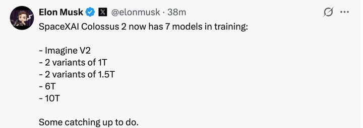
互联网可爬取token约100T（图中刻度线），更大模型必须依赖合成数据

## 为什么是5% 激活率

为了证明5% 激活比的合理性，我们调研了最新的前沿模型：

DeepSeek V3/V3.2（5.4%）、GLM-5（5.4%）和MiniMax M2.5（4.3%）都聚集在4% 到6% 区间，5% 正好是这个区间的中心。Kimi K2.5已经做到3.1%，趋势是朝着更稀疏的方向发展，所以5% 对下一代模型而言是偏保守的。较老的模型（Mixtral、DBRX）使用约27% 的激活率，18个月内整个领域迁移到3% 到6%，这是一个决定性的转变。

DeepSeek V3在14.8T token上以5.5% 激活率训练成功，相比稠密基线没有任何质量损失。5% 激活率还带来实用的尺寸：2T对应100B、4T对应200B、10T对应500B每token激活参数，都是已被验证可行的架构规模。

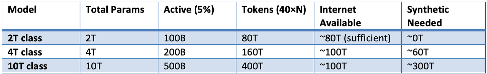
前沿MoE模型激活率对比（原文图表）

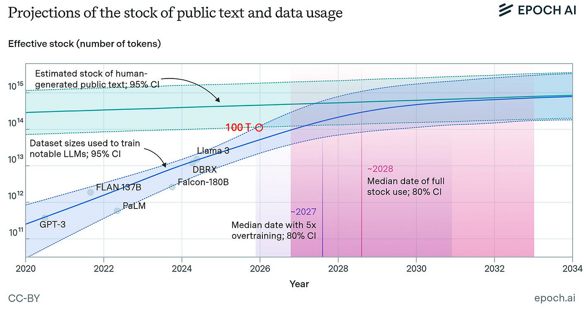
各模型稀疏度分布（原文图表）

## 训练算力公式

对于MoE，每个token只有激活参数参与计算：

N_active = N_total × 0.05

C = 6 × N_active × D

C = 6 × (N_total × 0.05) × (40 × N_total)

C = 12 × N_total²

这个公式揭示了一个关键事实：训练算力与总参数量的平方成正比。这也是为什么从2T跳到10T，成本不是涨5倍，而是涨25倍量级。

## GPU规格

B300只有在FP4下才优于B200。在BF16下，二者完全相同，都是2.25 PFLOPS。这一点很重要，因为后续的情景分析会显示，在更现实的BF16训练下，选B300反而更亏。

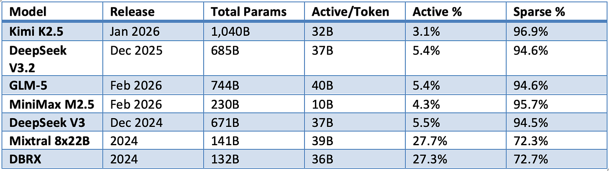
B200与B300在BF16/FP4下的规格对比（原文图表）

## 计算链：从FLOPs到成本

整个推算分六步展开：

步骤1：Effective_FLOPS = Peak_FLOPS × 0.20
步骤2：GPU_seconds = C ÷ Effective_FLOPS
步骤3：GPU_hours = GPU_seconds ÷ 3,600
步骤4：GPUs_needed = GPU_hours ÷ 2,160（= 90天 × 24小时）
步骤5：NVL72_Racks = GPUs_needed ÷ 72
步骤6：Total_Cost = GPU_hours × 每GPU每小时价格

下面这些图表给出了各量级模型在不同GPU配置下的逐步测算结果。

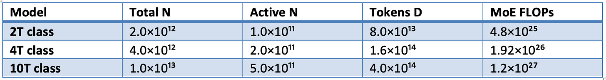
2T量级训练成本测算（原文图表）

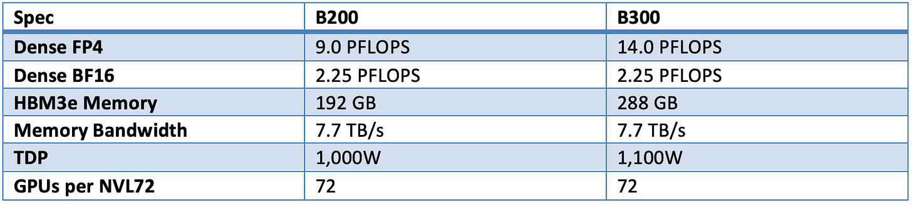
4T量级训练成本测算（原文图表）

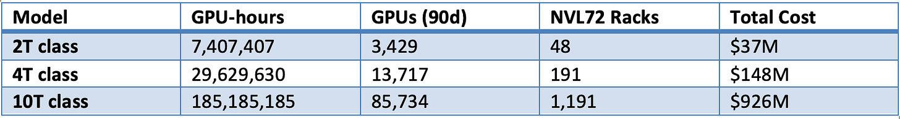
10T量级训练成本测算（原文图表）

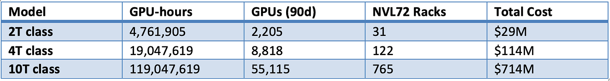
各量级所需GPU小时数（原文图表）

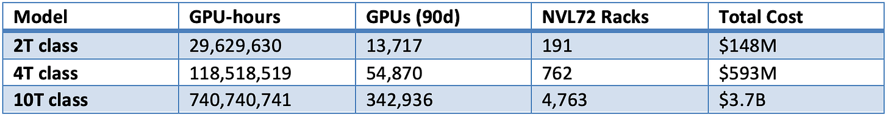
各量级所需NVL72机柜数（原文图表）

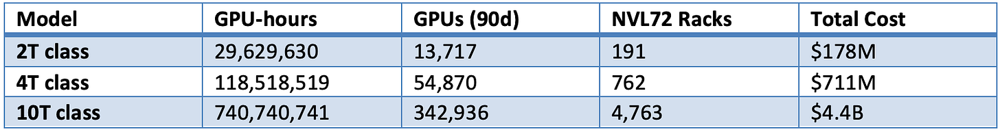
BF16情景下单卡每小时成本结构（原文图表）

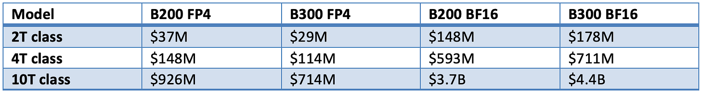
FP4情景下单卡每小时成本结构（原文图表）

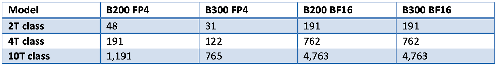
成本随参数量增长曲线（原文图表）

## FP4与BF16两种情景

FP4是理论上的最佳情况，所有FLOPs都以FP4吞吐运行。但据我所知，这在今天还不可能，或者在这一规模上尚未被验证。Nvidia在更小的模型（如12B）上用4位精度训练做过，但即便在那里，他们也将许多其他部分保持在更高精度。原文引用如下：注意力、嵌入、非线性层以及其他张量，为了保证训练过程中的数值稳定性，我们对嵌入、输出投影头、归一化层、非线性激活，以及注意力组件（包括softmax和query-key、注意力分数-值 的批处理GEMM）保留原始精度（如BF16或FP32）。主权重（由优化器存储）、权重梯度（用于跨微批次和跨数据并行副本的梯度累积）和优化器状态也保持在FP32。张量并行归约在BF16精度下执行。

因此我们分别计算两种价格情景：

B200（FP4）每GPU每小时 $5，B300（FP4）每GPU每小时 $6。
B200（BF16）每GPU每小时 $5，B300（BF16）每GPU每小时 $6。

BF16是更现实的情景，即全程用BF16训练。下两图给出两种情景下的总成本与机柜数对比。

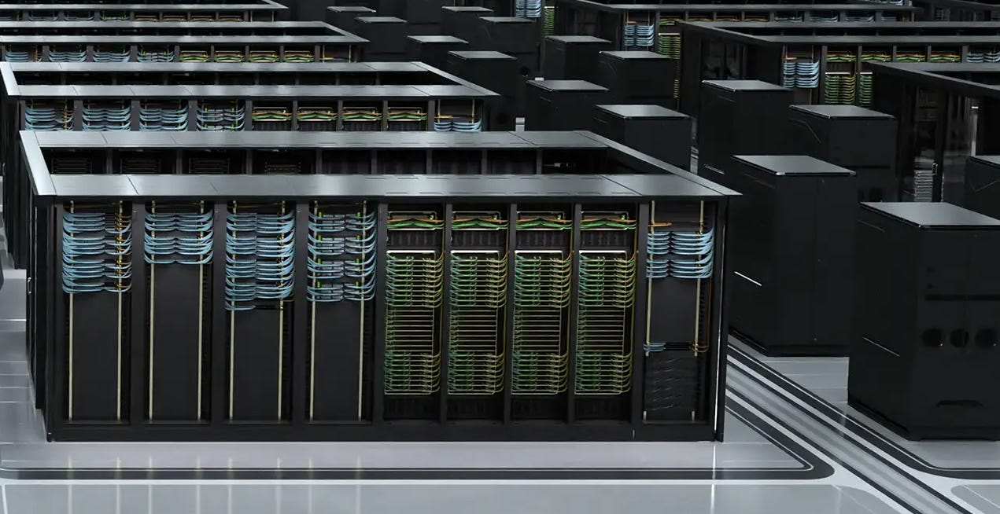
总训练成本对比（按模型规模与GPU配置）

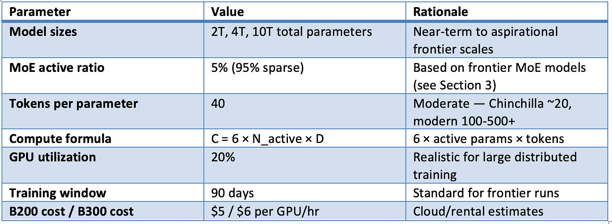
所需NVL72机柜数对比

## 训练成本可视化

把结果画出来会更直观。图1是按模型规模和GPU配置划分的训练成本，图2是所需NVL72机柜数。

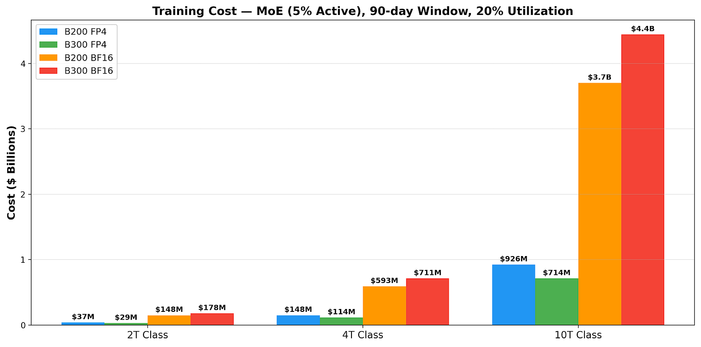
图1：按模型规模和GPU配置划分的训练成本

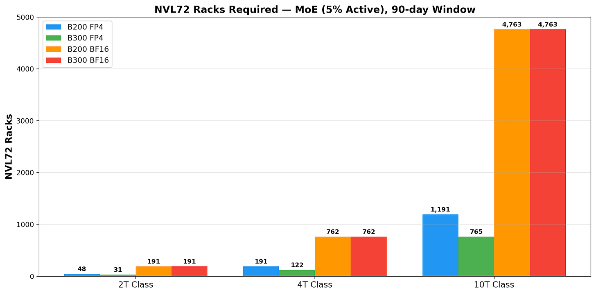
图1（续）：不同GPU配置下的成本曲线

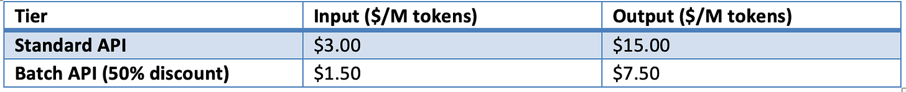
图2：所需NVL72机柜数

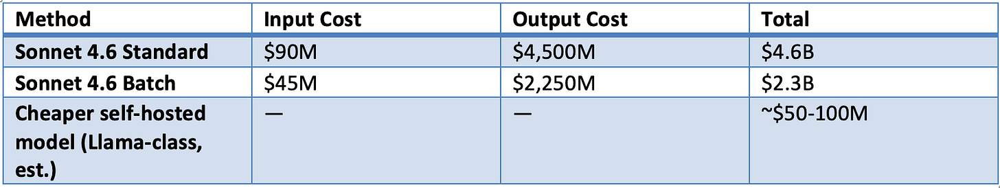
图2（续）：机柜数随参数量增长

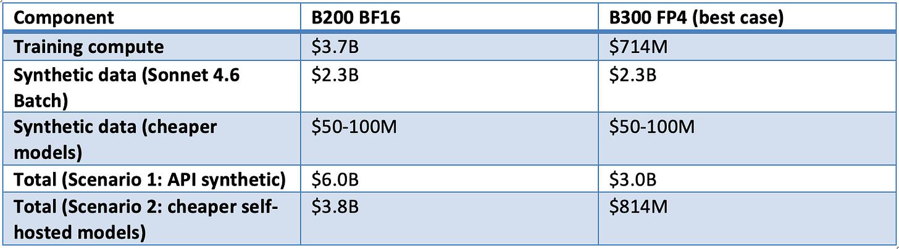
图2（续）：BF16与FP4机柜需求对比

## 合成数据生成成本

10T模型需要400T token，但互联网上只有约100T可用。剩下的300T必须合成生成。我们用Claude Sonnet 4.6作为代表性前沿API模型来分析成本。假设输入与输出比例为1:10（30T提示token生成300T token）：

标准版：(30T ÷ 1M × $3) + (300T ÷ 1M × $15) = $90M + $4,500M = $4.6B
批量版：(30T ÷ 1M × $1.50) + (300T ÷ 1M × $7.50) = $45M + $2,250M = $2.3B

当然，对Anthropic来说成本会比外部人低得多，因为他们不用付自己的利润率。

## 10T量级总成本

把训练和合成数据加在一起，10T量级的账单才完整呈现。图3是训练与合成数据的成本拆分。

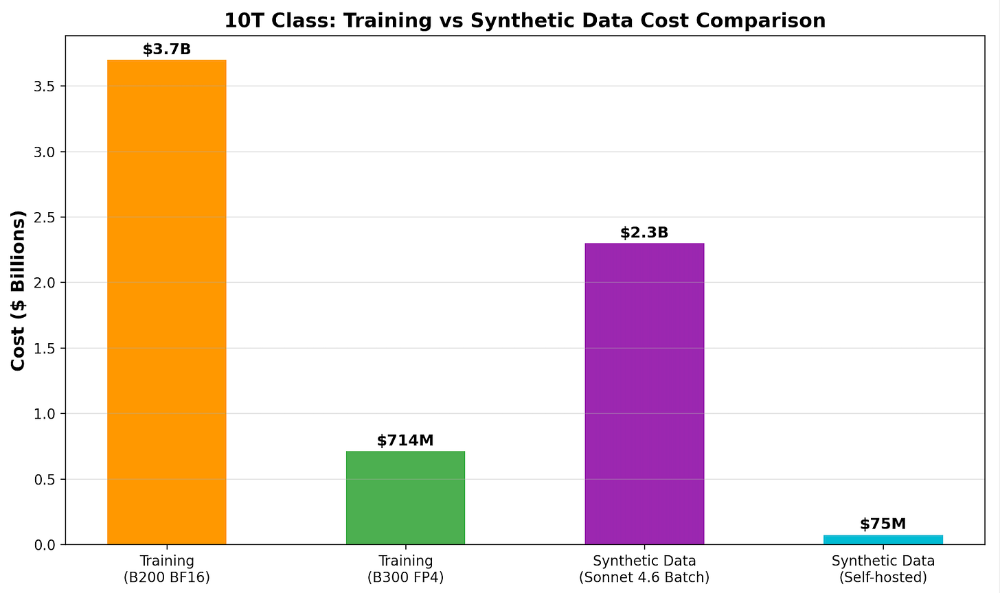
图3：10T量级成本拆分，训练vs合成数据

有几个务实的替代方案可以压低合成数据成本：

自托管推理：在自有GPU上运行一个Llama量级的模型（MiniMax等会不错，因为它们的激活参数更少且性能稳健），生成300T token成本约 $50M到 $100M，比Sonnet 4.6 API便宜20到40倍。
多轮训练：用课程学习在同一批100T token上训练4次，零数据生成成本，尽管在2到3轮之后收益递减。
改写或增强：取100T互联网token，用廉价模型改写3到4次，比从零生成便宜得多。
混合方法：100T互联网 + 50T高质量合成 + 3轮，约400T有效token，生成成本极低。

## 后训练与关键发现

我们主要关注预训练和合成数据生成成本。后训练（SFT + RL）可能额外花费20%（Epoch AI对DeepSeek R1的分析）。xAI报告说，他们在Grok 4的后训练上花费的算力几乎与模型预训练一样多。

本次思维推演的关键发现可以归纳如下：

2T量级非常可实现：191个NVL72机柜，BF16下 $148M。NeoLabs仍能应付，数据需求（80T）在互联网可得性范围内。

4T量级可行：762个机柜，BF16下 $593M。需要约60T合成token才能达到总共160T token，可管理但开始变得非常昂贵。

10T量级在超大规模云厂商伙伴和成吨现金的支持下触手可及：4,763个机柜，BF16下 $3.7B。但300T合成token还要额外增加 $2.3B（API）或约 $75M（自托管更便宜的模型）。

合成数据的成本可能和训练一样高：按API定价，通过Sonnet 4.6生成300T token花费 $2.3B，几乎相当于10T量级模型在B200上以BF16精度训练成本 $3.7B的60%。在这一量级上，自托管生成可能变得不可或缺。

B300只有在FP4下才胜出：BF16下吞吐量与B200完全相同，但贵20%。据我理解，Nvidia将B300定位为推理而非训练。

数据是主要瓶颈：不只是算力或GPU本身，10T模型所需的400T token要求可能是最难满足的约束。

<strong style="font-size:15px;color:#8b6f4c;">结语</strong>

这篇推演最有意思的地方，不是算出了几个吓人的数字，而是把"训练下一代模型"从口号拉回工程约束。2T量级 $148M对中小团队已可触及，但10T量级的真正门槛不是GPU，而是那300T合成token的数据缺口。  
作者把B300的"训练优势"戳破了：BF16下它和B200没区别却贵20%，所谓升级更多是Nvidia的推理卡叙事。选型时别被规格表的峰值数字带偏。  
一个值得警惕的转向是，合成数据成本正在逼近训练成本本身。当API生成300T token要 $2.3B，自托管推理和多轮训练不再是省钱技巧，而是10T量级能否成立的硬前提。  
当然，这是基于公开公式和20% MFU假设的思维推演，真实值会随并行效率、定价和架构变化而大幅浮动，结论看量级即可。

---

参考：https://polymath707.substack.com/p/claude-mythos-class-training-compute
