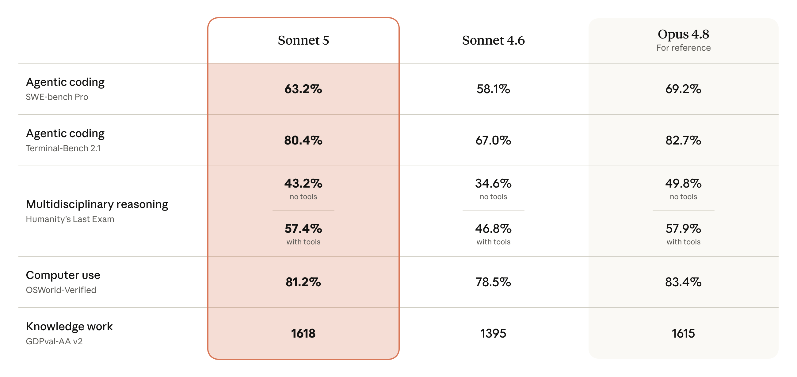

<strong style="font-size:16px;color:#1a6ba0;">要点速览</strong>

- <strong>Agent能力最强的Sonnet</strong>：Claude Sonnet 5能自主规划、使用浏览器和终端、独立完成多步骤任务，是Sonnet系列中Agent能力最强的一代  
- <strong>价格远低于Opus，性能接近</strong>：标准价 $3/$15每百万token，性能在多个基准测试上与Opus 4.8的差距已大幅缩小。促销期到8月31日，输入仅 $2/MTok  
- <strong>效率优于Sonnet 4.6全面</strong>：在Agentic编程、计算机使用、知识工作等所有维度都显著优于Sonnet 4.6，更高的pass rate和更低成本  
- <strong>安全升级</strong>：不良行为率更低，幻觉率和谄媚率下降，默认启用实时网络安全防护

---

**Claude Sonnet 5是Anthropic于2026年6月30日发布的新一代中端模型。** 它在Sonnet 4.6基础上实现了全面升级，性能接近旗舰Opus 4.8，但价格仅为Opus的一半左右。这是迄今为止Sonnet系列中Agent能力最强的模型：能规划、能使用浏览器和终端、能自主运行复杂任务。

**定价方面，Sonnet 5走了一条亲民路线。** 截至2026年8月31日的促销期内，输入仅 $2/百万token，输出 $10/百万token。促销结束后标准价为输入 $3/百万token、输出 $15/百万token。相比之下，Opus 4.8的定价为输入 $5/百万token、输出 $25/百万token。不过要注意，Sonnet 5采用了更新的tokenizer，相同输入下token数增加1.0–1.35倍。Anthropic表示促销定价可以做到成本中性的迁移。

Sonnet 5即日起成为Free和Pro方案的默认模型，Max、Team、Enterprise用户以及Claude Code和Claude Platform均可使用。API模型名为 `claude-sonnet-5`。

**Sonnet 5在五个核心维度上全面超越了Sonnet 4.6。** 以下是官方公布的对比数据：

Sonnet 5与Sonnet 4.6、Opus 4.8在多个基准测试上的对比数据

数据很清晰：在Agentic编程（SWE-bench Pro 63.2%、Terminal-Bench 2.1 80.4%）、多学科推理（HLE无工具43.2%、有工具57.4%）、计算机使用（OSWorld-Verified 81.2%）和知识工作（GDPval-AA v2 1618分）方面，Sonnet 5全面领先Sonnet 4.6。尤其在知识工作上，它甚至以1618分微弱超过了Opus 4.8的1615分。

**Sonnet 5的效率曲线。** Anthropic引入了一个 "effort level" 系统：用户可以通过调节推理深度（从low到xhigh再到max）来平衡成本和性能。

Agentic search性能随effort和成本的变化曲线（BrowseComp基准）

橙色线（Sonnet 5）在整条曲线上都优于灰色线（Sonnet 4.6）。在 "low" effort下，Sonnet 5仅需约 $1.5/任务就能达到60% 的pass rate，而Sonnet 4.6需要 $10+ 才到68%。到了 "max" effort，Sonnet 5以不到 $25/任务的成本达到约85% 的pass rate。黄色线（Opus 4.8）在最高端略好，但起步成本是Sonnet 5的近5倍。

Agentic computer use性能随effort和成本的变化曲线（OSWorld-Verified基准）

在计算机使用场景（OSWorld-Verified）中，Sonnet 5同样展现出极高的cost-performance比：在约 $0.5/任务就能达到80% 的pass rate，而Opus 4.8要达到类似效果需要花费近 $1/任务。对大规模Agent部署来说，这个差距会转化为显著的成本优势。

**安全方面，Sonnet 5也有实质性进步。** 自动化行为审计显示，它的不良行为率低于Sonnet 4.6，对恶意请求和对抗性提示注入攻击的抵抗能力更强，幻觉率和谄媚率也更低。网络安防功能默认启用，与Opus 4.7/4.8同级。在开发可用的Firefox漏洞利用方面，Sonnet 5的成功率为0%，远低于Opus 4.8和Mythos 5。它还加入了网络验证计划，可在Claude Platform、AWS和Microsoft Foundry上使用，即将登陆Google Vertex。

**早期合作伙伴的反馈也印证了Sonnet 5的Agent能力。** GitLab说它为Agent提供了强大的多步骤软件工程执行层。Salesforce分享了一个真实场景：一个更新客户层级、发送发布公告的两部分任务，以前总是做到一半就卡住，Sonnet 5端到端地跑完了。Cursor则提到，它让Sonnet 5调查一个bug：没有额外提示，它自己写了重现测试、实现了修复，然后把修复暂存确认bug会回来，全部在一个回合内完成。Replit测试了几十个最具挑战性的真实pull request，Sonnet 5全部独立推进到经过验证的结果。Vercel和Sourcegraph也给出了高度评价。

<strong style="font-size:15px;color:#8b6f4c;">结语</strong>

Claude Sonnet 5的发布说明了Anhtropic的产品策略正变得越来越清晰：把Opus留给最苛刻的场景，用Sonnet线去承接绝大多数日常Agent工作。如果Sonnet 5在Agent任务上已经做到85% 的Opus水平而只需一半价格，那对开发者来说，选择就不难做了。  
一个值得留意的信号是，Sonnet 5在Cursor和Replit这样的工程Agent场景中的表现极为亮眼，而他们都是在用户真实工作流中对模型进行评测的。这种"在实际代码中测"的验证方式，可能比任何标准化benchmark都更有说服力。

---

参考：

https://www.anthropic.com/news/claude-sonnet-5
