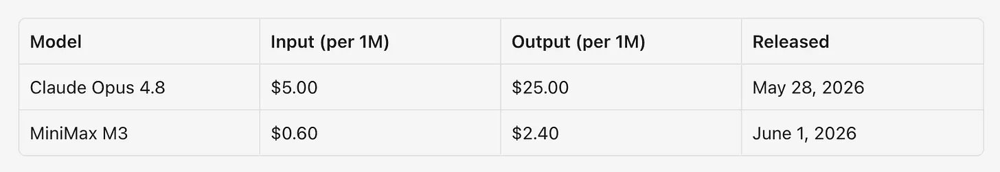
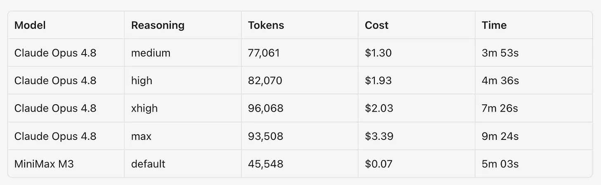
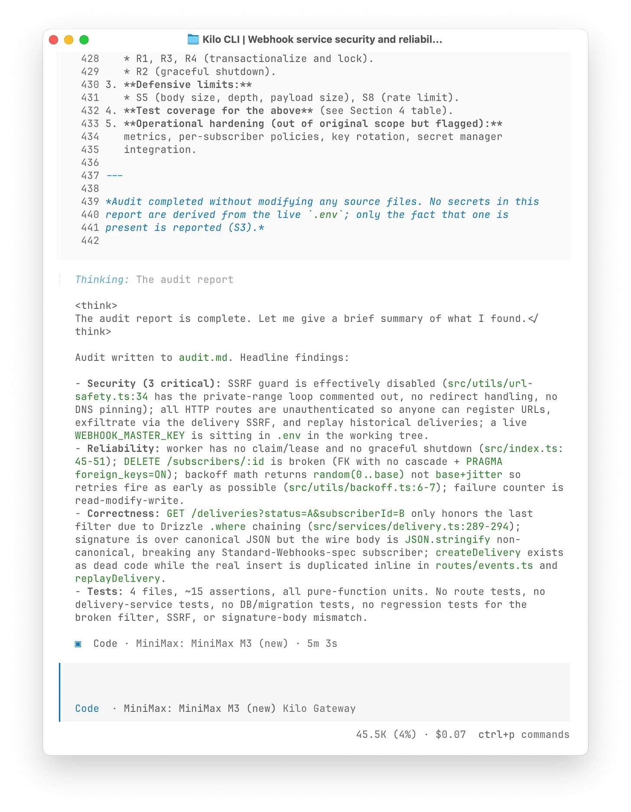
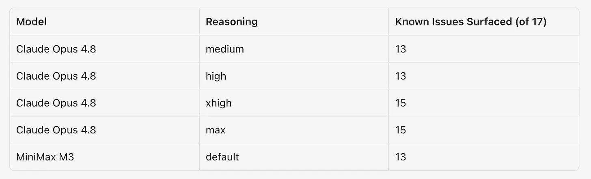
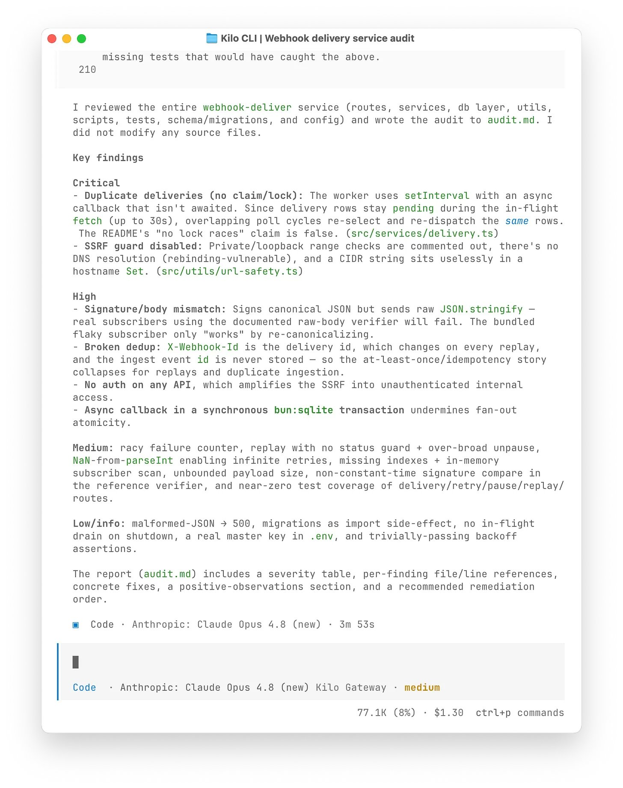
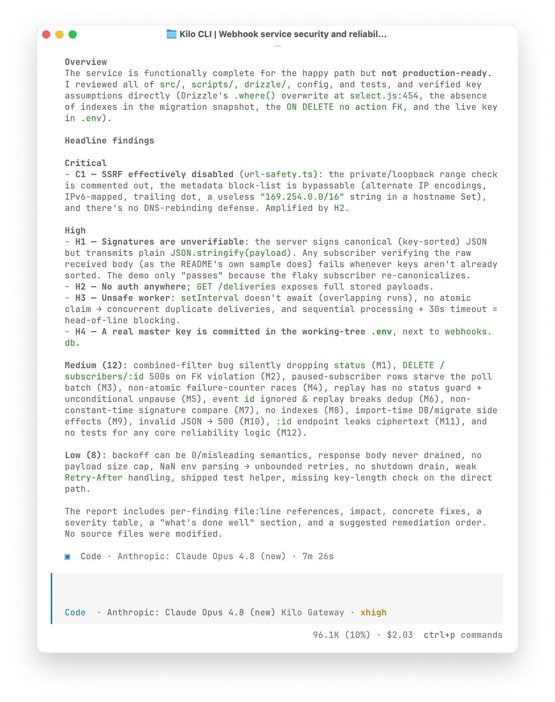
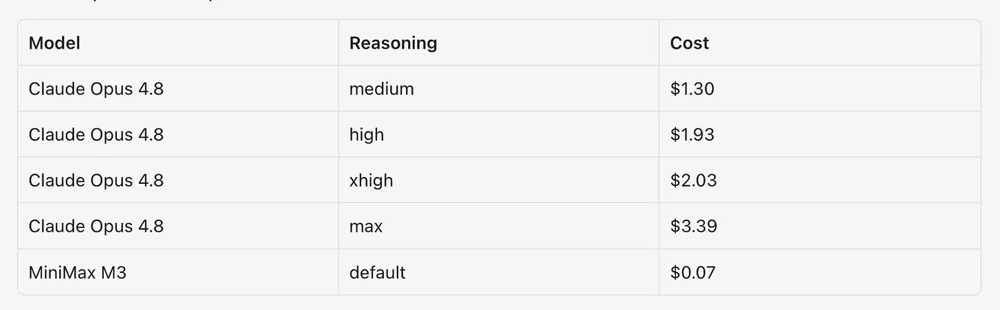
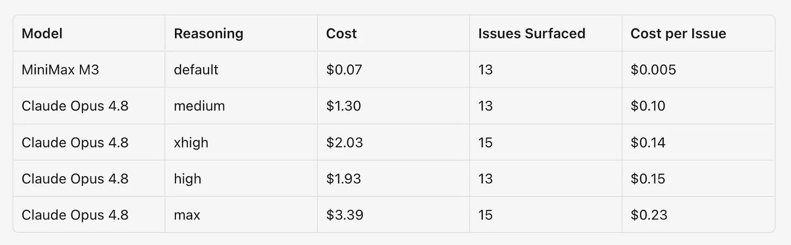
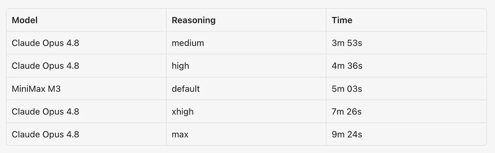

一个代码审计任务，两个模型，五种配置——结果用一张表就能说清楚，但背后的数据值得深挖。

Kilo 给同一个 webhook 服务代码库（TypeScript、Bun、SQLite）安排了 5 次审计：Claude Opus 4.8 在 4 个推理级别（medium、high、xhigh、max），外加 MiniMax M3 默认设置。代码库中预埋了 17 个已知问题，涵盖了安全、可靠性、正确性和测试覆盖。每次审计写一份 audit.md，不修改任何文件。

结果：MiniMax M3 花了 $0.07 找出 13/17 个问题，和 Claude Opus 4.8 在 medium 和 high 级别打平，仅落后 xhigh 和 max 两个问题。而 Claude Opus 4.8 最贵的跑了一次 $3.39。

---

## 1 引言

两个模型在 per-token 价格上差距巨大。Claude Opus 4.8 输入贵约 8 倍，输出贵约 10 倍。价格和性能并不总是同步移动，所以值得把它们放在一起看。

---

## 2 测试方法

代码库是一个用 TypeScript、Bun、SQLite 写的 webhook 投递服务。接受 HTTP API 事件，存储，用签名 payload 投递到订阅者 URL。预埋了已知 bug 没有修复——一个小但真实的服务，适合做审计样本。

每次跑的 prompt 完全一样：

> 把这个 webhook 投递服务当作生产级代码审计，检查安全、可靠性、正确性和测试覆盖，不修改任何文件。把报告写到 audit.md。

唯一输出就是那份审计报告。

Claude Opus 4.8 跑了 4 个推理级别：medium、high、xhigh、max。MiniMax M3 不暴露同样的推理控制，以默认设置跑一次，作为对照点。

每次跑都用 Claude Code CLI，独立会话无共享状态，记录 token 数、费用和墙钟时间。

---

## 3 Token 与费用

MiniMax M3 用了比任何 Claude Opus 4.8 跑次都少的 token。比 Claude Opus 4.8 medium 少 41%，比 xhigh 少 53%。费用才是真正突出的——$0.07，不到最便宜 Claude Opus 4.8 跑次的十分之一。

差距这么大的原因是更少的 token 加上更低的每 token 价格。Claude Opus 4.8 读写更多来生成报告，每个 token 按好几倍的价格计费。

---

## 4 发现问题

跑测试之前，Kilo 自己审查了代码库，整理出 17 个问题作为答案键。范围从安全问题（返回存储密钥的 endpoint、被有效关闭的出站请求防护）到可靠性问题（可能重复发送同一条 webhook 的后台 worker）到缺失的测试覆盖。

只有在跑次明确命名了该问题时才算找到，部分提及不算。

所有 5 个跑次都抓到了主要阻塞问题——路由缺少认证、不安全的出站请求处理、签名计算与实际发送的字节串不一致、非常数时间的签名检查、worker 可能重复拾取同一条投递、事件幂等性缺失。

---

## 5 MiniMax M3 表现

MiniMax M3 在更具体的问题上也站住了脚。它抓到了返回存储密钥的 endpoint、投递列表过滤器在组合两个条件时丢失条件、存在投递历史后订阅者删除失败、以及接受错误状态投递的回放路径。

它漏了 3 个 Claude Opus 4.8 抓到的——无效 JSON 返回 500、数据库设置在 import 时运行、event route 中同步事务内运行异步回调。这些比它抓到的阻塞问题小，但这就是它停在 13 而不是 15 的原因。

---

## 6 推理级别的影响

Claude Opus 4.8 在 xhigh 和 max 级以 15/17 领先。两者都抓到了暂停订阅者的积压和投递列表过滤器 bug——medium 和 high 未抓到的。Claude Opus 4.8 xhigh 是唯一同时抓到密钥返回 endpoint 又覆盖了同级别所有其他问题的跑次。

更高级别的推理并不单向提升。medium 和 high 都标记了同步事务中的异步回调——xhigh 和 max 反而没提。max 漏了 xhigh 抓到的密钥返回 endpoint。提高推理级别更多改变了模型把注意力放在哪里，而非检查了多少。

---

## 7 每次跑的费用

费用和 token 数成正比。

Claude Opus 4.8 max 跑次值得单独看——花了 $3.39，比 xhigh 贵 67%，用了略少的 token。token 总量本身不决定价格。输出和缓存 token 的不同组合可以把账单推高，即使总量不变，在这个任务上多花的钱没有买到更好的报告。

每次找到问题的单位成本：

MiniMax M3 的每问题成本遥遥领先。Claude Opus 4.8 max 最高。找到最多的两个设置——xhigh 和 max——并不是每美元最高效的。

---

## 8 耗时

墙钟时间更多跟着 token 而非模型本身走。MiniMax M3 在中间——5 分 03 秒，比 Claude Opus 4.8 medium 和 high 慢，比 xhigh 和 max 快。它的优势在成本而非速度。

一个注意事项：MiniMax 说计划公开发布 M3 权重。目前权重未公开，但一旦发布，其他推理提供商可以托管，吞吐量可能更高。

---

## 9 结论与推荐

4 个 Claude Opus 4.8 跑次并不随推理级别线性提升。medium 和 high 都是 13/17。从 high 到 xhigh 多了 17% token 和 5% 费用，多了近 3 分钟，找到了 15 个。xhigh 是 Claude Opus 4.8 的最佳报告。max 开销最大、耗时最长、产出最少——和 xhigh 一样 15 个，贵了 67%，还漏了一个 xhigh 抓到的。

选择不是哪个模型更好，而是匹配跑次到任务：

- **低成本/高量审计**：MiniMax M3，$0.07 抓 13/17，约 5 分钟。抓到了 Claude Opus 4.8 便宜跑次漏掉的问题
- **快速 Claude Opus 4.8 扫描**：medium，$1.30，不到 4 分钟，抓到了 xhigh 和 max 漏掉的问题
- **更精确的 Claude Opus 4.8 审查**：high，$1.93，代码级发现更锋利
- **最彻底的单次审查**：xhigh，$2.03，15/17，最佳报告
- **最不值**：max，$3.39，9 分 24 秒，未超过 xhigh

更便宜模型（包括开源权重）正在快速追赶。在这个任务上 MiniMax M3 追平了 Claude Opus 4.8 的 medium 和 high，但比更高的设置差两个问题。实际做法是在你实际做的工作上测试几个模型，根据需求、预算和覆盖要求选择。

---

## 10 一点观察

**这是目前看到最诚实的模型对比测试之一。** 不是标准 benchmark，是真实代码库的真实审计。Kilo 列出了答案键（17 个预埋问题），公布了每次跑的发现明细——哪个跑次找到了哪个具体问题。这种透明度在模型对比中很少见。

**推理级别不是越高越好。** Claude Opus 4.8 的 medium 找到了 xhigh 和 max 漏掉的问题（async callback in sync transaction）。max 比 xhigh 贵 67% 但没有更好。对代码审计这类需要广泛覆盖而非深度推理的任务，medium 到 xhigh 可能是有效区间，max 的性价比在快速下降。

**MiniMax M3 的 $0.07 比 Claude Opus 4.8 medium 的 $1.30 便宜了 18 倍，只差 4 个问题。** 如果你的审计需求是"天天跑、抓大问题、漏几个小问题可以接受"，MiniMax M3 的性价比逻辑很强。但如果那 4 个问题里有你的生产环境关键 bug，"18 倍便宜"就没意义了。

**数据揭示了两个不同的使用场景，而不是两个竞争模型。** Claude Opus 4.8 是"让我看清楚"——成本高但覆盖广，适合深度审查。MiniMax M3 是"让我跑起来"——成本极低但覆盖够用，适合日常扫描和质量门禁。两个场景不是替代关系，是不同流水线阶段的工具。

---

参考：We Audited the Same Codebase with Claude Opus 4.8 and MiniMax M3
