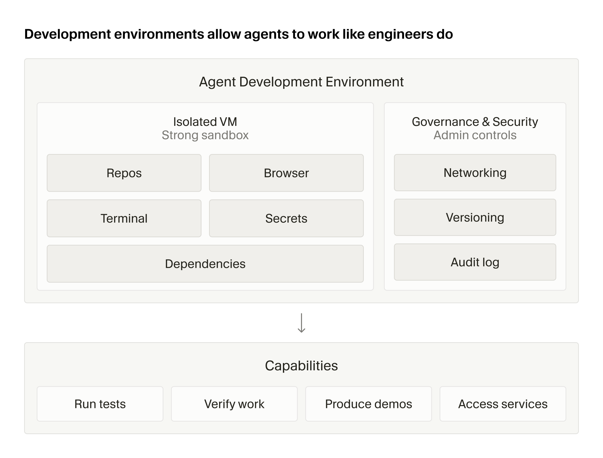
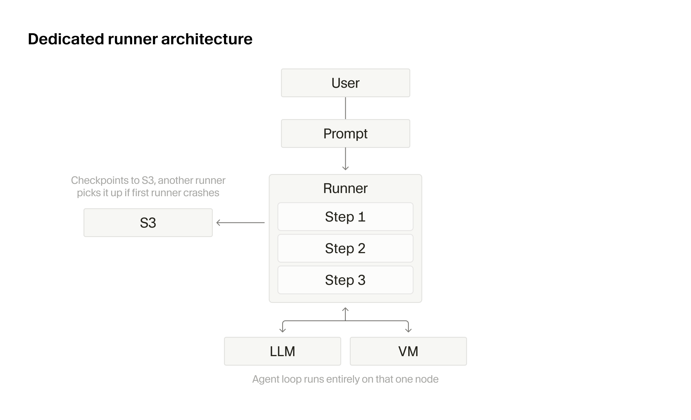
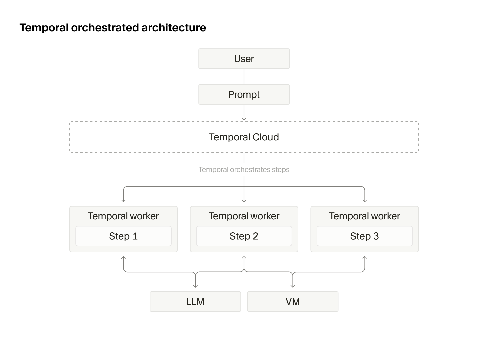
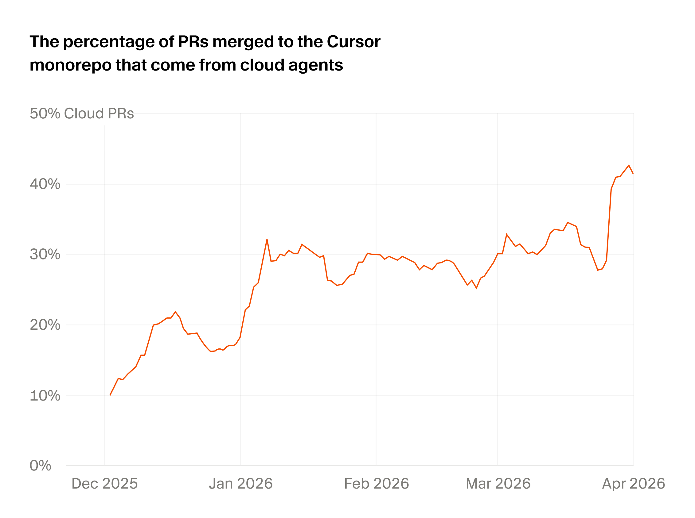
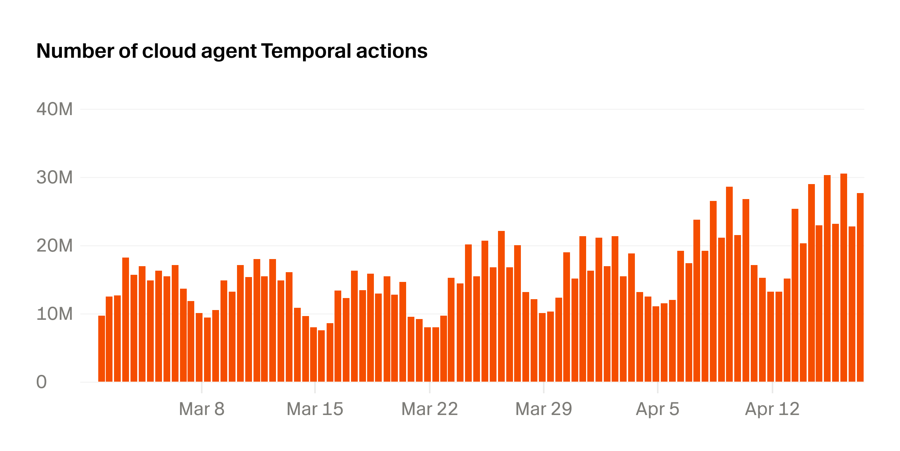
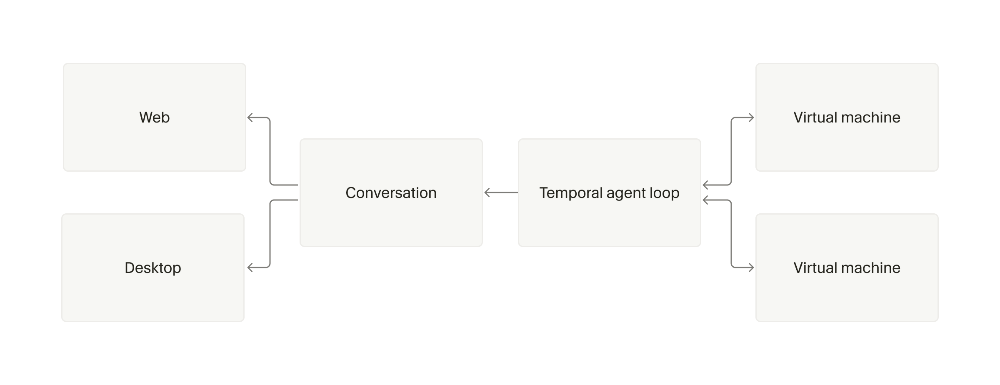
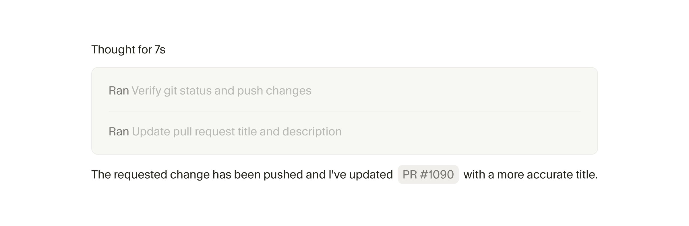

**Cursor 云 Agent 五大教训：40% PR 已由 Agent 自动生成**

一年前刚推出云 Agent 时，它看起来只是本地 Agent 的简单延伸。如今，云 Agent 运行在专属虚拟机上，拥有独立的环境、依赖和网络访问权限，可以并行工作、无人值守运行、处理比本地 Agent 更长的任务。这些能力带来了环境搭建、可靠性和编排方面的全新挑战——构建云 Agent 越来越不像把本地 Agent 移植到服务器，而更像在它周围构建一个操作系统层。

---

**1. 开发环境即产品**

过去一年里，本文作者学到的最大教训是：**影响云 Agent 输出质量的单一最大因素，是确保它拥有完整的开发环境，就像开发者本人拥有的一样。**

本地 Agent 天然继承了你笔记本电脑上的开发环境，无需额外操心。**但在云端，你必须从头重建一切，而且很难判断重建是否完美。** 没有崩溃，没有错误信息，唯一的迹象往往是输出质量的微妙下降——你可能一开始没注意到，或者注意到了但归咎于模型。

但作者一次又一次地追溯到同一个诊断：云 Agent 缺少执行或验证工作所需的环境。一年前这还不是大问题，因为模型本身也利用不了多少环境信息。**但随着模型越来越聪明，环境搭建已成为决定它们能否发挥全部潜力的关键因素。**

要达到「完整环境」，需要重建大量基础设施：更好的用户工具来构建 Agent 环境、在消息之间高效休眠和恢复 Agent VM 的方法、快速且持久地检查点/恢复/分支 VM 镜像的流水线、紧密的 Harness 和客户端集成。随着云 Agent 承担更多工作，它们还需要受控的网络访问来创建 PR、拉取依赖和做研究。**作者最终构建了本质上是一套面向 Agent 的企业 IT 系统，包括密钥审查、网络策略和凭据管理。**

---

**2. 长时间运行的 Agent 需要持久化执行**

云 Agent 面临与本地 Agent 不同的可靠性挑战。**它们运行在隔离的 VM 中，开发者可以并行运行多个 Agent，并委派通常需要数小时而非数分钟的长任务。**

但 VM 也带来了新的风险：推理服务商宕机、Pod 被替换、EC2 节点下线。作者最初采用工作窃取架构构建云 Agent——工作节点可以拾取 Agent 并循环运行到完成。**这相当于把本地方案移植到了服务器上，但非常脆弱——早期云 Agent 的 beta 版本经常只能达到一个 9 的可靠性。**

随着云 Agent 成熟，作者发现自己即将重建大量 Temporal 已经解决的持久化执行原语（重试机制、跨机器调度、节点故障持久化），于是直接迁移到了 Temporal。

**现在基于 Temporal 的 Agent 循环可以承受推理可靠性波动、Pod 休眠和恢复，以及跨越数天甚至数周的执行。** 仅这一项迁移就让可靠性超过了两个 9。如今，Temporal 每天处理超过 5000 万次操作，覆盖超过 700 万个独立工作流。在 Cursor 内部，超过 40% 的 PR 来自云 Agent，而且这个比例还在增长。

随着时间的推移，作者学会了如何更好地架构 Temporal 工作流。**他们从「永恒」的 Agent 工作流转向了多个更短的工作流——每个工作流完成单个任务后退出，这让版本升级更容易。** 他们还拆分了活动（activities），以更好地捕获超时和重试，因为异步工具调用、子 Agent 和推理服务商宕机已经改变了底层假设。

---

**3. 解耦 Agent、机器与对话状态**

一个云 Agent 不再只是在一台机器上运行的一个循环。**Agent 可能在一台机器上运行，在多个机器上生成异步子 Agent，或者从本地开始然后委派工作到云端。** 子 Agent 甚至可能比父 Agent 活得更久，或者运行在完全不同的 Pod 上。

为了实现这一点，作者将 Agent 循环、机器状态和对话状态保持为解耦的组件。**因为 Agent 循环运行在 Temporal 而非 VM 上，他们可以独立管理 Pod 生命周期，并在不同类型的 Pod 上运行 Agent——包括只读 VM 或预热 VM 等优化。**

在对话端，他们将存储和流式传输层与核心 Agent 工作流分离。**他们构建了一个高效的追加式存储机制，将对话更新流式传输到 Web 和桌面客户端。** 这一层处理了重试场景：如果 Agent 循环的某一步在流式传输部分输出后失败并重试，客户端可以检测到这一情况，回滚流，然后显示新数据而非旧数据。

---

**4. 知道何时让路**

构建云 Agent Harness 意味着不断重新评估多少行为是确定性的，多少行为交给 Agent 自主决定。

早期，作者不太信任 Agent，Harness 会在每个任务后检查它的工作、强制提交并推送。随着模型变得更聪明，他们开始将逻辑从 Harness 转移到 Agent 控制的工具中。一年前，多仓库设置需要硬编码的 Harness 行为。**现在，他们可以给 Agent 仓库布局、暴露分支和 PR 的工具，然后让 Agent 自己决定如何完成工作。**

CI Autofix 也经历了同样的演变——早期版本的云 Agent Harness 包含抓取作业失败日志并写入 VM 的逻辑。**现在，他们只需给 Agent GitHub CLI 的访问权限，并自动将大输出写入 Agent 可以搜索的文件。** Agent 收到的通知变得简单得多。

**Harness 不会消失，而是它的内容在变化。** 计算机使用（Computer use）就是一个很好的例子。云 Agent Harness 有一个专门的计算机使用子 Agent 类型，拥有自己的模型路由、自定义提示和屏幕录制。VNC 和 Chrome 属于环境的一部分，由父 Agent 和子 Agent 共享——父 Agent 可以直接使用它们，例如运行 Playwright 脚本。

云 Agent 还需要与本地 Agent 不同的提示词。**作者鼓励它们更加自主，因为阻塞的成本要高得多。** 在本地，你知道 Agent 何时停止并等待许可；但在云端，它可能在你回去检查之前就坐在那里等上几个小时。

---

**5. 自愈的 Agent 环境**

展望未来，作者的重点是超越「扶着 Agent 的手」和「放手不管」的二元选择。更好的模式是给 Agent 理解周围系统的工具。

**作者希望云 Agent 能够报告密钥缺失、网络访问被阻断或环境阻碍进展的情况，然后以自愈的方式采取行动。** 在最近的一篇研究博客中，他们讨论了实现这一目标的一条路径，称之为「autoinstall」。

云 Agent 在过去几个月里取得了巨大进步，作者预计变化速度只会越来越快。**Cursor 云 Agent 让团队能够利用这个广阔的空间，而无需自己构建或维护底层基础设施。**

---

**一点观察**

Cursor 这篇博客是典型的「亲历者视角 + 产品定位」文章——以 Cursor 内部构建云 Agent 的一年经验建立可信度，然后自然引出 Cursor 云 Agent 作为解决方案。类比精度值得审视：他们说「构建云 Agent 像构建操作系统层」，这个类比抓住了环境管理和编排的复杂性，但云 Agent 的「操作系统」目前仍然是高度定制化的——Temporal、VM 快照、企业 IT 策略，这些远不是开发者能一键获得的通用能力。**本文描述的问题真实存在，但给出的答案（使用 Cursor 云 Agent）只是众多路径之一。**

另一个值得注意的点是 40% PR 来自云 Agent 这个数字。放在一年前这听起来像科幻，但 Cursor 的 monorepo 本身就是最适合 Agent 的代码库——Cursor 的代码就是 Agent 的代码，这种同构性让 Agent 的成功率天然高于在普通项目中的表现。**当云 Agent 面对非 Cursor 的、没有深度优化的代码库时，这个数字会打多少折扣，才是行业真正关心的。**

---

参考：https://cursor.com/blog/cloud-agent-lessons
