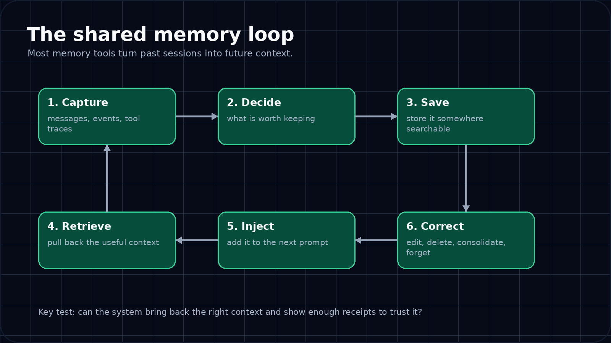
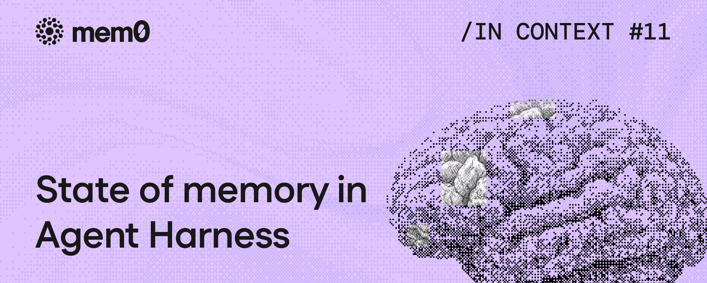
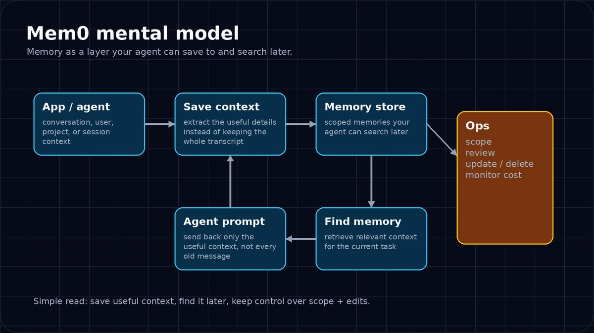
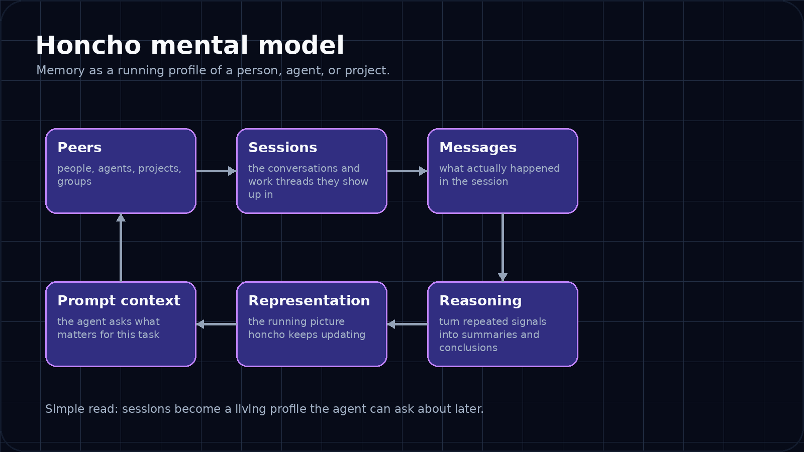
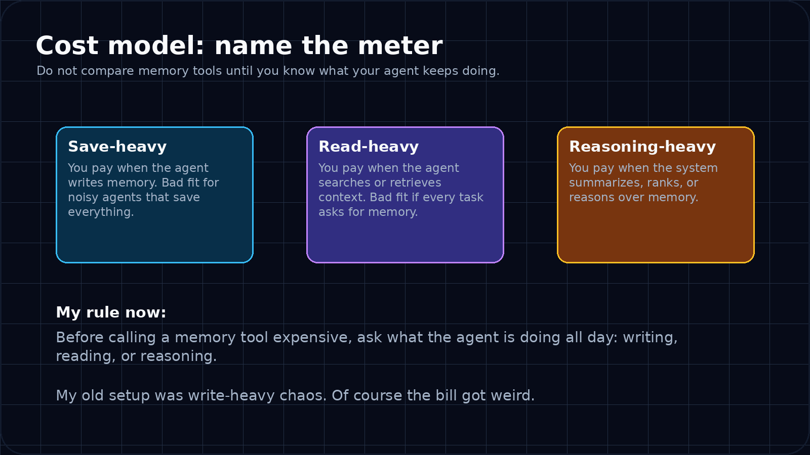
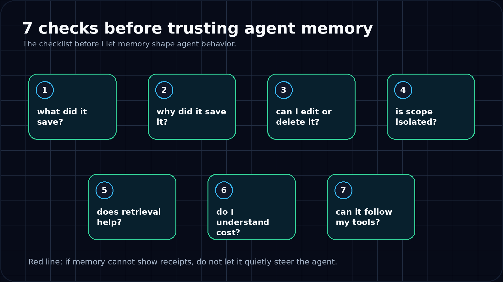

<strong style="font-size:16px;color:#1a6ba0;">要点速览</strong>

- <strong>Agent 记忆层的基本循环</strong>：会话中发生某事 → 决定保留什么 → 保存 → 后续检索 → 拉入新会话 → 修正错误。每个系统的核心差异在于它认为「记忆」应该是什么——是事实、笔记、摘要，还是一个人或项目的模型  
- <strong>记忆应该跟随工作流动</strong>：好的记忆层不应被困在单一应用里。跨工具、跨会话的「可携带工作记忆」是真正的需求——Honcho 正在这个方向，mem0 更像一个记忆数据库  
- <strong>信任记忆层的 7 项检查清单</strong>：能否查看保存了什么/为什么保存、能否编辑/删除错误记忆、是否限定在正确的作用域、带回的是有用上下文还是噪音、是否理解成本计量方式、能否接入已有工具——其中「能否查看保存了什么和为什么」是最关键的两条

---

> **核心洞察**：Agent 不再每次打开终端时从零开始。它记得足够多，可以继续工作。记忆系统正在改变我们对工具的思考方式。

**Agent 记忆系统正在改变我对工具的思考方式。** 每次打开新会话，内容 Agent 已经知道我的语气规则、我的红线、上周我拒绝了什么、以及我正在构建什么。

**为什么我开始认真对待 Agent 记忆插件**

我在自己的服务器上运行 Hermes Agent。当打开新会话时，内容 Agent 已经知道我的语气规则、我的红线、上周我拒绝了什么、以及我正在构建什么。**Agent 不再每次打开终端时从零开始。** 它记得足够多，可以继续工作。

我一直在深入 Agent 记忆系统，因为我认为这将是人们很快就会关心的一个重要层面。有用的版本很简单：**Agent 可以跨真实工作携带上下文，而不需要我每天早上重新解释同一个项目。**

一些背景：我不绑定某一个记忆层。我喜欢尽早测试新的 Agent 工具，尤其是那些触及真正重要的部分的——成本、信任、召回、边界——以及演示之后是否还能工作。

---

**每个记忆系统本质上都在做同一件事**

简单版本：会话中发生某事 → 记忆层决定什么值得保留 → 将上下文保存到某处 → 之后 Agent 请求有用的内容回来 → 有用的内容被拉入下一个会话 → 当它变得奇怪时你需要某种方式来修正它。

有趣的部分在于每个系统认为「记忆」应该是什么。是一个保存的事实？一个可搜索的笔记？一个摘要？一个人的模型？一个项目的模型？**这个选择改变了一切。**

---

**最酷的部分：记忆可以跟随工作流动**

这是我最为关心的部分。一个好的记忆层不应被困在单一应用里。如果我在使用多个 Agent 工具，我希望上下文能跟随工作流动。

目前我在几个 Hermes Agent 中使用了 Honcho，也把它接入了 Codex 里的一个项目。当我回来构建一个应用或工具时，项目不会感觉完全冰冷。**它能记住设计方向、我已经追查过的奇怪 Bug、我不断重复的约束条件、以及我不想重新争论的决策。**

这就是我关心的类别：**Agent 的可携带工作记忆。** 我在寻找的是能够跨会话和跨工具跟随项目的记忆。

---

**mem0 感觉像 Agent 的记忆数据库**

mem0 是这个想法的一个版本。你的 Agent 可以从对话中保存有用的细节，之后在需要上下文时搜索它们。这是一个非常实用的形态。如果你在构建一个需要记住用户、偏好、历史对话、项目细节、支持记录等的应用或 Agent，你不想从头构建所有这些东西。**mem0 更接近一个你的 Agent 可以调用的记忆层。**

我之前在一个相当混乱的设置中使用过 mem0：巨大的代码库、持续的 Agent 对话、太多事情同时发生。**它很快就变得昂贵了。** 我不会假装知道多少是 mem0 的问题、多少是我像疯子一样使用它的问题——可能两者都有。但它教会了我记忆工具的第一条规则：**你必须知道你正在敲哪个计量表。**

| 收费模式 | 说明 |
|---------|------|
| 保存时收费 | 每次写入记忆都计费 |
| 检索时收费 | 每次读取记忆都计费 |
| 按 Token 收费 | 按处理的文本量计费 |
| 按推理步骤收费 | 按 Agent 的推理步数计费 |

如果你的 Agent 在持续写入和读取上下文，这就会累积起来。

---

**Honcho 更像一个活的档案**

Honcho 是我目前用得最多的，因为它接入了我的 Hermes 设置。用最简单的方式解释：**Honcho 不只是存储随机笔记，它随时间构建一个人、Agent 或项目的持续画像。**

在我的设置中，我是一个对等节点。我的 Hermes 内容 Agent 是一个对等节点。一个项目也可以被当作一个对等节点来处理。消息进入，Honcho 在后台处理它们。随着时间的推移，它学会了我喜欢什么、我一直在拒绝什么、我当前的策略是什么、我讨厌什么措辞、以及某个特定项目想要成为什么。

> 真实例子：在起草之前，我的 Hermes 内容 Agent 可以查询我最近做了哪些品味判断。它能拉回类似「cobi 讨厌编排好的改写文案」或「cobi 希望草稿基于实际收据而非感觉」这样的信息。

**这些都是我在不经意间做出的决定，有时是几周前，有时是在开车时用语音笔记记录的。** 有用。但也不是魔法。我仍然会检查它。记忆会变陈旧、过度拟合某个偏好、或以错误的权重记住某件事。

这就是为什么我把 Honcho 当作我的实时基线，而不是最终答案。

---

**这其实是关于检查清单，而不是 Logo**

经过几次测试后，演示版本的重要性大大降低了。我关心的是经过一周真实会话后的表现：

| 问题 | 核心 |
|------|------|
| 是否记住了正确的东西？ | 准确性 |
| 是否忘记或修正了错误的东西？ | 纠错能力 |
| 是否保持在正确的项目范围内？ | 作用域控制 |
| 是否让 Agent 变得更好，还是只是更自信？ | 真实增益 |
| 当 Agent 真正使用它时，账单是否合理？ | 成本效益 |

**它是否保持在正确的项目范围内？它是否让 Agent 变得更好，还是只是更自信？当 Agent 真正使用它时，账单是否合理？**

「这个记忆工具贵吗？」这个问法本身就太模糊了。更好的问题是：**你的 Agent 多久写入一次记忆、多久读取一次记忆、以及这个工具对什么收费？** 我之前的设置是写密集型混乱——当然会变得昂贵。

---

<strong style="font-size:15px;color:#1a6ba0;">信任 Agent 记忆之前的 7 项检查</strong>

这是我目前使用的检查清单：

| # | 检查项 |
|---|--------|
| 1 | 我能否查看/询问它保存了什么？ |
| 2 | 我能否查看/询问它为什么保存了它？ |
| 3 | 我能否编辑或删除错误的记忆？ |
| 4 | 它是否限定在正确的人、Agent 或项目范围内？ |
| 5 | 它带回的是有用的上下文，还是只是嘈杂的历史？ |
| 6 | 我是否理解它的成本计量方式？ |
| 7 | 我能否接入我已经在使用的工具？ |

> 如果一个记忆层不能展示它保存了什么以及为什么保存，我不希望我的 Agent 在它之上悄悄构建行为。

第 1 和第 2 条对我来说最重要。**如果一个记忆层不能展示它保存了什么以及为什么保存，我不希望我的 Agent 在它之上悄悄构建行为。** 一个健忘的 Agent 令人恼火。一个自信但记忆错误的 Agent 是危险的。

---

**为什么我现在写这些**

Agent 记忆正在改变我对工具的思考方式。一个有记忆的编码 Agent 可以记住项目决策。一个有记忆的内容 Agent 可以记住语气和策略。一个有记忆的研究 Agent 可以记住来源、约束条件和已经检查过的内容。

**我想要的形态很简单：人类仍然做决定，但 Agent 不再让你每个会话都从头重建上下文。** 这就是为什么我对更多记忆插件越来越感兴趣。我不在乎演示看起来多酷。我想知道记忆是否能在真实工作中存活下来：新会话、工具变更、成本压力、修正和混乱的项目。

Honcho 是我当前的基线，因为它已经在我的 Hermes 中运行。下一步，我想开始用同样的检查清单对更多记忆插件进行压力测试。谁有建议？

---

<strong style="font-size:15px;color:#8b6f4c;">结语</strong>

本文的价值不在于推荐工具，而在于建立了一个评估框架。前两条检查——「能否查看保存了什么」和「为什么保存」——指向一个更深的问题：<strong>记忆系统是否可审计。</strong> 不可审计的记忆层意味着不可预测的 Agent 行为，这比「贵不贵」重要得多。  
作者把 Honcho 定位为「基线」而非「答案」，同时公开了 mem0 上的踩坑经历。<strong>真正的记忆系统需要在真实工作负载下被考验，而不是在 demo 中表演。</strong>

---

参考：How my Hermes agent remembers me
