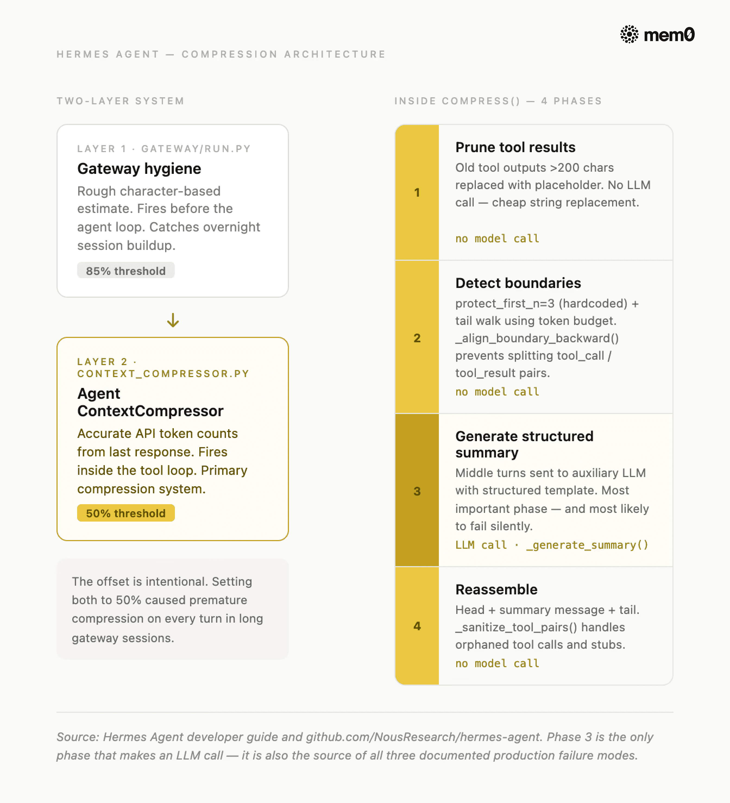
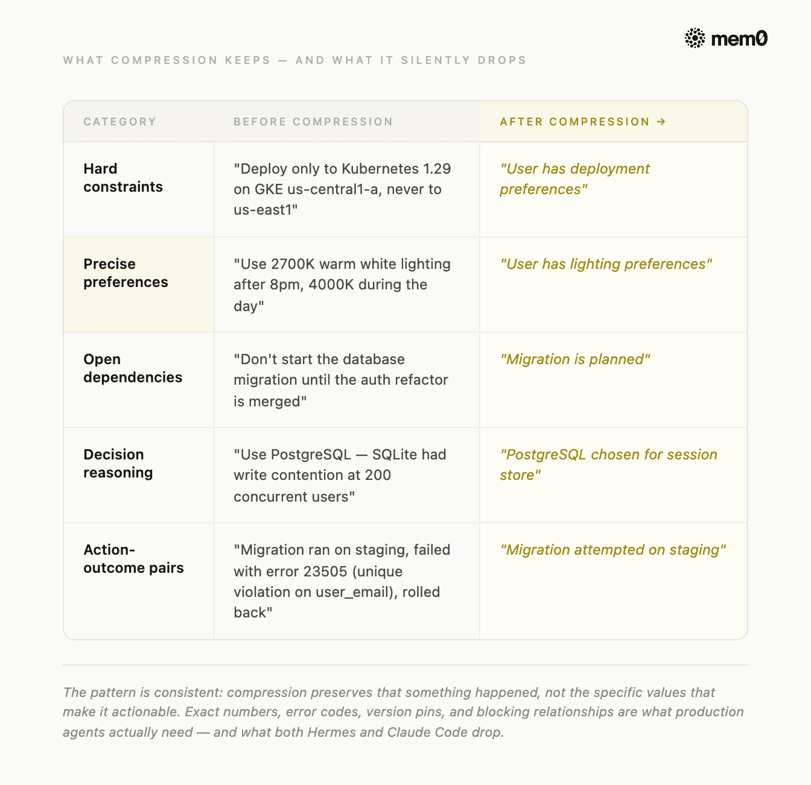
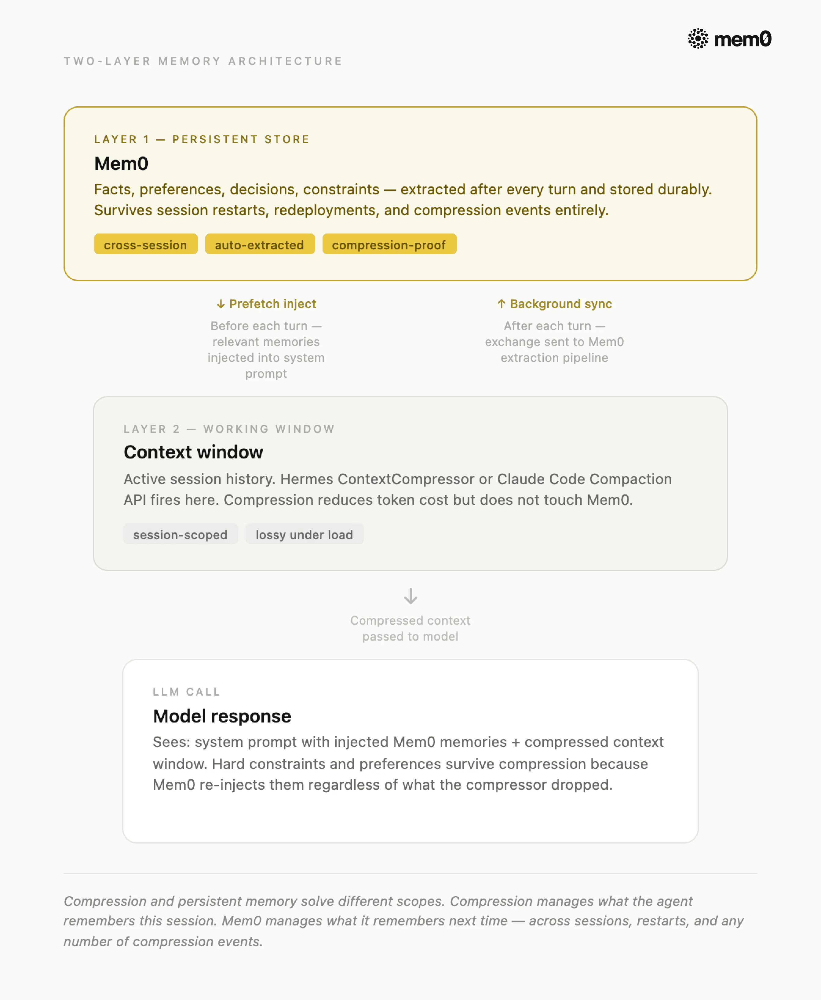

> 大多数上下文压缩失败看起来不像失败。Agent 继续运行。上下文继续缩小。token 数在下降，而消失的是你在第二轮给出的约束、Agent 在第八轮确认的精确值、以及它在任务间追踪的依赖关系。模型没变。架构没变。压缩器只是做了它该做的事——而且做得有损。

本文对两个真实生产级实现的上下文压缩方案进行代码级剖析：Nous Research 的 Hermes Agent（可配置的 `context_compressor.py`）和 Claude Code 的 Context Compaction API（通过 `compact-2026-01-12` beta header 启用）。我们将逐一分析它们的工作原理、失效场景、共同丢失的信息，以及**你在压缩触发前必须提取到持久化存储的内容**。

> **初次接触这个话题？三个关键术语：**
> - **Context window（上下文窗口）**：LLM 的工作记忆。对话历史中的每个 token 每次调用都要付费。
> - **Context compression（上下文压缩）**：当上下文变大时自动缩减历史，让 Agent 在不触达 token 上限的情况下继续运行。
> - **Persistent memory（持久化记忆）**：位于上下文窗口之外的独立持久化记忆存储（如 Mem0），跨会话、跨重启、跨压缩事件存活。

---

<div style="background:#e8f4fd;padding:14px 16px 10px 16px;border-radius:6px;margin-bottom:18px;">
<div style="text-align:center;margin-bottom:10px;">
<strong style="font-size:16px;color:#1a6ba0;">要点速览</strong>
</div>
<div style="font-size:14px;color:#3f3f3f;line-height:1.75;">
- <strong>Context drift 比 token 上限更致命</strong>：Zylos Research 2026 年调查发现，2025 年 65% 的企业 AI 故障根源是多步推理中的上下文退化，而非原始 token 耗尽。<br><br>
- <strong>Hermes 双层压缩系统</strong>：Agent 压缩器在 50% 触发，gateway 安全网在 85% 触发。两者故意错开——如果都设为 50%，每次轮次都会发生过早压缩。<br><br>
- <strong>Claude Code 的 Compaction API</strong>：用简单性换取可配置性——一个参数、服务端处理、无需边界调优。<br><br>
- <strong>两者都丢失精确值</strong>：两个方案都能很好地保留叙事连续性，但都会静默丢失精确值偏好和硬约束。<br><br>
- <strong>压缩管会话内，记忆管跨会话</strong>：压缩管理当前会话的工作窗口，持久化记忆管理跨会话存活的内容。两者都需要。
</div>
</div>

**什么是上下文压缩？**

上下文压缩是一种自动化过程，当 AI Agent 的对话历史接近 token 上限时，它会缩小历史记录，保留最重要的信息，同时丢弃或总结较早的轮次。**它让 Agent 在不崩溃的情况下继续运行，但总会损失一些精度。**

**最天真的方案是截断**：到达上限时丢弃最早的消息。它免费、快速，但几乎立刻就会破坏多步推理。**一个看不到自己六轮前做了什么决定的 Agent，会重新推导、自相矛盾或重新获取。这看起来像模型问题，但实际上是架构问题。**

**压缩器到底解决了什么？**


*图：上下文压缩的消息生命周期*

所有严肃实现都遵循的通用模式是：
- **保护头部**（system prompt 和首次交互）
- **总结中间**（Agent 到目前为止所做的一切）
- **保留尾部原样**（Agent 仍在积极处理的最近轮次）

压缩后的结果比原文短，但保留了叙事线索。

**每个压缩器必须做出的 3 个决策**

要理解好的压缩做了什么，先看看天真的版本长什么样：

```python
def naive_compress(messages: list, head: int = 3, tail: int = 20) -> list:
    if len(messages) <= head + tail:
        return messages
    return messages[:head] + messages[-tail:]
```

Agent 存活了。只是它不记得第 3 轮到第 25 轮之间发生了什么。对于一个跨越 40 轮的任务，这相当于丢失了大部分工作。

因此，每个压缩器都必须做出这 3 个决策：
- **何时触发？**
- **哪些内容保持原样？**
- **哪些内容被总结，哪些被完全丢弃？**

**这三个问题的答案，区分了生产级压缩器和天真压缩器，也是 Hermes 和 Claude Code 做出截然不同选择的地方。**

---

**Hermes 的压缩方案**

Hermes Agent 是 Nous Research 开发的开源自洽 Agent。它的压缩系统分布在四个源文件中：`agent/context_compressor.py`（主引擎）、`agent/context_engine.py`（可插拔的抽象基类）、`agent/prompt_caching.py` 和 `gateway/run.py`（安全网）。

> **TL;DR：** Hermes 在两个故意错开的阈值上运行两个压缩器。第一个触发时，它执行一个 4 阶段算法：裁剪廉价工具输出、检测安全边界、用结构化 LLM 模板总结中间部分、重新组装。以下深入分析涵盖每个阶段及其已知失效模式。

**两层架构，故意错开**

**Hermes 不运行一个压缩器。它运行两个，在不同阈值，出于不同原因。**



*图：Hermes Agent 压缩架构*

**Agent 压缩器**位于 `context_compressor.py`，默认在模型上下文窗口的 50% 时触发。它在 Agent 的工具循环内部运行，因此可以访问上一次响应的准确 API 报告 token 数。这是主压缩系统。

**Gateway 会话卫生**位于 `gateway/run.py`，在 85% 时触发。它在 Agent 处理消息之前运行，使用粗略的基于字符的估算（`estimate_messages_tokens_rough`）而非真实 token 数。它的唯一任务是捕获在轮次之间变得过大的会话（例如 Telegram 或 Discord 集成中的隔夜累积）。

**注意：** 偏移是故意的。**将 gateway 卫生设为 50%（与 Agent 压缩器相同）会导致长 gateway 会话中每次轮次都发生过早压缩。85% 阈值的存在正是为了不干扰 Agent 压缩器。**

**配置参数**

所有压缩设置都在 `config.yaml` 的 `compression` 键下。Hermes 暴露的参数如下：

```yaml
compression:
  enabled: true
  threshold: 0.50
  target_ratio: 0.20
  protect_last_n: 20

auxiliary:
  compression:
    model: null
    provider: auto
    base_url: null
```

对于 200K 上下文模型和默认值，计算结果为：阈值在 100,000 token 时触发，尾部预算为 20,000 token，摘要最多获得 10,000 token（`min(200,000 × 0.05, 12,000)`）。

**重要提示：** 摘要模型的上下文窗口必须至少与主 Agent 模型一样大。**如果辅助模型的上下文更小，`_generate_summary()` 会捕获上下文长度错误、记录警告并返回 `None`。此时压缩器会丢弃中间轮次而不生成摘要，但会话继续，上下文变得更短。**

**`compress()` 方法的 4 阶段算法**

一旦 50% 阈值触发，`ContextCompressor.compress()` 运行四个阶段：

**阶段 1：裁剪旧的工具结果**

在任何 LLM 调用之前，压缩器将长度超过 200 字符的旧工具输出替换为占位符：`[Old tool output cleared to save context space]`。**这不需要模型调用，只需字符串替换，就能从冗长的输出中削减大量 token。**

**阶段 2：确定边界**

压缩器保护前 3 条消息（`protect_first_n`，硬编码）和最近的尾部——从末尾向前遍历并累积 token，直到尾部预算耗尽。如果 token 预算保护的消息数更少，则回退到 `protect_last_n`（默认 20 条消息）。**关键的是，它调用 `_align_boundary_backward()` 来避免拆分 `tool_call` / `tool_result` 对：调用了工具的 assistant 消息必须与其结果保持配对。**

**阶段 3：生成结构化摘要**

中间轮次被发送到辅助 LLM，附带一个结构化模板。**这是最重要的阶段，也是最容易静默失败的阶段。**

该模板值得研究，因为它也是你应该提取到持久化记忆的内容的最清晰映射。每个节标题都命名了一个压缩试图保留但常常丢失精度的类别。

在后续压缩中，压缩器将 `_previous_summary` 传递给 LLM，要求它更新摘要而非从头开始。项目从"进行中"移到"已完成"，并添加新的进展。同时，所有过时条目被移除。**这使得 Hermes 的压缩器在长会话中优于单次总结器。**

**阶段 4：重新组装**

压缩后的消息列表包括头部消息、一条摘要消息和尾部原样消息。`_sanitize_tool_pairs()` 函数处理孤立的配对：移除引用了已移除调用的工具结果，为结果被移除的工具调用注入桩结果。

**生产环境中的失效点**

在部署 Hermes 压缩之前，有三个失效模式值得了解：

- **静默摘要丢弃：** `_generate_summary()` 没有显式处理 `json.JSONDecodeError`。**当辅助 LLM 返回非 JSON 响应（如配置错误的端点、限流的供应商或 HTML 错误页面）时，JSON 解析静默失败。压缩器丢弃中间轮次而不生成摘要。** 你会在日志中看到 `WARNING: Failed to generate context summary: Expecting value: line 631 column 1`，但会话继续运行。

- **工具排序崩溃：** 当尾部的第一条消息恰好是 `tool` 角色时，插入的摘要出现在它之前，但 API 要求每条 `tool` 消息必须紧跟在包含 `tool_calls` 的 `assistant` 消息之后。**压缩器产生的消息序列会在所有 OpenAI 兼容供应商上返回 HTTP 400，导致会话崩溃。**

- **防抖动永久锁定：** 如果压缩连续两次触发且每次 token 节省不到 10%，`should_compress()` 会永久返回 `False`，直到用户运行 `/new` 重置会话。**没有超时或衰减机制，因此一旦锁定，就保持锁定。**

---

**Claude Code 的压缩方案**

**Claude Code 采取了与 Hermes 相反的架构选择。它将上下文压缩完全卸载到服务端，并移除了配置面。** Anthropic 的 Context Compaction API（目前处于 beta 阶段）是对标准 `messages.create` 调用的两个补充。

> **TL;DR：** 设置一个 token 阈值。当对话达到该阈值时，Anthropic 的 API 自动压缩并返回 `stop_reason: "compaction"`。你追加响应并继续。无需边界调优、无需辅助模型、无需管理阶段。

```python
import anthropic

client = anthropic.Anthropic()
messages = [{"role": "user", "content": "Help me set up a FastAPI project"}]
TRIGGER_THRESHOLD = 80_000

response = client.beta.messages.create(
    betas=["compact-2026-01-12"],
    model="claude-opus-4-7",
    max_tokens=4096,
    messages=messages,
    context_management={
        "edits": [{
            "type": "compact_20260112",
            "trigger": {"type": "input_tokens", "value": TRIGGER_THRESHOLD},
            "pause_after_compaction": True,
        }]
    },
)

if response.stop_reason == "compaction":
    messages.append({"role": "assistant", "content": response.content})
```

当输入 token 数达到触发阈值时，Anthropic 的 API 自动总结对话的较早部分，将其替换为存储在压缩块中的压缩状态，并返回 `stop_reason: "compaction"`。下一个请求从该压缩状态继续，无需客户端管理消息列表。

**Hermes vs Claude Code：关键差异**

**取舍很直接：你获得简单性，放弃控制权。**

| | Hermes ContextCompressor | Claude Code Compaction API |
|---|---|---|
| 触发条件 | 可配置（默认 50%） | 你设置的 token 阈值 |
| 摘要可见性 | 可检查的结构化模板 | 不透明的压缩块 |
| 辅助模型 | 可配置或回退到主模型 | 由 Anthropic 管理 |
| 可插拔引擎 | 是，通过 `ContextEngine` ABC 替换 | 否 |
| 双层安全网 | 是，gateway 在 85% | 否 |
| 开源 | 是 | 否 |

> **共同的弱点比差异更重要。** **Hermes 和 Claude Code 的压缩都是有损的。两个系统都不是为在压缩过程中保证精确值保留而设计的。**

---

**上下文压缩丢失了什么？**

**每个基于总结的压缩器最终都会遇到同样的四个失效模式。它们不是边缘情况，而是架构的可预测后果。** 在所有情况下，丢失的信息分为五类：



*图：压缩前后对比*

- **精确数值。** 阈值、端口号、版本锁定和随口提到的 token 数被吸收到散文式摘要中，失去了精度。一个读到"我们将重试限制设为 3"的总结器通常会输出"重试已配置"——而 3 消失了。

- **硬约束。** 像"不要碰测试文件"、"不要 Redis"或"只用 Postgres"这样的指令被声明一次，用户假设它们是永久的。总结器将它们视为已解决上下文，不再重述，因此到第三轮时，它们已经悄然消失。

- **决策推理。** 决策的"是什么"在压缩中存活得相当好；"为什么"很少存活。一个知道"我们选了 Postgres"但不知道"因为 Redis 未获合规环境批准"的 Agent，下次遇到类似选择时会做出错误判断。

- **跨任务依赖。** 第 12 轮修改的一个文件被第 47 轮调用的工具依赖，这两个部分被分别压缩。总结器独立处理每个区间，完全错过了它们之间的链接。

- **隐性偏好。** 用户反复展示但从未明确声明的编码风格、回复语气和格式化习惯，是总结器最不会想到保留的——也是用户最先注意到缺失的。

**模式是一致的：总结保留的是"某事发生了"，而不是让事情可操作的具体值。而生产级 Agent 真正需要的正是具体值。**

> **这就是 Mem0 旨在填补的缺口。** 它在你的压缩器旁边运行，在每一轮之后捕获上述五类信息，在压缩有机会丢失它们之前。

---

**在压缩触发前提取到 Mem0**

**先写再压缩的模式就是解决方案。与其希望压缩器保留重要内容，不如在压缩触发之前将五类信息提取到持久化存储中。** 当下一个会话开始或压缩器在会话中触发时，这些事实会被重新注入到 system prompt 中，无论压缩器丢弃了什么。

**提取需要在每一轮之后进行，而不是在压缩触发时。当压缩器在 50% 触发时，你可能已经有 25 轮需要存活的偏好和约束。在压缩时才提取已经太晚了。**

**这正是 Mem0 的位置。**

Hermes 将 Mem0 作为原生记忆提供者内置在 `plugins/memory/` 中。激活后，它在每轮三个点工作：

- **Agent 回复之前**，上一轮缓存的 Mem0 结果被注入到 system prompt 中。这实现了零延迟，回复时无需 API 调用。
- **Agent 回复之后**，交互被发送到 Mem0 的 API（后台线程）。事实被自动提取：偏好、约束、决策和实体名称。无需配置提取规则。
- **同时**，Hermes 启动下一轮记忆的后台搜索。到你再次输入时，它们已经预加载。



*图：将 Mem0 与 Hermes Agent 和 Claude Code 集成*

当 `ContextCompressor` 在 50% 触发并丢弃中间轮次时，那些事实已经在 Mem0 中，位于上下文窗口之外，不受压缩影响。下一次回复通过预取-注入循环将它们取回。

**在 Hermes 中设置 Mem0：**

在 Hermes Agent 中设置 Mem0 只需 3 条命令：

```bash
curl -fsSL https://raw.githubusercontent.com/NousResearch/hermes-agent/main/scripts/install.sh | bash
source ~/.bashrc

hermes memory setup
```

你的 API 密钥来自 app.mem0.ai。`mem0ai` Python 包在你启用该提供者时自动安装，无需手动 `pip install`。

如果你已经在运行 Hermes：将 Mem0 作为记忆提供者接入，就完成了。预取-注入循环在每轮自动运行，压缩丢弃的内容会在下一次调用时从 Mem0 重建。

```bash
hermes memory setup
hermes memory status
```

一旦 Mem0 激活，LLM 在对话期间获得三个可以显式调用的工具。`mem0_conclude` 是处理硬约束的关键工具。它使用 `infer=False`，这意味着不进行服务端 LLM 提取，只存储你传入的精确字符串。对于像"永远不要部署到 us-east1"这样的约束，你需要的是逐字存储，而不是转述提取。

**在 Claude Code 中设置 Mem0：**

如果你在 Claude Code 而非 Hermes 上构建，Mem0 Python SDK 直接处理相同的提取和注入模式。你在每次交互后写入记忆，在每次 system prompt 组装前读取记忆。

```python
from mem0 import MemoryClient

mem0 = MemoryClient(api_key="your-MEM0_API_KEY")
user_id = "user_123"

# After each exchange — extract facts before compression can lose them
mem0.add(messages, user_id=user_id)

# Before each system prompt assembly — inject relevant memories back
memories = mem0.search(query=user_message, user_id=user_id, limit=5)
memory_context = "\n".join([m["memory"] for m in memories])
```

每次交互后调用 `mem0.add()` 将事实提取到持久化存储中，每次 system prompt 组装前调用 `mem0.search()` 将它们注入回来。

---

**立即在你的 Agent 上试试**

**上下文压缩已经解决了。Hermes 和 Claude Code 都处理得足够好，可以用于生产。差距在于压缩器触发后发生了什么：精确值约束消失、决策推理丢失、跨会话连续性断裂。这个差距正是 Mem0 要填补的。**

**已经在运行 Hermes？** Mem0 作为原生提供者接入，预取-注入循环自动运行，压缩丢弃的内容在下一次调用时重建。从 `hermes memory setup` 开始。

**在 Claude Code 上构建？** 在你的压缩循环旁边添加 Mem0 Python SDK。每次交互后 `mem0.add()`，每次 system prompt 组装前 `mem0.search()`。

**不确定是否需要？** 让你的 Agent 在一个真实任务上运行 40 轮以上，检查两件事：它是否记得第 3 轮的约束？它是否知道第 15 轮关键决策的原因？如果任一答案是"否"，你已经遇到了压缩损失。

> 压缩器处理你的 Agent 这一会话记住的内容。Mem0 处理它下一次会话记住的内容。

---

**常见问题**

**Q. 什么是 AI Agent 中的上下文压缩？**

上下文压缩是长时间运行的 Agent 保持在模型 token 上限之内的方式。每个模型都有一个硬上限——Claude Sonnet 200K、Opus 1M——一旦会话达到上限，就必须舍弃一些内容。四种主要方法是截断、滚动 LLM 总结、结构化交接摘要和基于提取的记忆。

**Q. Hermes 上下文压缩如何工作？**

Hermes 运行两层压缩：一个在 85% 上下文填充时触发的 gateway 卫生层，和一个在 50% 时触发的主 ContextCompressor，采用 4 阶段算法。它裁剪过时的工具结果、保护头部和尾部、用结构化模板总结中间部分，并更新之前的摘要而非从头生成。

**Q. Claude Code 上下文压缩如何工作？**

Claude Code 使用三层方案：微压缩将大型工具输出卸载到磁盘，只在上下文中保留路径引用；自动压缩在接近 token 上限时触发，生成结构化九节摘要；手动 `/compact` 让你在任务边界触发压缩。

**Q. 上下文压缩和持久化记忆有什么区别？**

压缩是被动的、单会话的：它在上下文窗口填满时触发，丢弃信息以腾出空间。持久化记忆是主动的、跨会话的：它在对话期间提取事实，并为未来会话建立索引。

**Q. 什么时候应该将 Mem0 与上下文压缩一起使用？**

当你的 Agent 需要可靠地跨轮次和会话记住特定事实，而不仅仅是维持叙事连续性时，将 Mem0 与上下文压缩一起使用。

---

<div style="background:#f5f0eb;padding:14px 16px 10px 16px;border-radius:6px;margin-bottom:16px;">
<div style="text-align:center;margin-bottom:8px;">
<strong style="font-size:15px;color:#8b6f4c;">结语</strong>
</div>
<div style="font-size:14px;color:#3f3f3f;line-height:1.75;">
本文对 Hermes 和 Claude Code 的压缩机制做了扎实的代码级分析，尤其是 Hermes 的 4 阶段算法和 Claude Code 的三层方案，对正在搭建 Agent 系统的开发者有直接参考价值。<br><br>
不过需要指出的是，本文由 Mem0 官方博客发布，其核心叙事是"压缩有损 → 需要持久化记忆 → Mem0 填补缺口"。这个逻辑链条本身成立，但读者应意识到：持久化记忆并非只有 Mem0 一个选项——Hermes 自带的 memory 系统、简单的向量数据库、甚至精心设计的 system prompt 模板，都能在不同程度上解决"跨轮次约束丢失"的问题。Mem0 的优势在于开箱即用的提取-注入循环和零延迟预取，而非不可替代的独家能力。<br><br>
另外，文中将 Hermes 的失效模式描述得相当坦诚（静默摘要丢弃、工具排序崩溃、防抖动锁定），但对 Claude Code 的失效模式只字未提。一个合理的推测是：Claude Code 的压缩块完全不透明，用户无法检查压缩后的内容，也无法调试"为什么 Agent 忘了某件事"。这种黑盒性质在调试时可能比 Hermes 的可检查模板更令人头疼。
</div>
</div>

---
<span style="font-size:12px;color:#888888;">参考：https://mem0.ai/blog/how-hermes-and-claude-handle-context-compression-in-real-production-agents-(and-what-you-should-extract)</span>
