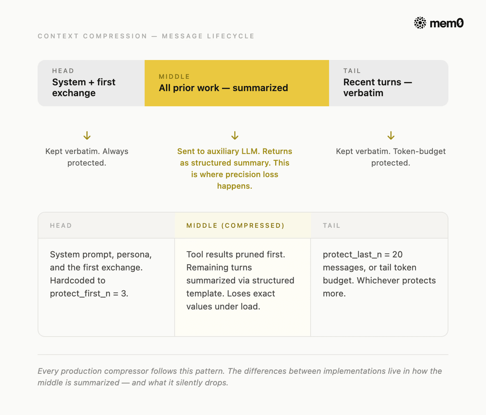

大多数 context compression 的失败看起来不像失败。Agent 还在跑，上下文还在缩，token 计数在下降——消失的是你在第二轮给出的约束、第八轮确认的精确数值、以及 Agent 正在追踪的跨任务依赖。模型没变，架构没变，压缩器只是做了它该做的事，而有损地做了。

本文从代码层面拆解两个真实生产环境中的 context compression 实现：Nous Research 的 **Hermes Agent**（可配置的 `context_compressor.py`）和 Anthropic 的 **Claude Code**（Context Compaction API，通过 `compact-2026-01-12` beta header 启用）。我们会看每个方案怎么工作、在哪里出问题、两者都丢失什么、以及在压缩触发前你需要把什么提取到持久存储。

---

**什么是 Context Compression？**

Context compression 是一个自动化过程：当 AI Agent 的对话历史接近 token 限制时，它会压缩历史，保留最重要的信息，丢弃或总结较旧的轮次。它让 Agent 持续运行而不崩溃，但总是损失一些精度。

**最朴素的做法是截断（truncation）：** 到达限制时丢弃最早的消息。免费、快速，但几乎立即破坏多步推理。一个看不到六轮前自己做了什么的 Agent，会重新推导、自相矛盾、或重新获取数据。看起来像模型问题，其实是架构问题。



*图：Context Compression 消息生命周期*

每个严肃实现都遵循的通用模式是：
- 保护头部（system prompt 和首次对话）
- 总结中间（Agent 已完成的所有工作）
- 保留尾部原文（Agent 当前正在处理的最近轮次）

压缩后的结果比原文短，但保留了叙事线索。

每个压缩器必须做 3 个决定：**何时触发？什么保留原文？什么被总结 vs 完全丢弃？** 这三个问题的答案，是生产级压缩器和朴素压缩器的分水岭，也是 Hermes 和 Claude Code 做出非常不同选择的地方。

---

**Hermes 怎么做**

Hermes Agent 是 Nous Research 开发的开源自主任 Agent。它的压缩系统分布在四个源文件中：`agent/context_compressor.py`（主引擎）、`agent/context_engine.py`（可插拔的抽象基类）、`agent/prompt_caching.py` 和 `gateway/run.py`（安全网）。

> 一句话：Hermes 运行两个压缩器，在故意错开的阈值上。第一个触发时，执行 4 阶段算法：修剪廉价工具输出、检测安全边界、用结构化 LLM 模板总结中间、重组。

**两层系统，故意错开**

Hermes 不运行一个压缩器，它运行两个，在不同阈值上，为不同目的。


*图：Hermes Agent 压缩架构*

**Agent compressor** 位于 `context_compressor.py`，默认在模型上下文窗口的 50% 触发。它在 Agent 的工具循环内部运行，因此可以访问 API 报告的上次响应的准确 token 计数。这是主要的压缩系统。

**Gateway session hygiene** 位于 `gateway/run.py`，在 85% 触发。它在 Agent 处理消息之前运行，使用粗略的字符估算（`estimate_messages_tokens_rough`）而非真实 token 计数。它的唯一工作是捕获在轮次之间增长过大的 session（例如 Telegram 或 Discord 集成中的隔夜累积）。

**注意：偏移是故意的。** 将 gateway hygiene 设为 50%（与 agent compressor 相同）会导致长 gateway session 中每轮都触发过早压缩。85% 阈值的存在就是为了不干扰 agent compressor。

**配置参数**

所有压缩设置位于 `config.yaml` 的 `compression` 键下：

```yaml
compression:
  enabled: true
  threshold: 0.5          # 在 50% 上下文窗口触发
  target_ratio: 0.20      # 尾部 token 预算 = threshold_tokens × 0.20
  protect_last_n: 20      # 最少保留的最近消息数
  auxiliary:
    compression:
      model: null         # 辅助模型；null 则用主模型
      provider: "auto"
      base_url: null
```

对于 200K 上下文模型：阈值在 100K token 触发，尾部预算 20K token，摘要最多 10K token。**如果辅助模型的上下文更小，`_generate_summary()` 会捕获 context-length 错误、记录警告、返回 `None`——中间轮次无摘要直接丢弃。**

**compress() 方法的 4 阶段算法**

一旦 50% 阈值触发，`ContextCompressor.compress()` 运行四个阶段：

**Phase 1：修剪旧工具输出。** 在任何 LLM 调用之前，压缩器将超过 200 字符的旧工具输出替换为占位符。无需模型调用，只需字符串替换。

**Phase 2：确定边界。** 压缩器保护前 3 条消息（硬编码）和最近的尾部——从末尾向后走，累积 token 直到尾部预算耗尽。关键的是，它调用 `_align_boundary_backward()` 避免拆分 `tool_call` / `tool_result` 对：调用了工具的 assistant 消息必须与其结果保持配对。

**Phase 3：生成结构化摘要。** 中间轮次发送给辅助 LLM，使用结构化模板。**这是最重要的阶段，也是最容易静默失败的阶段。** 后续压缩时，压缩器传入 `_previous_summary` 要求 LLM **更新**摘要而非从头生成。这使得 Hermes 的压缩器在长 session 中优于单次摘要器。

**Phase 4：重组。** 压缩后的消息列表包括头部消息、一条摘要消息和尾部原文。`_sanitize_tool_pairs()` 处理孤儿对：移除引用了已删除调用的工具结果，为结果已被删除的工具调用注入桩结果。

**生产环境中的 3 个故障模式**

在启用 Hermes 压缩之前，值得了解三个故障模式：

- **静默摘要丢失。** `_generate_summary()` 没有显式处理 `json.JSONDecodeError`。当辅助 LLM 返回非 JSON 响应（如配置错误的端点、被限流的 provider、或 HTML 错误页面）时，JSON 解析静默失败。压缩器丢弃中间轮次而无摘要。session 继续运行，但中间内容全丢了。

- **工具排序崩溃。** 当尾部的第一条消息恰好是 `tool` 角色时，插入的摘要出现在它之前，但 API 要求每条 `tool` 消息必须紧跟包含 `tool_calls` 的 `assistant` 消息。**压缩器产生一个消息序列，在每个 OpenAI 兼容 provider 上返回 HTTP 400，导致 session 崩溃。**

- **防抖动永久锁定。** 如果压缩连续两次触发且每次节省不到 10% 的 token，`should_compress()` 永久返回 `False`，直到用户运行 `/new` 重置 session。没有超时或衰减机制，一旦锁定就永远锁定。

---

**Claude Code 怎么做**

Claude Code 采取了与 Hermes 相反的架构选择。它将 context compression 完全卸载到服务端，去掉了配置面。Anthropic 的 Context Compaction API（当前 beta）是在标准 `messages.create` 调用上的两个补充。

> 一句话：设置一个 token 阈值。当对话达到阈值时，Anthropic API 自动压缩，返回 `stop_reason: "compaction"`。你追加响应后继续。无边界调优、无辅助模型、无阶段管理。

当输入 token 计数达到触发阈值时，Anthropic API 自动总结对话的较早部分，用存储在 compaction block 中的压缩状态替换它们，并返回 `stop_reason: "compaction"`。**下一个请求从该压缩状态继续，无需客户端消息列表管理。**

**Hermes vs Claude Context Compression：关键差异**

| 维度 | Hermes ContextCompressor | Claude Code Compaction API |
|------|--------------------------|----------------------------|
| 触发 | 可配置（默认 50%） | 你设置的 token 阈值 |
| 摘要可见性 | 可检查的结构化模板 | 不透明的 compaction block |
| 辅助模型 | 可配置或回退到主模型 | Anthropic 管理 |
| 可插拔引擎 | 是，通过 ContextEngine ABC 替换 | 否 |
| 双层安全网 | 是，网关 85% | 否 |
| 开源 | 是 | 否 |

> 共同的弱点比差异更重要。**Hermes 和 Claude Code 都是有损压缩。两个系统都不是为在压缩过程中保证精确值保留而设计的。**

---

**Context Compression 丢失了什么？**

每个基于摘要的压缩器最终都会遇到相同的四个故障模式。它们不是边界情况，而是架构的可预测后果。在所有故障中，丢失的信息分为五类：


*图：压缩差距——压缩前后对比*

- **精确数值。** 阈值、端口号、版本锁定和 token 计数——在对话中被顺带提及——被吸收到散文式摘要中，失去精度。一个读到"我们将重试限制设为 3"的摘要器，经常输出"重试已配置"——而那个 3 消失了。

- **硬约束。** 像"不要碰测试文件""不用 Redis"或"只用 Postgres"这样的指令被一次性声明，用户认为它们是永久的。**摘要器将它们视为已处理的上下文，不再重复。到第三轮压缩时，它们已经静默消失。**

- **决策理由。** 决策的"是什么"在压缩中保留得相当好；"为什么"几乎从不保留。一个知道"我们选了 Postgres"但不知道"因为 Redis 未获合规环境批准"的 Agent，在下次遇到类似选择时会做出错误决定。

- **跨任务依赖。** 第 12 轮修改的一个文件被第 47 轮的工具依赖——压缩器将这两段作为独立片段处理，完全错过它们之间的链接。

- **隐性偏好。** 编码风格、回复语气、用户反复展示但从未明确说出的习惯——这是摘要器最不可能想到要保留的，也是用户最先注意到缺失的。

模式是一致的：**摘要保留的是"发生了某事"，而不是使事情可执行的具体值。** 而具体值正是生产 Agent 真正需要的。

---

**压缩触发前应提取什么到 Mem0？**

**写前压缩模式（write-before-compaction）** 是解决方案。不是在压缩器保留什么上碰运气，而是在压缩触发之前将五类信息提取到持久存储。当下一个 session 开始或压缩器在 session 中间触发时，这些事实会被重新注入到 system prompt 中，无论压缩器丢弃了什么。

**提取需要在每一轮之后进行，而不是在压缩触发时。** 到压缩器在 50% 触发时，你可能已经有 25 轮的偏好和约束需要保留。在压缩时才提取已经太晚了。

> 这正是 Mem0 的位置。

Hermes 将 Mem0 作为原生记忆提供者，作为 `plugins/memory/` 中的一等插件。激活后，它在每轮三个点工作：

- **Agent 回复前：** 上一轮缓存的 Mem0 结果被注入到 system prompt 中。零延迟，无需 API 调用。
- **Agent 回复后：** 对话被发送到 Mem0 API（后台线程）。事实被自动提取：偏好、约束、决策和实体名称。无需配置提取规则。
- **同时：** Hermes 启动后台搜索下一轮的记忆。到你再输入时，它们已经预加载好了。


*图：将 Mem0 与 Hermes Agent 和 Claude Code 集成*

当 `ContextCompressor` 在 50% 触发并丢弃中间轮次时，**那些事实已经在 Mem0 中——位于上下文窗口之外，不受压缩影响。** 下一次回复通过预加载-注入循环将它们取回。

**在 Hermes 中设置 Mem0：**

只需 3 条命令：

```bash
hermes config set memory.provider mem0ai
hermes config set memory.mem0ai.api_key "your-api-key"
hermes memory setup
```

API 密钥来自 app.mem0.ai。`mem0ai` Python 包在你启用 provider 时会自动安装，无需手动 `pip install`。

激活后，LLM 在对话中可以显式调用三个工具：

- `mem0_conclude(user_message, assistant_message)` — 将关键事实写入记忆
- `mem0_search(query)` — 搜索相关记忆
- `mem0_reset()` — 重置当前 session 的记忆

**`mem0_conclude` 是处理硬约束的关键工具。** 它使用 `infer=False`，意味着不进行服务端 LLM 提取，只存储你传入的确切字符串。对于像"永远不要部署到 us-east1"这样的约束，你需要原文存储，而非转述提取。

**在 Claude Code 中设置 Mem0：**

如果你在 Claude Code 而非 Hermes 上构建，Mem0 Python SDK 直接处理相同的提取和注入模式。每次对话后调用 `mem0.add()` 将事实提取到持久存储，每次 system prompt 组装前调用 `mem0.search()` 将它们注入回来。

```python
from mem0 import Memory
m = Memory()

# 每次对话后
m.add(f"用户: {user_msg}\n助手: {assistant_msg}", user_id="user-1")

# 每次 system prompt 组装前
relevant = m.search(query, user_id="user-1")
```

---

**一点观察**

Mem0 这篇文章本质上是一篇产品定位文——先建立"所有压缩器都会丢失精确信息"这个行业共识，然后把自己定位成填补空白的唯一方案。这个诊断本身是准确的：压缩器确实丢失精确值，而且这是架构性缺陷而非配置问题。

但有两个点值得单独拎出来说。

第一，文章把"压缩器丢失信息"和"需要持久记忆"画了等号，但两者不是同一个问题。**压缩器丢失的信息中，大部分其实不需要跨 session 持久化**——第 12 轮改了哪个文件、第 15 轮为什么选 Postgres，这些在当前 session 内通过 Hermes 的增量摘要机制（传递 `_previous_summary` 要求更新而非从头生成）已经能部分保留。真正需要跨 session 保存的，是用户偏好和硬约束这类重复出现的信息。

第二，Hermes 自带的本地 SQLite memory 系统已经能处理"跨 session 记住事实"这个需求，只是没有 Mem0 的 LLM 驱动自动提取和语义搜索。对于大多数用户场景，**Hermes 内置 memory 加上压缩器的增量摘要，已经覆盖了 80% 的需求。** Mem0 的价值在于：零配置的自动事实提取、跨 session 的语义检索、以及不依赖本地存储的云端持久化。如果你已经在跑 Hermes，先试试内置 memory 够不够用，再决定是否需要 Mem0。

---

<span style="font-size:12px;color:#888888;">参考：https://mem0.ai/blog/how-hermes-and-claude-handle-context-compression-in-real-production-agents-(and-what-you-should-extract)</span>
