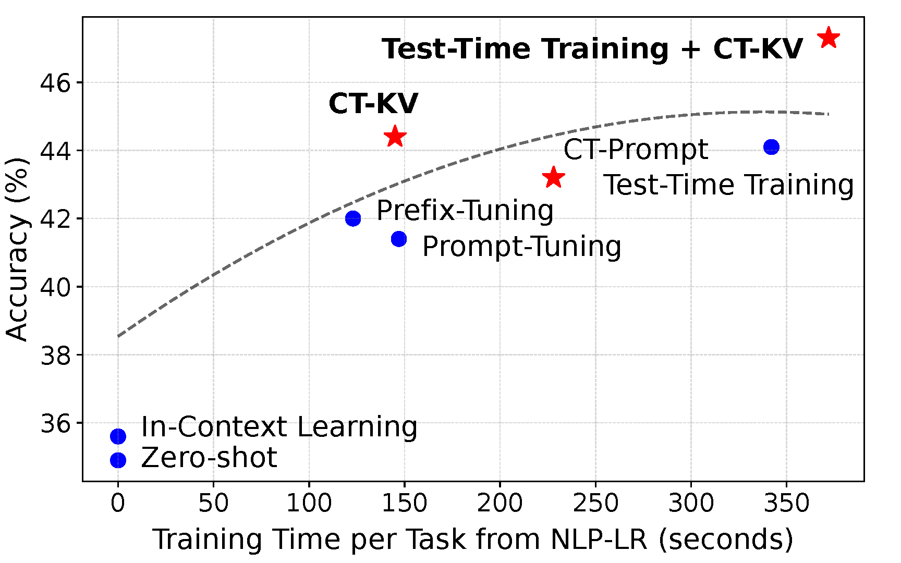
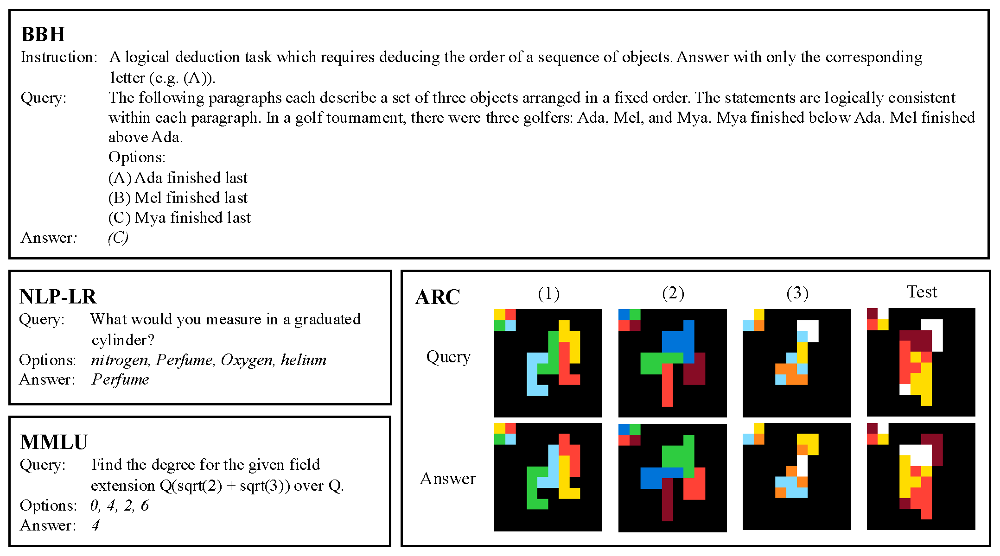
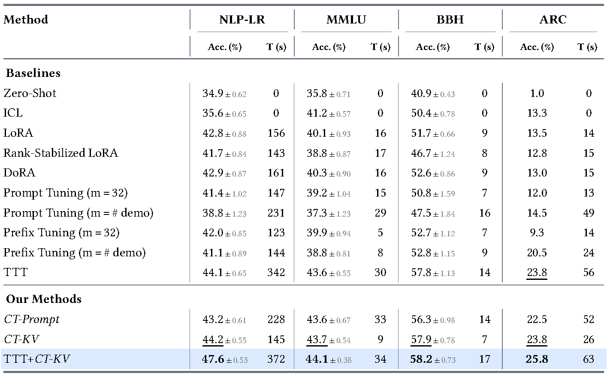
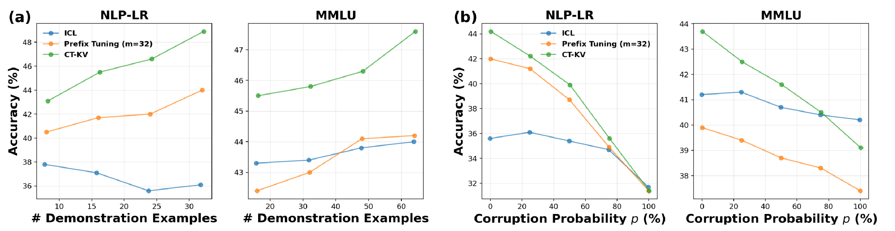
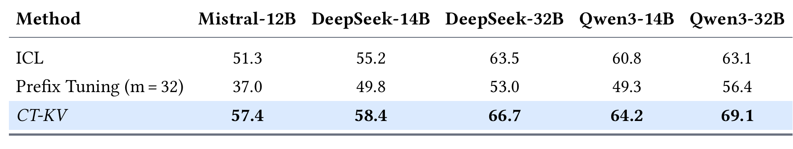
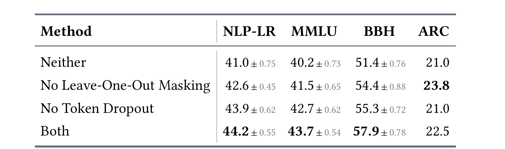
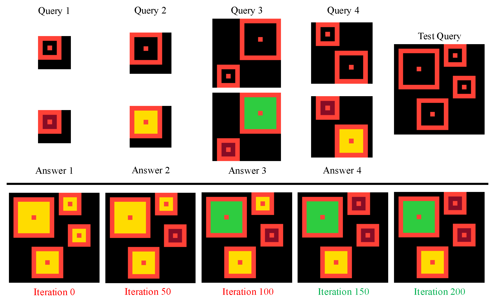
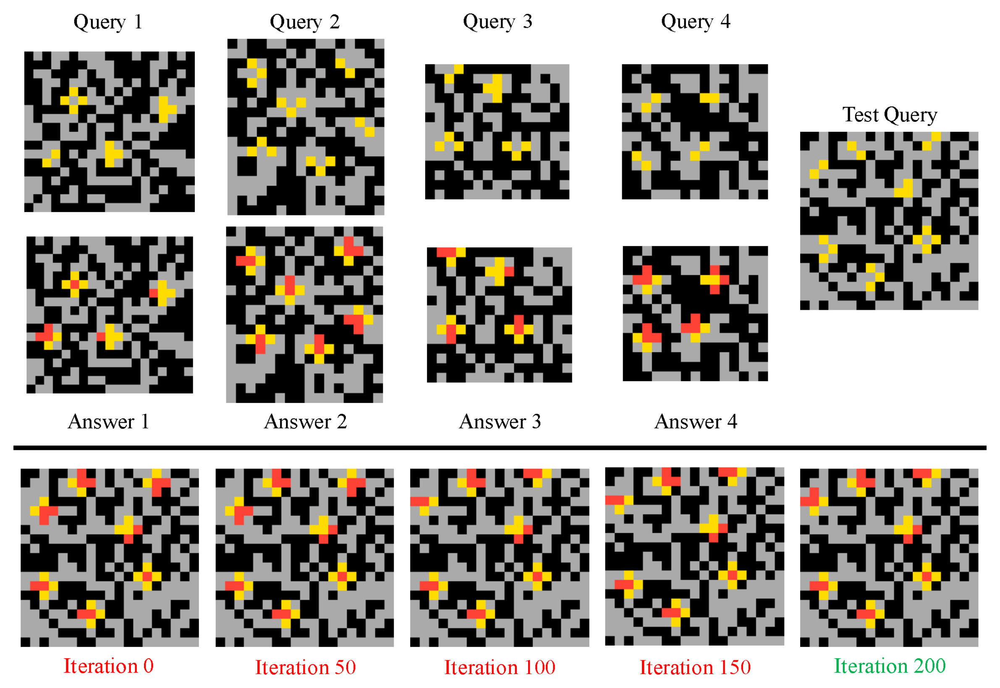

<strong style="font-size:16px;color:#1a6ba0;">要点速览</strong>

- <strong>核心操作</strong>：冻结LLM，把演示样本形成的KV缓存当成可训练参数，用梯度优化精炼记忆表征  
- <strong>两个训练技巧</strong>：Leave-One-Out Masking逼模型学通用映射，Token Dropout提升泛化  
- <strong>效率</strong>：不更新权重，训练时间仅为Test-Time Training（TTT）的一半或更少，准确率与之竞争；TTT+CT-KV组合拿全部基准第一  
- <strong>鲁棒性</strong>：示例增多持续领先，75%标签损坏仍最佳

---

## 背景：ICL与提示方法的断层

上下文学习（ICL）在单次前向传播中形成对演示样本的"记忆表征"，但表征是被动形成的，演示不足时无法改进。提示类方法（Prompt Tuning、Prefix Tuning）则独立初始化一段可训练前缀，完全没利用演示样本本身的信息。

Context Tuning要填的坑是：直接用ICL能力从演示初始化记忆表征，再去优化它，而不是两套机制各走各路。

CT-KV整体概览：冻结LLM，将示例形成的KV缓存转化为可训练的记忆表征

## 方法：CT-KV

CT-KV（KV版上下文调优）是主力变体，核心只有一句话：**保持LLM冻结，只优化由演示样本形成的键值（KV）缓存。**

分两步。初始化时，模型用正常ICL流程处理演示，得到一个KV前缀，它已编码了"这些示例在教什么"。优化时引入两个设计：

Leave-One-Out Masking（留一掩码）：训练时遮掉某个示例，要求模型基于其余示例预测它的输出，迫使记忆表征学到通用映射而非死记。

Token Dropout（词元丢弃）：随机丢弃部分token，抑制过拟合。

推理时，模型以完整优化后的缓存为条件回答新查询。论文另提CT-Prompt变体（把记忆放在提示嵌入上），但实验表明CT-KV更强。

CT-KV方法图：左为留一掩码优化KV前缀，右为推理时以完整优化前缀为条件作答

## 结果

评测覆盖NLP-LR、MMLU、BBH、ARC四个基准，模型规模1B到32B，跨多种架构。CT-KV在全部四个基准上同时压过ICL、Prompt Tuning、Prefix Tuning、LoRA、rank-stabilized LoRA和DoRA。

效率是对比关键。Test-Time Training（TTT）靠更新权重做测试时适配，代价高；CT-KV不更新任何权重，训练时间只需TTT一半或更少，准确率仍与之竞争。两者结合（TTT+CT-KV）在每个基准都拿第一，说明KV缓存调优与权重更新正交互补。

NLP-LR上还有一个点：CT-KV单任务适配在样本量匹配时准确率44.2%，超过MetaICL多任务元训练43.3%，即用单任务演示优化记忆胜过了专门跨任务元训练。

基准测试对照表：各方法在四个任务上的配置与样本设置

主结果图：各方法在四个基准上的准确率与训练时间（秒），加粗/下划线分别为最佳与第二佳

## 鲁棒性

示例数量维度：演示增多时CT-KV始终领先ICL和Prefix Tuning，无饱和或崩塌。

标签质量维度：即使随机损坏多达75%的示例标签，CT-KV在两个基准上仍最佳。留一掩码让模型学到示例背后的规律，而非被噪声标签带偏。

鲁棒性图：(a) 准确率随示例数量变化，(b) 准确率随标签损坏概率变化

## 扩展性

在12B到32B参数、跨多种架构的五个预训练模型上，CT-KV稳定超越ICL和Prefix Tuning，随规模放大依然有效。

扩展性图：BBH准确率随预训练模型规模增大而提升

## 消融

留一掩码和词元丢弃在四个基准中的三个上都为CT-KV带来提升，两者实打实贡献了泛化能力，非装饰。

消融图：留一掩码与词元丢弃在四个基准上的单独影响

## 定性观察

ARC任务上CT-KV预测随迭代演变，迭代0等同ICL。颜色映射任务中，模型从统一填黄逐渐"发现"每格正确颜色；交叉补全任务中，模型从迭代0误覆盖黑块，到迭代200预测与示例一致。

定性结果一：ARC颜色映射任务，四示例下预测随CT-KV迭代逐步修正

定性结果二：ARC交叉补全任务，模型逐步学会不覆盖黑色方块

<strong style="font-size:15px;color:#8b6f4c;">结语</strong>

CT-KV把"优化对象"从权重或提示前缀换成了ICL天然产出的KV缓存，相当于在模型已有能力上做增量精炼，而非从零训一个适配器。  
它与TTT的正交关系最直接：KV缓存调优改善"记忆表征够不够好"，权重更新改善"模型能力够不够强"，两者组合全面领先，说明大模型适配应走向多层协同。  
工程上，冻结权重只优化缓存意味着不改模型即可做任务级快速适配，推理成本可控，比全参数微调更现实。

---

【传送门】 
<a class="normal_text_link mp_article_text_link" href="https://mp.weixin.qq.com/s/QzUgNaCON_w0ZxTyYnDyDw" target="_blank" data-linktype="2">号外！OpenClaw之父刚刚开源Agent Loop工程：每5分钟自动修Bug</a> 
<a class="normal_text_link mp_article_text_link" href="https://mp.weixin.qq.com/s/_vr1v34JlGONRt_uWZtaig" target="_blank" data-linktype="2">Claude Managed Agents：Brain-Hands解耦，延迟降60%</a> 
<a class="normal_text_link mp_article_text_link" href="https://mp.weixin.qq.com/s/2h0NULN9kXjdxoxphZx0Ew" target="_blank" data-linktype="2">OpenClaw之父&Claude Code之父都在用的Loop到底是什么？答案藏在Loop之下</a> 
<a class="normal_text_link mp_article_text_link" href="https://mp.weixin.qq.com/s/IZBsLB7ci7U8ZmrpkFuB0Q" target="_blank" data-linktype="2">梁文峰署名DeepSeek DSpark：半自回归推测解码，吞吐提升51% (附论文中文版)</a> 
<a class="normal_text_link mp_article_text_link" href="https://mp.weixin.qq.com/s/o6pnSWW01pahFQelJSbSPA" target="_blank" data-linktype="2">华为「韬定律」全解析：从 τ 常数到4GHz麒麟，一张时间表看清未来十年芯片路线</a> 
<a class="normal_text_link mp_article_text_link" href="https://mp.weixin.qq.com/s/mqTab0qwrT95DVrxTllmcQ" target="_blank" data-linktype="2">Torch解析系列一：深入理解FX Graphs</a> 
<a class="normal_text_link mp_article_text_link" href="https://mp.weixin.qq.com/s/_4vgKCTSir14mhtdvs7_HA" target="_blank" data-linktype="2">美团开源LongCat-2.0 (OpenRouter原Owl Alpha)解读：1.6T参数，...</a> 
<a class="normal_text_link mp_article_text_link" href="https://mp.weixin.qq.com/s/VZRcpl6vL7riJp77ZmtSIg" target="_blank" data-linktype="2">Hermes vs OpenClaw创始人隔空互怼：假星标，抄袭，死亡威胁各种瓜</a> 

---

参考：https://agenticlearning.ai/context-tuning/
