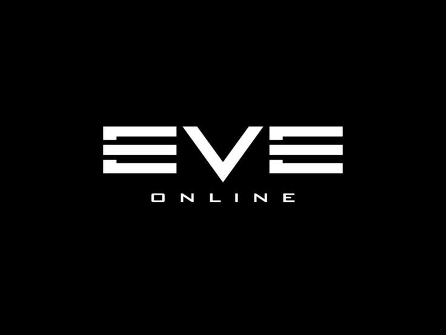

**Cursor Design 开源了：这才是真正的 AI 设计工作室该有的样子**

当 Cursor 用 AI 辅助编程颠覆了 IDE 之后，所有人都想知道同一个问题的答案：同样的范式迁移到视觉设计上，会是什么样子？现在答案来了——Cursor Design 正式开源，它把"点一下、说一句、画一笔就能改 UI"这件事，变成了现实。

Open Design 团队在推文中只用了四个动词就概括了全部野心：**Point（指向）. Comment（评论）. Mark（标记）. Edit（编辑）. Capture and remix（捕捉并重混）。** 这不是一个"用提示词生成一张图"的设计工具，而是一个让你全程参与、随时介入、AI 与你并肩工作的设计工作室。你不再是那个在 Figma 图层里翻来翻去找圆角半径的设计师，你是指挥官——指向任何元素，告诉 AI 你想怎么改，它立刻执行。不满意？再指一次，再说一句，迭代快到肉眼跟不上。

**Cursor Design 的核心逻辑和 Cursor IDE 如出一辙：AI 替你完成一切，但你随时可以夺回控制权。** 在 Cursor 的编程世界里，开发者用自然语言生成代码，然后逐行审查、修改、微调。Cursor Design 把同一套哲学搬到了视觉设计领域——你对着屏幕说"把标题改成更现代的无衬线字体，主色调换成深蓝，间距拉大 20%"，AI 理解你的意图，直接操作设计稿。但如果你对某个细节不满意，直接上手拖动、点击、修改，AI 不会跟你抢鼠标。这种"AI 代劳 + 人类掌控"的混合模式，正是 Cursor 团队在编程领域验证过的黄金路径。

**最令人兴奋的是 Design Mode：指向、绘制、或直接说话，就能实时更新你的 UI。** 想象一下这个场景：你在 Cursor 里写前端代码，旁边的 Design Mode 打开，你圈出导航栏说"改成毛玻璃效果"，AI 不仅改了设计稿，还能同步生成对应的 CSS 代码。设计和开发之间的那堵墙，正在被 Cursor Design 一锤一锤地砸碎。这不是一个"设计工具接入了 AI 功能"，而是一个"以 AI 为原生交互方式的设计系统"。

**Open Design 可以直接在 Cursor 内部使用，这意味着设计和代码从未如此接近。** 传统工作流中，设计师在 Figma 里画完稿，标注、切图、导出，开发者再照着实现——每一步都在损耗信息。而在 Cursor Design 里，设计稿本身就是可交互的、可编程的资产。你改一个按钮的颜色，对应的代码可能已经同步更新了。这不是效率提升，这是工作流的范式革命。

**"This is how a real AI design studio works"——这句话不是口号，是对整个设计工具赛道的宣战。** 现有的 AI 设计工具大多停留在"输入提示词→生成图片"的单向管道里，你无法精确控制某个按钮的位置、某个字体的粗细、某个间距的像素值。Cursor Design 选择了更难但更正确的路：AI 做粗活，人类做细活，双方在同一个画布上实时协作。开源更是关键一步——社区可以贡献插件、自定义模型、接入自己的设计系统，这让它有可能成为设计界的 VS Code。

结语

Cursor Design 的开源，标志着 AI 辅助设计进入了一个新阶段——不再是"让 AI 替你画一张图"，而是"让 AI 成为你的设计搭档"。它把 Cursor 在编程领域验证成功的"AI 代劳 + 人类掌控"模式完整迁移到了视觉设计上，并且用 Design Mode 和 Open Design 的深度集成，打通了从设计到代码的最后一公里。对于每一个在 Figma 和代码编辑器之间来回切换的设计师和开发者来说，这可能就是他们一直在等的那把钥匙。

---

**参考来源：**
- @OpenDesignHQ 官方推文 — "Point. Comment. Mark. Edit. Capture and remix."
- @cursor_ai 引用推文 — "This is how a real AI design studio works"
- Cursor Design 开源仓库 & Open Design 项目主页
