代码在 AI 面前正在加速：Cursor 首份开发者习惯报告的五个核心发现

开发商每人的周代码产出从 3,600 行涨到了 8,600 行，单个 PR 增加的行数翻了 2.5 倍，AI 代码在代码库中的 1 小时存活率从 76% 上升到 81%——Cursor 在这份《开发者习惯报告》中用 Cursor 产品本身的数据，给出了 Agent 编程时代的第一份全景快照。

这份报告基于 Cursor 聚合的产品和工程数据，涵盖 Agent 用量、token 消耗、接受的 AI diff、合并的 PR 活动等维度。大多数时间序列使用 7 天/28 天滚动均值以减少短期噪音。

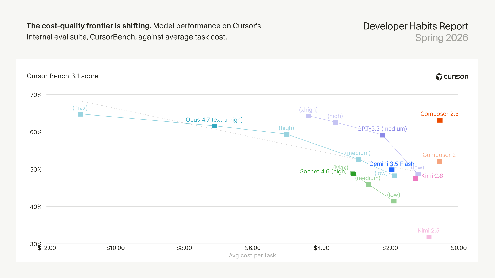

---

## 0. 领域正在被重塑

软件开发的变革速度令人震惊。这份首期报告基于 Cursor 数据，从五个主题切入：

1. **开发者加速**：编码速度同比翻倍，PR 越来越大、越来越深，Agent 生成的代码在审查后的留存率创下新高。
2. **智能的经济学**：七个模型家族在每行成本和每次提交成本上的差异，揭示出惊人的单位经济异质性。
3. **超级用户鸿沟**：AI 带来了广泛的生产力提升，但在 top 1% 的开发者中变化最为显著。
4. **上下文的崛起**：输入 token 激增，cache-read token 的转移正在给 Agent 提供执行复杂任务的工作记忆。
5. **自动化的迁移**：编码 Agent 正在从个人开发者工具演变为一个自动构建和维护软件的完整系统。

---

## 1. 开发者加速

开发者正在以更快的速度工作并产生更多代码，但生产力的变化远不止数量层面。PR 变得更大，Agent 会话更深，AI 生成的代码在代码库中存留更久。

### 1.1 代码在加速

开发者每周添加的代码量在增长，且自 2026 年初以来增速明显加快。虽然这不是一个完美指标，但它为理解开发者工作的变化提供了一个方向上有意义的基准。

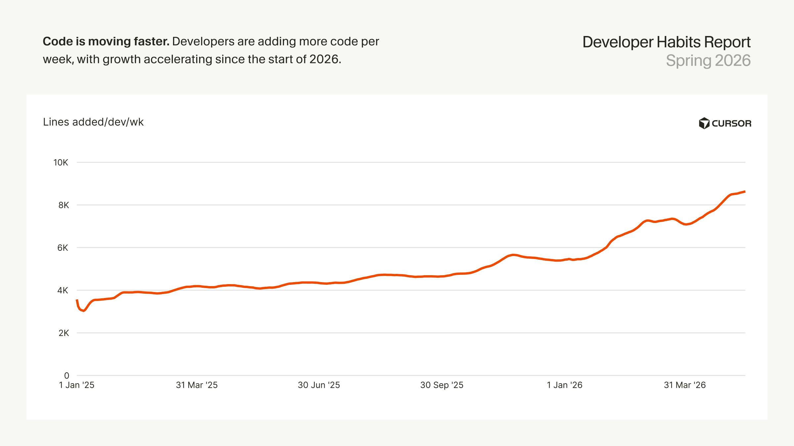

| 日期 | 每周人均新增行数 |
|------|----------------|
| 2025-01-01 | 3.6K |
| 2025-07-30 | 4.5K |
| 2026-01-14 | 5.5K |
| 2026-05-16 | 8.6K |

从 2025 年初的 3,600 行/周，到 2026 年 5 月的 8,600 行/周，增幅约 2.4 倍。

### 1.2 每个 PR 的代码量在增长

每个 PR 增加的行数（p75）同比涨了约 2.5 倍，增速正在加快。

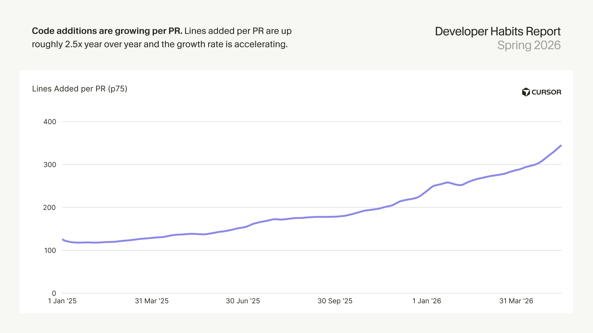

| 日期 | 每 PR 新增行数 (p75) |
|------|---------------------|
| 2025-01-01 | 126 |
| 2025-07-30 | 172 |
| 2026-01-14 | 254 |
| 2026-05-16 | 345 |

### 1.3 开发者承担的工作单元越来越大

Mega PR（至少修改 1,000 行代码的 PR）正在变得越来越常见。值得关注的是 2026 年 1 月出现的跳跃——当时大量开发者正在尝试最新的编码 Agent 和模型改进。

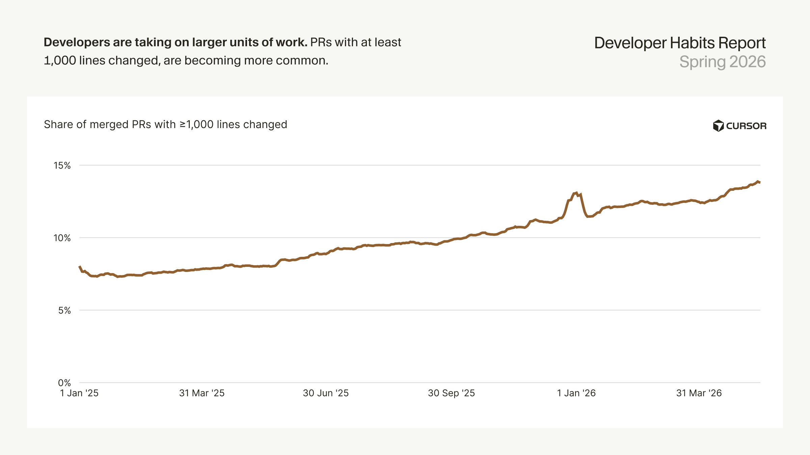

| 日期 | Mega PR 占比 |
|------|-------------|
| 2025-01-01 | 8.0% |
| 2025-07-30 | 9.5% |
| 2026-01-14 | 11.6% |
| 2026-04-29 | 13.4% |
| 2026-05-16 | 13.8% |

**从 8% 提升到近 14%，增长 70% 以上，开发者正在用 AI 规模化地一次处理更大单元的工作。**

### 1.4 Agent 会话越来越深

仅过去两个月，平均每次会话的工具调用次数就上升了约 30%。编码 Agent 正在承担更复杂的工作——更频繁地读写文件、搜索代码、运行 shell 命令和浏览网页。

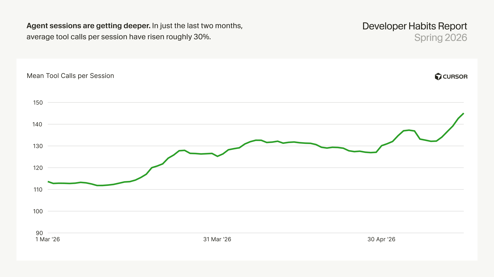

3 月均值约 113 次/会话，5 月已达 145 次/会话。

### 1.5 AI 生成的代码存留更久

自 2026 年初以来，被接受的 AI 代码在 60 分钟后仍留在代码库中的比例从约 76% 上升到 81%。

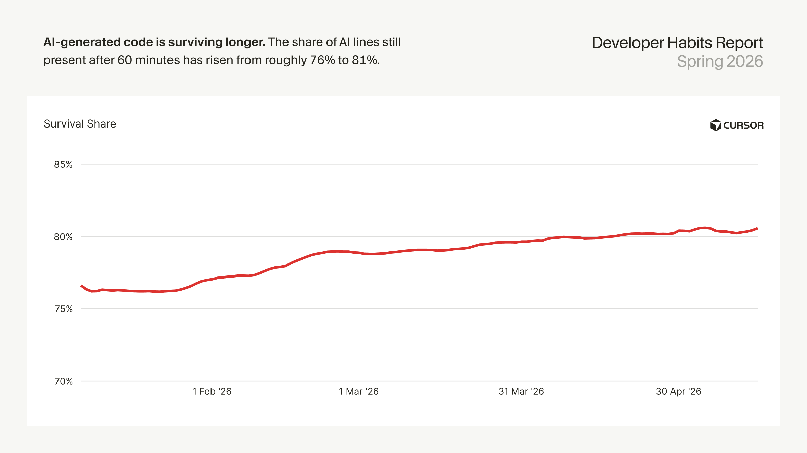

从 76.6%（1 月初）到 80.6%（5 月中旬），趋势稳定上行。

---

## 2. 智能的经济学

不同模型家族之间的成本差异巨大——相同工作流的不同模型，成本可以相差近 9 倍。

### 2.1 请求成本因模型家族差异巨大

每次 Agent 请求的成本在模型家族间相差近 9 倍。

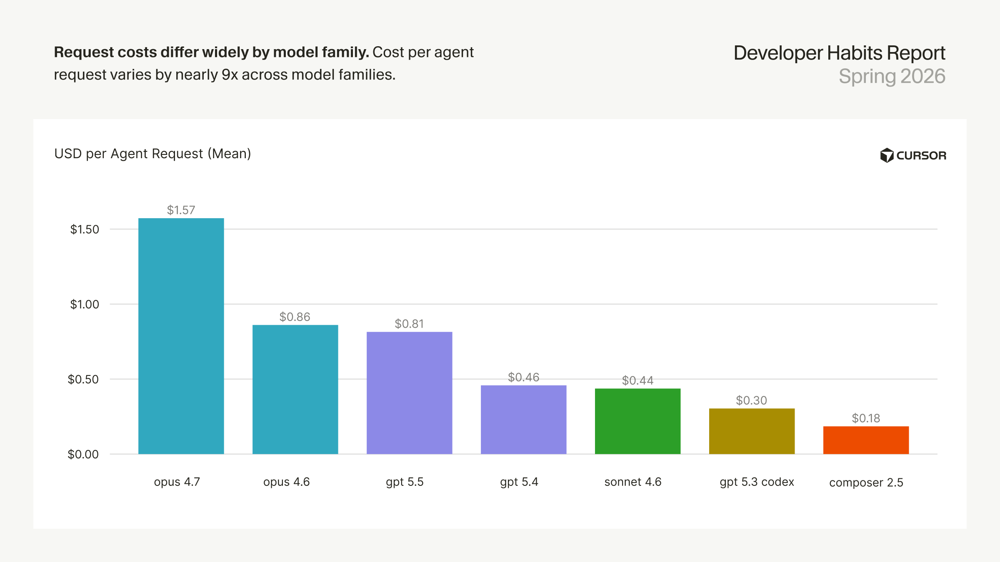

| 模型家族 | 每次 Agent 请求成本 (均值) |
|---------|--------------------------|
| Opus 4.7 | $1.57 |
| Opus 4.6 | $0.86 |
| GPT-5.5 | $0.81 |
| GPT-5.4 | $0.46 |
| Sonnet 4.6 | $0.44 |
| GPT-5.3 Codex | $0.30 |
| Composer 2.5 | $0.18 |

最低的 Composer 2.5（$0.18）与最高的 Opus 4.7（$1.57）相差 8.7 倍。

### 2.2 每行被接受代码的成本缩小了模型差距

每行被接受代码的成本在模型家族间相差约 7 倍，略低于每次请求的 9 倍差距——说明高成本模型部分通过产出更多被接受代码来弥补成本差。

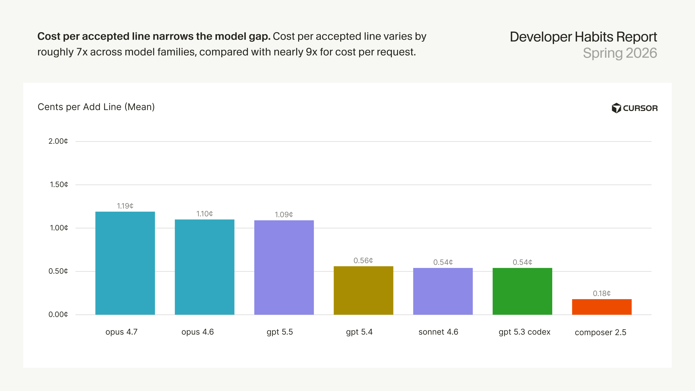

| 模型家族 | 每新增行成本 (均值) |
|---------|-------------------|
| Opus 4.6 | 1.19¢ |
| Opus 4.7 | 1.10¢ |
| GPT-5.5 | 1.09¢ |
| Sonnet 4.6 | 0.54¢ |
| GPT-5.4 | 0.54¢ |
| GPT-5.3 Codex | 0.56¢ |
| Composer 2.5 | 0.18¢ |

Composer 2.5 令人印象深刻——每行仅 0.18 美分。

### 2.3 成本-质量前沿在移动

报告将模型在 Cursor 内部评估套件 CursorBench 3.1 上的得分与平均任务成本进行了对比，展示了模型在成本-质量前沿上的位置。

| 模型 | 平均任务成本 | CursorBench 3.1 得分 |
|------|------------|-------------------|
| Opus 4.7 (max) | $11.02 | 64.8% |
| Opus 4.7 (extra high) | $7.11 | 61.6% |
| GPT-5.5 (high) | $3.59 | 62.6% |
| GPT-5.5 (extra high) | $4.37 | 64.3% |
| GPT-5.5 (medium) | $2.22 | 59.2% |
| GPT-5.5 (Low) | $1.19 | 48.8% |
| Sonnet 4.6 (medium) | $2.64 | 46.0% |
| Composer 2.5 | $0.55 | 63.2% |
| Composer 2 | $0.56 | 52.2% |
| Kimi 2.6 | $1.27 | 47.6% |

Composer 2.5 以 63 美分的成本达到了 63.2% 的得分，性价比极为突出。GPT-5.5 的表现曲线非常平滑——从 low 到 extra high，成本翻了 3.7 倍，得分从 49% 涨到 64%，给出了当前最线性的「加钱提分」曲线。

---

## 3. 超级用户鸿沟

AI 用量的集中度极高。占比极小的开发者在 AI 行数、开支和 token 消耗上占比极大。

### 3.1 超级用户占了 AI 活动的大部分

洛伦兹曲线展示了这种集中度。三个指标的基尼系数分别为 0.77（AI 行数）、0.75（AI 开支）、0.72（Token 消耗）——数值越高表示活动集中在越少的用户手中。

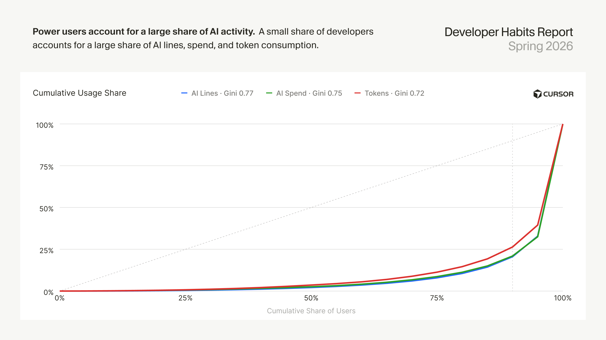

以 AI 行数（基尼 0.77）为例：排名前 5% 的开发者贡献了约 48% 的 AI 行数，前 20% 贡献了约 100%（即最后 80% 的用户几乎不产生 AI 代码）。

### 3.2 产出鸿沟在扩大

p90 开发者每周的绝对新增行数正在将中位数开发者越甩越远，p99 用户更是远远落在尾部。

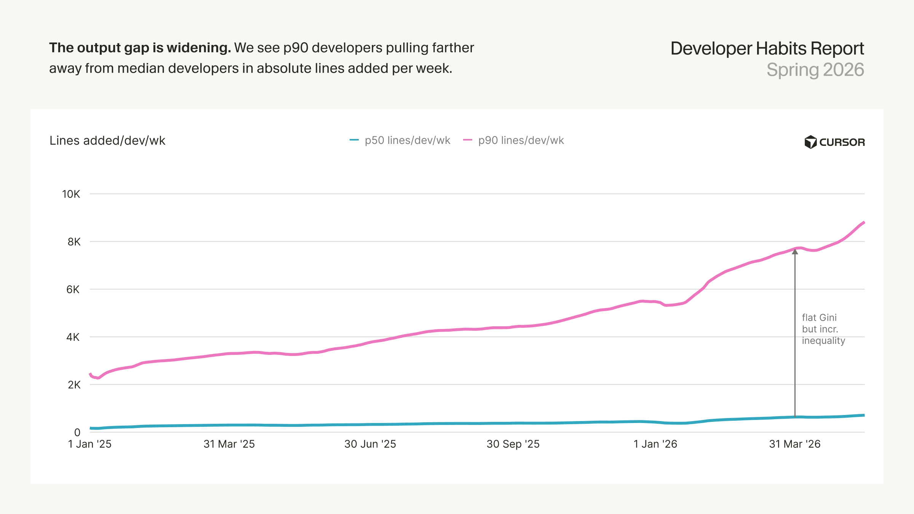

| 日期 | p50 行/周 | p90 行/周 |
|------|----------|----------|
| 2025-01-01 | 176 | 2,500 |
| 2025-07-30 | 345 | 4,100 |
| 2026-01-14 | 377 | 5,400 |
| 2026-05-16 | 712 | 8,800 |

p90 与 p50 的绝对差距从 2.3K 扩大到 8.1K，裂口在持续变大。

### 3.3 尾部的不平等更陡峭

再往上看尾巴。p99 开发者每天产出的 AI 行数是中位数活跃用户的 **46 倍**，合并的 PR 数也是中位数 PR 作者的 **15 倍**——p90 与 p50 的差距虽然也不小（10 倍和 4 倍），但和 p99 完全不在一个量级。

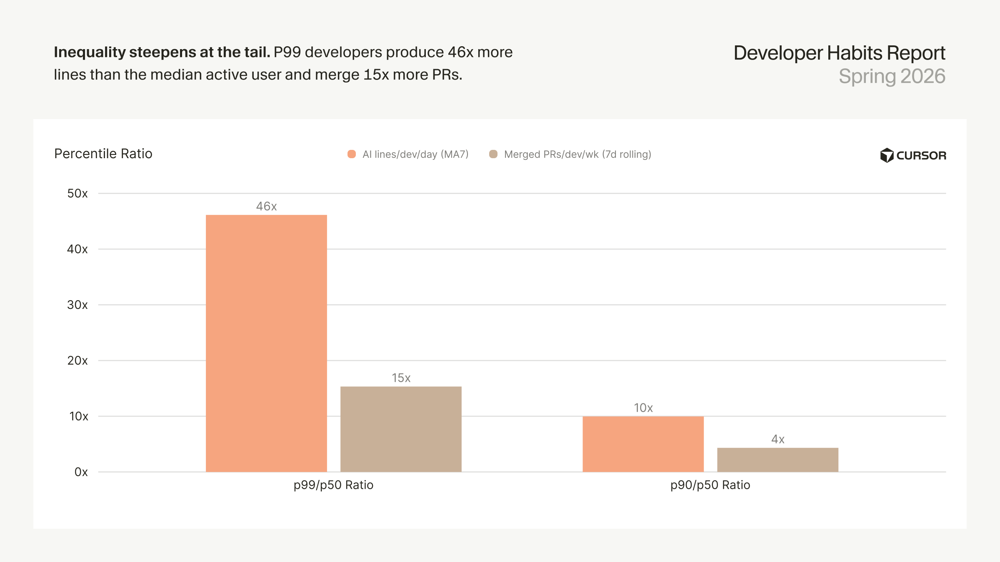

| 指标 | p99/p50 比率 | p90/p50 比率 |
|------|-------------|-------------|
| AI 行数/人/天 (MA7) | 46× | 10× |
| 合并 PR/人/周 (7d 滚动) | 15× | 4× |

---

## 4. 上下文的崛起

模型在写代码之前读得越来越多。输入/输出 token 的比率在快速上升，说明模型在生成每一段代码之前在做更多的「功课」。

### 4.1 模型写之前读得更多

输入与输出 token 的比率正在快速攀升。

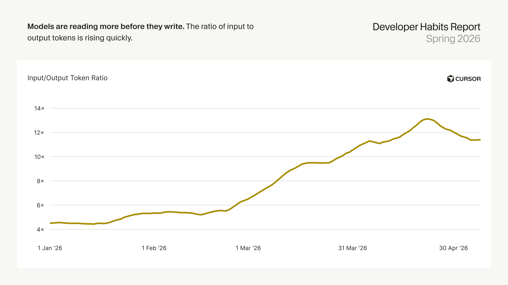

从 1 月初的 4.5 倍到 5 月的 11.4 倍，翻了 2.5 倍。这意味着模型每输出 1 个 token，现在需要读 11 个输入 token。

### 4.2 输入 token 主导非缓存 token 量

同样的结构变化在 token 构成中也能看到。输入现在占输入+输出 token 量的 90% 以上。

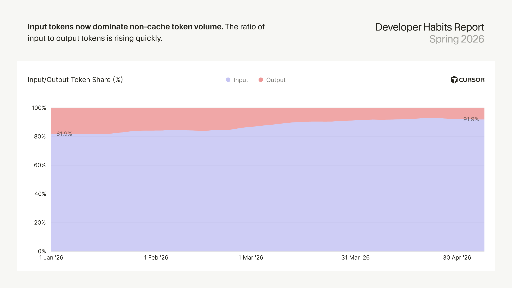

1 月时输入占 82% 输出占 18%，到 4 月底输入已占 93%，输出仅剩 7%。

### 4.3 输入上下文正在成为主要 token 成本

输入 token 主导消耗，但其对成本的影响被较低的单位价格所缓解。即便如此，输入 token 已经占到了价格等效 token 成本的大部分——从年初约占 47% 上升到近 70%。

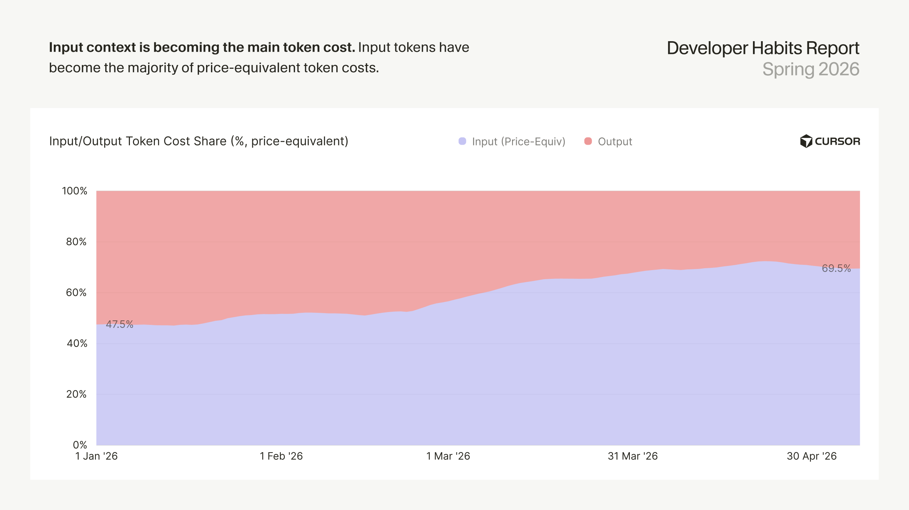

这是一个反直觉的发现：输入 token 单价低，但因为量太大了，总成本上已经超过输出 token。

### 4.4 Cache-read 主导 token 活动

一旦把缓存纳入考量，上下文的故事就更大了。Cache-read token 主导了总的 token 活动，说明 Agent 的绝大多数工作现在依赖于复用先前的上下文而不是从头读起。

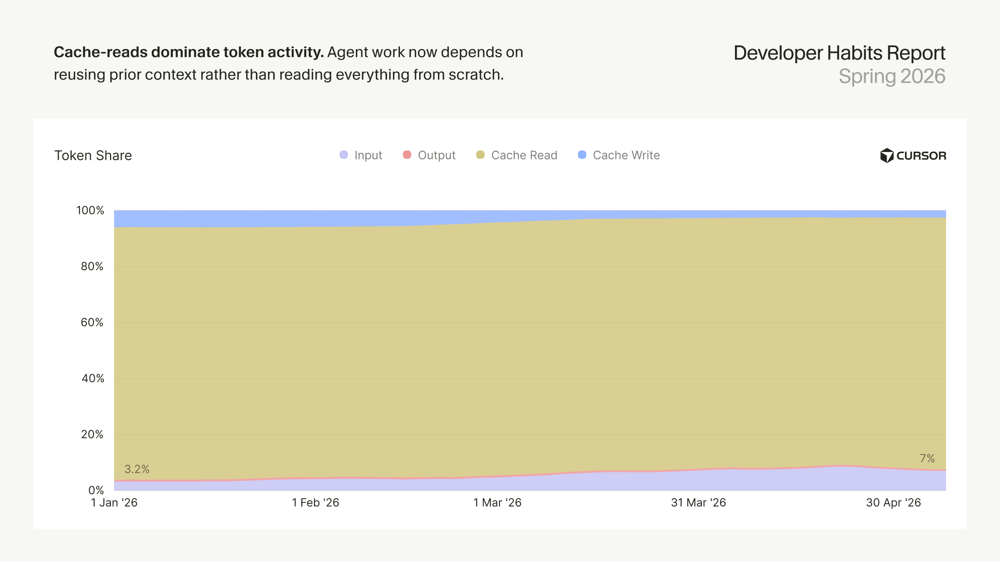

| 日期 | Cache Read | Cache Write | Input | Output |
|------|-----------|------------|-------|--------|
| 2026-01-01 | 90.1% | 6.0% | 3.2% | 0.7% |
| 2026-03-14 | 90.0% | 3.1% | 6.2% | 0.7% |
| 2026-05-09 | 89.9% | 2.5% | 7.0% | 0.6% |

**Cache-read 始终占约 90%，而 Output token 在所有 token 中仅占 0.6% 到 0.7%——Agent 写代码本身只占总 token 量的不到 1%，系统绝大部分开销在读取上下文上。**

---

## 5. 自动化的迁移

编码 Agent 正在从个人工具演变为一个用于构建和维护软件的完整自动化系统。

### 5.1 更多 AI 变更被自动接受

自年初以来，无需单独的人工 diff 确认就能到达提交的 Agent 生成变更数量增长了 **5 倍以上**。

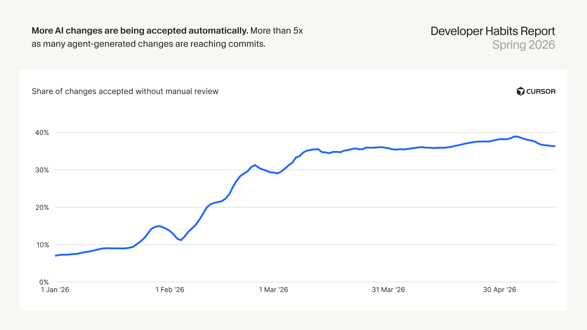

从 1 月初的 7% 上升到 5 月的 36-38%。曲线在 2 月经历了一次陡峭拉升（从 13% 到 31%），此后稳定在 35-38% 区间。

### 5.2 自动化正在跨工作流扩散

虽然仍处于早期，但第一批自主化模式正在浮现。Cursor Automations 的采用正在快速增长，安全审查已成为一个强力自动化用例。更近期，SDK 运行显示出将 Cursor 的 Agent 基础设施转变为一个可按每家公司构建软件的方式定制的可编程平台的早期需求。

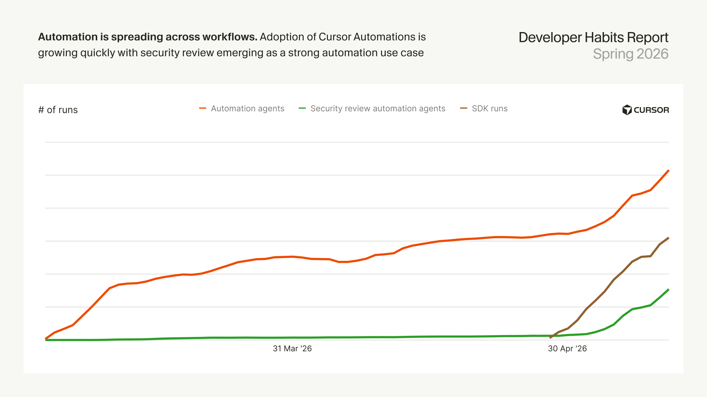

此图表的具体数值被报告 withheld（未公布），但三个系列（Automation agents、Security review automation agents、SDK runs）的曲线形状都呈显著上升趋势。Security review automation 的增长最为陡峭。

---

### 方法论

本报告基于聚合的 Cursor 产品和工程数据，包括 Agent 用量、token 消耗、接受的 AI diff 和合并的 PR 活动。大多数时间序列图表使用 trailing 7 天、28 天或 30 天平均值以减少短期噪声。

报告不包含隐私模式下用户选择退出的数据（包括零数据保留与模型提供商的配合）。

---

### 一点观察

**报告的数据本身就是一个隐喻。** 当 Agent 会话深度在两个月内增长 30%、输入 token 占比超过 90%、Cache-read 消耗 90% 以上的总 token 量时，一个趋势已经很清晰：编码 Agent 正在从「写代码的工具」变成「读代码的系统」。写代码只是整个开销中微不足道的最后一两笔。

**p99 与 p50 之间 46 倍的产出差距，不是工具差距，是工作方式的差距。** 如果 AI 只是给所有人配了同样的引擎，那么差距应该缩小才对——但数据告诉我们，它反而在扩大。这意味着 AI 更擅长放大已有的工作方法差异，而非拉平它们。对团队来说，真正的问题是：一个普通开发者能不能被引导去像那 1% 的人一样使用工具？

报告中未提及的一个商业维度也值得留意：Cursor 在这个报告里不仅是研究者，也是直接的受益者。Composer 2.5 在 CursorBench 上以 63 美分的成本达到 63% 的分数——这个「自家模型自家评测」的组合，和 GPT-5.5 在不同投入水平下的平滑表现曲线形成了一种有趣的叙事张力。

---

参考：https://cursor.com/cn/insights
