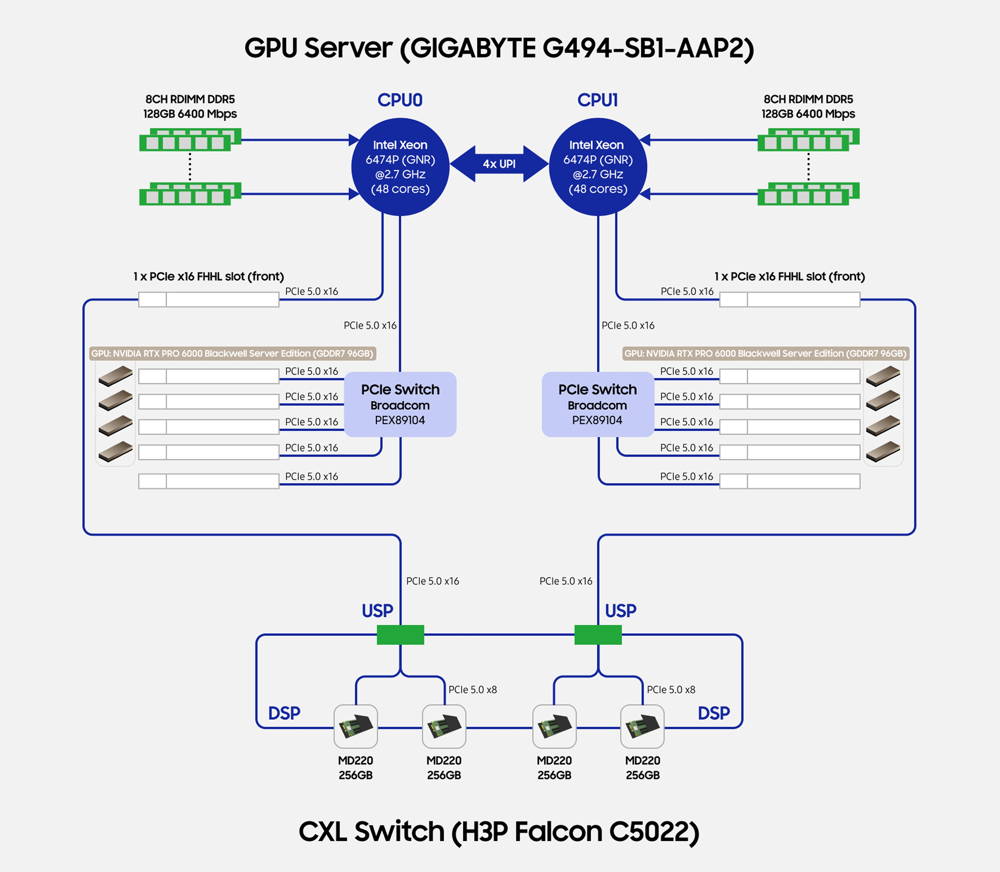

<strong style="font-size:16px;color:#1a6ba0;">要点速览</strong>

- <strong>瓶颈转移</strong>：随着上下文长度和并发用户数增长，KV Cache需求轻松突破数百GB，超出GPU显存与系统DRAM，成为推理基础设施的新瓶颈。  
- <strong>接近DRAM的性能</strong>：三星用CXL内存池做KV Cache卸载，单GPU下性能与DRAM相当，8 GPU环境下仍保持约92% 的DRAM性能。  
- <strong>容量翻倍不降速</strong>：在512GB DRAM与1TB CXL内存池的对比中，KV Cache一旦超出DRAM容量就因重算开销而掉速，CXL池则稳定容纳更大的KV Cache足迹。  
- <strong>核心器件</strong>：三星CMM-D（CXL Memory Module-DRAM）配合CXL交换机，把多个内存设备聚合成共享内存池，是这套方案的内存底座。

---

## 为什么KV Cache如此重要

随着生成式AI加速落地，基础设施的关注点已经从单纯的训练性能，转移到推理的效率与可扩展性上。而对在生产环境部署大语言模型（LLM）的组织来说，这两项指标直接决定了服务是快还是贵。

问题出在KV Cache（键值缓存）。LLM在推理时依赖它来存储已经算过的注意力键和值，复用这些信息，而不是为每个新生成的token重新计算，从而大幅压低延迟和计算开销。但随着模型规模、上下文长度、并发用户数一起往上走，KV Cache的需求可以轻松冲到数百GB，迅速吃光GPU显存和系统DRAM。这条内存墙，正在变成推理侧最现实的卡点。

传统的卸载方案是靠SSD或网络附加内存来扩容，但代价是额外的延迟和带宽开销。三星想验证的是另一条路：能不能用基于CXL的内存池化来卸载KV Cache，在容量可扩展的同时，性能还能贴近传统DRAM。

图1：带KV Cache的LLM推理流程（来源：Samsung Semiconductor）

## CXL内存池化的机会

Compute Express Link（CXL）正在成为下一代数据中心架构的一项关键技术。它的核心是用一条一致性、高带宽的互连来做内存扩展，让系统突破传统DRAM配置的物理上限。

当CXL遇上CXL交换机，多个内存设备就能被聚合成一个共享内存池，内存分配变得灵活，容量也大幅拉升。更重要的是，这种池化把内存从单台服务器里解耦出来，资源可以按负载动态借调，而不是每台机器都按峰值预留、常年闲置。三星的CMM-D（CXL Memory Module-DRAM）就是为这类扩展架构设计的，它给AI推理这类内存密集型负载提供了一个颇具吸引力的选项。

## 为AI推理评估CXL内存

评估环境由几部分组成：NVIDIA RTX PRO 6000 Blackwell GPU、通过CXL交换机连接并配置成1TB CXL内存池的三星CMM-D模块、vLLM与LMCache软件栈，再加上三星自研的宿主级优化。

核心问题很直接：CXL内存池能不能在支撑大规模KV Cache卸载的同时，把性能维持在和DRAM差不多的水平？

图2：评估环境的系统框图（来源：Samsung Semiconductor）

## 在更大规模下逼近DRAM性能

评估结果显示，CXL内存池化确实能同时给AI推理负载带来接近DRAM的性能和可观的内存可扩展性。

单GPU配置下，经过优化的CXL内存池作为LMCache后端使用时，性能与DRAM相当。在8块GPU的多GPU环境里，CXL内存池在提供明显更大内存容量的同时，保持了约92% 的DRAM性能。换句话说，把KV Cache从昂贵的GPU显存挪到CXL池里，几乎不付性能代价，却换来一个数量级的容量空间。

研究还把512GB DRAM配置和1TB CXL内存池放在不断增长的KV Cache需求下做了对比。一旦KV Cache需求超过DRAM可用容量，缓存重算开销立刻拖垮性能；CXL内存池却能稳稳容纳大得多的KV Cache足迹，性能纹丝不动。

## 内存池化在AI基础设施中的未来

三星的这次评估说明，基于CXL的内存池化可以一边大幅扩展内存，一边在KV Cache卸载负载上保持接近DRAM的性能。

随着CXL生态持续成熟，内存池化架构有望成为未来AI数据中心的基石，支撑更灵活、可扩展、高效的基础设施部署。

想了解详细的系统配置、优化技术和完整基准测试结果的读者，可以查阅完整白皮书，它对评估方法和结论做了深入分析。

<strong style="font-size:15px;color:#8b6f4c;">结语</strong>

三星这套方案真正的价值不在「92%」这个数字，而在于它把内存从计算卡上解耦：1TB的KV Cache池不再绑定GPU显存，扩容成本远低于堆HBM，这对长上下文、高并发的推理服务才是实打实的TCO红利。  
但92% 是在三星自研宿主优化的「最佳配置」下跑出来的，白皮书之外的多租户、混合负载等真实生产波动尚未公开，企业落地前仍需独立验证，不能把厂商基准当结论。  
技术本身不是瓶颈，CXL 3.0生态和交换机的成熟节奏才是。内存池化要真正成为数据中心的「基石」，先得过供应链和软件栈这一关。

---

【传送门】 
<a class="normal_text_link mp_article_text_link" href="https://mp.weixin.qq.com/s/s0Ovn3_tnbbl9jxfAC3WLg" target="_blank" data-linktype="2">阿里Sparse Attention on CXL替代RDMA做KV Cache解耦 推理2.1×吞吐, 9.7×TTFT</a> 
<a class="normal_text_link mp_article_text_link" href="https://mp.weixin.qq.com/s/2eWh5jZJPHsv0wi9km2nVg" target="_blank" data-linktype="2">NVIDIA TriAttention解读: KV Cache压缩最大的问题不是算法而是两个Infra问题</a> 
<a class="normal_text_link mp_article_text_link" href="https://mp.weixin.qq.com/s/OoHu1yeuh1gzgCfEiPvDuQ" target="_blank" data-linktype="2">RL的下一个大突破：不是优化可验证问题而是把'不可验证'领域变得'可验证'</a> 
<a class="normal_text_link mp_article_text_link" href="https://mp.weixin.qq.com/s/FTsibdpbEjvoPWtxGqgxkQ" target="_blank" data-linktype="2">小米MiMo罗福莉后训练新范式MOPD: 多教师同策略蒸馏，多领域无损集成</a> 
<a class="normal_text_link mp_article_text_link" href="https://mp.weixin.qq.com/s/3btXHAVd8_x5CM5CWETc2g" target="_blank" data-linktype="2">Agent卷向AI Infra: SGLang团队用硬核Agent优化框架和CUDA Kernal性能</a> 
<a class="normal_text_link mp_article_text_link" href="https://mp.weixin.qq.com/s/HnGKVp45C-GApBJ-LleP6g" target="_blank" data-linktype="2">小米MiMo罗福莉:8卡GPU让1T参数模型跑出1000 TPS , FP4+DFlash+TileRT全解读</a> 
<a class="normal_text_link mp_article_text_link" href="https://mp.weixin.qq.com/s/nVqW9acA7NN1zeALDwRAsw" target="_blank" data-linktype="2">Google新论文RubricEM: 评分标准引导的深度研究Agent训练框架</a> 
<a class="normal_text_link mp_article_text_link" href="https://mp.weixin.qq.com/s/OqtF6ZaWQNu3o-VAWLfqbg" target="_blank" data-linktype="2">榨干GPU性能：流水线解码消除GPU气泡，推理吞吐提升35%</a> 

---

参考：https://semiconductor.samsung.com/news-events/tech-blog/breaking-ai-memory-limits-with-cxl-memory-pooling/
