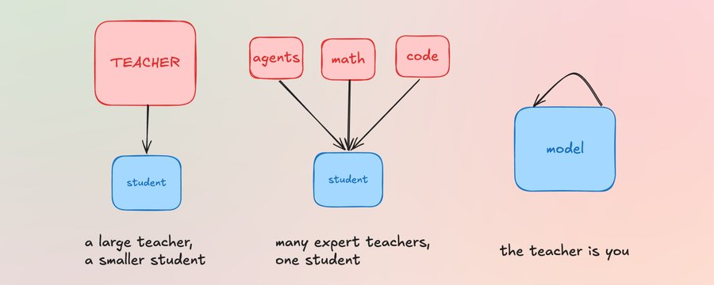
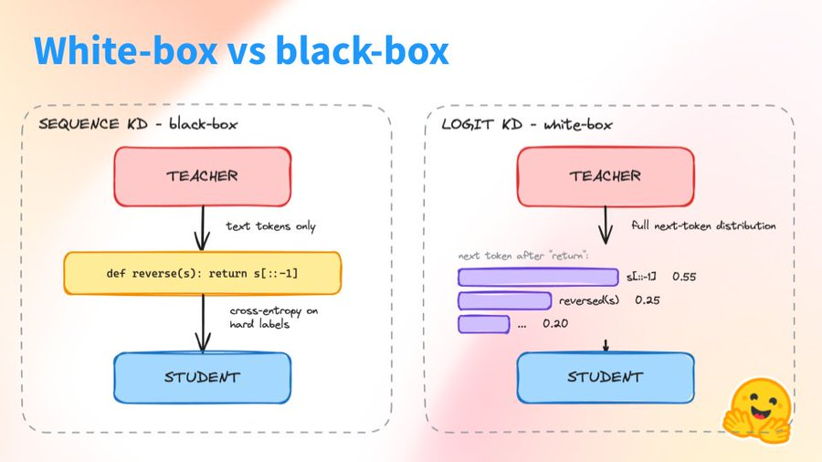
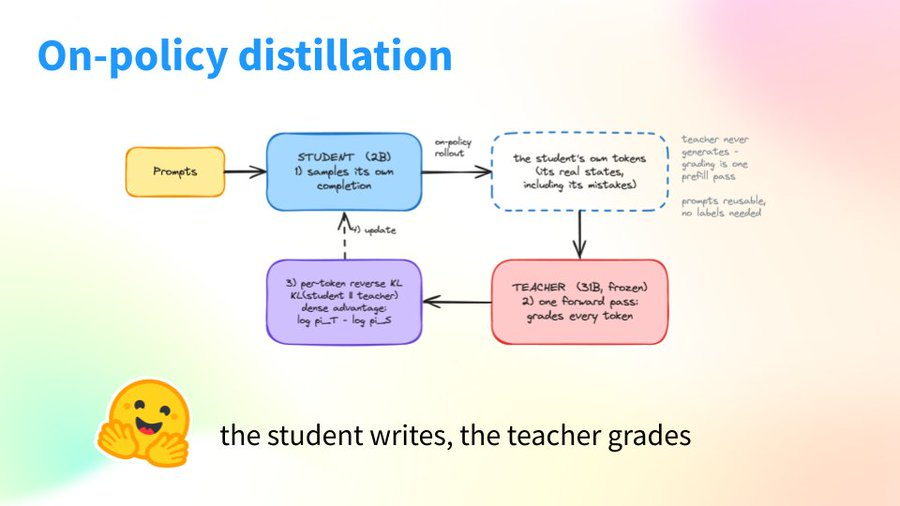
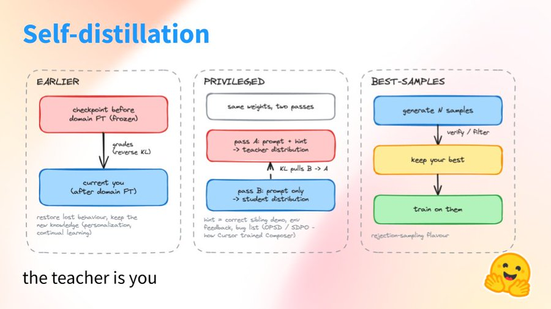

<strong style="font-size:16px;color:#1a6ba0;">要点速览</strong>

- <strong>蒸馏仍是2026年训练后的核心</strong>：从压缩大模型到合并RL专家，再到模型自教，师生机制贯穿所有前沿模型的后训练配方。  
- <strong>离策略蒸馏（off-policy）</strong>：大教师教小模型，分软标签（白盒匹配下一token分布）和硬标签（黑盒直接用教师文本SFT）两型，R1-Distill是典型的硬标签案例。  
- <strong>在线策略蒸馏（on-policy）成主流</strong>：各实验室为每个领域各训一个RL专家，再把它们蒸馏进一个边生成rollout边被打分的学生，DeepSeek-V4、GLM-5、Nemotron 3 Ultra、Qwen3都在用。  
- <strong>自我蒸馏（self-distillation）</strong>：丢掉独立教师，Cursor用特权教师（hint）自教，Thinking Machines用微调前检查点恢复被抹掉的能力，实现持续学习。

---

## 一个大教师和一个小模型

最原始的用法至今仍无处不在：找一个昂贵的大教师模型，训练一个更小的学生模型去匹配它。

Gemma 3的技术报告告诉我们，它的训练后「依赖于一个改进版的知识蒸馏，蒸馏自一个大IT（指令微调）教师」。全新的Gemma 4技术报告描述了相似的训练后配方，所以可以推断其中也涉及了某种蒸馏。DeepSeek-R1-Distill也是这类案例：R1的推理轨迹被蒸馏进紧凑的Qwen和Llama学生模型，方式是在教师的文本上做普通的微调（SFT），也就是序列级的那一型。

这就是离策略（off-policy）阶段的两型：**匹配教师的下一token分布（软标签，白盒），或者直接拿教师生成的文本训练（硬标签，黑盒可用）**。R1-Distill是第二型，同样的师生思路，不同的信号。

Sergio Paniego长文配图：2026年蒸馏在各大前沿模型训练后配方中的位置（原文图）

## 把多个RL专家合并进一个模型

较新的用法不同，也是今年大多数前沿实验室殊途同归的选择。通过RL让单一模型在所有事情上都变好，结果非常复杂，因为在一个训练阶段获得的技能往往会在下一个阶段退化。大多数实验室落到同一个变通方案：**为每个领域分别训练一个RL专家（一个管数学，一个管代码，一个管Agent任务），然后在学生模型自己生成rollout的同时，把所有专家蒸馏进一个学生**。这就是在线策略（on-policy）蒸馏，学生写、教师对每个token打分。

值得注意的一点是：这里的教师通常并不是更大的模型。它们是同一个基座的检查点，和学生一样大，只是各自用RL在某个单一领域推得更远。**让它们成为好教师的，是专精化（specialization）而非规模。**

DeepSeek-V4对这条流水线描述得最干净。每个领域各有一个专家（先做SFT，再做GRPO），之后「通过一个在线策略蒸馏训练出单一统一模型」，学生针对专精教师优化反向KL损失。

多教师形态的名字来自MiMo-V2-Flash：MOPD，Multi-Teacher On-Policy Distillation（多教师在线策略蒸馏），后来还专门出了论文研究。领域教师在学生生成的任何内容上提供稠密、token级的信号。

原文配图：多教师在线策略蒸馏（MOPD）流水线示意（Sergio Paniego长文）

GLM-5（即GLM-5.x家族背后的报告）把它用在了训练阶段之间而非领域之间。在它们串行的RL阶段之后，最后一趟蒸馏pass恢复了沿途退化的能力，而教师是同一血脉里更早的检查点。离「模型教自己」只差一步。

Nemotron 3 Ultra（NVIDIA的旗舰）在规模化上采用了多教师形态：十多个专精教师，各自有独立的领域流水线，在学生的自有rollout上给出稠密的token级指导。

Qwen3在经典方向上用了同样的机制：一个大教师和小的学生，学生生成并将自己的logits与它对齐。它们的报告把成本估在RL的约1/10 GPU小时，且效果更好。

每家实验室都用同一个理由为自己辩护：教师可以对学生的每一个产出token给出反馈，而RL里的奖励是整个尝试的一个数字。所以蒸馏在「学生需要修正的确切行为」上收敛得快得多。Thinking Machines关于在线策略蒸馏的文章，是对这一论点最清晰的一版从业者表述，而且带数字，以一小部分算力就能匹配它们的RL基线。

## 当教师就是你自己

第三种用法彻底丢掉了独立的教师。

Cursor的Composer 2.5用自我蒸馏训练。它们往上下文里注入一条描述期望行为的hint（提示），带着hint的模型就成为没有hint的同一模型的教师。**逐token的KL把无hint策略拉向它「以hint为条件」的自己，于是模型最终能在推理时不需要hint就产出该行为。**这就是直播课里称作「特权教师（privileged teacher）」的东西。Cursor的Sasha Rush在Dwarkesh Patel的访谈里讲得很细，类比里还出现了Rafa Nadal，光这点就值得一看。

原文配图：Cursor Composer 2.5的特权教师自我蒸馏机制（Sergio Paniego长文）

Thinking Machines展示了另一种自我教师，用了上一节同样的在线策略配方，只换了教师。在对新领域数据做微调之后，它们从「微调前」的检查点蒸馏，以恢复被微调抹掉的行为，同时保留新知识。用课上的术语说，这是「更早的教师」。这是它们对持续学习（continual learning）的主张：让一个已部署的模型学新东西而不忘旧的。注意，这跟GLM-5在RL各阶段间解决的问题是同一个，只是规模更个人化。

原文配图：Thinking Machines用微调前检查点做自我蒸馏（持续学习）（Sergio Paniego长文）

## 教师不一定要更大，只要更对路

教师不需要更大，只需要在情境里更好。有时那就是模型自己。

## 要点总结

这就是2026年迄今为止蒸馏所处的位置：它把大模型压缩进小模型，它把多个RL专家合并进单一模型，它让一个模型从「更好的自己版本」学习。但在各种名字之下，它们全都是同一个师生机制的变体，在TRL里以你能够复现的规模开源开放。如果你想看清楚这一切到底怎么运作，去看那堂课吧。这个系列还会来更多课，关注Ben和作者本人，别错过下一节。

<strong style="font-size:15px;color:#8b6f4c;">结语</strong>

「蒸馏」这个词在2026年被用得很泛，但拆开看仍是同一套师生逻辑在换皮：压缩、合并、自教，本质都是把一种信号高效地灌进更小的载体。  
最反直觉的一点是教师不再需要更大。RL专精化的检查点、带hint的同一模型、微调前的自己，都能当教师，规模让位给「在当下情境里更好」。  
对工程团队的启示很直接：当单模型RL的多技能权衡成为瓶颈，分训专家再蒸馏合并，正成为比硬刚单一模型更现实的路线。文章里Qwen3给出的约1/10 GPU小时成本，是这条路线最具诱惑力的数字。

---

【传送门】 
<a class="normal_text_link mp_article_text_link" href="https://mp.weixin.qq.com/s/OqtF6ZaWQNu3o-VAWLfqbg" target="_blank" data-linktype="2">榨干GPU性能：流水线解码消除GPU气泡，推理吞吐提升35%</a> 
<a class="normal_text_link mp_article_text_link" href="https://mp.weixin.qq.com/s/HnGKVp45C-GApBJ-LleP6g" target="_blank" data-linktype="2">小米MiMo罗福莉:8卡GPU让1T参数模型跑出1000 TPS , FP4+DFlash+TileRT全解</a> 
<a class="normal_text_link mp_article_text_link" href="https://mp.weixin.qq.com/s/nVqW9acA7NN1zeALDwRAsw" target="_blank" data-linktype="2">Google新论文RubricEM: 评分标准引导的深度研究Agent训练框架</a> 
<a class="normal_text_link mp_article_text_link" href="https://mp.weixin.qq.com/s/2eWh5jZJPHsv0wi9km2nVg" target="_blank" data-linktype="2">NVIDIA TriAttention解读: KV Cache压缩最大的问题不是算法而是两个Infra</a> 
<a class="normal_text_link mp_article_text_link" href="https://mp.weixin.qq.com/s/OoHu1yeuh1gzgCfEiPvDuQ" target="_blank" data-linktype="2">RL的下一个大突破：不是优化可验证问题而是把'不可验证'领域变</a> 
<a class="normal_text_link mp_article_text_link" href="https://mp.weixin.qq.com/s/FTsibdpbEjvoPWtxGqgxkQ" target="_blank" data-linktype="2">小米MiMo罗福莉后训练新范式MOPD: 多教师同策略蒸馏，多领域无损</a> 
<a class="normal_text_link mp_article_text_link" href="https://mp.weixin.qq.com/s/3btXHAVd8_x5CM5CWETc2g" target="_blank" data-linktype="2">Agent卷向AI Infra: SGLang团队用硬核Agent优化框架和CUDA Kernal性能</a> 
<a class="normal_text_link mp_article_text_link" href="https://mp.weixin.qq.com/s/s0Ovn3_tnbbl9jxfAC3WLg" target="_blank" data-linktype="2">阿里Sparse Attention on CXL替代RDMA做KV Cache解耦 推理2.1×吞吐, 9.7×TTFT</a> 
<a class="normal_text_link mp_article_text_link" href="https://mp.weixin.qq.com/s/zXF5pNopJ1s9QNFg98QIWg" target="_blank" data-linktype="2">【Agent for AI Infra二】Stanford合成数据+多Agent进化+RL生成AMD GPU Kernel</a> 
<a class="normal_text_link mp_article_text_link" href="https://mp.weixin.qq.com/s/ngZTD0_FCP7N8m-nVAwv5Q" target="_blank" data-linktype="2">Claude Code记忆系统Memory架构剖析</a> 
<a class="normal_text_link mp_article_text_link" href="https://mp.weixin.qq.com/s/RDycs9d7mvV3NkPkJeagxQ" target="_blank" data-linktype="2">Google Cloud发布OKF：一个让AI Agent真正「读懂」企业知识的开放格式</a> 

---

参考：https://x.com/SergioPaniego/status/2074863503312044499
