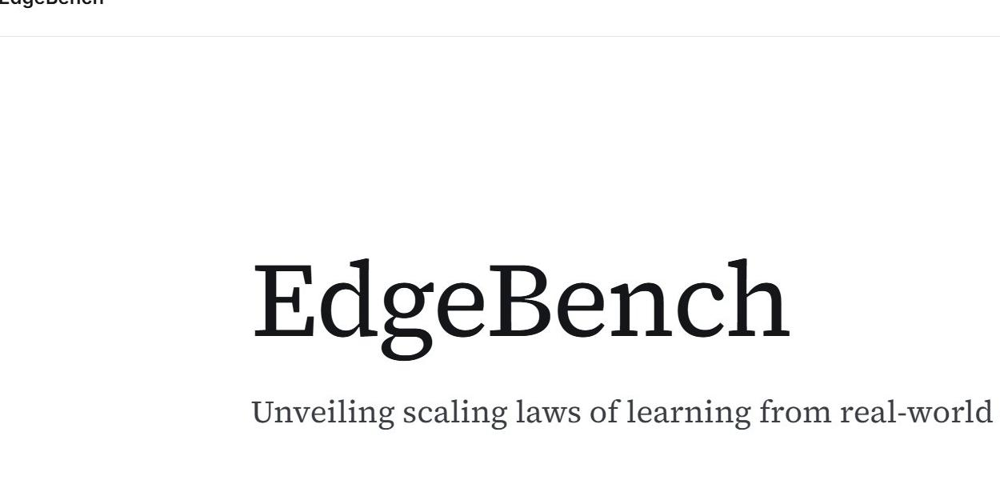
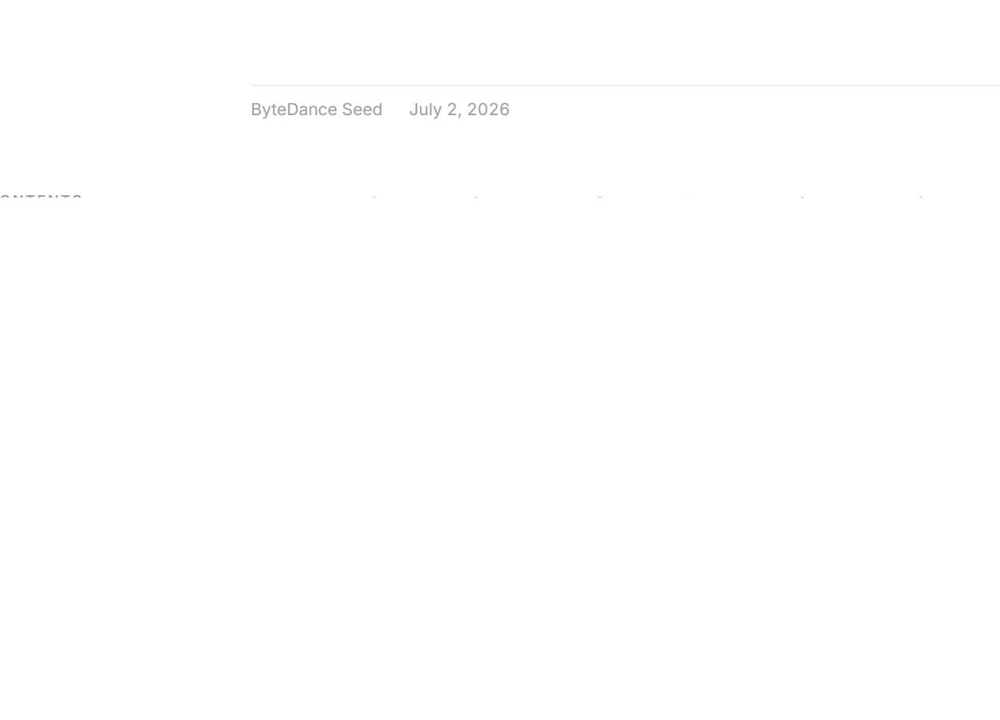

<strong style="font-size:16px;color:#1a6ba0;">要点速览</strong>

- <strong>不是又一个跑分</strong>：EdgeBench测量的是AI Agent在长时间任务中从环境持续学习的能力，而非模型已知知识的总量。它是第一个测量Agent"学习怎样学习"的基准  
- <strong>38,000小时学习曲线揭示Log-Sigmoid缩放定律</strong>：团队发现Agent的环境学习轨迹高度一致：S(t)=Smax/(1+(tmid/t)^β)，平均拟合度R²=0.998。这意味Agent的学习效率可能是一个可预测的工程参数  
- <strong>AI学习速度每3个月翻一番</strong>：从2025年9月到2026年5月，前沿模型的"2小时内学到的东西"提升了约8倍，相当于每季度翻倍  
- <strong>有状态远胜无状态</strong>：同一Agent连续运行12小时，比同一预算下独立重启12次，最终得分高出6.9分：持续经验的价值远大于重复尝试

---

Agent的能力到底是在训练时决定的，还是可以在推理过程中继续成长？

这个问题在2026年越来越紧迫。传统基准测试把模型放到一个封闭箱子里：给一个问题、收一个答案，然后根据"它已经知道什么"来打分。但这种静态评测离真实世界越来越远。在真实场景中，一个写代码的Agent可能花一整天调试一个bug，一个科学Agent可能需要反复实验几十次才能校准模型参数。它们不是一次性回答问题，而是在**过程中不断学习**。

7月2日，字节跳动Seed团队发布了EdgeBench，一个专门用来测量AI Agent从真实环境中学习能力的基准。它给出的答案不仅是一个排行榜，还揭示了一条惊人的规律：AI从环境中学习的轨迹，居然可以用一个简单的数学公式描述。

EdgeBench项目主页

## 这个基准怎么设计的

EdgeBench的核心理念很简单：给Agent一个真实世界的任务，给它12小时甚至更长时间，看它能不能在这个过程中变好。它不是考Agent的知识面，而是考它的**学习曲线**。

为此，团队构建了134个任务，分布在6个能力领域：

EdgeBench的6大任务分类与分布。首批开放51个任务

- **科学与机器学习（39个）**：引力波检测、地下水建模、太阳能预测、电池健康分析等
- **系统与软件工程（36个）**：RISC-V CPU设计、匹配引擎优化、TLS 1.3实现、FFmpeg重写等
- **组合优化（19个）**：车辆路径规划、SAT/SMT求解、分子自组装等
- **专业知识工作（19个）**：CTA风险预算、跨境合规审查、保单精算定价等
- **形式数学与定理证明（13个）**：Lean 4和Coq证明（费马定理、质数定理、球面外翻）
- **交互游戏与模拟器（8个）**：NetHack、运输大亨、文字冒险、韦诺之战

这些任务不是随便从网上扒来的。每个任务都有领域专家参与构建和审核，平均每个任务耗费专家57.2小时，最大的任务甚至用了320小时。首批开放51个任务，完整134个任务需要联系团队获取。

为什么这些任务要持续12小时以上？因为短任务测不出学习效应。一个30分钟就能完成的任务，Agent要么做对要么做错，没有"学了变好"的空间。EdgeBench的所有任务都支持至少12小时的连续运行，部分任务最长运行超过72小时，足够让学习效应充分显现。

## Agent学习循环：不只是试错

EdgeBench定义了一个清晰的环境学习循环：

环境学习的4步循环：尝试 → 观察 → 吸收 → 改进

1. **尝试**（Attempt）：在真实环境中测试候选方案
2. **观察**（Observe）：从每次尝试中接收新的信息
3. **吸收**（Absorb）：分析环境反馈和历史交互记录
4. **改进**（Improve）：将经验转化为更好的方案和策略

然后重复。12小时内循环几十到几百次。

这听起来像是基础的"试错"，但它和强化学习中的"奖励信号"有本质区别。RL给的是一个标量奖励：数字越大越好，Agent自己摸索怎么最大化它。但EdgeBench的任务反馈是**结构化的、丰富的、问题域相关的**：编译器的错误日志、科学实验中的物理一致性检查、代码审查的测试失败信息。Agent不是简单地"最大化分数"，而是要从这些反馈中**理解问题、诊断根因、重新制定策略**。

这才是真正意义上的人类式学习。

## 38,000小时学习曲线揭示的规律

做了134个任务、跑了多轮Agent之后，EdgeBench团队发现了令人惊讶的结果。他们记录了每个模型在134个任务上的402条学习曲线（12-72小时窗口），然后将这些曲线按时长做平均。原本参差不齐、充满毛刺的单条曲线，在平均之后竟然全部收敛到同一个形状：

各模型在12小时内的学习曲线。不同颜色代表不同模型。尽管单条曲线充满毛刺和平台期，平均后所有曲线收敛到同一个形状

这个形状就是 **Log-Sigmoid曲线**：

$$S(t) = \frac{S_{\max}}{1 + (t_{\text{mid}}/t)^\beta}$$

拟合度平均R²=0.998：这在社会科学和行为科学中是极为罕见的精度。从引力波检测到NetHack，从形式证明到运输优化，所有任务的平均学习曲线都遵循这个形状。

这个公式中的参数含义：
- $S(t)$：t时刻的最好得分
- $S_{\max}$：这个任务可能达到的得分上限
- $t_{\text{mid}}$：达到一半上限所需的时间
- $\beta$：学习曲线的陡峭程度

## Log-Sigmoid定律的理论解释

拟合的精度已经令人印象深刻，但EdgeBench团队更进一步：他们提出了一个简洁的理论解释。为什么学习会呈现这个形状？

每个任务的得分由许多"小单元"（潜在图中的节点）构成，每个节点要么解锁要么未解锁。学习就是节点解锁的过程：一个节点解锁后，它的邻居变得更容易解锁，所以学习从种子点向外扩散，形成一个**前沿**。

Log-Sigmoid缩放定律：左侧是单个任务的前沿扩张过程，右侧是平均后呈现的Log-Sigmoid曲线

前沿的移动速度由两个因素决定：已经解锁的节点（提供动力）和仍然锁定的节点（提供空间），恰好是 $\beta \cdot x(1-x)$ 的形式。由于任务图是自相似的：难度每上一个台阶就需要乘性更多的搜索：时间轴表现为对数尺度。

团队将以上推理写成了一个微分方程：

$$\frac{dx}{d\ln t} = \beta x(1-x)$$

求解这个方程，得到的正是前面拟合的Log-Sigmoid公式。这个理论之所以漂亮，不是因为它有多复杂，而是因为它把"学习"这个模糊的概念变成了一个可计算的动力学方程。单个任务的曲线充满毛刺和平台期（由于有限大小的任务图），但大量任务的平均噪声相互抵消，Log-Sigmoid作为群体层面的趋势浮现出来。

**你可能遇到过这种困惑：** 一个Agent跑了6小时没进展，是应该继续还是换个方向？有了这个曲线，我们可以预估它大概什么时候会突破。

## AI学习速度每3个月翻一番

EdgeBench还有一个更令人震撼的发现：AI从环境中学习的速度，正在以**每季度翻倍**的速度增长。

团队选取了18个初始性能相近的任务，然后用"2小时内性能提升"作为学习速度的指标，跟踪了从2025年9月（GPT-5-Codex）到2026年5月（Claude Opus 4.8、GPT-5.5、DeepSeek V4 Pro等）的前沿模型发布。

前沿模型学习速度趋势：2025年9月到2026年5月约8倍提升，每3个月翻一番

结果：221天内前沿模型的学习速度提高了约8倍：于每3个月翻一番。这不是简单的"提交更多"：后续模型提交中能显著改进成绩的比例更高，说明它们知道怎么更有效地利用反馈。

12小时的总榜上，Claude Opus 4.8以51.3分领先，GPT-5.5以48.4分紧随其后。

EdgeBench 12小时排行榜（前5名）

有趣的是各领域的表现差异：在科学和代码领域，分数差距明显拉大；而在游戏和专业知识领域，模型之间的差距相对较小。

## 一个12小时跑的真实样本

来看看一个Agent在12小时内具体经历了什么。EdgeBench展示了GPT-5.5在引力波检测任务上的完整轨迹：

GPT-5.5在引力波任务上的12小时运行：从42.8分到67.0分。247次计分提交中只有27次提升了成绩

247次计分提交，224次提交中只有27次将最好成绩提升了至少0.1分：效率看起来很低，但这正是学习的本质。

这27次提交背后是一个清晰的diagnose-edit-evaluate循环：

1. **先让它可测量，再让它更好。** 最初，Agent需要把一个无结构的分析任务变成一个可打分的流水线。仅这一步就涨了4.5分。
2. **直接修复走不通，就分解问题。** Agent将波形匹配失败拆解为参考锚定、时频定位、检测器对齐三个子问题，7次更新将分数提到52.3。
3. **找到主要瓶颈。** 组件反馈指向速度和分离参数是差距的主要来源，Agent在源质量校准空间内搜索，创造了运行中最大的一次跳跃。
4. **保留核心，修复剩余误差。** 最后几小时集中做残差、相位和窄带修正，将分数推至67.0。

这个模式让人想起人类专家解决问题的过程：不是线性的、不是一蹴而就的，而是反复地诊断-拆解-聚焦-修复。Agent不是在"做题"，而是在真正地做科研。

## 持续经验vs重复重启

EdgeBench还有一个重要的对比实验值得关注。

同一个Agent，一种模式是让它连续跑12小时（有状态），另一种是让它独立重启12次、每次1小时（无状态）。结果：**连续运行的最终得分比独立重启高出6.9分。**

这不是一个微小的差距：在EdgeBench的评分体系下，6.9分可能比一代模型更新带来的提升还要大。这个结果有些反直觉：独立重启看起来似乎有更多"新鲜感"和"第二次机会"，但事实上，Agent从上一轮失败中积累的经验，远比重启后的新初始状态更有价值。

**这给Agent部署的实际启示是：不要频繁重置Agent的上下文。让它记住自己做过什么、为什么失败，这才是学习的关键。**

<strong style="font-size:15px;color:#8b6f4c;">结语</strong>

EdgeBench的出现是AI评测范式的转变：从"你知道什么"到"你能学得有多快"。在Agent时代，推理时的持续学习能力可能比预训练的知识储备更重要。这就像区分一位"什么都懂但一成不变的教授"和一位"愿意进实验室反复验证的博士生"：后者才是真正解决新问题的能力。  
但3个月翻倍的趋势线需要理性看待。这条曲线的分母是前沿模型的更新频率（1-2个月一代），学习速度的提升是模型能力、推理链长度、上下文窗口、Agent架构优化等多因素叠加的结果。如果模型更新放缓或架构出现突破性变化，这个趋势是否会持续还有待观察。  
EdgeBench还有一个更微妙的启示：它揭示的diagnose-edit-evaluate循环，比目前很多Agent框架的自夸更接近真正的自主智能。Agent不需要外部prompt工程或人类干预，自己就能从环境反馈中找出瓶颈、分解问题、修复错误。这才是Agent真正变得有用的方向：不是跑得更快，而是学得更聪明。

---

【传送门】 
<a class="normal_text_link mp_article_text_link" href="https://mp.weixin.qq.com/s/qcIFzXsBalSGpca5fzJKxg" target="_blank" data-linktype="2">Claude Code动态Workflow Vs. SubAgent Vs. Skill</a> 
<a class="normal_text_link mp_article_text_link" href="https://mp.weixin.qq.com/s/aiJs5CC8Gb6qa_xDRNEjTA" target="_blank" data-linktype="2">Dynamic Subagents：用代码编排Agents，告别逐轮工具调用</a> 
<a class="normal_text_link mp_article_text_link" href="https://mp.weixin.qq.com/s/mFuUJ79DRodIK6shVWOgpw" target="_blank" data-linktype="2">OpenAI GPT-5.6：安全之外新增Prompt Cache断点+两种推理模式；放弃版本号</a> 
<a class="normal_text_link mp_article_text_link" href="https://mp.weixin.qq.com/s/xP1cEoO_plRpWItxhqeQnQ" target="_blank" data-linktype="2">Agent Harness Engineering：为什么Agent可靠性的天花板不是模型而是基础设施</a> 
<a class="normal_text_link mp_article_text_link" href="https://mp.weixin.qq.com/s/o6pnSWW01pahFQelJSbSPA" target="_blank" data-linktype="2">华为「韬定律」全解析：从 τ 常数到4GHz麒麟，一张时间表看清未来十年芯片路线</a> 
<a class="normal_text_link mp_article_text_link" href="https://mp.weixin.qq.com/s/PLNx54PxO1A0oYc47hz99g" target="_blank" data-linktype="2">Anthropic三连：Claude Opus 4.8更聪明+诚实；CC动态工作流+算力控制</a> 
<a class="normal_text_link mp_article_text_link" href="https://mp.weixin.qq.com/s/Pdjz39WG9SS6IpWWAJ6pPw" target="_blank" data-linktype="2">Claude Opus 4.8击败Opus 4.7、GPT-5.5和Gemini 3.1 Pro</a> 
<a class="normal_text_link mp_article_text_link" href="https://mp.weixin.qq.com/s/oDZJbvskv_ocNgPUH1DHVA" target="_blank" data-linktype="2">AI暗输出：为何AI价值在GDP统计中失效了</a> 

---

参考：

https://edge-bench.org/，https://x.com/scaling01/status/2072790826581709165