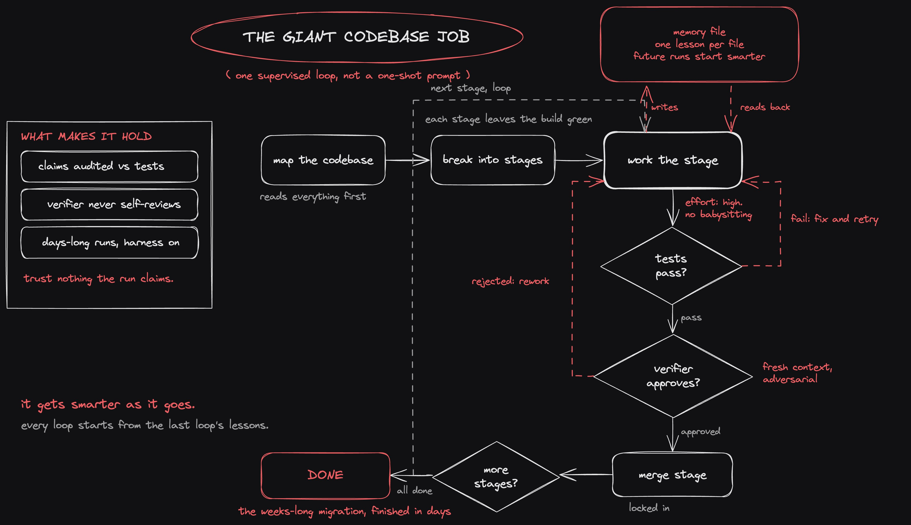
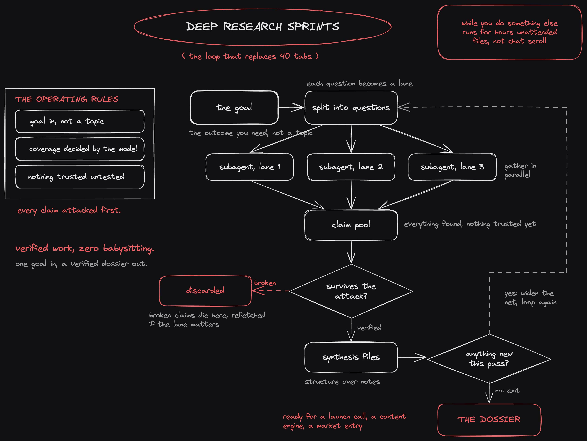
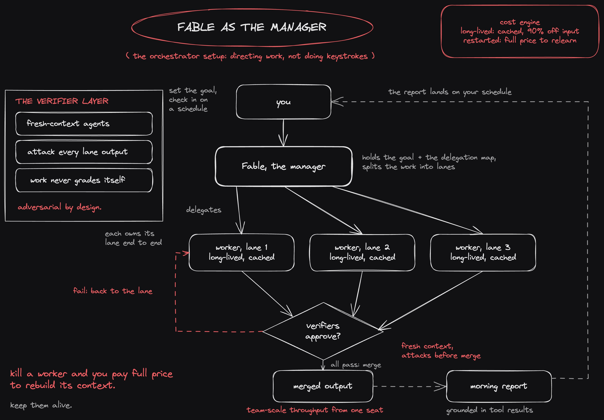
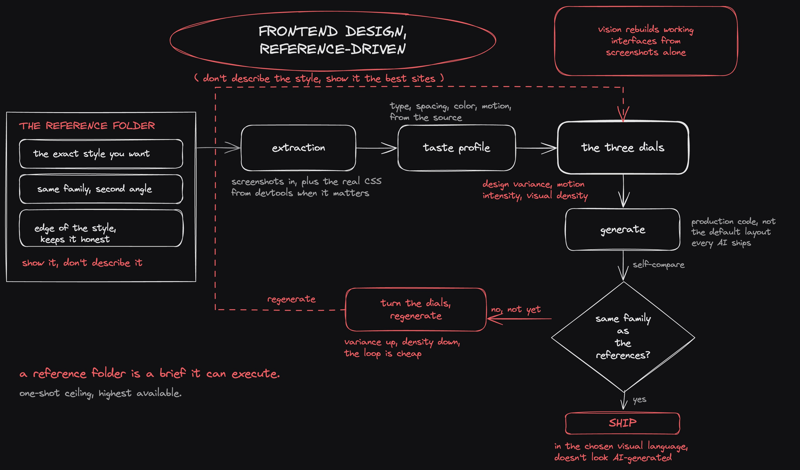
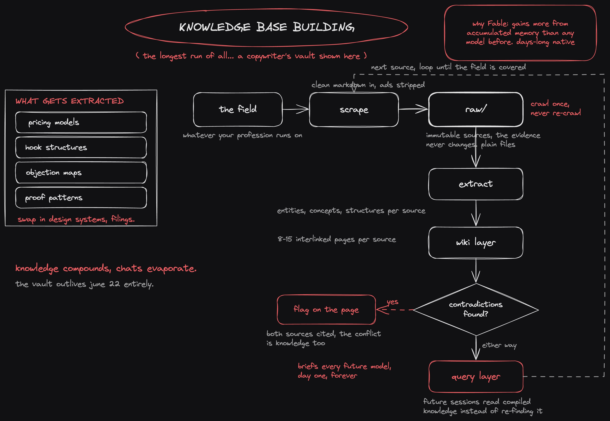

**要点速览**

<strong style="font-size:16px;color:#1a6ba0;">要点速览</strong>

- <strong>Fable 5 的 11 天窗口期</strong>：6 月 22 日前 Fable 5 包含在 Claude 订阅中，不限量使用。这是「拥有最好的模型，已付费，无限量」的稀有窗口  
- <strong>五大系统</strong>：巨型代码库迁移、深度研究冲刺、Orchestrator 多 Agent 编排、前端设计、知识库构建——每个都曾是「某天再做」的项目  
- <strong>Orchestrator 模式</strong>：Fable 作为管理者调度并行子 Agent，长期 worker 保持 90% 输入缓存折扣，kill-restart 模式则全价重新学习  
- <strong>知识库构建</strong>：三层架构（raw → wiki → query），将领域知识编译为 Obsidian vault，成为「6 月 22 日之后仍然存在的资产」

---

**Fable 5 的最后 11 天：五大系统，把每一分 token 用到极致**

Fable 5 是 Anthropic 有史以来发布的最强模型。6 月 22 日前，它包含在每一个付费 Claude 订阅中。之后，每一次调用都是按量计费，重度使用会迅速变贵。

所以接下来 11 天，你手里握着一件稀有的东西：**世界上最好的模型，几乎无限量，已经付过钱了。**

策略很简单：在它们还包含在订阅里的时候，花掉你能花的每一分 token。如果你的 backlog 比你的订阅计划还大，叠一个 Max 订阅也比按量计费一周同样的工作便宜。唯一的问题是——花在什么上面？答案不是聊天，而是那些你拖延了几个月、因为太长或太重、直到现在没有任何模型能处理的项目。

**以下 5 个系统，Fable 能带来可衡量的差异。** 每个按同样的结构拆解：架构、如何编排、产出什么。

---

**1. 巨型代码库任务**

每家公司都有一个：范围以周计的数据迁移、没人自愿接手的重构、一拖再拖的重写。

**Fable 改变了这个等式，因为它能在数百万 token 上保持专注，在 Claude Code 内持续运行数天。** 即使是它的中等努力（medium effort）设置，也能完成去年最强模型全力以赴才能做到的事。

编排：

> 先测绘代码库，然后把任务拆成阶段
> 在一个长监督循环中逐阶段推进
> 一个独立的验证 Agent 用全新上下文在每个阶段开始前把关
> 每一个进度声明都绑定一个真实的测试结果——早上的报告匹配实际存在的代码
> 一个记忆文件沿途收集运行过程中对代码库的发现

**产出：** 几天完成原本数月的迁移，外加一个记忆层，让未来在该代码库上的每一次运行都更快。

---

**2. 深度研究冲刺**

现在的研究意味着 40 个打开的标签页、一个会忘记上下文的聊天窗口、以及你自己来做综合整理。

**Fable 用一条自主循环取代了整个仪式——运行数小时，带回经过验证的成果。** 因为长周期专注和并行子 Agent 是它的原生优势。

编排：

> 输入一个研究目标，写为你需要的产出
> 并行地从多个来源收集信息
> 每一个重要声明都经过一个独立的检查 Agent 尝试推翻
> 随着循环运行，发现被写入结构化文件
> 当新的 pass 不再浮现任何新内容时循环结束——这个覆盖决策由模型自己做出

**产出：** 一份研究报告，每一条声明都经受了攻击，可以直接用于发布决策、内容引擎或市场进入。

---

**3. Orchestrator 设置**

这是其他四个系统所处的框架：**Fable 作为 Agent 团队的管理者。** 因为市场上最聪明的模型用来指挥工作比用来敲键盘更有价值。

它比之前的任何模型都更愿意分发并行子 Agent，而且经济学对你有利：长期 worker 保持上下文缓存，享受 90% 的输入折扣；而被 kill 后重启的 worker 则全价重新学习一切。

架构：

> 管理者持有目标和委派地图
> 每个 worker 负责一条轨道，并行运行
> 验证 Agent 用全新上下文在合并前攻击一切
> 通信是异步的——你按计划检查进度，而不是盯着看

**你不再监督敲键盘，而是开始管理一个团队——因为现在就是这样。**

产出：一个席位获得团队级别的吞吐量——而且这套架构比这个模型活得更久，同样的架构可以运行你未来指向的任何模型。

---

**4. 前端设计**

Fable 是目前最强的设计模型。**提取它的方式是以参考为驱动：你不描述你想要的风格，而是给它看该风格下最好的 UI/UX 网站，让它从中提取品味。**

它的视觉能力足够强，能仅凭截图重建可工作的界面——这意味着一个参考文件夹就是它可以执行的设计简报。

编排：

> 收集 2-3 个你想要的确切视觉风格的网站，截图放入参考文件夹
> 当精度重要时，从 devtools 抓取真实的 CSS——字体、间距和颜色来自源头，而非像素猜测
> 添加一个品味层：taste-skill 给 Agent 三个在生成时应用的旋钮——设计变化度、动感强度、视觉密度——这样输出就不会默认成每个 AI 都在用的布局
> 生成，然后让 Fable 将自己的输出与参考对比并迭代

**产出：** 以你选择的精确视觉语言构建的生产级前端，看起来不像 AI 生成的。

---

**5. 知识库构建**

这是最长的运行，也是几乎没人正在做的事：**把 Fable 指向你领域里一切值得知道的东西，让它构建你的业务所依赖的知识库。**

一个文案可以让它抓取每一个优秀的销售页面和值得研究的框架，提取结构，全部存储为一个互相关联的 Obsidian vault。一个设计师可以对设计系统做同样的事，一个机构可以对案例研究做同样的事——这个模式适用于任何职业。

架构有三层：

> **raw**：来源被清理为 markdown，保持不可变
> **wiki**：每个概念有自己的互链页面，来源之间的矛盾被揭示而非掩盖
> **query**：未来的会话读取编译后的知识，而不是每次都重新寻找

每个摄入的来源变成 8-15 个关联页面，整个 vault 保持为你拥有的纯文本文件。

**Fable 是做这件事的正确模型**，因为它需要数天的连续 scrape → extract → file 工作，而且它从累积记忆中获益比之前的任何模型都多——它构建的 vault 让构建者随着运行变得更聪明。

**产出：** 完全在 6 月 22 日之后仍然存在的资产——一个知识库，为未来你运行的每一个模型提供简报，从第一天开始，永远。

---

**回顾**

> 代码库任务：阶段循环 + 验证把关，数周迁移在数天内完成
> 研究冲刺：收集 → 验证 → 综合，直到没有新内容浮现
> Orchestrator：管理者 + worker 轨道 + 验证者，一个席位的团队输出
> 前端：参考文件夹 + 品味旋钮，看起来不像生成的设计
> 知识库：raw → wiki → query，持续复利的资产

**这五个中的每一个，一个月前都是「某天再做」的项目。而每一个，在 6 月 22 日之前，都是「这周就做」的项目。**

在窗口关闭之前，选一个在你 backlog 里躺得最久的，今晚把目标交给 Fable，让第一次运行教会你剩下的四个应该怎么做。**token 已经付过钱了。**

---

<strong style="font-size:15px;color:#8b6f4c;">结语</strong>

这篇帖子的核心洞察不在那五个系统本身——它们大多是已知的 Agent 模式变体。真正有趣的是「限时窗口」这个 framing：把订阅制的「无限调用」视为一种稀缺资源，需要策略性地消耗。这本质上是在用 token 预算思维替代对话思维。  
但帖子的商业意图也很明显——每个系统都指向 weeklyaiops.com 社区，五个系统是 lead magnet，社区是变现端。这不减损内容的价值，但读者需要意识到：Fable 5 窗口期结束后，这些工作流的持续运行成本会迅速累积，社区提供的「深度指南」大概率也是付费内容。  
五个系统中，知识库构建是最被低估的。它不产生即时可见的产出（不像「迁移完成」「PR 合并」），但它的复利效应最强——每次运行都在为下一次积累上下文。这也是最需要 Fable 5 窗口期的任务，因为其他四个系统在窗口结束后仍然可以用按量付费跑，而知识库构建的数天连续 scrape 成本在按量模式下会非常可观。

---

参考：Fable 5 的最后 11 天：五大系统把每一分 token 用到极致
