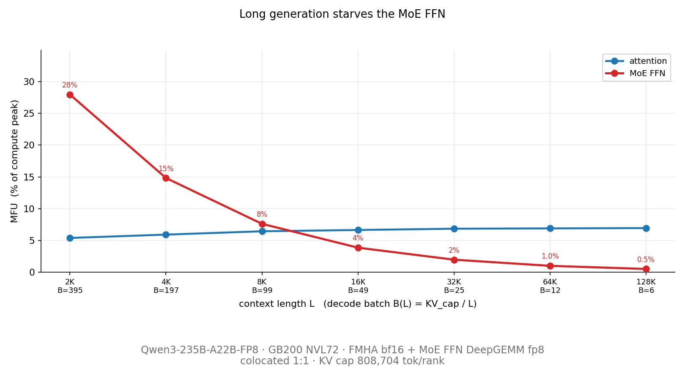
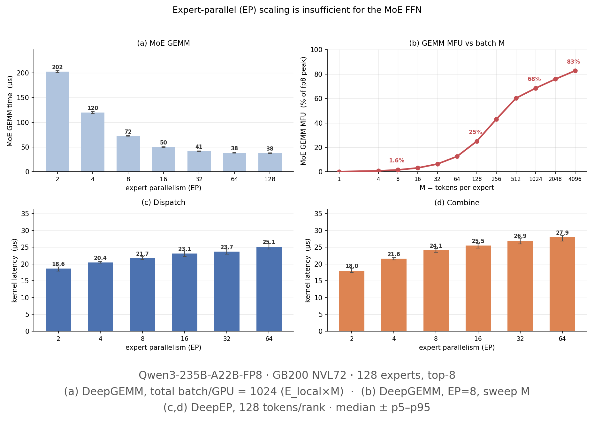
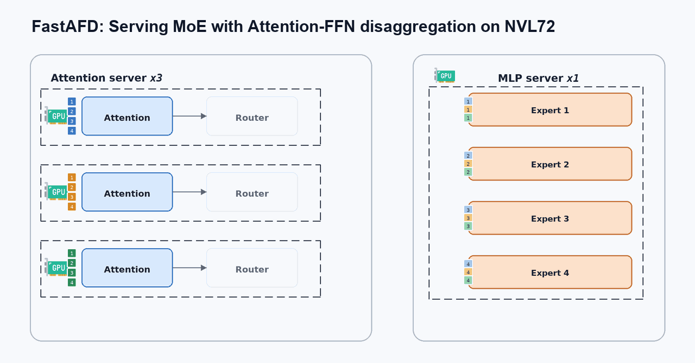
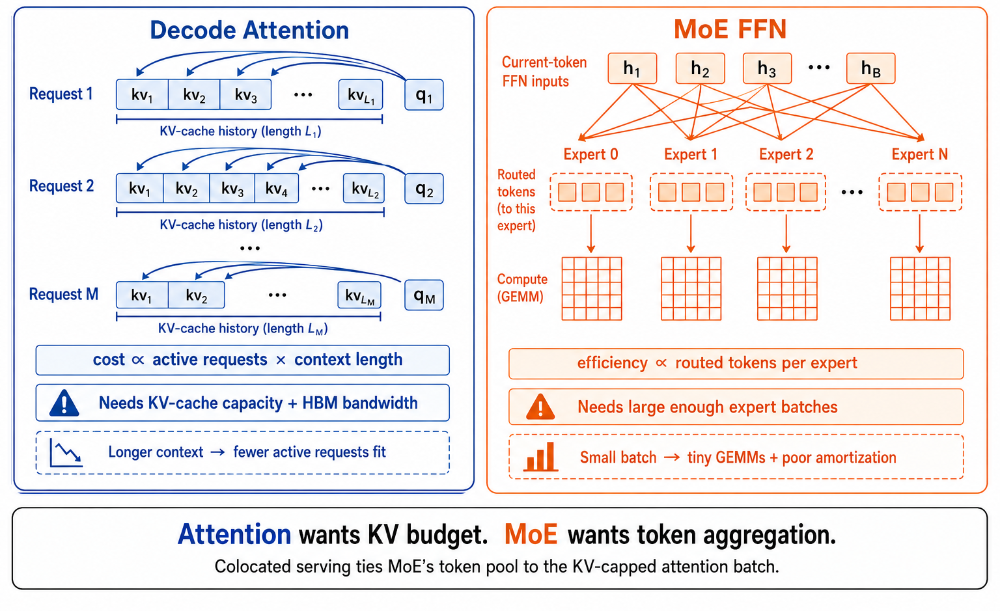
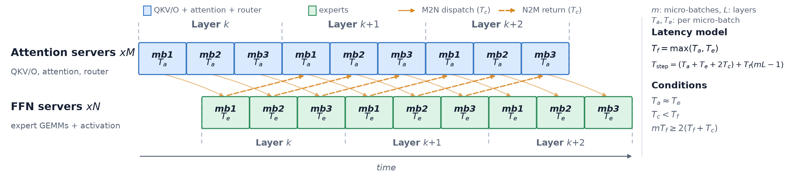
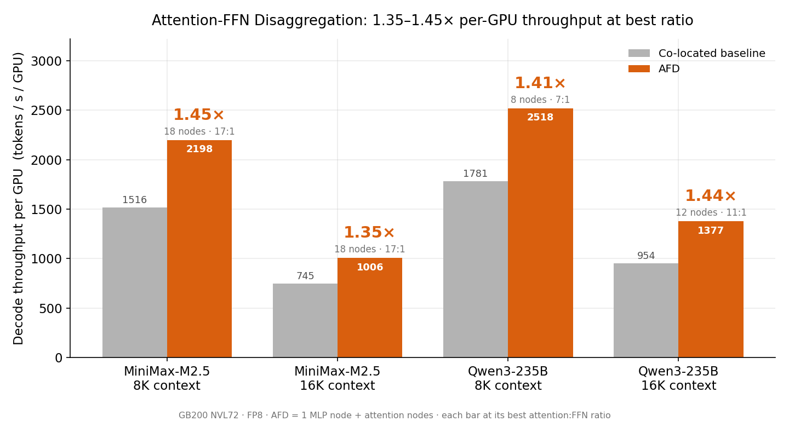
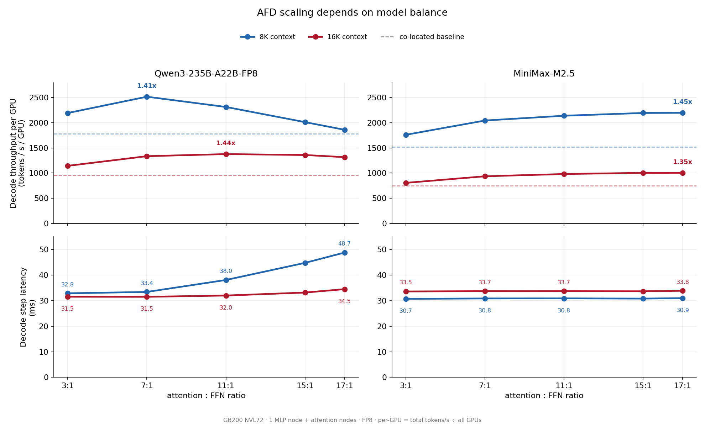
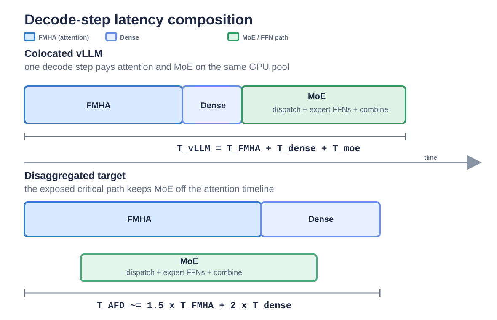
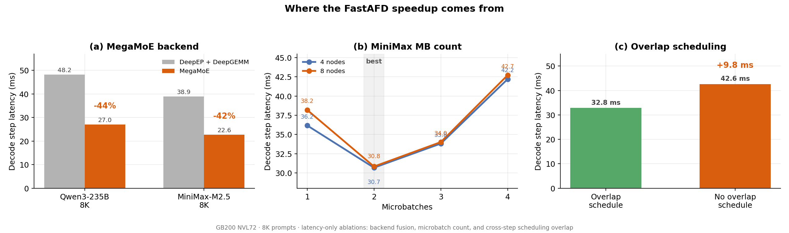

<strong style="font-size:16px;color:#1a6ba0;">要点速览</strong>

- <strong>FastAFD 是什么</strong>：UCSD Hao AI Lab 开源的 Attention-FFN 解耦推理系统，在 GB200 NVL72 上实现 1.35–1.45x 的每 GPU 吞吐提升  
- <strong>为什么需要解耦</strong>：长上下文场景下 Attention 受 KV Cache 容量限制导致 batch 缩小，MoE 层因 token 不足而 GEMM 低效——两类算力需求天然冲突  
- <strong>核心技术突破</strong>：MegaMoE 融合核（将 dispatch + 专家 GEMM + combine 合一）、CUDA Graph 预录、零开销调度（协调器提前一步准备计划）、2 微批次流水线  
- <strong>Vera Rubin 展望</strong>：若 MoE 卸载到 LPX，推理吞吐可提升 1.57–1.75x；若将 dense 计算也移过去，可达 2x 以上

---

## MoE 推理的"左右互搏"

大模型推理行业有一个日益尖锐的问题：**Attention 和 MoE 层对算力资源配置的要求完全相反，但现有的 colocated 方案把它们绑在一起运行。**

Attention 层的核心瓶颈是 KV Cache 容量。随着上下文增长，单 GPU 能同时容纳的活跃请求越来越少，batch 被迫缩小。而 MoE 层恰恰相反——它需要足够大的 batch 才能让各 expert 的 GEMM（通用矩阵乘法）达到高利用率。batch 一缩小，每个 expert 分到的 token 寥寥无几，矩阵乘法变成"小矩阵计算"，硬件利用率迅速崩塌。

UCSD Hao AI Lab 在一篇技术博客中清晰地展示了这一矛盾。在固定的 KV Cache 预算下，随着上下文长度 \(L\) 增长，活跃 batch \(B\) 缩小，Attention 层的 MFU（模型算力利用率）基本持平——因为它是 HBM 带宽受限，读同样多的 KV Cache 自然保持稳定。但 MoE 层的 MFU 却随 batch 缩小而直线下降。

**这一矛盾的根本原因在于：Attention 受内存容量约束，MoE 受计算吞吐约束，把它们硬塞在同一块 GPU 上，两端都得不到最优资源配置。**

固定 KV Cache 预算下，上下文越长 → batch 越小 → MoE 利用率崩塌，而 Attention 保持平稳

## Expert Parallelism 解决不了问题

有人可能会想：加大 Expert Parallelism（EP）不就行了？

答案是**不能**。EP 只改变每块 GPU 从 HBM 读取的 expert 权重数量，但它**不改变送入 MoE 层的 token 总数**。在 colocated 模式下，batch 已经被 Attention 的 KV Cache 容量固定了，EP 再大，每个 expert 仍然只能分到那么点 token。

实验数据证实了这一点：固定每 GPU 的 MoE token 数并增加 EP 只会减少本地 expert 权重读取量，降低延迟的边际收益迅速衰减；真正能让 MoE 利用率提升的方法是增加每 expert 的 token 数，而这需要突破单个 Attention worker 的 KV Cache 上限。

EP 增加仅减少权重 I/O，不改变 token 总量；真正的杠杆在于聚合更多 attention worker 的 token

## AFD：把 Attention 和 FFN 拆开

Attention-FFN Disaggregation（AFD）的思路来自 MegaScale-Infer 和 Step-3 等先驱工作。核心思想很朴素：**让 Attention workers 和 FFN（MoE）workers 各司其职。**

- **Attention worker** 负责请求面路径：管理 KV Cache、注意力计算、路由决策和采样。它只持有模型权重中很小一部分（QKV 投影、输出投影等非专家权重）。
- **FFN worker** 负责重量级 MoE 计算：接收来自多个 Attention worker 的路由 token，按 expert 分组，执行专家 GEMM 和激活函数，再将结果送回。

这样做的最大好处：**FFN 端不再受困于某个 Attention worker 的 KV Cache 容量限制。** 多个 Attention worker 的 token 在 FFN 端聚合，每个 local expert 的 GEMM 规模瞬间变大，利用率自然提升。

实验表明，随着 feeding 同一个 FFN pool 的 Attention worker 数量增加，MoE 的 MFU 显著高于 colocated baseline。

AFD 解耦后的 token 流：Attention workers 执行请求并行，FFN workers 聚合 token 形成大 expert batch

## GB200 NVL72：最强的 baseline，最难攻的阵地

GB200 NVL72 是一个机架级系统：36 颗 Grace CPU + 72 块 Blackwell GPU（18 个 4-GPU 节点），通过第五代 NVLink 构成统一的 72-GPU NVLink 域。每 GPU 192GB HBM3e、130 TB/s 机架级 NVLink 带宽——这些数字让 colocated baseline 本来就非常强。

Perplexity 早先的报告已经指出，在完整 NVL72 机架上，利用机架内高带宽和宽 EP，colocated MoE 推理已经很有竞争力。

**对 AFD 来说，这意味着不能只靠"换布局"来赢——必须从运行时层面真正优化掉 dispatch/combine 的通信开销和调度气泡。**

FastAFD 正是在这个前提下设计出来的。

Colocated MoE 逐层执行流程：同一 worker 顺序执行 Attention、路由、Dispatch、专家计算、Combine——各阶段串行，张力明显

## FastAFD 四大优化

### 1. GPU 端控制通信

MegaScale-Infer 和 Step-3 都通过 CPU 侧的 RDMA 进行 M2N/N2M 通信，理由是省 GPU SM。但在 NVL72 上，Attention 和 FFN workers 共享同一个 NVLink 域，FastAFD 选择**把通信控制也放在 GPU 上**——复用 DeepEP 的 dispatch/combine kernel。

Attention 侧的边界 kernel 只用 24 个 SM（Blackwell 总共 148 SM，约 16%），FFN 侧因为独占 GPU 更没有压力。代价是 GPU SM 开销，但通过后面的 MegaMoE 融合，这笔开销被重叠掉了。

### 2. MegaMoE 融合核

这是 FastAFD 最关键的性能优化。受 DeepGEMM 的 MegaMoE 启发，它将 EP dispatch、expert GEMM（含 SwiGLU）和 EP combine 融合为**单个 kernel**。

在 AFD 边界处，FastAFD 拆为两个角色专用 kernel：
- **Attention 侧 kernel**：将 hidden state 量化为 FP8、发布路由元数据、等待 expert 回写、reduce top-k 结果。只占 24 SM。
- **FFN 侧 kernel**：拉取所有 Attention worker 的 FP8 token、执行 group expert GEMM（SwiGLU 融合在 GEMM pipe 内）、将 BF16 输出推回各源 rank。

因为 FFN worker 只运行 receive-compute-return 循环，FastAFD 甚至能**一个 decode step 只 launch 一次 persistent FFN kernel**——逐层、逐微批次的 kernel launch 全部消失。

消融实验显示，对比分离式 DeepEP + DeepGEMM 路径，融合后的 8 节点 decode-step 延迟降低 44%（Qwen3-235B）和 42%（MiniMax-M2.5）。

### 3. CUDA Graph 预录

在推理场景中，每次 decode step 的完整 DAG（依赖图）是固定的，CUDA Graph 允许一次性"录制"所有 GPU kernel launch，然后无限回放，省去逐次 launch 的开销。FastAFD 将整个 decode step（含通信 kernel）纳入 CUDA Graph，大幅降低启动成本。

### 4. 零开销调度

协调器（coordinator）在 GPU 执行当前 decode step 的同时，通过 ZMQ 准备下一步的计划：决定哪些请求活跃、怎么分区到微批次、每个 rank 用哪个 graph bucket。**一个集群范围的调度往返时延就这样从 decode 关键路径中移除了。**

AFD 微批次流水线：dispatch、expert 计算、combine 和 attention 端工作在微批次间重叠，消除通信气泡

协调器提前一步准备计划，GPU 执行当前计划时调度在后台并行进行

## 效果到底如何？

FastAFD 在 steady-state decode（已 prefilled 后持续生成 token）上评估，对比 tuned vLLM colocated baseline。两个模型：Qwen3-235B-A22B-FP8（235B 参数/22B 激活/128 expert）和 MiniMax-M2.5（约 230B 参数/10B 激活）。

**代码里的一组数字：**

| 模型 | 8K 上下文 | 16K 上下文 |
|-------|-----------|------------|
| Qwen3-235B | **1.41x** | **1.44x** |
| MiniMax-M2.5 | **1.45x** | **1.35x** |

每 GPU decode 吞吐提升 1.35–1.45x。作者还给出了一个**精确可计算的加速公式**：

$$\text{加速比} = \underbrace{\frac{B_{\text{AFD}}}{B_{\text{vLLM}}}}_{\text{batch 扩展}} \times \underbrace{\frac{T_{\text{vLLM}}}{T_{\text{AFD}}}}_{\text{延迟比}} \times \underbrace{\frac{M}{M+N}}_{\text{FFN 节点税}}$$

其中：
- **batch 扩展**：Attention worker 不需要存 expert 权重（>90% 的参数），释放出来的内存可多放 KV Cache → 每 GPU batch 从 64 提升到 96（Qwen 8K），1.5x
- **延迟比**：AFD 的 decode step 时长和 vLLM 差不多，拉不掉多少分
- **FFN 节点税**：FFN workers 参与计算但不承接请求，多出来的 GPU 是"税"

**加速的核心来自"容量换吞吐"**——Attention worker 因为不存 expert 权重而能放更多 KV Cache（更大 batch），即使 FFN 端多占了些 GPU，净效果仍正向。

FastAFD 在最佳 Attention:FFN 节点比例下的每 GPU decode 吞吐提升

Qwen 和 MiniMax 的 AFD 缩放对比：MiniMax 在 17:1 仍不饱和，Qwen 有最佳点

## Vera Rubin + LPX 上的推演

NVIDIA Vera Rubin + LPX/LPU 是下一代异构加速器：Rubin GPU（288GB HBM4、22TB/s HBM 带宽）处理 Attention 和 KV Cache 重负载，LPX（每 rack 256 LPU、315 PFLOPS FP8）加速 MoE 推理。

FastAFD 团队用 GB200 上验证过的分解模型做了投影：

| 边界 | MiniMax 8K | MiniMax 16K | Qwen 8K | Qwen 16K |
|------|-----------|------------|---------|----------|
| MoE 仅卸载 | **1.68x** | **1.57x** | **1.75x** | **1.71x** |
| Dense + MoE 全卸 | **2.31x** | **2.07x** | **2.42x** | **2.36x** |

关键前提是 LPX 的执行时间 + 传输时间要< Rubin 剩余的 Attention 时间。从 GB200 的 kernel share 推算，LPX 有充足余量——2.66–3.73ms 的 slack，足够吃下网络传输波动。

GB200 step 分解与 AFD 延迟模型：左列 vLLM 分解为 FMHA + Dense + MoE，右列为 AFD 暴露路径

## 几条关键结论

博客末尾的"Takeaways"写得非常清晰，每条都值得消化：

1. **同一 NVLink 域内，通信必须留在 GPU 上。** MegaScale-Infer 选择 CPU 控 RDMA 来省 SM，这在 NVL72 上行不通——GPU 间通信必须用 GPU 端 kernel，才能进入 CUDA Graph，实现真正的零开销回放。

2. **平衡不是目标。** 先前 MegaScale-Infer 追求 \(T_a \approx T_e\)（Attention 和 MoE 时间平衡），但这条路走不通。FFN 端闲一点，代价只是多占一个节点（固定 \(\frac{1}{M+1}\)）；FFN 端暴露了，每步 decode 都变慢，且随 M 增长恶化。FastAFD 的策略是**让 FFN 端始终隐藏**（\(T_e \le T_a\)），用最大的 M 让 MoE 空闲但可控。

3. **两个微批次就够了。** mb=2 已经能完全隐藏两个通信方向。更多微批次只会加倍小 kernel 的副本数，没有额外收益。

4. **加速来自容量，而不是速度。** FastAFD 的 decode step 和 vLLM 的差不多长。真正的变化是**每 GPU 持有的东西不同了**——Attention worker 甩掉了 90%+ 的权重，多装了 1.5x 的请求。Net 结果是每 GPU 吞吐提升了 35–45%。

消融实验：每个运行时机制保护加速公式中的一项——MegaMoE 降延迟 44%、mb=2 正好隐藏通信、零开销调度避免 9.8ms 步周期增长

<strong style="font-size:15px;color:#8b6f4c;">结语</strong>

FastAFD 是一份很"干净"的工程成果——问题定义清晰（MoE 推理的 Attention vs FFN 资源冲突）、数学分解简洁（加速比三因子恒等式）、实验验证扎实（公式复现了每个 workload 的实测值），而且完全开源。  
它在 GB200 上拿到 1.4x 不算意外——这是 AFD 预期的改进幅度。更有意思的是它对 Vera Rubin + LPX 的推演：如果 AFD 的下一个硬件边界是把 Attention 和 MoE 放到完全不同的加速器上，FastAFD 已经证明了这套软件接口是可移植的。KV Cache 重负载走 Rubin，权重重负载走 LPX——不用改模型，只改部署拓扑。  
UCSD 团队开源的不仅是代码，还有一套用来"计算加速比"的方法：用 vLLM 的单机 kernel profile 就能预测 AFD 在新硬件上的收益。这个分析框架可能比具体数字更有长期价值。

---

【传送门】 
<a class="normal_text_link mp_article_text_link" href="https://mp.weixin.qq.com/s/XXXX" target="_blank" data-linktype="2">已发布文章1</a> 
<a class="normal_text_link mp_article_text_link" href="https://mp.weixin.qq.com/s/XXXX" target="_blank" data-linktype="2">已发布文章2</a> 

---

参考：https://haoailab.com/blogs/fastafd/
