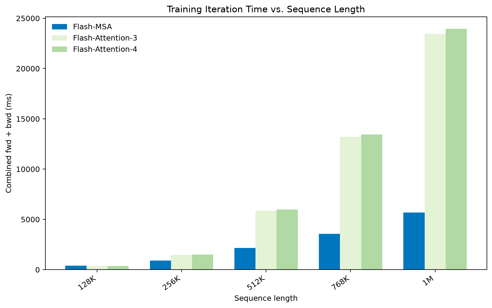
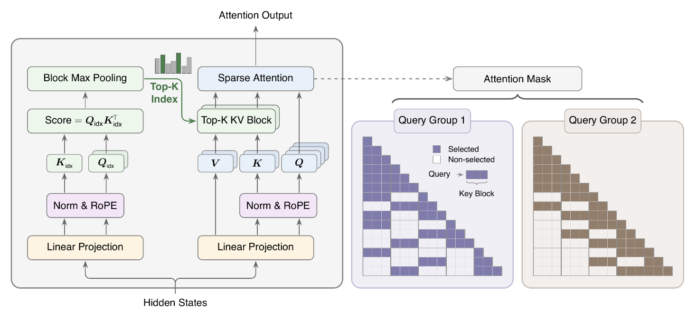
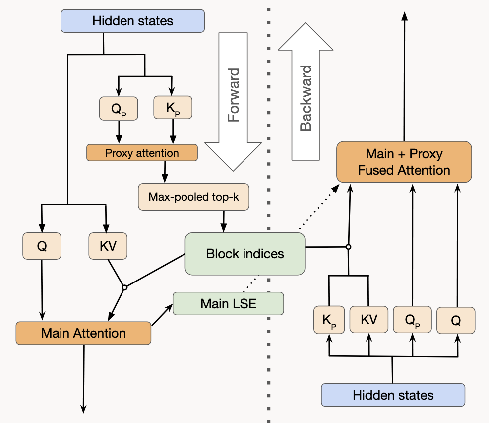
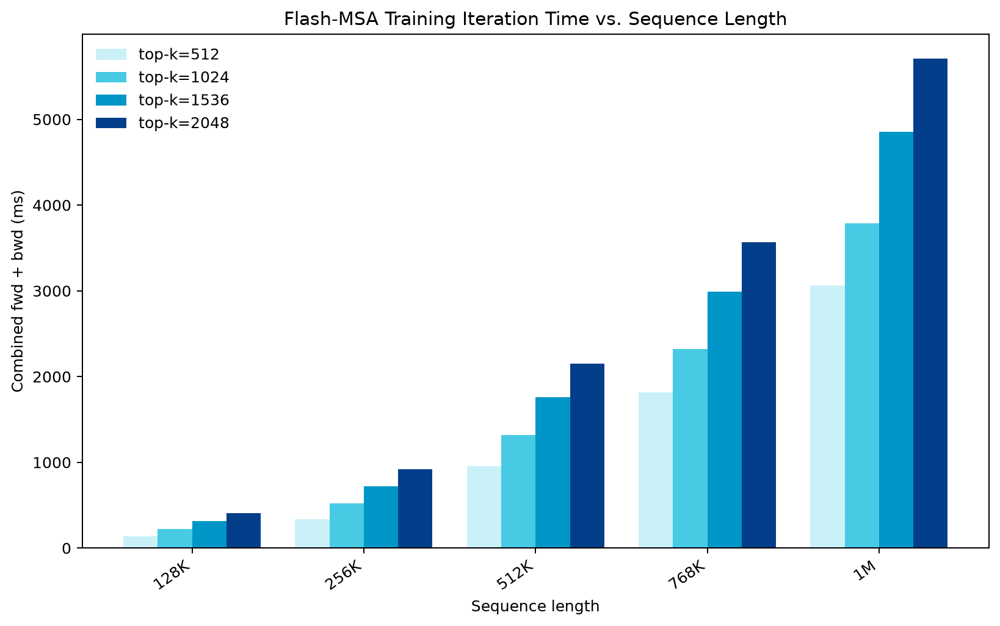

<strong style="font-size:16px;color:#1a6ba0;">要点速览</strong>

- <strong>首个高性能开源MSA训练kernel</strong>：作者用CuTeDSL为Hopper/Blackwell GPU写出MiniMax Sparse Attention的训练kernel，这是业界第一个能高效训练稀疏注意力的开源实现，此前只有推理侧代码。  
- <strong>相对Flash-Attention的长上下文优势</strong>：在百万token量级，Flash-MSA单步训练显著快于FA4；整个训练步里只有代理前向着上下文长度是二次方，其余全部走稀疏块缓存。  
- <strong>三项关键改动</strong>：块状稀疏（按128选块而非单token）、主注意力用GQA替代MLA、代理头分组专门化，使西方主流的GQA架构也能用上MSA。  
- <strong>用一行梯度技巧避开KL实体化</strong>：KL损失对代理分数的梯度等于「代理概率减主概率」，kernel内原子化反向传播，无需在共享内存里完整展开KL分布。  
- <strong>仍受寄存器/共享内存瓶颈</strong>：反向理论占用率仅12.5%（FA为18.75%），上下文并行Ring方案与低精度索引器是后续优化方向。

---

## 引言：把稀疏注意力的训练也开源了

多家前沿模型都在用稀疏注意力大幅加速推理，但**至今没有任何人发布过能高效训练它的代码**。作者今天发布了世界上第一个高性能的开源训练kernel：用CuTeDSL为Hopper和Blackwell GPU实现的MiniMax Sparse Attention（MSA）训练kernel。所有开发工作在Spheron的H100和B200租用机上完成，并参考了FA4、MSA推理实现和Codex。

作者明确声明：这**不是MiniMax的官方实现，也与MiniMax无任何关联**。

Flash-MSA与Flash-Attention在单个训练步上的对比（长上下文下Flash-MSA反超）

## 关于MSA：与DeepSeek稀疏注意力的三点不同

MSA与DeepSeek Sparse Attention（DSA）类似，但有几处核心改动。

Fig. 1 from the MSA Paper

## 1. 块状稀疏（Blockwise sparsity）

代理注意力不再为每个主注意力挑选单独的KV，而是以128为块、通过对代理分数做最大池化来挑选块。这为kernel带来很好的缓存特性。

**2. 主注意力用GQA而非MLA**

这一点尤其重要：据作者所知，没有一家西方实验室在训练中采用过MLA，这使得GLM-5.2、DSv4这类基于MLA的前沿模型所适配的稀疏注意力形式，在这里的模型上无法直接复用。换成GQA后，西方主流架构也能跑MSA。

**3. 代理头的分组专门化**

用GQA替换MLA后，每一层内部出现了相互独立的查询组，让每个代理头可以挑选不同的KV子集，而不是像DSA那样把整个注意力层求和后再统一打分。有证据表明注意力头会天然关注不同的token，因此这一改动应该能提升主注意力的表达能力。

## Kernel设计：尽量少重复计算

要高效跑MSA，核心矛盾是**尽量少重复计算，同时不撑爆寄存器/共享内存**。除了常规flash寄存器（Q分块、KV分块、O累加器、LSE累加器），前向还要处理流式的top-k累加器；反向则要为「双注意力合并计算」留空间，才能同时算主注意力和代理注意力的梯度，因为代理梯度需要同时访问两者概率。

块状稀疏的一个关键好处：只缓存块索引而非单独token，因此可以把块索引一直存到反向阶段。**整个训练步里，只有代理前向着上下文长度是二次方的，其余部分都复用代理前向前缓存的稀疏块。**

High level overview of kernel sequence

### 前向：代理注意力 → 稀疏主注意力

操作顺序固定为：代理注意力 → 稀疏主注意力 → 把主注意力输出送往下一层，并保存主注意力的LSE供反向使用。

**代理注意力**的点积与常规Flash Attn略有不同：不再累加输出，但必须在流式扫描key时持续记录top-k分数及其索引。作者也没有为反向累加LSE，而是在反向时通过一次廉价的「稀疏激活上重算代理点积」拿到LSE，实践里比前向融合LSE+top-k更快。每算一块QK^T，就抓取该chunk的因果局部最大分数，做插入排序写入寄存器里的top-k值；为腾空间把key块切成两半。MSA要求每个token的局部块保持滑动窗口不被掩码，因此局部KV块的分数被设为inf。

**主注意力**就是块稀疏的flash attention前向，作者直接借用MoBA的技巧，把块稀疏注意力重新参数化为变长（varlen）flash。

### 反向：融合代理与主注意力

计算代理头梯度必须融合两者反向，因为代理训练信号需要同时访问代理和主注意力概率。由于前向已保存块索引、且只在这些稀疏KV激活上训练，反向可以线性时间运行：先取出缓存的块索引，把「[batch, proxy head, query, top_k_slot] → [key block]」的映射反转为「[batch, proxy head, key block] → [使用该块的查询]」，用来调度查询分块、优化共享稀疏KV块的复用；再对选中块跑一遍稀疏代理注意力拿到代理LSE，然后流式执行融合的「代理-主」反向，加载QKV、Q_proxy、K_proxy和main_lse的分块。为容纳更多头进寄存器，必须缩小每次的Q/KV分块尺寸。

### KL散度损失：用一行梯度代替实体化

DSA原始的KL损失项是L_i = Σ_t D_KL(p_t, s_t ‖ softmax(I_t, s_t))。若把索引器和主注意力的两个概率分布都实体化再累加KL，需要对共享内存大量读写并占用额外寄存器，显著拖慢训练。

作者给出的等价技巧：设代理注意力概率为p_px、主注意力概率为p，展开KL项并对softmax前的代理分数z_px,i求偏导，利用softmax的logprob偏导 δ_it - p_px,i与概率分布归一性，最终得到：**KL损失对代理分数的梯度 = 代理概率 - 主概率**。这一项直接在kernel里算代理梯度，永远不需要完整实体化KL分布。

### 预热kernel

预热模式下，主注意力前向是稠密的、不使用块索引，代理前向可以完全跳过，在反向里整体训练。主注意力预热前向直接调用flash并保存输出和LSE，返回一个占位KL；反向里对索引器调用稠密flash只拿LSE，再复用稀疏MSA的融合「代理+主」反向。

## 正确性验证

作者用eager模式PyTorch实现MSA，在多种配置下扫描两个实现的前向输出与反向梯度的余弦相似度，扫描在bf16下进行、反向同时含目标输出损失和内部KL损失。bf16下的通常精度容差是0.01。

## 接下来要做的

**提升融合反向的并行度。** 当前反向受限于低张量核心利用率和沉重寄存器/共享内存需求：博客吞吐扫描中Flash-MSA反向用了138寄存器/线程、105 KB共享内存/CTA，而H100/B200上限是255寄存器/线程、228 KB共享内存/CTA，因此被限制到1 CTA/SM。试过把Q/KV切更窄以达2 CTA/SM，但CTA总数增加反而净变慢。Flash-MSA反向理论占用率12.5%，Flash-Attention为18.75%。

**路由架构加速。** GLM已证明用IndexShare层间共享代理头既稳定又更快；索引器推理时总以低精度服务，若训练也用低精度且稳定，能解决训练-推理不匹配并大幅加速。

**上下文并行（CP）。** 长上下文训练必须上某种CP，否则很快爆内存。两种路径：

1. **按头全收集（Headwise all-gather）**：把分配给每个代理查询头的那组主注意力查询头称为「MSA组」。MSA组在前向/反向独立运行，因此用TP风格CP折叠（CP rank最多到代理头数）很轻松，每设备持 (序列长度 / CP rank) 个token及其MSA组，调用MSA前对完整序列做一次all-to-all通信，无需改kernel，当前Megatron MSA fork大概率就能用。
2. **环形（Ring）**：更难但大概是MSA做CP的最优解，允许更好overlap和更高CP rank，需在代理前向内做overlap-exchange跨设备流式传top-k、再广播、再做跨设备稀疏key查找。作者还没想好怎么接进kernel，会先请教本地CP专家，这将是下一篇博客主题。

**两个设计说明。** 其一，论文里「给代理头加value/output投影、把代理输出加进主注意力以引入CE损失梯度」的做法会拖慢训练，MSA论文表6也指出恰当预热可弥补不用人CE训练索引器。其二，调度要求MSA组 ≥ GQA组（每个代理头映射到一个主注意力GQA组）；作者预期稳定训练至少需4个MSA组，对每层KV cache超1024的模型毫无兴趣，因此不打算实现KV头多于代理头的反演路径。

**跨Top-k扫描。** 作者可视化了稀疏收益随块减少的变化，并计划在有算力后扫描更多GQA/代理MQA配置，以及用MSA继续预训练Qwen3这类GQA基座来测试转换（需更多算力）。

Sweep across Top-k：稀疏收益随块大小的变化（16 Q头、2 KV头、4代理Q头、1代理K头、128 headdim、bf16、H100）

<strong style="font-size:15px;color:#8b6f4c;">结语</strong>

把MSA的训练kernel开源，补上了稀疏注意力从「推理能用」到「能训练」之间长期缺的一块拼图，对想在自己GQA模型上复现MiniMax路线的团队是实打实的起点。  
真正卡住吞吐的不是算法而是硬件占用：反向理论占用率只有12.5%，被寄存器/共享内存绑死在1 CTA/SM，这说明kernel还有明显优化空间，当前发布更接近「能跑通且正确」而非「榨干GPU」。  
作者用GQA替换MLA这一招值得注意，它让西方主流架构绕开了MLA锁定，但代价是引入代理头分组专门化等新复杂度，训练稳定性仍需更多基座（如Qwen3）的续训验证。  
下一步的Ring式上下文并行和低精度索引器，才是决定Flash-MSA能否从demo走向大规模训练的关键，而非当下的单卡速度对比。

---

【传送门】 
<a class="normal_text_link mp_article_text_link" href="https://mp.weixin.qq.com/s/OoHu1yeuh1gzgCfEiPvDuQ" target="_blank" data-linktype="2">RL的下一个大突破：不是优化可验证问题而是把'不可验证'领域变得'可验证'</a> 
<a class="normal_text_link mp_article_text_link" href="https://mp.weixin.qq.com/s/nVqW9acA7NN1zeALDwRAsw" target="_blank" data-linktype="2">Google新论文RubricEM: 评分标准引导的深度研究Agent训练框架</a> 
<a class="normal_text_link mp_article_text_link" href="https://mp.weixin.qq.com/s/HnGKVp45C-GApBJ-LleP6g" target="_blank" data-linktype="2">小米MiMo罗福莉:8卡GPU让1T参数模型跑出1000 TPS , FP4+DFlash+TileRT全解读</a> 
<a class="normal_text_link mp_article_text_link" href="https://mp.weixin.qq.com/s/3btXHAVd8_x5CM5CWETc2g" target="_blank" data-linktype="2">Agent卷向AI Infra: SGLang团队用硬核Agent优化框架和CUDA Kernal性能</a> 
<a class="normal_text_link mp_article_text_link" href="https://mp.weixin.qq.com/s/2eWh5jZJPHsv0wi9km2nVg" target="_blank" data-linktype="2">NVIDIA TriAttention解读: KV Cache压缩最大的问题不是算法而是两个Infra问题</a> 
<a class="normal_text_link mp_article_text_link" href="https://mp.weixin.qq.com/s/OqtF6ZaWQNu3o-VAWLfqbg" target="_blank" data-linktype="2">榨干GPU性能：流水线解码消除GPU气泡，推理吞吐提升35%</a> 
<a class="normal_text_link mp_article_text_link" href="https://mp.weixin.qq.com/s/FTsibdpbEjvoPWtxGqgxkQ" target="_blank" data-linktype="2">小米MiMo罗福莉后训练新范式MOPD: 多教师同策略蒸馏，多领域无损集成</a> 
<a class="normal_text_link mp_article_text_link" href="https://mp.weixin.qq.com/s/s0Ovn3_tnbbl9jxfAC3WLg" target="_blank" data-linktype="2">阿里Sparse Attention on CXL替代RDMA做KV Cache解耦 推理2.1×吞吐, 9.7×TTFT</a> 

---

参考：https://nanduruganesh.github.io/flash-msa/
