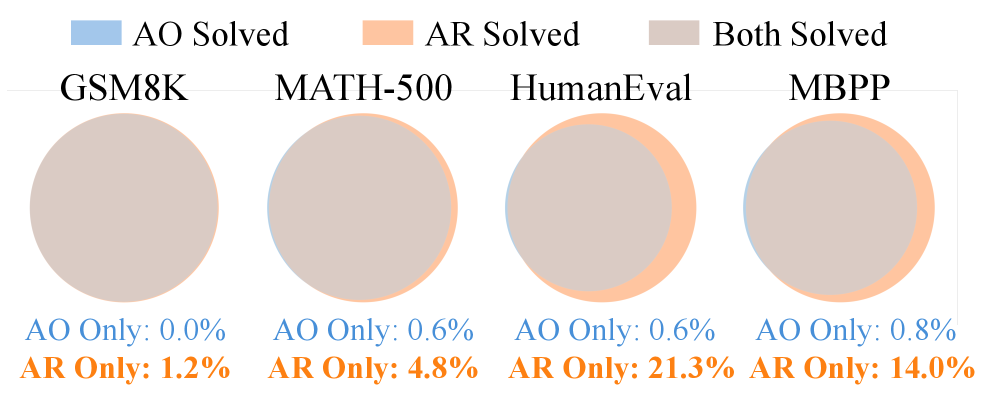
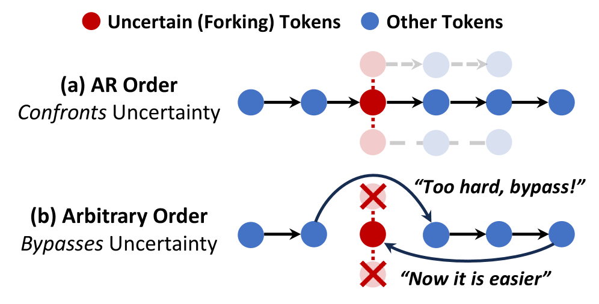
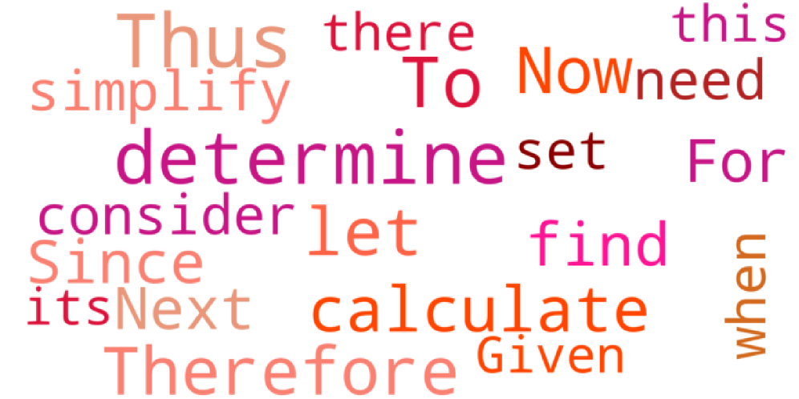
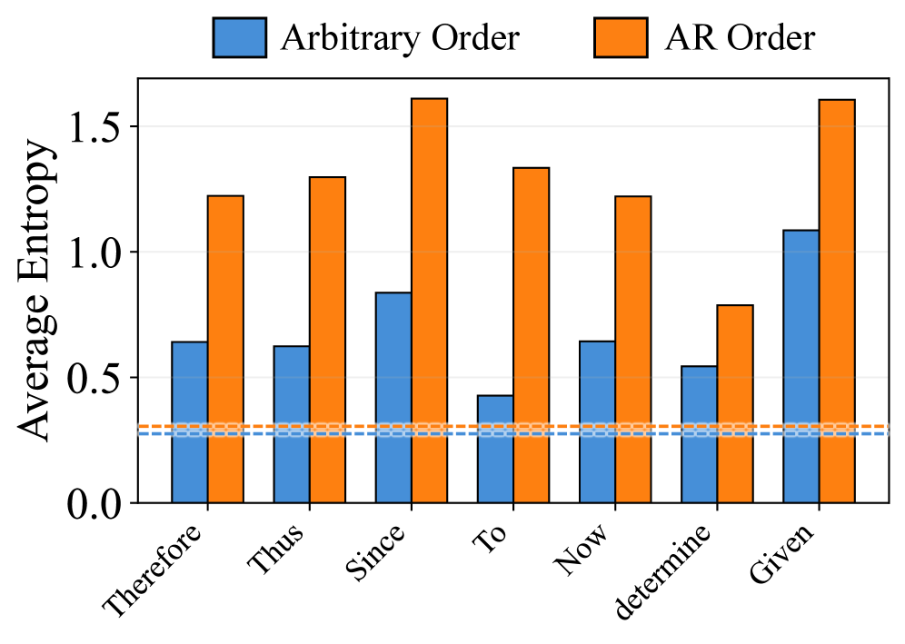
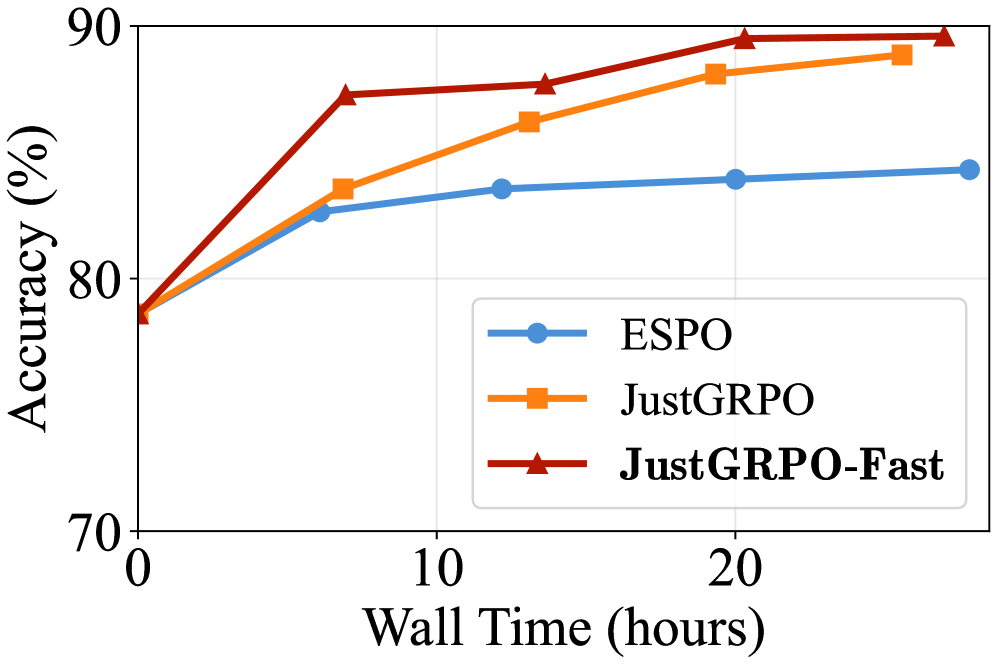
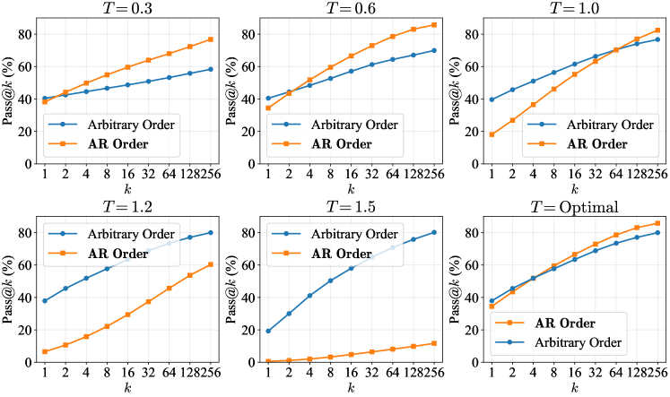
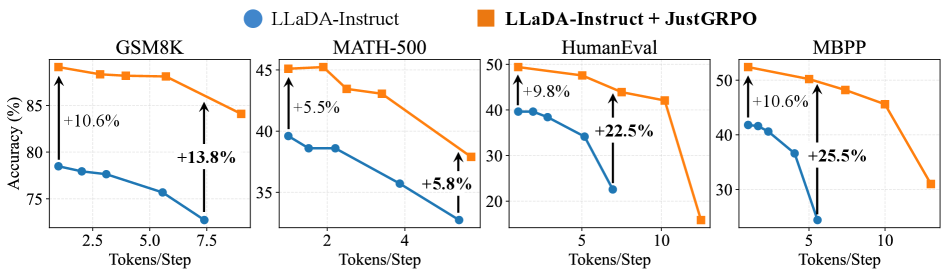
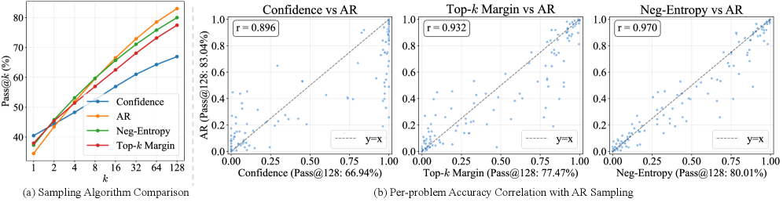

<strong style="font-size:16px;color:#1a6ba0;">要点速览</strong>

- <strong>反直觉结论</strong>：dLLM的"任意顺序生成"灵活性，在数学/编程等通用推理任务上反而收窄了RL可激发的推理潜力  
- <strong>根因：熵退化</strong>：任意顺序让模型绕过"因此""既然"等高熵逻辑分叉token，提前锚定轨迹，解空间过早坍缩  
- <strong>极简解法JustGRPO</strong>：训练期直接放弃任意顺序、把dLLM当AR策略跑标准GRPO，GSM8K达89.1%  
- <strong>并行能力不丢</strong>：AR约束只用于训练探索脚手架，推理期仍完整保留dLLM的并行解码加速

---

## 一个被忽视的陷阱：灵活性反而限制推理

扩散语言模型（dLLM）打破了传统LLM严格的从左到右生成约束，允许token以任意顺序产出。直觉上，这种灵活性意味着解空间严格包含固定的自回归（AR）轨迹，理应解锁更强推理。但清华LeapLab与阿里团队的这篇ICML 2026杰出论文奖工作给出反直觉结论：**对于数学、编程等通用推理任务，任意顺序生成实际上可能限制dLLM的推理潜力。**

核心机制是：dLLM会利用顺序灵活性，绕过对探索至关重要的高不确定性token（如逻辑连接词），优先填容易的部分，导致解覆盖的过早坍缩。这一观察直接动摇了当前dLLM强化学习（RL）方法的设计前提：它们为了保留任意顺序，承担了组合轨迹爆炸、难解似然等巨大复杂度。

作者用Pass@k（k次采样中至少1次正确的概率，作为RL可达推理上限的代理）做了硬核验证。如图1左，把dLLM限制为标准AR顺序，Pass@k反而高于灵活对应物。

图1：左图显示限制为AR顺序反而扩大推理解空间；右图为JustGRPO方案示意

## 三大证据：灵活性越高的dLLM，推理潜力越低

**证据一：Pass@k扩展曲线更平。** 在LLaDA-Instruct、Dream-Instruct、LLaDA 1.5三个dLLM上，于GSM8K、MATH-500、HumanEval、MBPP四个基准测Pass@k。任意顺序在k=1时往往有竞争力甚至更好，但随着k增大，AR模式的扩展曲线明显更陡，能挖出更多正确解。

图3：任意顺序（AO）在单次设置有竞争力，但Pass@k扩展曲线比AR更平缓

**证据二：解空间是AR的子集。** 在k=1024时分析解覆盖，任意顺序找到的解与AR解码大量重叠，且实际是更小的子集。HumanEval上21.3%的问题仅AR能解出，反之仅0.6%。理论上更大的解空间，在实际采样下反而更受约束。

图4：任意顺序（AO）可解问题基本是AR顺序可解问题的子集

**证据三：块大小扫掠单调下降。** dLLM的半自回归块大小B控制任意程度：B=1即纯AR，B越大越自由。扫B∈{8,32,128}发现趋势一致且单调：**B越大，Pass@k越低**。说明"越少任意性，越高推理潜力"是稳健规律，而非两端极端特例。

图5：半自回归块大小B越大（越随意），Pass@k越低

## 机制拆解：什么是"熵退化"

推理本质上不均匀，依赖稀疏的**"分叉token"**（通常是"因此""既然""于是"等连接词）。它们在逻辑轨迹上制造分支，表现为熵的局部尖峰。标准AR解码每步强制解析最左未知token，**迫使模型在分叉点直面不确定性**（图2a），通过采样不同分支保留推理多样性。

图2：AR顺序（a）直面不确定性保留推理空间；任意顺序（b）绕过不确定性、先解简单token

而任意顺序基于置信度自适应选token，**优先填高确定性的"简单"部分，推迟困难的逻辑连接词**（图2b）。被频繁推迟的token呈现清晰模式：正是"Therefore""Thus""Since"这类逻辑连接词（图6）。

图6：任意顺序中被绕过的token多为逻辑连接词与过渡词

等模型回头补这些连接词时，已生成的未来上下文把歧义消解了。结果如图7：AR顺序下这些分叉token保持高熵（多路径可行），任意顺序下熵急剧下降。模型不再在分支点做开放式导航，而是"回顾性对齐"去桥接已定结论。作者称此现象为**熵退化（entropy degradation）**。

图7：全局平均熵两者相当，但逻辑分叉处的熵（蓝条）在任意顺序下显著下降

一句话总结：任意顺序偏好推理时的"利用"而非"探索"，提前把轨迹锚定到特定结果，牺牲了RL所需的广泛解覆盖。

## 极简解法：JustGRPO

既然任意顺序对推理潜力非但非必要、反而有害，那保留它的复杂度就是"税"。现有扩散RL方法要处理三大难题：

- **token级分解歧义**：dLLM不承认唯一索引对齐的条件概率，信用分配模糊，标准重要性比难定义
- **难解序列似然**：轨迹空间随O(N!)增长，精确似然不可计算，被迫依赖ELBO近似
- **采样器-学习者错配**：基于置信度的rollout采样策略与ELBO瞄准的原始分布不一致，梯度被偏置

JustGRPO的思路极其简单：**RL训练期直接放弃任意顺序，把dLLM当成一个AR策略**。构造输入x~_k（过去观测、未来掩码），只取位置k的logits作为下一token概率，在dLLM骨干上定义一个代理AR策略π_θ^AR。这样把对排列的难解边际化，转化为可精确计算的似然，标准GRPO无需任何修改即可直接套用。

关键是这个AR约束**只用于训练期的探索脚手架**：不加因果掩码、不改双向注意力、不动离散扩散架构。推理能力的激发（受益于顺序探索）与推理执行（受益于并行解码）被解耦。

## 实验结果：简单却强悍

在LLaDA-Instruct上全参数微调、无额外SFT，JustGRPO在四个基准上一骑绝尘。系统级对比（表3，生成长256）中，GSM8K达**89.1%**、MATH-500 **45.1%**、HumanEval **49.4%**、MBPP **52.4%**，全面超过依赖复杂扩散专用RL适配的方法。

表1/3：LLaDA-Instruct上后训练方法系统级对比，JustGRPO以极简实现取得领先

考虑到各基线实验设置异构，作者在统一协议（全参数微调、每步1 token、生成长256）下复现代表性基线，JustGRPO仍全面领先（表2）。

表2：统一设置下的复现对比，JustGRPO仍领先ESPO*、SPG*等基线

**并行解码能力完整保留。** 用免训练的熵有界（EB）采样器测不同并行度，JustGRPO模型与原始LLaDA-Instruct完全兼容，且并行度越高优势越大。MBPP上准确率差距从保守设置（1 token/步）的+10.6%扩大到激进设置（约5 token/步）的+25.5%。说明AR训练精炼出的分布对并行采样近似更具韧性。

图8：JustGRPO保留dLLM并行解码能力，并行度越高相对基线优势越大

**训练效率也不差。** 精确GRPO需独立评估每个位置、带来额外每次迭代开销，但图9显示其准确率/挂钟时间权衡仍匹配近似基线（ESPO）峰值并持续改进。进一步的JustGRPO-Fast只在top-25%最高熵位置算概率比，消除75%前向评估，效率更优。

图9：GSM8K上训练效率，JustGRPO及JustGRPO-Fast的准确率/墙钟时间权衡优于近似基线ESPO

<strong style="font-size:15px;color:#8b6f4c;">结语</strong>

这篇工作对"扩散模型灵活性一定更好"的社区共识泼了冷水：在数学/编程这类通用推理上，任意顺序不是红利而是陷阱，它用熵退化悄悄牺牲了探索。  
JustGRPO的启示是"做减法"：与其在难解的组合轨迹上硬做RL适配，不如回归从左到右顺序当训练脚手架，把问题变成定义良好的标准GRPO。极简方案反而最强，这对当下越做越复杂的扩散RL研究是一记提醒。  
更值得玩味的是解耦思想：训练用AR换探索质量，推理用并行换速度，两者不必绑定。这或许指明了一条比"硬保任意顺序"更务实的dLLM推理进化路线。

---

【传送门】 
<a class="normal_text_link mp_article_text_link" href="https://mp.weixin.qq.com/s/sQTgsN529YAjXOQ0Y0bJuA" target="_blank" data-linktype="2">微软SkillOpt: 用Skill文件梯度下降法优化Agent技能，52项测试全胜</a> 
<a class="normal_text_link mp_article_text_link" href="https://mp.weixin.qq.com/s/mjBLO4O4fHUFNk4DfR9Y-g" target="_blank" data-linktype="2">Anthropic/Claude多Agent协同五种模式详解</a> 
<a class="normal_text_link mp_article_text_link" href="https://mp.weixin.qq.com/s/tQmHn4iCqUzh3_SVZtvgzQ" target="_blank" data-linktype="2">Agent记忆百家争鸣: 没有统一架构,取决于具体任务; 或许还缺理论突破</a> 
<a class="normal_text_link mp_article_text_link" href="https://mp.weixin.qq.com/s/mHlrMsXRCrzZrN-GTODqug" target="_blank" data-linktype="2">四层Loop彻底告别Prompt：前两层卷疯了，后两层还是处女地</a> 
<a class="normal_text_link mp_article_text_link" href="https://mp.weixin.qq.com/s/qHscVKN06FEGTru80STlxA" target="_blank" data-linktype="2">M²A多模态双层混合记忆系统：记住你的每一次变化</a> 
<a class="normal_text_link mp_article_text_link" href="https://mp.weixin.qq.com/s/_4vgKCTSir14mhtdvs7_HA" target="_blank" data-linktype="2">美团开源LongCat-2.0 (OpenRouter原Owl Alpha)解读：1.6T 参数，...</a> 
<a class="normal_text_link mp_article_text_link" href="https://mp.weixin.qq.com/s/4Iz5SjE4D240EL4MmKrWZQ" target="_blank" data-linktype="2">OpenAI Dreaming记忆系统：从记住你到理解你</a> 
<a class="normal_text_link mp_article_text_link" href="https://mp.weixin.qq.com/s/MLFtBJrXFoHn6IPj1Z_36Q" target="_blank" data-linktype="2">苹果Apple感知压缩新突破PICO：图像画质不降低，体积只有1/3</a> 

---

参考：https://arxiv.org/html/2601.15165v4
