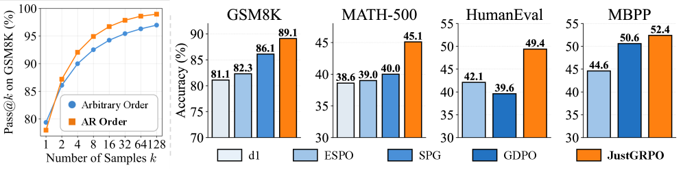
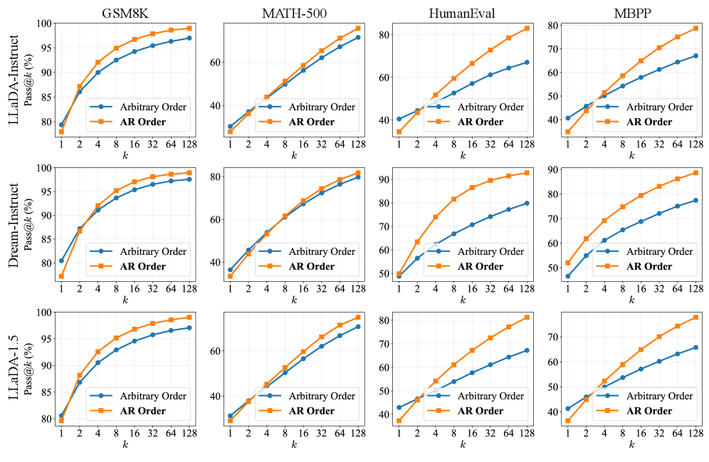
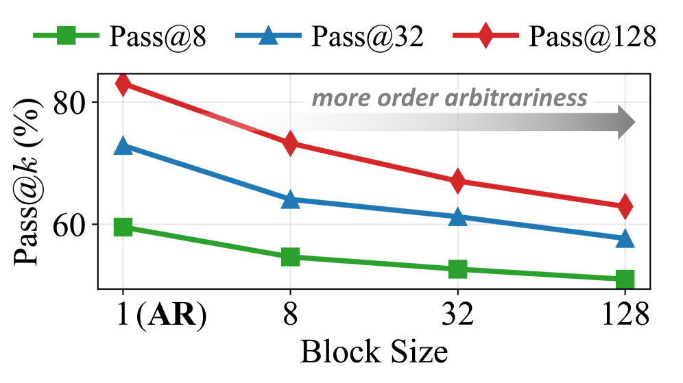

<strong style="font-size:16px;color:#1a6ba0;">要点速览</strong>

- <strong>反直觉发现</strong>：扩散语言模型（dLLMs）的"任意顺序生成"灵活性，在数学和编程等通用推理任务上反而限制了推理潜力，而非扩展它  
- <strong>熵退化机制</strong>：dLLMs利用顺序灵活性优先绕过逻辑连接词（因此、于是等关键分叉token），导致推理分支的高熵被提前消解，解空间的覆盖范围因此被压缩  
- <strong>JustGRPO方法</strong>：清华大学团队提出一个简单方案：在RL训练阶段放弃任意顺序、直接用标准GRPO训练，GSM8K达89.1%、MATH-500达45.1%，超越复杂定制方法，且不牺牲dLLMs的并行解码速度

---

## 扩散语言模型的独特优势

扩散大语言模型（dLLMs）在过去一年中快速增长，它们将文本生成视为一个逐步"去噪"的过程：从一个完全掩码（masked）的token序列开始，逐步预测并揭露正确的token。这与自回归模型（AR）严格的从左到右生成方式截然不同。

这种新的生成范式天然带来两大优势：一是**并行解码**，可以同时预测多个位置，显著加速推理；二是**任意顺序生成**，模型不必从第一个token写到最后一个，可以根据置信度自由选择哪个token先写，哪个后写。

并行解码的效率优势已经得到了充分验证，被广泛用于加速推理。而任意顺序生成的价值，通常被理论界视为一个更大的想象空间：如果把AR模型的固定路径看作一条线，那么任意顺序的解空间是一个面：理论上更大、更灵活，应该能解锁更高级的推理能力。受这一前景驱动，多个团队开始用强化学习（RL）为dLLMs激发推理能力，而这些方法的核心假设是：**必须保留任意顺序生成的灵活性。**

LeapLab研究团队提出了一个反直觉的声音。

## 灵活性陷阱：越灵活，推理越受限

团队用Pass@k指标来衡量模型的推理潜力边界。Pass@k衡量在k次独立采样中至少一次得到正确答案的概率：它度量的是一个模型在RL探索阶段能"扫描"到正确答案的能力上限。如果模型连正确解都采样不到，RL自然无从强化。

图1：更少的灵活性带来更好的推理潜力。左图显示，限制dLLMs使用标准自回归顺序反而扩大了推理解空间。右图是本文方法JustGRPO的效果对比。

在LLaDA-Instruct、Dream-Instruct、LLaDA 1.5三个代表性dLLM上，团队对比了两种解码模式：任意顺序（标准扩散解码，按置信度自适应揭露token）和AR顺序（从左到右强制顺序）。结果是一致的反直觉模式：

任意顺序在单次生成（k=1）时往往表现不错，甚至有时更好；但随着采样次数k增加，AR顺序的扩展曲线越来越陡、持续发现新解，而任意顺序的曲线很快变平。

图3：不同dLLM和基准上Pass@k对比。任意顺序在k=1时有竞争力，但扩展曲线显著比AR顺序平缓：一致性跨模型出现。

解空间覆盖分析进一步印证了这一点：在HumanEval上，21.3% 的问题仅能被AR顺序解决，而反过来只有0.6% 的问题仅能被任意顺序解决。**任意顺序能找到的解，基本上是AR顺序能找到的解的子集：而非超集。** 这一结果与理论预期恰好相反。

更重要的是，这种效应是单调的。dLLMs的半自回归解码通过块大小B来控制任意性程度：B=1是纯AR顺序，B越大则自由度越大。团队扫描了不同B值，结论清晰：**B越大，Pass@k越低。** 任意性越多，推理潜力越小。

## 熵退化：绕过逻辑分叉点的代价

为了理解这一反直觉现象的机制，团队深入分析了两种解码模式在token层面的行为差异。

AR顺序强制模型每一步都必须解决最左侧的未知token：模型**必须面对**不确定性。而任意顺序则基于置信度自适应选择：优先揭露"容易"的高置信度token，而绕过"困难"的低置信度token。

图2：（a）AR顺序通过强制在不确定token处做决策来保留推理空间。（b）任意顺序绕过不确定性，先解决容易的token：一旦未来上下文建立，原有的分支可能性就被剪枝了。

那么，被绕过最多的token是哪一类？答案是逻辑连接词："Therefore"、"Thus"、"Since"、"However"等。先前研究已经指出，这类token具有高熵，充当推理路径的"分叉点"：不同的选择将牵引整个推理轨迹走向完全不同的方向。在传统语言模型中，保持这些分叉点的高熵状态是探索推理空间的关键。

任意顺序的自适应行为对逻辑分叉点产生了什么影响？团队测量了这些token在解码时的熵：

图7：熵退化现象。任意顺序的全局平均熵（虚线）与AR相当，但逻辑分叉点的熵（蓝色柱）显著下降。

**在AR顺序中，这些逻辑分叉点在被解码时保持了较高的熵：意味着模型正在一个真正的分支点做开放式的导航决策，多条推理路径仍然可行。而在任意顺序中，这些连接词的熵急剧下降。** 原因在于：模型推迟了这些困难的连接词，优先确定"易"的未来上下文；当最终回头填充跳过的连接词时，未来上下文的存在已经几乎确定了该填什么：模型不再是做一个真正的前瞻性导航决策，而是在"事后对齐"来弥合一个基本确定的缺口。

团队将此现象称为**熵退化（entropy degradation）**。这一机制精确解释了为什么任意顺序的灵活性在通用推理任务上反而有害：灵活性被模型用来规避困难决策，而非用来探索更广阔的推理空间。其结果是高单次生成的连贯性，但牺牲了复杂问题求解所需的广泛探索。

## 灵活性的代价

如果任意顺序对通用推理并不必要甚至有害，那么当前dLLMs RL方法为了保留这种灵活性所付出的代价就值得审视了。

现有的扩散RL方法在保留任意顺序的假设下，面临三个结构性挑战：

**Token级信用分配困难。** dLLMs的生成状态依赖于随机的揭露轨迹，不存在AR模型中唯一的、索引对齐的条件概率：因此标准重要性比率无法直接定义，使得哪个token该得多少奖励含糊不清。

**序列似然不可计算。** AR模型的序列似然是所有位置条件概率的乘积，可直接计算。而dLLMs需要对所有可能的揭露轨迹（N! 种）做边缘化：对于256个token的序列，这等同于在256! 种顺序中求和。精确计算不可能，现有方法只能依赖ELBO近似，但这不可避免地偏离原始目标。

**采样器-学习器不匹配。** 更微妙的问题是：rollout阶段实际用基于置信度的启发式采样来导航组合空间，但优化目标针对的却是原始模型分布：一个是启发式引导的采样策略，另一个是扩散先验。两者之间的差距使得梯度信号存在系统性偏差。

这些结构性阻碍带来了巨大的工程复杂性，多个方法依赖不同的近似策略（平均场近似、ELBO、重要性采样的变体），却仍然效果有限。

## JustGRPO：放弃灵活性，回归简洁

LeapLab团队提出了一个极简方案：JustGRPO。

核心思路出奇简单：**在RL训练阶段，将dLLM当作一个AR策略来用。** 具体做法是：对于每个位置k，构造一个输入序列，其中前k-1个token为观测值，位置k及之后全为 [MASK]，然后将模型在位置k的logits通过Softmax得到概率 π(o_k|o_&lt;k)。

公式说明：通过构造掩码序列，可以从dLLM中提取AR策略 π_θ^AR(o_k|o_&lt;k,q)。

这样一来，dLLM原本无法计算的序列似然变成了可精确计算的乘积形式，标准GRPO可以直接使用，无需任何扩散特定的适配。

但关键问题是：**AR训练会不会把dLLM变成AR模型，破坏并行解码能力？** 团队明确表示不会。AR约束仅应用于RL训练的优化目标中，不施加因果掩码等结构性约束。dLLM的原生架构：双向注意力、离散扩散公式：完全保留。这相当于在训练阶段搭了一个AR"脚手架"来更好地探索和分配信用，推理时拆掉脚手架，dLLM的并行能力完好无损。

### 实验效果

在LLaDA-Instruct上的实验证明了这一点。

**推理性能方面**，JustGRPO在GSM8K上达到89.1% 准确率，MATH-500达45.1%，HumanEval达49.4%，MBPP达52.4%。在统一实验设置（全参数微调、每步1 token、序列长度256）下的公平对比中，JustGRPO全面领先于扩散特定RL方法d1、ESPO、SPG。

表1：系统级对比。JustGRPO尽管极简，依然在多数设置下达到最优或接近最优。注意实验设置不完全一致（基线各有差异），表2做了统一设置下的复现验证。

**并行解码方面**，用训练无关的EB采样器测试不同并行度下的推理性能。结果显示，JustGRPO模型完全兼容并行解码，而且随着并行token数增加，相比原始LLaDA-Instruct的性能优势反而扩大：在MBPP上，从保守设置（1 token/步）的 +10.6% 扩大到激进设置（约5 token/步）的 +25.5%。

图8：JustGRPO保留并行解码能力。随着并行token数增加，性能增益反而扩大，说明AR训练优化了底层模型分布，使其对并行采样的近似更具韧性。

**训练效率方面**，虽然计算精确似然有每迭代额外开销，但JustGRPO在准确率/时钟时间的权衡上仍然有竞争力：匹配替代方法ESPO的峰值准确率并继续提升。团队进一步推出JustGRPO-Fast，只计算顶部25% 高熵位置的比率，进一步提升了效率。

## 相关思考

任意顺序生成一直是dLLMs最吸引人的特性之一。它直观上代表了一种更灵活、更强大的思考方式：不按固定顺序写，像人类一样先写核心观点再补充细节。此前已有研究在数独、斑马谜题等受限任务中验证了非顺序生成的优势。

但也有不同的声音。Du et al.（2025）曾从预训练角度指出，强制模型学习均匀排列会导致对底层数据分布的显著宽松近似。本文从推理和RL的角度，观察到了一个平行的失败模式：灵活性在RL训练中退化了必要的探索。

这实际上与一个更基础的观点相通：序列的顺序承载了超出其内容的宝贵结构性信息。从左到右的顺序不是一个毫无意义的设计选择。它天然地在每一步强制模型面对"在这个时间点、这个上下文中该写什么"的决定。而任意顺序，恰恰允许模型绕过这个压力：始终先做最容易的部分，再把困难的部分留给一个已经被基本确定的未来。

<strong style="font-size:15px;color:#8b6f4c;">结语</strong>

本文的核心洞见在于：dLLMs的"任意顺序"灵活性在推理任务上实际上是毒药而非解药。这不是一个技术细节的调整，而是对基础假设的质疑：更灵活的生成顺序是否等于更强的推理能力？答案是否定的。  
但更值得玩味的是JustGRPO为什么能成功。团队将其解释为"AR脚手架"优化了底层分布。换个角度看，这可能意味着AR顺序的约束本身提供了一种结构化的正则化：强迫模型在每个位置学习"当前最该做的事"，而不是永远可以先做容易的事。这种"结构化压力"在RL探索中可能比任意顺序的海量可能性更有效。  
当然，本文的结论有明确的适用范围：数学推理和代码生成这类"正确路径唯一、必须严格遵循逻辑链条"的任务。对创意写作、开放对话等更需要发散性的任务，任意顺序的灵活性可能仍然是优势。dLLMs的研究不应走向"AR好，任意顺序坏"的二元论，而是应该更精确地理解：什么任务适合什么顺序约束。

---

【传送门】 
<a class="normal_text_link mp_article_text_link" href="https://mp.weixin.qq.com/s/O0gzjbgy3IhB9TolXUIBzA" target="_blank" data-linktype="2">Code as Agent Harness：可执行、可验证、有状态的Agent系统新范式</a> 
<a class="normal_text_link mp_article_text_link" href="https://mp.weixin.qq.com/s/lcs_gT9vfs0eaW001g2dfg" target="_blank" data-linktype="2">SGLang用Waterfill+LPLB解决DeepEP MoE负载不均，吞吐提升7.3%</a> 
<a class="normal_text_link mp_article_text_link" href="https://mp.weixin.qq.com/s/OqtF6ZaWQNu3o-VAWLfqbg" target="_blank" data-linktype="2">榨干GPU性能：流水线解码消除GPU气泡，推理吞吐提升35%</a> 
<a class="normal_text_link mp_article_text_link" href="https://mp.weixin.qq.com/s/TrDau7cG1M7kwsLQNwOpzA" target="_blank" data-linktype="2">揭秘最快的GLM-5.2推理优化技术：如何将吞吐推到 280 TPS</a> 
<a class="normal_text_link mp_article_text_link" href="https://mp.weixin.qq.com/s/0zKdjRmWg3TbL5Y3HGO3fA" target="_blank" data-linktype="2">从 P/D 分离到 A/F 分离：从学术原型变成行业标准</a> 
<a class="normal_text_link mp_article_text_link" href="https://mp.weixin.qq.com/s/olxLm3almopaba6J2JeFrA" target="_blank" data-linktype="2">Anthropic：如何用 Claude 实现 95%自动化数据化分析</a> 
<a class="normal_text_link mp_article_text_link" href="https://mp.weixin.qq.com/s/_4vgKCTSir14mhtdvs7_HA" target="_blank" data-linktype="2">美团开源LongCat-2.0 (OpenRouter原Owl Alpha)解读：1.6T 参数，...</a> 
<a class="normal_text_link mp_article_text_link" href="https://mp.weixin.qq.com/s/4Iz5SjE4D240EL4MmKrWZQ" target="_blank" data-linktype="2">OpenAI Dreaming记忆系统：从记住你到理解你</a> 

---

参考：https://arxiv.org/html/2601.15165v4
