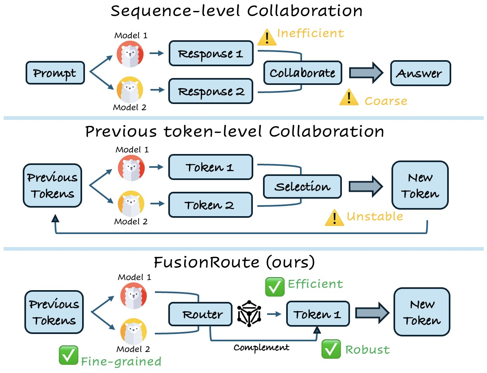
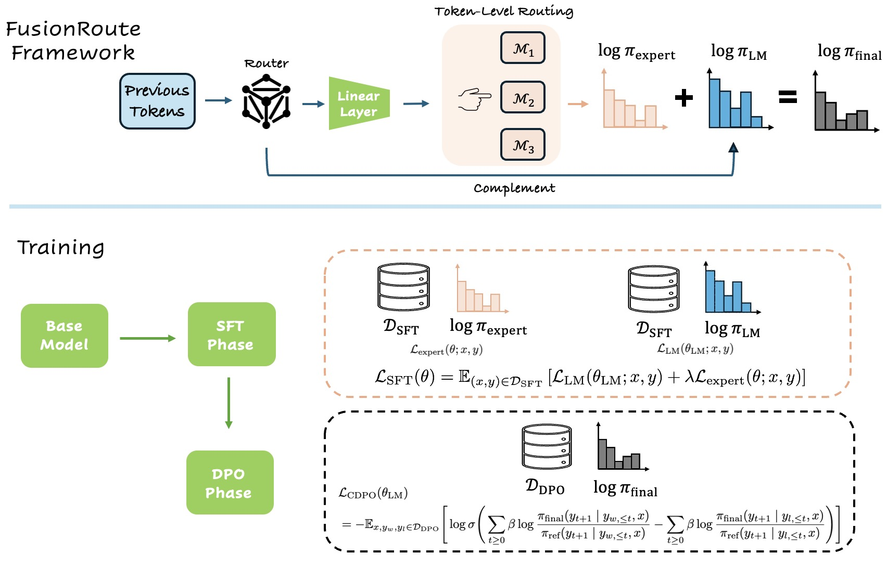
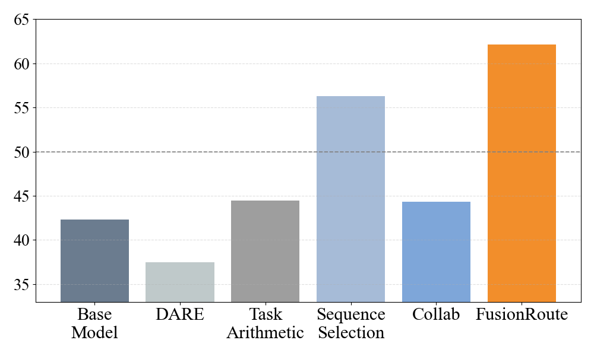
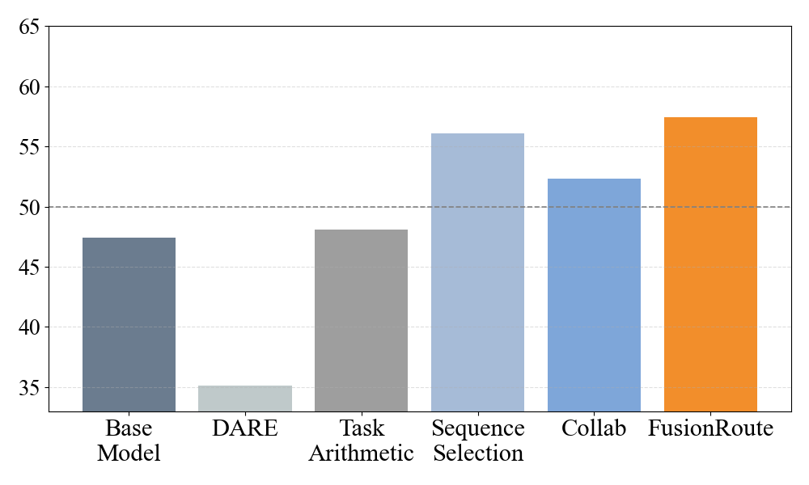
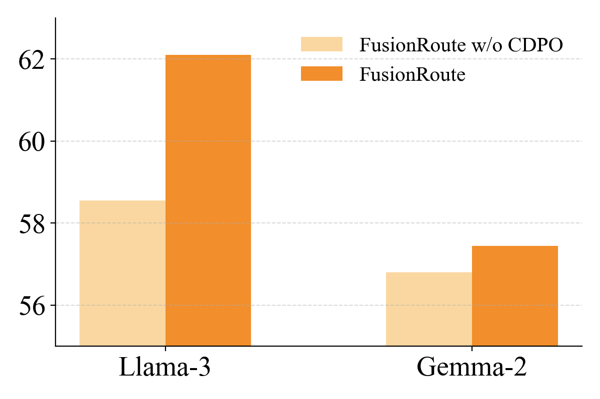

<strong style="font-size:16px;color:#1a6ba0;">要点速览</strong>

- <strong>核心思路</strong>：用一个轻量router，在每一步解码时既选出最合适的专家LLM，又输出一组互补logit去修正该专家的预测  
- <strong>解决痛点</strong>：纯专家路由存在理论上的根本局限，仅靠选专家无法逼近最优策略；FusionRoute用互补生成器扩展策略类，弥补这一缺口  
- <strong>训练两阶段</strong>：SFT阶段学路由+基础生成，CDPO阶段用偏好优化学互补纠错  
- <strong>实验结果</strong>：在Llama-3与Gemma-2两族、数学/代码/指令跟随任务上，平均准确率全面超过序列级协作、token级协作、模型融合与直接微调

## 背景与动机

单一通用大模型要跨领域都强，往往得堆到prohibitively expensive的规模。而小号的领域专家模型虽高效，一旦超出训练分布就掉链子。于是「用多个专家模型协作」成了高效又能力广的自然路线，但三种旧范式各有硬伤。

MoE把多个专家融进统一架构联合训练，需要所有专家的梯度访问和大量额外训练，还要求专家结构相似。多智能体系统（MAS）通常在「整条回答」这一粗粒度上运作：每个agent独立生成完整回答，再靠选择、辩论或合并出最终答案，既浪费又可能因上下文暴涨而掉性能。模型融合（model merging）免训练、结构简洁，但对超参敏感、存在参数干扰，难以在不同场景下稳定突出不同专家的行为。

更细的token级协作近年被提出，但现有方法高度依赖底层模型质量，一旦某些专家在某些token上不行、或选择策略出错，就不鲁棒。本文要回答的问题很直接：**能不能做一个在所有场景下都鲁棒、高效、自动的token级协作范式？**

图1：序列级协作粗且低效，既有token级方法不稳定；FusionRoute通过互补路由实现细粒度、高效、鲁棒的token级协作

## FusionRoute设计

FusionRoute让一个轻量router（从基座LLM后训练得到）在每个解码步同时产出两样东西：一是路由权重向量wθ∈ℝⁿ，决定从专家集合 {π₁,…,πₙ} 里选谁；二是router自己的一组logit，作为互补纠错项。

推理时，先取权重最高的专家 π_expert=π_{i*} 作为当前步的specialists，再把router的互补logit与该专家logit做加法融合，得到最终下一token分布：

**log π_final(·|x,y≤t) = log π_θLM(·|x,y≤t) + log π_expert(·|x,y≤t)**

这个设计既保留了所选专家的领域特长，又允许router在专家不确定或不可靠时出手修正。

图2：上：FusionRoute整体架构，router同时输出token级路由权重与互补logit；下：训练拆为SFT与CDPO两阶段

## 训练：解耦的两阶段

router要同时满足两个耦合目标：选对专家、又要补对logit，朴素地一起优化会此消彼长。论文用解耦策略：**SFT阶段 + 互补偏好优化（CDPO）阶段**。

SFT阶段建立两个基础属性：next-token预测能力，以及token级专家选择。这里并非训练互补行为，而是先产出与专家专长对齐的稳定路由机制。关键是路由损失只监督「专家意见分歧」的token位置：标点、功能词这类所有专家都一致预测的token若强行监督，会主导梯度、把router带偏到无信息的「一致」。因此对给定前缀，只在存在i≠i′ 使两专家下一token预测不同的「informative token set」上计算路由损失。

CDPO阶段解决SFT没覆盖的问题：专家即便被选中，也可能输出不可靠的logit。这一阶段把专家输出视为固定，专门训练router学互补logit贡献，称为Complemented Direct Preference Optimization。

## 理论：纯专家路由的根本局限

论文给出理论分析：纯专家路由（只选专家、不加任何互补项）**在缺乏强全局覆盖假设时，根本上无法达到最优值函数**。换言之，仅靠「选对专家」这条路有天花板。FusionRoute的互补生成器把有效策略类扩展得更大，在温和条件下就能恢复最优值函数。这给后面「去掉互补logit就掉点」的消融实验提供了理论支撑。

## 实验：关键结果

在Llama-3（8B）与Gemma-2（2B）两族上各取数学、代码、指令跟随三个MergeBench专家，在GSM8K、MATH500、MBPP、HumanEval、IFEval上测混合域平均准确率（Table 1）。

Llama-3家族：FusionRoute平均0.566，明显超过Collab（0.502）、直接微调（0.536）、序列选择（0.466）以及DARE/TaskArithmetic融合（0.368/0.424）。Gemma-2家族：FusionRoute平均0.426，超过Collab（0.360）与直接微调（0.394）。

**更重要的不是赢过基线，而是它不牺牲专精**：FusionRoute在数学专家的强项GSM8K/MATH500、代码专家的强项MBPP/HumanEval上都能匹配或超过该专家本身，同时在混合域保持鲁棒。

图3：Llama-3-8B家族上GPT-4o评测的胜率对比（相对直接微调基线）

在PerfectBlend抽500条通用prompt上用GPT-4o比胜率：FusionRoute两族都显著高于微调基线，且比其他所有基线都高，说明整体回复质量（对齐、流畅、格式）也更好。

**规模越大收益越明显**：8B的Llama-3上FusionRoute与Collab、序列选择的胜率差距被显著拉大：模型容量越大，在固定专家输出里挑挑拣拣越脆弱；而FusionRoute的互补路由能借新增容量去精修专家预测。2B的Gemma-2上差距较小，因为router容量有限，互补纠错空间本就小。

图4：Gemma-2-2B家族上GPT-4o评测的胜率对比

## 消融：互补logit与CDPO都不可省

**去掉互补logit**（只用SFT后的router做路由、不加router logit）：FusionRoute在几乎所有基准、两族模型上一致优于这个routing-only变体，差距在代码和指令跟随任务上尤其明显：因为即便选对了专家，局部次优或错位token仍需要纠错。这直接实证了 §理论：仅靠固定专家logit靠不住。

值得注意的是，routing-only变体本身已大多超过Collab：说明**直接在专家数据上训路由组件**对学准确稳定的token级路由至关重要，而Collab这类依赖外部奖励信号的控制解码更易不稳定。

**去掉CDPO阶段**（只留SFT）：SFT已给出合理初始化，但加上CDPO后胜率大幅跃升，全量FusionRoute显著胜过仅SFT版本，证明性能增益关键依赖偏好优化阶段学到的互补纠错。

图5：Llama-3-8B与Gemma-2-2B上，含CDPO与仅SFT的GPT-4o胜率对比

## 结语

FusionRoute的本质是把「选专家」和「补专家」塞进同一个轻量router：选专家保留领域特长，补logit在专家掉链子时兜底，二者通过logit加法在解码时融合。

理论上的那句话值得记住：**纯路由有天花板，互补项才是打破天花板的关键**。这解释了为什么ablation里去掉互补logit就掉点、去掉CDPO就掉胜率，不是工程trick，而是策略类被扩展的必然结果。

它相对MoE和模型融合的最大卖点是「免联合训练、免结构对齐、免梯度访问」：heterogeneous的现成LLM直接拼，训练只发生在这个小router上。对想用一堆现成专家又不想重训大模型的人来说，这是一条更轻的路。

<strong style="font-size:15px;color:#8b6f4c;">结语</strong>

FusionRoute把「路由选择」和「互补纠错」统一进一个可训练的轻量router，既避开MoE的联合训练重负，也克服纯路由的理论天花板。  
实验揭示一个反直觉点：规模越大，固定专家输出间的「挑挑拣拣」越脆弱，而互补路由反而越能借容量精修预测：这意味着它更可能在大模型时代而非小模型时代发光。  
_pending_portal_

---

【传送门】 
<a class="normal_text_link mp_article_text_link" href="https://mp.weixin.qq.com/s/OoHu1yeuh1gzgCfEiPvDuQ" target="_blank" data-linktype="2">RL的下一个大突破：不是优化可验证问题而是把'不可验证'领域变</a> 
<a class="normal_text_link mp_article_text_link" href="https://mp.weixin.qq.com/s/HnGKVp45C-GApBJ-LleP6g" target="_blank" data-linktype="2">小米MiMo罗福莉:8卡GPU让1T参数模型跑出1000 TPS , FP4+DFlash+TileRT全解</a> 
<a class="normal_text_link mp_article_text_link" href="https://mp.weixin.qq.com/s/s0Ovn3_tnbbl9jxfAC3WLg" target="_blank" data-linktype="2">阿里Sparse Attention on CXL替代RDMA做KV Cache解耦 推理2.1×吞吐, 9.7×TTFT</a> 
<a class="normal_text_link mp_article_text_link" href="https://mp.weixin.qq.com/s/nVqW9acA7NN1zeALDwRAsw" target="_blank" data-linktype="2">Google新论文RubricEM: 评分标准引导的深度研究Agent训练框架</a> 
<a class="normal_text_link mp_article_text_link" href="https://mp.weixin.qq.com/s/3btXHAVd8_x5CM5CWETc2g" target="_blank" data-linktype="2">Agent卷向AI Infra: SGLang团队用硬核Agent优化框架和CUDA Kernal性能</a> 
<a class="normal_text_link mp_article_text_link" href="https://mp.weixin.qq.com/s/2eWh5jZJPHsv0wi9km2nVg" target="_blank" data-linktype="2">NVIDIA TriAttention解读: KV Cache压缩最大的问题不是算法而是两个Infra</a> 
<a class="normal_text_link mp_article_text_link" href="https://mp.weixin.qq.com/s/FTsibdpbEjvoPWtxGqgxkQ" target="_blank" data-linktype="2">小米MiMo罗福莉后训练新范式MOPD: 多教师同策略蒸馏，多领域无损</a> 
<a class="normal_text_link mp_article_text_link" href="https://mp.weixin.qq.com/s/OqtF6ZaWQNu3o-VAWLfqbg" target="_blank" data-linktype="2">榨干GPU性能：流水线解码消除GPU气泡，推理吞吐提升35%</a> 
<a class="normal_text_link mp_article_text_link" href="https://mp.weixin.qq.com/s/crfkhSIuMZJxjNA0Md8dXw" target="_blank" data-linktype="2">李飞飞：世界模型的功能分类</a> 
<a class="normal_text_link mp_article_text_link" href="https://mp.weixin.qq.com/s/orPguOPILj08E329SHculw" target="_blank" data-linktype="2">Claude Code动态工作流Dynamic Workflows深入拆解：编排逻辑从对话变成</a> 
<a class="normal_text_link mp_article_text_link" href="https://mp.weixin.qq.com/s/0zKdjRmWg3TbL5Y3HGO3fA" target="_blank" data-linktype="2">从P/D分离到A/F分离：从学术原型变成行业标准</a> 

---

参考：
https://arxiv.org/abs/2601.05106
