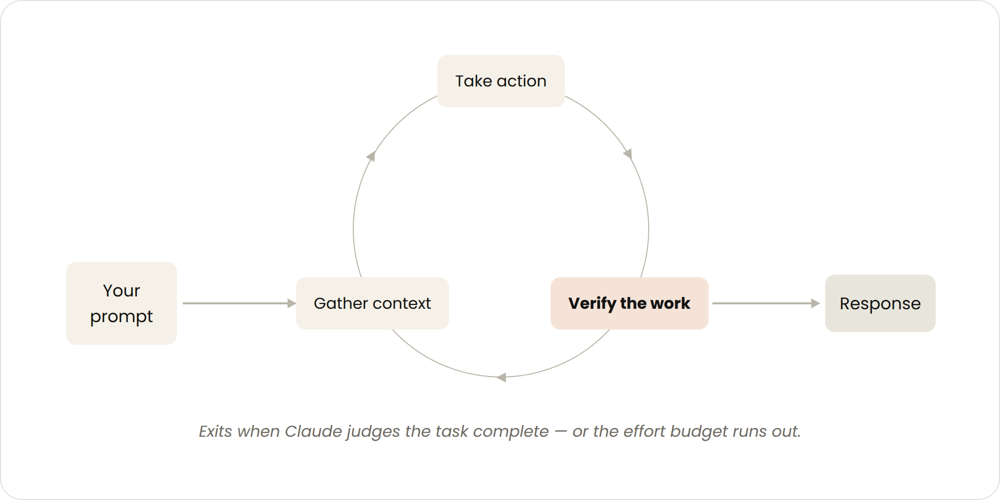
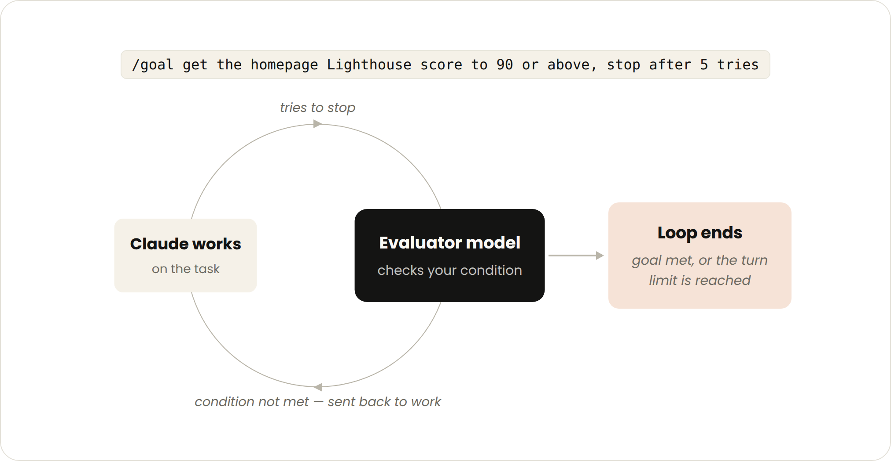

<strong style="font-size:16px;color:#1a6ba0;">要点速览</strong>

- <strong>四类Loops模式</strong>：按轮次（Turn-based）、按目标（Goal-based）、按时间（Time-based）和主动模式（Proactive），覆盖从探索性任务到全自动运维的全场景  
- <strong>自我验证的循环</strong>：将人工检查编码为SKILL.md文件，让AI在循环中自动验证结果：检查、重做、再检查，直到达标  
- <strong>云端持久循环</strong>：`/schedule` 将循环移到云端，笔记本合上也能运行；`/loop` 在本地运行，关闭即停  
- <strong>组合是真正的威力</strong>：把 `/schedule` 的定时触发 + `/goal` 的确切停止条件 + 动态工作流的并行探索组合在一起，一个指令就能驱动数小时的自主工作

---

Loops的核心概念其实很简单：让Agent自己重复执行工作，直到完成。但把什么当作"完成"，以什么节奏重复，在哪里运行：这些选择定义了四类截然不同的能力层级。

**按轮次循环是最基础的形态。** 每次你发一条消息，就是一个循环的起点：Claude收集上下文、执行行动、检查自己的工作，如果不够好就再来一遍，然后才给你回复。在这个基础上，你把人工检查的环节写进 `SKILL.md` 文件，Claude就能端到端自我验证：打开浏览器、点击按钮、截图对比、检查控制台错误：全部自动完成。人工做验证是手动检查，编码成技能文件是循环的自我检查。

`SKILL.md` 的模板大概是这样：告诉AI"做完编辑先别急着说完成，像人类审阅者那样验证：启动dev server、打开页面、点几下按钮交互、检查浏览器控制台零错误再确认"。

Claude的推理循环：收集上下文 → 执行行动 → 验证工作，直到任务完成或预算耗尽

**按目标循环把"做完"的定义交给了条件。** 你给一个具体的停止条件：比如"把首页Lighthouse分数做到90以上，最多试5次"：Claude就自己反复试，直到达标或用完次数。这里的诀窍是确定性标准：测试通过数、评分阈值、错误数量：这些东西可以明确判断"过还是没过"，不需要模糊的主观判断。

Goal-based Loop的Evaluator-Optimizer流程：执行者工作 → 评估者检查 → 不达标返回重做

**按时间循环把重复性工作自动化。** 有些工作是按计划发生的：每天早上的Slack总结、每小时的CI检查、PR审批评论。`/loop` 在本地运行（关掉就停），`/schedule` 把循环搬到云端（笔记本合上也能跑）。

云端自动化循环：Trigger监控Slack/GitHub → 主Agent修复 → 开PR → 第二Agent审核 → 用户决定合并

**主动模式是前三者的组合。** 把 `/schedule` 的定时触发能力 + `/goal` 的确切停止条件 + 动态工作流的并行探索组合在一起：一个指令就能描述这样复杂的任务：

> `/schedule every hour: check #project-feedback for bug reports. /goal: don't stop until every report found this run is triaged, actioned, and responded to. When fixing a bug, use a workflow to explore three solutions in parallel worktrees and have a judge adversarially review them.`

这相当于告诉Agent："每小时检查一次反馈频道的新Bug报告；一旦发现，必须全部处理完才算完：修复Bug时并行探索3种方案，让评审模型对抗式审查后选出最优。"

---

循环的输出质量取决于围绕它的系统。当某个结果不达标时，不要把这次当作失败：**把修复逻辑编码到系统中**，让未来的每次迭代都自动受益。

技术上还有一条实用建议：Loops必须有清晰的边界。设置最大迭代次数、定义明确的停止条件、使用成本感知的提示词限制上下文大小。无限循环在Agent世界里的代价不是CPU时间和电量，而是Token消耗。

<strong style="font-size:15px;color:#8b6f4c;">结语</strong>

这篇文章最核心的价值不是分类本身：按轮次/按目标/按时间/主动算不上什么革命性框架。真正有价值的是那张决策表：你交出了什么、什么时候用哪种模式。很多人在引入Agent循环时犯的错误不是选错了模式，而是根本没意识到自己在手动作循环里。如果你每天花15分钟手动检查PR评论和CI状态，这本身就是一个人工版的时间循环：只是缺了一个 `/schedule` 而已。

---

参考：

https://claude.com/blog/getting-started-with-loops
