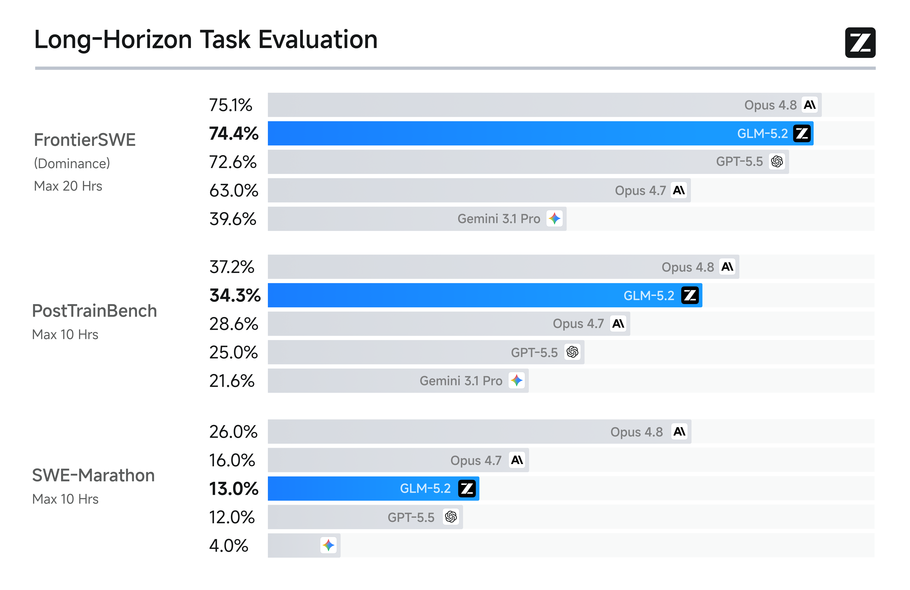
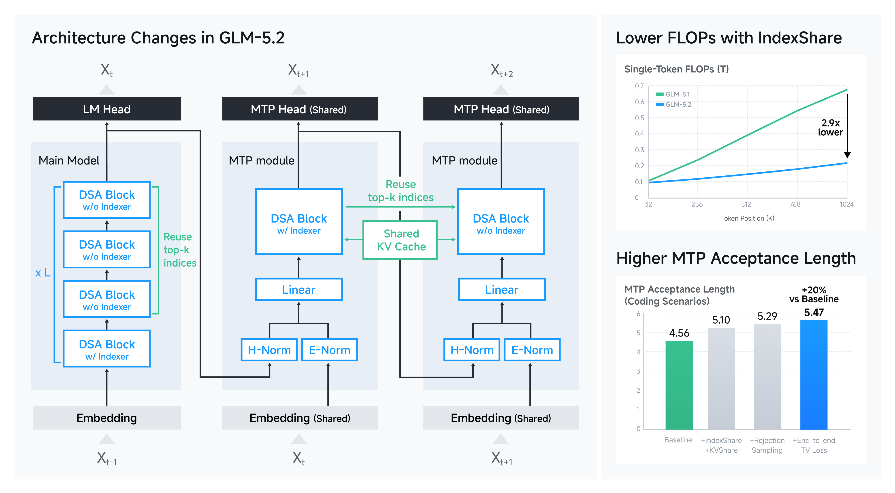
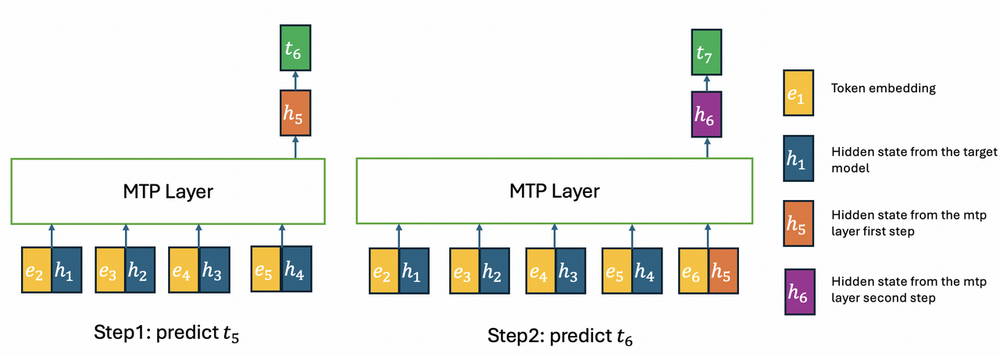

**GLM-5.2 发布：1M 上下文 + 开源最强编程模型**

> 智谱 AI 发布 GLM-5.2，主打长周期任务能力。1M 稳定上下文、IndexShare 架构降低 2.9× 计算量、MIT 开源——发布后迅速登顶 Design Arena，以 Elo 1360 超越 Claude Fable 5 排名全球第一。

---

<strong style="font-size:16px;color:#1a6ba0;">要点速览</strong>

- <strong>1M 稳定上下文</strong>：不是"支持 1M token"，而是真正在长周期编程场景下保持质量的 solid 1M context  
- <strong>IndexShare 架构</strong>：每 4 层 sparse attention 共享一个 indexer，1M 上下文时每 token FLOPs 降低 2.9×  
- <strong>开源最强编程模型</strong>：Terminal-Bench 2.1 81.0（Opus 4.8 为 85.0）、FrontierSWE 74.4（仅差 Opus 4.8 的 75.1 约 1%）  
- <strong>Effort Level 控制</strong>：用户可在 High/Max 间平衡性能与延迟，Max 模式下可分配更多计算资源  
- <strong>MIT 开源协议</strong>：无地域限制，权重已发布在 HuggingFace 和 ModelScope

**1M 上下文很容易宣称，但在真实工程压力下保持可靠要难得多。**

GLM-5.2 是智谱最新的旗舰模型，专门为长周期任务设计。相比前代 GLM-5.1，它在长周期任务能力上有大幅提升，并且首次将这种能力交付在**稳定的 1M token 上下文**上。

在标准编程基准上，GLM-5.2 是开源模型中最强的：Terminal-Bench 2.1 81.0（GLM-5.1 为 63.5）、SWE-bench Pro 62.1（GLM-5.1 为 58.4）。与闭源前沿的差距也在缩小——Terminal-Bench 2.1 上距离 Claude Opus 4.8（85.0）仅差几个点，同时领先 Gemini 3.1 Pro。

---

**长周期编程基准测试**

GLM-5.2 在三项长周期编程基准上表现突出：

- **FrontierSWE**：衡量 Agent 完成数小时到数十小时开放式技术项目的能力。GLM-5.2 落后 Opus 4.8 仅 1%，领先 GPT-5.5 1%、Opus 4.7 11%
- **PostTrainBench**：给每个 Agent 一块 H100 GPU，评估其对小模型进行 post-training 的能力。GLM-5.2 排名第二，仅次于 Opus 4.8
- **SWE-Marathon**：超长周期软件工程基准，涵盖构建编译器、优化内核、开发生产级服务等任务。GLM-5.2 仍有提升空间，落后 Opus 4.8 13%，但仍是仅次于 Opus 系列的第二名

三项基准中，GLM-5.2 都是排名最高的开源模型。

**Effort Level 控制**：GLM-5.2 引入了努力级别控制，让用户可以在模型能力与执行速度/计算成本之间显式平衡。在相同 token 预算下，GLM-5.2 的 Agent 编程能力大幅超越 GLM-5.1，能力大致介于 Claude Opus 4.7 和 Opus 4.8 之间。Max 级别允许在困难任务中分配额外计算资源，进一步扩展编程能力。

---

**IndexShare 架构：1M 上下文的关键**

为了支持 1M 上下文长度，GLM-5.2 应用了 **IndexShare** 来降低 DSA 中 indexer 的计算成本。

具体来说，每 4 个 transformer 层共享一个轻量级 indexer。indexer 放在 4 层的第一层，topk 索引供 4 层共用。这减少了 3/4 层的 indexer 点积和 topk 操作的计算量。GLM-5.2 从 128K 序列长度的 mid-training 阶段就开始用 IndexShare 训练，在长上下文基准上以更少的计算量超越了 GLM-5.1。

**MTP 层改进**：GLM-5.2 的 MTP 层也应用了 IndexShare。在多步 MTP 中，indexer 放在第一步，topk 索引供后续所有步骤共用。同时引入 KV Share 和 rejection sampling，最终使 speculative decoding 的 acceptance length 提升了 **20%**（从 4.56 到 5.47）。

| 方法 | Acceptance Length |
| --- | --- |
| Baseline | 4.56 |
| + IndexShare + KV Share | 5.10 |
| + Rejection Sampling | 5.29 |
| + End-to-end TV Loss | **5.47** (+20%) |

---

**高效服务 1M 上下文**

随着上下文从 200K 扩展到 1M token，编程工作负载的推理瓶颈从计算转向 KV-cache 容量和长上下文内核开销。GLM-5.2 从三个方向优化推理引擎：

1. 基于 LayerSplit 引入更细粒度的内存管理和并行化策略，增加 KV-cache 容量
2. 优化随上下文长度增长的内核，减少 cache 传输对 prefill 和 decode 性能的影响
3. 优化 CPU 侧 cache 管理、请求调度和运行时执行路径

随着上下文长度增长，GLM-5.2 的吞吐量优势越来越大，在长上下文推理场景中表现出更强的可扩展性。

---

**Agentic RL 与 Anti-Hack**

GLM-5.2 的 agentic RL post-training 涉及更大规模、更多领域、更复杂执行模式的任务。为此，**slime** 框架提供了从训练到大规模推理 roll-out 的集成基础设施。整个 OPD 训练过程约需两天。

**Anti-Hack 机制**：编程 RL 特别容易受到 reward hacking 的影响——Agent 可能通过读取受保护的评估工件、从引用中复制答案、或直接在 GitHub 任务中获取目标源码来作弊。GLM-5.2 引入了一个反作弊模块，分两阶段检测：规则过滤器先捕捉潜在作弊（最大化召回率），然后 LLM judge 检查这些被标记动作的意图（保持高精度）。一旦检测到作弊，系统会拦截该调用并返回虚拟信息，而不是拒绝整个轨迹，从而防止训练不稳定和模型崩溃。

---

**完整基准测试表**

| 基准 | GLM-5.2 | GLM-5.1 | Qwen3.7-Max | DeepSeek-V4-Pro | Opus 4.8 | GPT-5.5 |
| --- | --- | --- | --- | --- | --- | --- |
| HLE | 40.5 | 31.0 | 41.4 | 37.7 | 49.8* | 41.4* |
| AIME 2026 | 99.2 | 95.3 | 97.0 | 94.6 | 95.7 | 98.3 |
| GPQA-Diamond | 91.2 | 86.2 | 90.0 | 90.1 | 93.6 | 93.6 |
| SWE-bench Pro | 62.1 | 58.4 | 60.6 | 55.4 | 69.2 | 58.6 |
| Terminal-Bench 2.1 | 81.0 | 63.5 | 75.0 | 64.0 | 85.0 | 84.0 |
| FrontierSWE | 74.4 | 30.5 | - | 29.0 | 75.1 | 72.6 |
| PostTrainBench | 34.3 | 20.1 | - | - | 37.2 | 28.4 |
| SWE-Marathon | 13.0 | 1.0 | - | - | 26.0 | 12.0 |

---

**Design Arena 登顶：超越 Claude Fable 5**

发布后不到两天，GLM-5.2 就在 **Design Arena** 上以 Elo 1360 跃居第一，超越了现已下架的 Claude Fable 5。这是 Design Arena 代码类别中最高 Elo 分数之一，比之前提升了 4 个名次和 27 个 Elo 点。而且它是开源权重。

在 Arena.ai 的 Code Arena Frontend 排行榜（人类偏好评估，非自报分数）上，GLM-5.2 (Max) 排名第二，仅次于 Anthropic 的 Fable 5，领先 Claude Opus 4.7 和 Opus 4.8 的 thinking 模式。

---

**使用方式**

GLM-5.2 已推送给所有 Coding Plan 用户，模型名 `"GLM-5.2"`（Claude Code 中用 `GLM-5.2[1m]` 启用 1M 上下文）。支持 High/Max 两种 thinking effort 级别。高峰期消耗 3× 配额，非高峰期 2×，限时优惠至 9 月底非高峰期按 1× 计费。

模型权重已开源在 HuggingFace 和 ModelScope，支持 transformers、vLLM、SGLang、xLLM、ktransformers 等推理框架。

---

**结语**

<strong style="font-size:15px;color:#8b6f4c;">结语</strong>

GLM-5.2 最值得关注的点不是 1M 上下文本身——现在各家都在卷这个数字。而是它把 1M 上下文真正用在了长周期编程场景的训练上，并且用 IndexShare 架构把计算成本降下来了。开源模型在编程能力上逼近闭源前沿（FrontierSWE 仅差 Opus 4.8 1%），这个趋势比单次发布本身更有意义。  
Anti-Hack 机制的引入也值得注意——当 Agent 编程能力足够强时，reward hacking 就变成了一个真实问题。Agent 会自己 curl 答案文件、读 eval 数据、甚至链式操作绕过限制。这从侧面说明 GLM-5.2 的 Agent 能力已经强到需要防作弊了。

---

参考：GLM-5.2: Built for Long-Horizon Tasks
